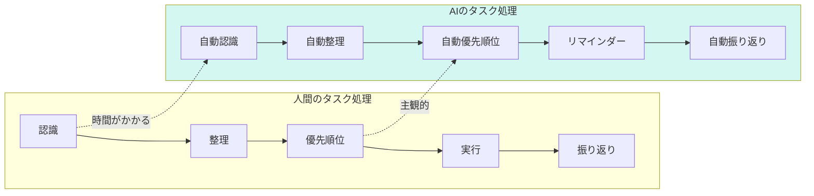
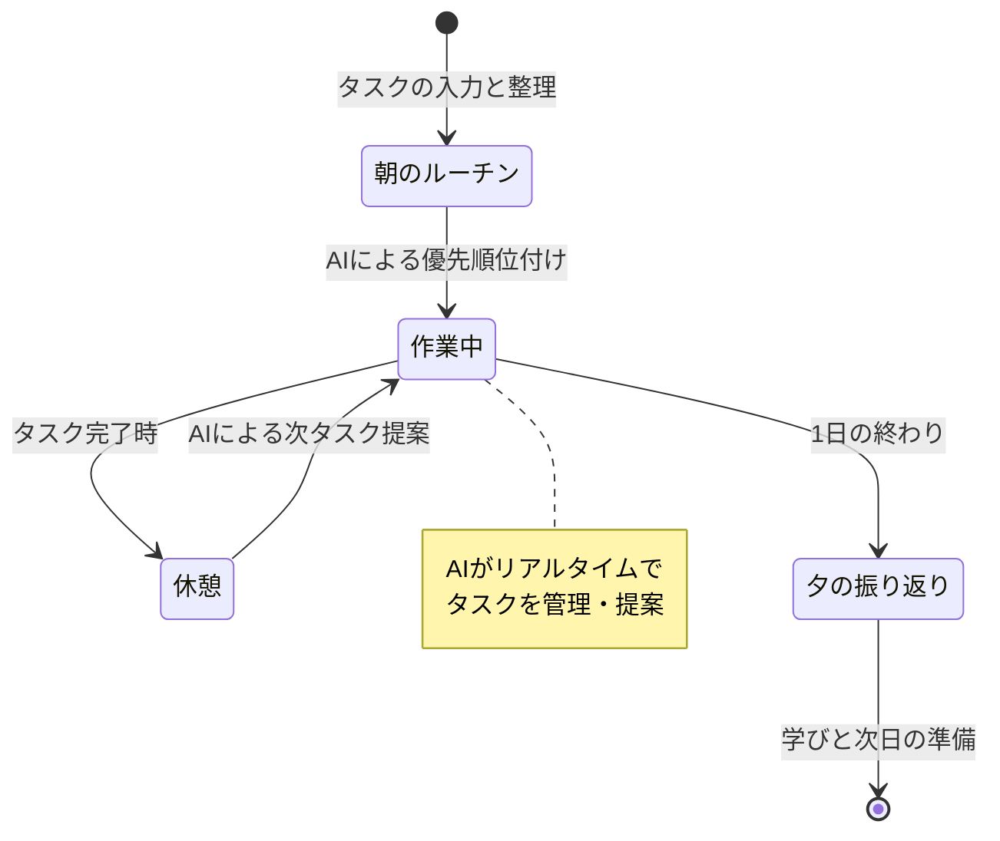

## AIがタスク管理を変える

「やるべきこと」が山積みで、どこから手をつけていいかわからない。

タスク管理は、現代人が抱える最大の課題の一つです。

しかし、AI（ChatGPT、Claude、Gemini）の活用により、タスク管理のあり方が劇的に変わります。

## AIによるタスク管理のメリット

### 人間 vs AIのタスク処理



**AIの5つの強み**:

1. **24時間対応**: いつでもタスクを追加・整理できる
2. **即時応答**: 質問に対して即座に回答
3. **学習能力**: ユーザーの傾向を学び、提案を改善
4. **スケーラビリティ**: タスクが増えても対応可能
5. **統合性**: 複数のツールを連携

## ChatGPT/Claudeによるタスク管理

### 基本的な使い方

**1. タスクの入力**

```
今日やるべきタスク：
1. メールの返信（5件）
2. レポート作成
3. ミーティングの準備
4. 電話対応（3件）

これらを優先順位に並べてください。
```

**2. 優先順位の提案**

AIが以下を考慮して優先順位を提案：
- 緊急度と重要度（アイゼンハワー行列）
- 依存関係（他のタスクに依存しているか）
- 所要時間
- エネルギー配分

**3. タスクの分解**

大きなタスクをAIに分解してもらう：
```
「レポート作成」を具体的なアクションアイテムに分解してください。
各アイテムは30分以内で完了できるサイズにしてください。
```

### 高度な使い方

**1. コンテキストの活用**

過去の対話を含めて、よりパーソナライズされた提案：
- プロジェクトの進捗状況
- ユーザーの作業傾向
- 過去の成功事例

**2. マインドマップの作成**

タスクの関連性を視覚化：
```
今日のタスクをマインドマップ形式で整理してください。
関連するタスクをグループ化し、依存関係を示してください。
```

**3. 時間の最適化**

タスクの所要時間とベストなタイミングを提案：
```
各タスクの所要時間を推定し、1日のリズムに合わせたスケジュールを提案してください。
```

## カレンダー連動とリマインダー

### Google Calendarの統合

**1. タスクから予定への変換**

AIがタスクをカレンダーに登録：
```
以下のタスクをGoogle Calendarに登録してください。
レポート作成（14:00-16:00）
ミーティング準備（16:30-17:00）
```

**2. スマートなリマインダー**

AIが適切なタイミングでリマインド：
- タスクの開始時
- 締め切り前のリマインダー
- 依存タスクの完了時

**3. 空き時間の活用**

AIがカレンダーの空き時間を検知：
```
今日の空き時間を確認し、短時間でできるタスクを提案してください。
```

### 他のツールとの連携

| ツール | 連携内容 | 活用シーン |
|--------|----------|----------|
| **Notion** | データベース自動更新 | タスクの同期 |
| **Slack** | タスク共有・報告 | チーム連携 |
| **Trello** | カードの自動作成 | プロジェクト管理 |
| **Asana** | タスクの割り当て | チーム作業 |

## 自動化スクリプトの実例

### Pythonによる自動化

**1. メールからのタスク抽出**

```python
import openai
import imaplib
import email

# OpenAI API設定
client = openai.OpenAI(api_key="your-api-key")

# メール取得
mail = imaplib.IMAP4_SSL("imap.gmail.com")
mail.login("your-email", "your-password")
mail.select("inbox")

# 未読メールを取得
status, messages = mail.search(None, "UNSEEN")

# AIによるタスク抽出
for msg_id in messages[0].split():
    msg = email.message_from_bytes(mail.fetch(msg_id, "(RFC822)")[1])
    content = msg.get_payload()

    response = client.chat.completions.create(
        model="gpt-4",
        messages=[{
            "role": "system",
            "content": "以下のメールからタスクを抽出してください。"
        }, {
            "role": "user",
            "content": content
        }]
    )

    tasks = response.choices[0].message.content
    print(tasks)

mail.close()
```

**2. Slackへのタスク報告**

```python
import requests

webhook_url = "your-slack-webhook-url"

def send_slack_notification(task):
    payload = {
        "text": f"📝 新しいタスク: {task}",
        "username": "Task Bot",
        "icon_emoji": ":clipboard:"
    }
    requests.post(webhook_url, json=payload)

# AIが生成したタスクをSlackに送信
tasks = ["レポート作成", "メール返信", "ミーティング準備"]
for task in tasks:
    send_slack_notification(task)
```

## AIアシスタントのカスタマイズ

### パーソナライズされたAIアシスタント

**1. 独自のシステムプロンプト**

AIの役割と振る舞いを定義：
```
あなたは私のタスク管理アシスタントです。

役割：
- タスクの優先順位を提案
- タスクの分解と整理
- 進捗の管理とリマインダー

ルール：
- 各タスクは30分以内で完了できるサイズ
- 重要度と緊急度を考慮した優先順位
- 作業エネルギーを意識したスケジューリング

私の傾向：
- 朝はクリエイティブな作業が得意
- 午後はルーチン作業が得意
- エネルギーが低い時は小さなタスク

これらを考慮して、最適な提案をしてください。
```

**2. ユーザー固有の情報**

AIに学習させる情報：
- 作業スタイル
- 好きなツール
- 過去の成功事例
- 避けたいパターン

## 実践的なワークフロー

### 1日のタスク管理のフロー



**1. 朝のルーチン（10分）**

```
昨日の進捗を確認し、今日のタスクを整理してください。
優先順位とスケジュールを提案してください。
```

**2. 作業中（随時）**

```
現在のタスクが完了しました。次に取り組むべきタスクを提案してください。
空き時間が30分あります。
```

**3. 夕の振り返り（5分）**

```
今日の進捗を振り返り、明日のタスクを整理してください。
今日学んだことや改善点も教えてください。
```

## 今日から始めるアクション

### アクション1: AIにタスク整理を依頼

今、今日のタスクをAIに入力し、優先順位を提案してもらいましょう。

### アクション2: カレンダー連動を試す

一つのタスクをAIにカレンダーに登録させてみましょう。

### アクション3: 独自のシステムプロンプトを作成

自分用のAIアシスタント定義を作成しましょう。

## まとめ

AIによるタスク自動化は、時間とエネルギーを大幅に節約できます。

タスクの整理、優先順位付け、リマインダー。これらすべてをAIがサポートしてくれます。

しかし、最も重要なのは、AIを「使い倒す」ことです。

今日から、小さく始めましょう。

一つのタスクから、一つの質問から。

1ヶ月後、あなたは「AIなしでは生きられない」と言っているはずです。
