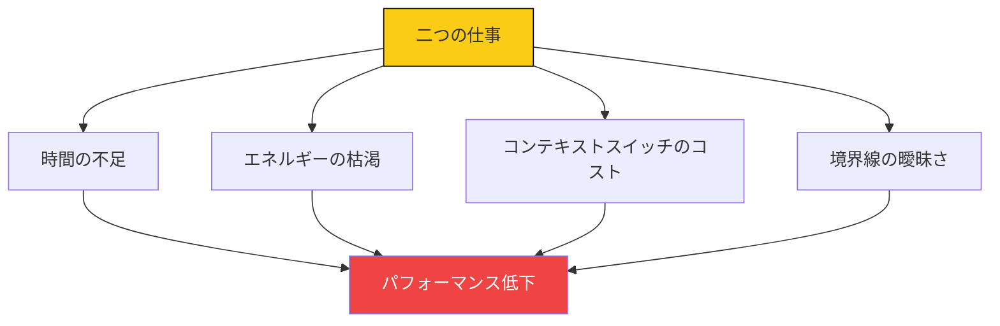
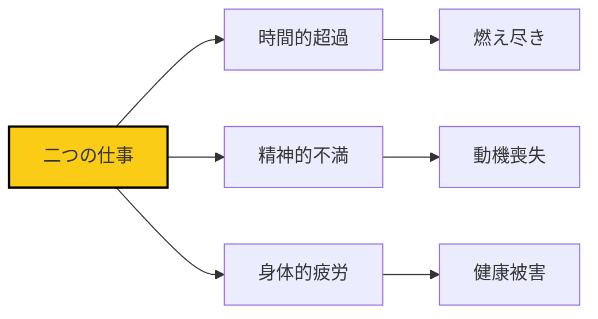

## 二つの仕事の現実

「本業をしながら、副業もやってみたい」

多くの人がこう考えますが、実際に二つの仕事を持つと、多くの課題に直面します。

### 二つの仕事の課題



## ノーコードと二つの仕事の相性

### ノーコードとは？

コードを書かずにWebアプリやサービスを開発・運営できるツール群（Notion、Airtable、Bubble、Glideなど）。

**ノーコードが二つの仕事に適している理由**:

1. **学習コストが低い**: プログラミング知識が不要
2. **迅速な構築**: 1〜2週間でMVP（Minimum Viable Product）が作れる
3. **柔軟な運営**: 必要に応じて即時変更可能
4. **自動化しやすい**: 連携ツールで業務を自動化

### ノーコード活用の事例

| 活用方法 | 具体的なツール | 本業とのシナジー |
|---------|--------------|-----------------|
| **副業管理** | Notion、Airtable | 本業のプロジェクト管理スキルを活用 |
| **自動化** | Zapier、Make | 本業のタスク自動化も可能 |
| **データ分析** | Airtable、Coda | 本業の分析業務にも活用 |
| **クライアント管理** | Notion、Trello | 本業の顧客管理スキルを応用 |

## 効率的なタスク切り替え

### コンテキストスイッチのコスト

タスクを切り替えるたびに、脳は新しい情報をロードする必要があります。

**タスク切り替えにかかる時間**:
- 簡単なタスク: 3〜5分
- 複雑なタスク: 15〜25分
- 新しい領域への切り替え: 30〜45分

### タスク切り替えの最適化

```mermaid
flowchart LR
    Morning[朝] --> Main1[本業タスク<br>ブロック1]
    Main1 --> Break1[休憩<br>15分]
    Break1 --> Side1[副業タスク<br>ブロック1]
    Side1 --> Break2[休憩<br>15分]
    Break2 --> Main2[本業タスク<br>ブロック2]
    Main2 --> Lunch[昼休み]
    Lunch --> Main3[本業タスク<br>ブロック3]
    Main3 --> Break3[休憩<br>15分]
    Break3 --> Side2[副業タスク<br>ブロック2]
    Side2 --> Evening[夕方]

    style Side1 fill:#2dd4bf,color:#fff
    style Side2 fill:#2dd4bf,color:#fff
    style Main1 fill:#94a3b8,color:#fff
    style Main2 fill:#94a3b8,color:#fff
    style Main3 fill:#94a3b8,color:#fff
```



**切り替えを効率化する5つの方法**:

1. **ブロック化**: タスクをブロック単位でまとめる
2. **トランジション儀式**: タスク切り替えの儀式を作る（コーヒーを飲む、深呼吸する）
3. **環境を変える**: 本業と副業で物理的な場所を変える
4. **デジタル分離**: メールや通知を完全に切り替える
5. **終了の明確化**: タスクの終了を明確に宣言する

## 時間管理の優先順位

### エネルギー配分の原則

| 時間帯 | エネルギーレベル | 最適なタスク |
|--------|-----------------|-------------|
| **朝（6:00-9:00）** | 高 | 副業のクリエイティブ作業 |
| **午前（9:00-12:00）** | 高 | 本業の重要タスク |
| **午後（13:00-17:00）** | 中 | 本業のルーチン作業 |
| **夕方（17:00-19:00）** | 中〜低 | 副業の軽作業 |
| **夜（19:00-22:00）** | 低 | 副業の学習・調査 |

### 優先順位の決定方法

**アイゼンハワワー行列の応用**:

```mermaid
quadrantChart
    title 副業タスクの優先順位
    x-axis 緊急度 "低" --> "高"
    y-axis 重要度 "低" --> "高"
    quadrant-1 "優先度高"
    quadrant-2 "計画的に実施"
    quadrant-3 "後回し"
    quadrant-4 "排除/委託"

    Q1: 副業収入化のタスク
    Q2: スキル習得、コンテンツ作成
    Q3: SNSチェック、情報収集
    Q4: 手動でできる自動化タスク
```

## 境界線の設定

### 本業と副業の境界線

**物理的境界**:
- 場所を変える（カフェ、自宅別の部屋）
- PCを分ける（可能な場合）
- 服装を変える（副業のときは私服）

**時間的境界**:
- 副業の開始・終了時間を固定
- 本業の前後1時間は副業禁止
- 週末は副業集中、平日は本業優先

**デジタル境界**:
- メールアドレスを分ける
- スマートフォンの通知を分ける
- ブラウザのプロファイルを分ける

### 境界線を守るための仕組み

**1. スケジュールの視覚化**

```mermaid
gantt
    title 1日のスケジュール例
    dateFormat  HH:mm
    axisFormat  %H:%M

    section 本業
    朝のルーチン           :a1, 09:00, 30m
    メール確認               :a2, 09:30, 30m
    重要タスク               :a3, 10:00, 2h
    会議                    :a4, 12:00, 1h
    昼休み                  :milestone, 13:00, 0h
    ルーチン作業             :a5, 13:30, 2.5h
    まとめ                  :a6, 16:00, 1h

    section 副業
    夕方の副業              :b1, 17:30, 1.5h
    夕食                    :milestone, 19:00, 0h
    夜の副業                :b2, 19:30, 2.5h
```



**2. 報告システム**

- 家族やパートナーにスケジュールを共有
- 「副業モード」の合図を決める（ヘッドフォンを着る）
- 緊急時の連絡方法を決定

**3. 自己監視システム**

- 毎日の振り返り（5分）
- 週次レビュー（30分）
- 労働時間の記録（Notion、Airtable）

## 疲弊を防ぐための対策

### 3つの疲弊パターン



**疲弊を防ぐ5つの対策**:

1. **完全休息日を設ける**: 週に1日は完全に副業を休む
2. **エネルギーログをつける**: エネルギーレベルを記録し、最適なスケジュールを発見
3. **「十分」を定義する**: 100%ではなく80%を目標にする
4. **休憩を優先**: 90分ごとに5〜10分の休憩を必ずとる
5. **睡眠を優先**: 睡眠を削って副業をしない

## ノーコードで作る副業アイデア

### 1ヶ月で作れる副業

| 副業の種類 | ノーコードツール | 所要時間 | 月間目標収入 |
|-------------|----------------|---------|---------------|
| **タスク管理アプリ** | Notion + Glide | 2週間 | 2〜5万円 |
| **予約管理システム** | Notion + Calendly | 1週間 | 1〜3万円 |
| **ブログ運営支援** | Notion + WordPress | 1週間 | 1〜2万円 |
| **顧客管理システム** | Airtable | 2週間 | 3〜10万円 |
| **自動化サービス** | Zapier + Google Apps | 3週間 | 5〜15万円 |

## 今日から始めるアクション

### アクション1: 副業の時間枠を確定する

今週の副業時間枠をカレンダーにブロックしましょう。

### アクション2: タスク切り替えの儀式を作る

本業と副業の切り替えの儀式を1つ決めましょう（例: コーヒーを飲む、深呼吸5回）。

### アクション3: ノーコードツールを試す

無料のノーコードツール（Notion、Airtable）を試してみましょう。

## まとめ

二つの仕事を持つことは、挑戦的であり、やりがいがあります。

しかし、無計画に始めると、両方のパフォーマンスが低下します。

効率的なタスク切り替え、明確な境界線、適切な休息。これらを意識的に設計することで、二つの仕事を両立させることができます。

今日から、小さく始めましょう。

1日30分から。徐々に時間を増やして。

1ヶ月後、あなたは「二つの仕事」を楽しんでいるはずです。
