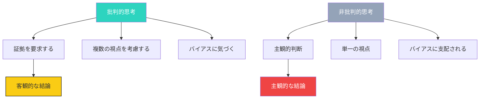
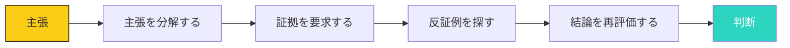

## 批判的思考の必要性

「情報が多すぎる」「何を信じていいかわからない」「意見が分かれて議論がまとまらない」

これらは、現代人が直面する典型的な課題です。

解決策の一つが、**批判的思考**の習慣化です。

## 批判的思考とは何か

### 定義

批判的思考とは、情報を盲目的に受け取らず、論理的に分析し、客観的な判断を下す思考のことです。

**批判的思考の3つの要素**:

1. **疑う態度**: 情報を最初から疑う
2. **論理的分析**: 情報の論理的整合性を検証
3. **多角的視点**: 複数の視点から情報を検討

### 批判的思考 vs 非批判的思考



## 認知バイアスの識別方法

### 主要な認知バイアス

**1. 確証バイアス**

自分の既存の信念を支持する情報のみを探し、反する情報を無視する傾向。

**2. 可用性ヒューリスティック**

最も記憶に残っている情報（最近聞いた情報、衝撃的な情報）を真実だと判断する傾向。

**3. アンカリング効果**

最初に得られた情報（アンカー）に、その後の判断が影響される傾向。

**4. 権威への従属**

権威者（専門家、リーダー、著名人）の意見を無条件に信じる傾向。

### バイアス識別のチェックリスト

| バイアス | 徴候 | 識別方法 |
|--------|------|---------|
| **確証バイアス** | 自分の意見を支持する情報のみを見る | 反対意見も探してみる |
| **可用性ヒューリスティック** | 最新のニュースを信じる | 複数の時点の情報を確認する |
| **アンカリング効果** | 最初に聞いた数字に固執する | 最初の情報を疑う |
| **権威への従属** | 専門家の意見を無条件に信じる | 権威者の背景と利益を確認する |

## 情報源の選別スキル

### 情報源の評価基準

```mermaid
decisiongraph
    title 情報源の評価基準
    node 信息源["情報源"]{情報源は信頼できるか？}
    node 作者["作者"]{作者は専門家か？}
    node 证据["証拠"]{証拠が提示されているか？}
    node 引用["引用"]{信頼できる情報源を引用しているか？}
    node 结束["結論"]{結論は証拠に基づいているか？}

    信息源 -- 否 --> 拒绝["拒絶"]
    信息源 -- 是 --> 作者
    作者 -- 否 --> 拒绝
    作者 -- 是 --> 证据
    证据 -- 否 --> 拒绝
    证据 -- 是 --> 引用
    引用 -- 否 --> 拒绝
    引用 -- 是 --> 结束
    结束 -- 否 --> 拒绝
    结束 -- 是 --> 接受["受け入れる"]
```

### 情報源の信頼性評価

**1. 作者の専門性**

- その分野の専門家か
- 学術的なバックグラウンドがあるか
- 業界での実績があるか

**2. 情報の鮮度**

- 最新の情報か
- 情報の更新頻度
- ソースの作成日

**3. 証拠の提示**

- 具体的なデータや事例があるか
- 統計学的に有意な結果か
- 再現可能な研究か

**4. 利益相反の有無**

- 広告やスポンサーの有無
- 商業的な利益関係
- 政治的な立場

**5. 複数の情報源の確認**

- 複数の信頼できる情報源が同じ結論か
- 反対意見も公平に扱っているか
- 議論の余地があるか

## 反論的思考の鍛え方

### 反論的思考の3ステップ



### ステップ1: 主張を分解する

主張を小さな要素に分解：

**例**: 「リモートワークは生産性を下げる」
- 分解1: リモートワークとは何か
- 分解2: 生産性とは何か
- 分解3: どのような条件下で比較されているか

### ステップ2: 証拠を要求する

主張を支える証拠を要求：

**質問**:
- この主張を支えるデータはあるか
- どのような研究結果があるか
- 具体的な事例はあるか

### ステップ3: 反証例を探す

主張に反する事例やデータを探す：

**例**: 「リモートワークは生産性を下げる」への反証例
- 多くの企業でリモートワークにより生産性が向上した報告
- リモートワーカーの満足度調査
- コミュニケーションツールの発達による効果

### ステップ4: 結論を再評価する

証拠と反証例を検討し、結論を再評価：

- 主張が完全に正しいか
- 一部修正が必要か
- 完全に誤りか
- 条件付きで正しいか

## 批判的思考の日常実践

### 日常生活での実践

**1. ニュースを見る際**

- タイトルだけで内容を判断しない
- 複数の情報源を確認する
- 感情的な言葉に注意する

**2. SNSでの議論**

- 相手を攻撃しない
- 証拠に基づく議論をする
- 自分のバイアスに気づく

**3. 意思決定**

- 複数の選択肢を考慮する
- 各選択肢の長所と短所を分析する
- 第三者の意見を聞く

### チームでの実践

**1. 会議での発言**

- 質問や反対意見を恐れない
- 感情的な発言を避ける
- 事実と意見を分ける

**2. フィードバック**

- 具体的な例を提示する
- 改善案を提案する
- 相手の視点を理解しようとする

## 今日から始めるアクション

### アクション1: 1日のニュースを批判的に分析する

今日見たニュースを1つ選び、批判的に分析しましょう。

### アクション2: 自分のバイアスを認識する

自分がどのようなバイアスを持ちやすいか、3つ書き出しましょう。

### アクション3: 反対意見を探す習慣

自分の意見に対する反対意見を1つ、積極的に探しましょう。

## まとめ

批判的思考は、情報過多の現代において不可欠なスキルです。

情報を盲目的に信じるのではなく、疑い、分析し、判断する。

今日から、小さく始めましょう。

1つのニュースから。1つの主張から。

批判的思考の習慣が、あなたの判断の質を高めます。

1ヶ月後、あなたは「情報の海」で迷わず、的確な判断ができるようになっているはずです。
