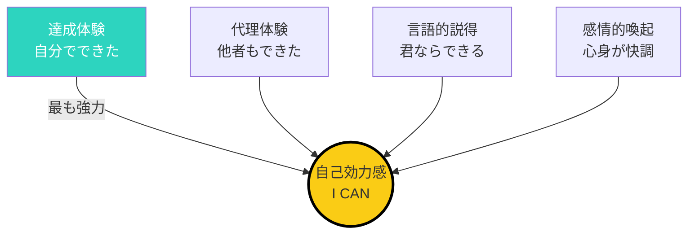
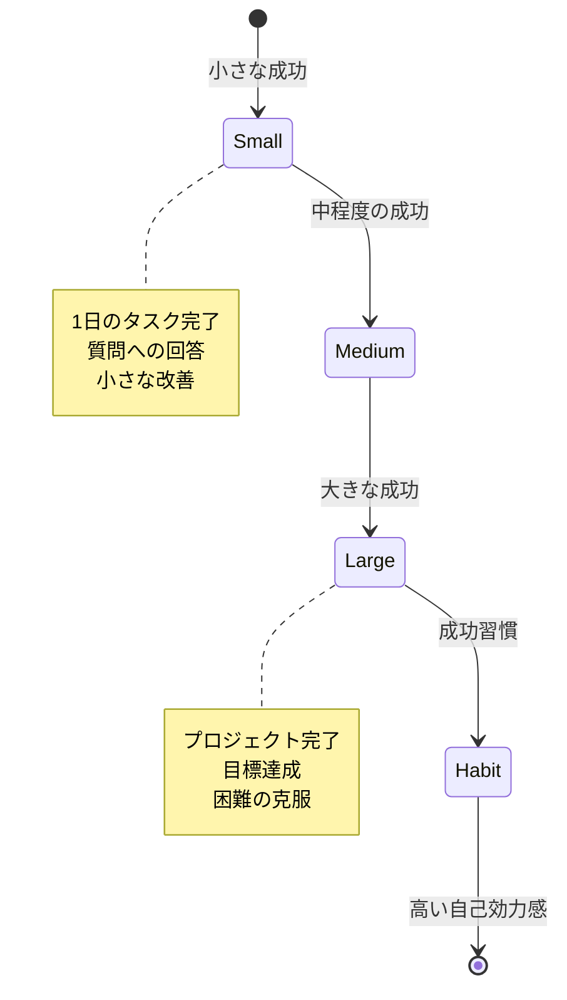
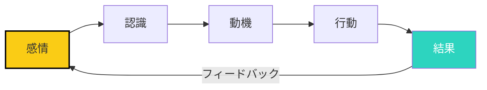

## マインドセットが成果を決める

「能力はあるのに、結果が出ない」「プレッシャーに弱い」「本番に弱い」

これらは、マインドセットの問題かもしれません。

## 自己効力感とパフォーマンス

### 自己効力感とは

自己効力感とは、「自分にはそれができる」という確信です。

**心理学者アルバート・バンデューラの定義**:

- 特定の課題に対する自信
- 自尊心（自分の価値）とは異なる
- 行動の予測可能性を高める

### 自己効力感の4つの源泉



### 成功体験の蓄積

**小さな成功の積み重ねが重要**:



**成功体験の蓄積方法**:

1. **目標を小さく分解する**
   - 大きな目標を30分でできるサイズに分解
   - 各ステップ完了を「成功」と認識

2. **成功を記録する**
   - 成功したことをリストアップ
   - 具体的な数字や事実を記録
   - 定期的に振り返る

3. **成功を祝う**
   - 小さな成功でも認める
   - 自分を褒める
   - 報奨システムを作る

## 代理体験と視覚的モデル

### 代理体験の効果

「彼にできるなら、自分にもできる」

他人が成功しているのを見ることで、自分もできると感じる効果です。

**代理体験の強化方法**:

1. **ロールモデルを見つける**
   - 自分と似た背景の人
   - 似た課題を克服した人
   - 複数の視点から参考にする

2. **成功事例を収集する**
   - 類似の成功事例をリストアップ
   - 彼らがどのようなステップを踏んだか
   - 具体的な方法を学ぶ

### 視覚的モデルの観察

「人の真似をする」という言葉がありますが、視覚的モデルを観察することで、効果的に学べます。

**観察するポイント**:

- 表現
- 姿勢
- 声のトーン
- 話し方

## プレッシャーの科学的な使い方

### プレッシャーの2面

```mermaid
xychart-beta
    title プレッシャーとパフォーマンスの関係
    x-axis プレッシャー（低〜高）
    y-axis パフォーマンス（低〜高）
    line [50, 100, 80]
    line [50, 100, 40]
```

**ヤーキーズ・ドットソンの法則**:

- 適度なプレッシャー（ストレッサー）はパフォーマンスを向上させる
- 過度なプレッシャー（ディストレッサー）はパフォーマンスを低下させる

### 最適なプレッシャーの見つけ方

**1. プレッシャーの自己監視**

自分のプレッシャーレベルを認識：

- 心拍数
- 呼吸
- 筋肉の緊張
- 集中力

**2. 最適なプレッシャーの状態**

最適な状態（ゾーン）に意識的に入る：

- 挑戦的だが、不安ではない
- 集中できている
- 楽しんでいる
- フロー状態に近い

**3. 過度なプレッシャーの回避**

ディストレッサーを避ける方法：

- 準備を徹底する
- 不安な要素を特定し、解決する
- 練習する
- ポジティブな自己対話

## 感情と行動の相関

### 感情が行動に影響するメカニズム



**ポジティブな感情の循環**:

- 楽しんでいる → 創造的になる → 良い結果 → 自信がつく → さらに楽しむ

**ネガティブな感情の循環**:

- 不安がある → 保守的になる → 思考が狭まる → 悪い結果 → 不安が増える

### 感情の管理方法

**1. 感情に名前をつける**

- 今、どのような感情を感じているか
- その感情は何を教えてくれるか

**2. 感情を受け入れる**

- 感情を否定せず、ただ観察する
- 感情は「情報」であり、「指示」ではない

**3. 感情を一時停止する**

- 強い感情が来たら、一時停止する
- 深呼吸を3回する
- 5秒間、感情から距離を置く

## マインドセットの実践的なトレーニング

### トレーニング1: 自己効力感の向上

**4つの達成体験の作成**:

週1回、小さな成功体験を作ります：

- **週1**: 新しいスキルの基礎を学ぶ（1時間）
- **週2**: そのスキルを使って何か作る（1時間）
- **週3**: 誰かに作品を見せる
- **週4**: 反馈をもらう

### トレーニング2: プレッシャーへの耐性

**ステップアップ方式の練習**:

**ステップ1**: 緊張感の低い状況で挑戦
- 家族や友人の前で話す
- 小さなグループで発表

**ステップ2**: 緊張感の中程度の状況で挑戦
- 部署の会議で発言
- 小さなグループでリードする

**ステップ3**: 緊張感の高い状況で挑戦
- 大勢の前で発表
- 重要なクライアントとの対面

### トレーニング3: ポジティブな自己対話

**セルフトークの改善**:

**悪いセルフトーク**:
- 「自分はダメだ」
- 「失敗した」
- 「またやっちゃった」

**良いセルフトーク**:
- 「まだ最善ではなかった」
- 「学びを得た」
- 「次はうまくいく」

## 今日から始めるアクション

### アクション1: 過去1ヶ月の成功をリストアップ

過去1ヶ月に達成したことを5つリストアップしましょう。

### アクション2: 今週の小さな目標を立てる

今週達成できる小さな目標を1つ立てましょう。

### アクション3: 目標を達成したら、自分を褒める

目標を達成したら、自分を褒めましょう。

## まとめ

マインドセットは、パフォーマンスに大きな影響を与えます。

自己効力感を高め、プレッシャーを最適に使い、感情を管理することで、パフォーマンスは向上します。

今日から、小さく始めましょう。

1つの小さな成功。1つのポジティブな言葉。

1ヶ月後、あなたは「自分はできる」と信じているはずです。
