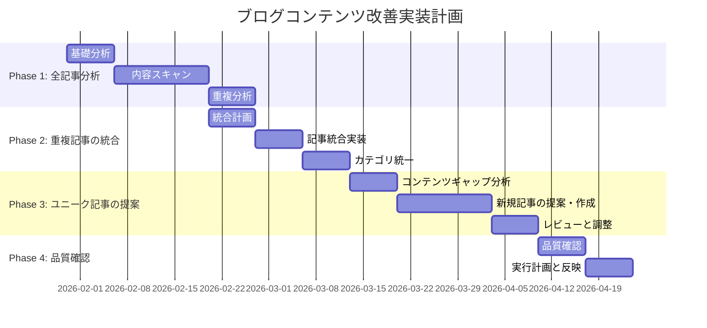

# ブログコンテンツ改善実装計画

## 📌 概要

本山貴裕ポートフォリオサイトのブログコンテンツ（100記事）を分析し、重複・類似記事を統合し、ユニークで高品質なコンテンツに改善するための実装計画。

**計画タイプ**: A - 全記事のスキャンと重複統合
**目標期間**: 2〜3ヶ月
**担当**: PM (Sisyphus)
**開始日**: 2026-01-30

---

## 🎯 目標

### 主要目標

1. **重複の排除**: 内容が類似している記事を統合し、ユニークなコンテンツにする
2. **品質の向上**: 各記事に独自の価値を持たせる（具体例、事例、視覚的要素）
3. **カテゴリの統一**: 英語カテゴリを日本語に統一
4. **アクセシビリティの向上**: 読みやすさ、ナビゲーションを改善

### 成功指標

| 指標 | 現状 | 目標 |
|------|------|------|
| ユニーク記事数 | 不明 | 90〜95記事（重複排除後） |
| 記事の平均長さ | 不明 | 1,500〜2,500文字 |
| カテゴリ数 | 10種類（英語含む） | 7種類（日本語のみ） |
| 重複記事数 | 2件以上（判明分） | 0件 |

---

## 📅 フェーズ別実装計画

### Phase 1: 全記事分析（第1〜3週）

#### 目的
全100記事の内容をスキャンし、以下を明らかにする：
- 各記事の要約
- 重複・類似度のスコア化
- カテゴリの一貫性確認
- コンテンツのギャップ特定

#### タスク

**Week 1: 基礎分析**

| タスク | 担当 | 状態 | 優先度 |
|--------|------|--------|--------|
| 1.1 全100記事のタイトル・カテゴリ・タグ収集 | PM | 未着手 | 高 |
| 1.2 各記事のフロントマター（Frontmatter）解析 | PM | 未着手 | 高 |
| 1.3 カテゴリ一覧作成と分布確認 | PM | 未着手 | 高 |
| 1.4 英語カテゴリの特定 | PM | 未着手 | 高 |

**Week 2: 内容スキャン**

| タスク | 担当 | 状態 | 優先度 |
|--------|------|--------|--------|
| 2.1 30記事（001〜030）の内容要約 | PM | 未着手 | 高 |
| 2.2 30記事（031〜060）の内容要約 | PM | 未着手 | 高 |
| 2.3 30記事（061〜090）の内容要約 | PM | 未着手 | 高 |
| 2.4 10記事（091〜100）の内容要約 | PM | 未着手 | 高 |

**Week 3: 重複分析**

| タスク | 担当 | 状態 | 優先度 |
|--------|------|--------|--------|
| 3.1 記事間の類似度スコア化 | PM | 未着手 | 高 |
| 3.2 重複度70%以上の記事ペア特定 | PM | 未着手 | 高 |
| 3.3 重複度80%以上の記事ペア特定 | PM | 未着手 | 高 |
| 3.4 分析レポート作成 | PM | 未着手 | 高 |

#### 出力物

1. **全記事分析スプレッドシート**
   - カラム: ID、タイトル、カテゴリ、タグ、要約、類似記事、重複度スコア

2. **重複・類似記事一覧表**
   - 重複度スコア別にグループ化
   - 統合候補ペアの提案

3. **カテゴリ分布レポート**
   - 現状のカテゴリ構造
   - 統一提案（英語→日本語）

---

### Phase 2: 重複記事の統合（第4〜6週）

#### 目的
重複・類似記事を統合し、ユニークで高品質な記事にする。

#### タスク

**Week 4: 統合計画**

| タスク | 担当 | 状態 | 優先度 |
|--------|------|--------|--------|
| 4.1 統合戦略の策定（どちらを残すか） | PM | 未着手 | 高 |
| 4.2 統合後のタイトル・カテゴリ決定 | PM | 未着手 | 高 |
| 4.3 統合後の記事構成案 | PM | 未着手 | 高 |
| 4.4 ユーザー確認リスト作成 | PM | 未着手 | 中 |

**Week 5: 記事統合実装**

| タスク | 担当 | 状態 | 優先度 |
|--------|------|--------|--------|
| 5.1 完璧主義関連記事の統合（007 + 081） | PM | 未着手 | 高 |
| 5.2 統合後の記事作成 | PM | 未着手 | 高 |
| 5.3 旧記事のアーカイブ化 | PM | 未着手 | 中 |
| 5.4 内部リンクの更新 | PM | 未着手 | 中 |

**Week 6: カテゴリ統一**

| タスク | 担当 | 状態 | 優先度 |
|--------|------|--------|--------|
| 6.1 英語カテゴリ → 日本語変換 | PM | 未着手 | 高 |
| 6.2 変換対象記事の特定 | PM | 未着手 | 高 |
| 6.3 ファイルのバッチ更新 | PM | 未着手 | 中 |
| 6.4 変換結果の確認 | PM | 未着手 | 中 |

#### 統合ガイドライン

**どちらを残すかの判断基準**:

| 基準 | 優先度 |
|------|--------|
| コンテンツの深さ | 高 |
| 具体例・事例の有無 | 高 |
| 読者への実用的な価値 | 高 |
| タイトルのクリック率予測 | 中 |
| 内部リンクの数 | 中 |

**統合後の記事構成**:

```markdown
# [統合後のタイトル]

## 概要
- 統合元の要点を統合

## はじめに
- 読者を引きつける導入

## メインコンテンツ
- 詳細な説明
- 具体例
- ステップバイステップ

## 実践方法
- 今日からできるアクション
- 具体的なツール・方法

## まとめ
- 重要なポイントの再確認
- 次の記事への導入

---

**セッション予約**: [CTA]
```

#### 出力物

1. **統合後の記事** (Markdownファイル)
2. **統合履歴レポート** (どの記事を統合したかの記録)
3. **カテゴリ統一後のファイル一覧**

---

### Phase 3: ユニークな記事の提案・作成（第7〜10週）

#### 目的
統合後の記事数を補充し、ユニークで高品質なコンテンツを追加する。

#### タスク

**Week 7: コンテンツギャップ分析**

| タスク | 担当 | 状態 | 優先度 |
|--------|------|--------|--------|
| 7.1 カテゴリ別の記事数確認 | PM | 未着手 | 高 |
| 7.2 カテゴリ間のバランス評価 | PM | 未着手 | 高 |
| 7.3 未開拓のトピック特定 | PM | 未着手 | 高 |
| 7.4 ユーザーニーズ調査 | PM | 未着手 | 中 |

**Week 8-9: 新規記事の提案・作成**

| タスク | 担当 | 状態 | 優先度 |
|--------|------|--------|--------|
| 8.1 未開拓トピックの記事化（3記事） | PM | 未着手 | 高 |
| 8.2 既存記事の品質向上（5記事） | PM | 未着手 | 高 |
| 8.3 ビジュアル要素の追加（図解・インフォグラフィック） | PM | 未着手 | 中 |
| 8.4 事例・ケーススタディの追加（3記事） | PM | 未着手 | 中 |

**Week 10: レビューと調整**

| タスク | 担当 | 状態 | 優先度 |
|--------|------|--------|--------|
| 10.1 新規記事の品質チェック | PM | 未着手 | 高 |
| 10.2 全体のバランス確認 | PM | 未着手 | 高 |
| 10.3 必要に応じて修正 | PM | 未着手 | 中 |

#### 新規記事のアイデア案

**未開拓トピック**:

| カテゴリ | 提案トピック | 既存記事数 |
|----------|-------------|------------|
| 生産性 | AIツールを活用したタスク管理 | 25件 |
| 思考法 | クリティカル・シンキングの実践 | 13件 |
| キャリア | 副業・サイドビジネスの立ち上げ | 16件 |
| コーチング | 自己肯定感を高める方法 | 15件 |

#### 出力物

1. **新規記事** (Markdownファイル)
2. **品質向上済み記事** (Markdownファイル)
3. **ビジュアル要素** (Mermaid図、画像)

---

### Phase 4: 品質確認と実行計画（第11〜12週）

#### 目的
全ての改善作業を確認し、本番環境への反映計画を策定する。

#### タスク

**Week 11: 品質確認**

| タスク | 担当 | 状態 | 優先度 |
|--------|------|--------|--------|
| 11.1 全記事の整合性チェック | PM | 未着手 | 高 |
| 11.2 内部リンクの確認 | PM | 未着手 | 高 |
| 11.3 メタデータの確認 | PM | 未着手 | 中 |
| 11.4 ビルドエラーの確認 | PM | 未着手 | 高 |

**Week 12: 実行計画と反映**

| タスク | 担当 | 状態 | 優先度 |
|--------|------|--------|--------|
| 12.1 本番反映のタイミング決定 | PM | 未着手 | 高 |
| 12.2 コミットメッセージの策定 | PM | 未着手 | 中 |
| 12.3 本番反映 | PM | 未着手 | 高 |
| 12.4 反映後の確認 | PM | 未着手 | 高 |

#### 出力物

1. **品質確認レポート**
2. **実行計画書**
3. **本番反映済みの状態**

---

## 📊 タイムライン



---

## 🎯 フェーズ開始条件

### Phase 1 開始条件
- [x] プロジェクト概要の理解
- [x] ユーザーの承認（A案選択）
- [ ] 作業環境のセットアップ

### Phase 2 開始条件
- [ ] 全記事分析の完了
- [ ] 重複・類似記事の特定
- [ ] ユーザーの承認

### Phase 3 開始条件
- [ ] 重複記事の統合完了
- [ ] カテゴリ統一完了
- [ ] ユーザーの承認

### Phase 4 開始条件
- [ ] 新規記事の作成完了
- [ ] 品質向上作業完了
- [ ] ユーザーの承認

---

## 📝 作業スケジュール

### 週間スケジュール（テンプレート）

**月曜日**:
- [ ] 全記事分析作業（Phase 1）
- [ ] 記事統合作業（Phase 2）
- [ ] 新規記事作成（Phase 3）
- [ ] 品質確認（Phase 4）

**火曜日**:
- [ ] 分析作業の続き
- [ ] 統合作業の続き
- [ ] 記事作成の続き
- [ ] レビュー作業

**水曜日**:
- [ ] 分析作業の続き
- [ ] 統合作業の続き
- [ ] 記事作成の続き
- [ ] レビュー作業

**木曜日**:
- [ ] 分析作業の続き
- [ ] 統合作業の続き
- [ ] 記事作成の続き
- [ ] レビュー作業

**金曜日**:
- [ ] 今週の進捗確認
- [ ] レポート作成
- [ ] 来週の計画策定
- [ ] ユーザーへの進捗報告

---

## ⚠️ リスク管理

| リスク | 影響 | 対策 | 担当 |
|--------|------|------|------|
| 重複記事の数が予想以上に多い | スケジュール遅延 | 優先度を再評価し、重要なものから着手 | PM |
| ユニークな記事のアイデアが不足 | コンテンツ不足 | ユーザーニーズ調査、外部リサーチ | PM |
| 品質基準が明確でない | 作業の迷い | 品質基準の事前策定 | PM |
| ユーザーの期待とズレがある | 再作業 | 定期的な進捗確認と方向修正 | PM |

---

## 📊 成功指標の測定方法

### 進捗管理

**週次進捗レポート**:
- 完了したタスク一覧
- 今週の課題と来週の予定
- 必要なリソース

**フェーズ終了時の確認**:
- フェーズの目的達成確認
- 出力物の品質確認
- 次のフェーズへの移行準備

### 品質確認

**記事品質チェックリスト**:

| チェック項目 | 評価基準 |
|------------|----------|
| タイトル | クリックしたくなるか？具体的か？ |
| 導入 | 読者を引きつけるか？ |
| 本文 | 具体的で実用的か？ |
| 構成 | 論理的でわかりやすいか？ |
| 事例 | 具体例・ケーススタディがあるか？ |
| ビジュアル | 図解・インフォグラフィックがあるか？ |
| CTA | 明確な行動喚起があるか？ |

---

## 📚 関連ドキュメント

- [コンテンツアクセスガイド](./docs/guides/CONTENT_ACCESS_GUIDE.md)
- [コンテンツプロモーション戦略](./.sisyphus/plans/content-promotion-strategy.md)
- [ブログ執筆ガイドライン](./docs/guides/BLOG_GUIDELINES.md)
- [プロジェクト概要](./PROJECT_OVERVIEW.md)

---

## 📞 コミュニケーション計画

### 週次報告

**報告内容**:
1. 今週完了したタスク
2. 進捗の可視化（%）
3. 今週の課題
4. 来週の予定
5. 必要な承認・フィードバック

**報告方法**: Markdownレポート（GitHub/GitLab）

### フェーズ終了時の確認

**確認項目**:
- フェーズの目的達成確認
- 出力物の品質確認
- 次のフェーズへの移行可否
- ユーザーの承認

---

## 🚀 次のステップ

### 即時実施

1. [ ] **Phase 1: 全記事分析の開始**
   - 全100記事のタイトル・カテゴリ収集
   - 各記事のフロントマター解析

2. [ ] **作業環境のセットアップ**
   - 分析用スプレッドシートの作成
   - 重複度スコアリング用ツールの準備

3. [ ] **週次スケジュールの確定**
   - 作業時間の確保
   - 定例会議の設定

### 今後の予定

- **2026-02-06**: Week 1 基礎分析完了予定
- **2026-02-20**: Phase 1 完了予定
- **2026-03-13**: Phase 2 完了予定
- **2026-04-10**: Phase 3 完了予定
- **2026-04-24**: Phase 4 完了予定

---

**作成日**: 2026-01-30
**最終更新**: 2026-01-30
**担当**: PM (Sisyphus)
**ステータス**: 計画策定完了（実行待ち）
