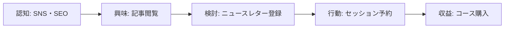
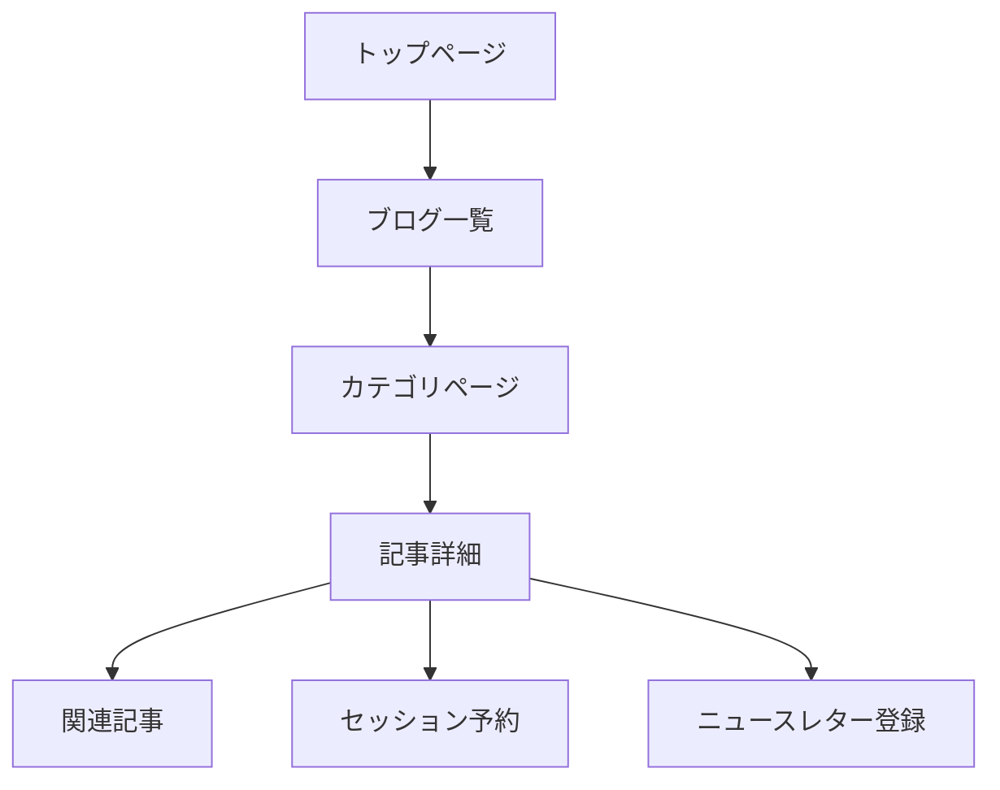

# コンテンツプロモーション戦略

## 📌 基本方針

本山貴裕のポートフォリオサイトの100記事を効果的にプロモーションし、ターゲット「自分を変えたい人」に届けるための包括的な戦略。

| 項目 | 内容 |
|------|------|
| **ターゲット** | 自分を変えたい人（30〜50代、キャリア転換・自己成長に関心） |
| **最終ゴール** | セッション予約とコース販売の増加 |
| **コンテンツ数** | 100記事（ブログ記事） |
| **カテゴリ** | キャリア(16)、コーチング(15)、生産性(25)、思考法(13)、マインドセット(16)、メンタルモデル(8)、AI活用(7) |

---

## 🎯 戦略フレームワーク

### コンテンツファネル



### プロモーションチャネル

| チャネル | 役割 | 投資対効果 |
|----------|------|-----------|
| **SEO** | 長期的な集客 | 🟢 高 |
| **SNS（X/Twitter）** | 短期的な認知拡大 | 🟡 中 |
| **ニュースレター** | 関係構築・リピート | 🟢 高 |
| **外部メディア** | 新規ユーザー獲得 | 🟡 中 |

---

## 📊 コンテンツ分析

### カテゴリ別戦略

| カテゴリ | 記事数 | 特徴 | プロモーション戦略 |
|----------|--------|------|------------------|
| **生産性** (25%) | 25記事 | 実用的なTips | SEO重視、短期成果を強調 |
| **キャリア** (16%) | 16記事 | キャリア転換ニーズ | ソーシャルメディア、事例共有 |
| **コーチング** (15%) | 15記事 | セッション予約への誘導 | セッションCTAの強化 |
| **思考法** (13%) | 13記事 | 深い洞察 | ニュースレター連携 |
| **マインドセット** (16%) | 16記事 | 行動変容 | ビフォーアフター事例 |
| **AI活用** (7%) | 7記事 | 時代に合った話題 | X/Twitterでのトレンド活用 |
| **メンタルモデル** (8%) | 8記事 | 複雑な概念 | インフォグラフィック活用 |

### ユーザージャーニーマッピング

#### 段階1: 認知

- **タッチポイント**: 検索エンジン、SNS、ニュースレター
- **コンテンツ**: キャッチーなタイトル、魅力的なサムネイル
- **行動**: クリック、閲覧

#### 段階2: 興味

- **タッチポイント**: 記事詳細、関連記事
- **コンテンツ**: 実践的な内容、具体例
- **行動**: 記事を最後まで読む、ニュースレター登録

#### 段階3: 検討

- **タッチポイント**: ニュースレター、セッションページ
- **コンテンツ**: 成功事例、お客様の声
- **行動**: セッションの詳細確認、問い合わせ

#### 段階4: 行動

- **タッチポイント**: 予約フォーム、決済画面
- **コンテンツ**: 明確な価値提案、安心感
- **行動**: セッション予約、コース購入

---

## 🚀 プロモーション戦略

### 1. SEO戦略（長期・高ROI）

#### 目標KPI

| 指標 | 現在値 | 目標値（6ヶ月後） |
|------|--------|-------------------|
| 月間PV | - | 10,000 |
| 検索流入 | - | 5,000 |
| 平均滞在時間 | - | 2分 |
| 直帰率 | - | 60%以下 |

#### キーワード戦略

**プライマリーキーワード**:
- キャリア転換
- 自己啓発
- 生産性向上
- コーチング 効果
- 思考法 ビジネス

**ロングテールキーワード**:
- 30代からキャリア転換
- 働き方 変えたい
- AI活用 キャリア
- 脱ノウハウ依存

#### 内部リンク構造



**実装計画**:
- ✅ 記事内にカテゴリへのリンク
- ✅ 関連記事の表示（タグ・カテゴリベース）
- [ ] 人気記事のサイドバー表示
- [ ] 「次に読む」記事の提案

#### コンテンツSEOの改善

**各記事の改善ポイント**:
1. **タイトル**: クリック率を意識（数字、疑問形）
2. **メタディスクリプション**: 検索結果でのCTR向上
3. **H1見出し**: キーワードを含める
4. **画像**: Altテキスト、ファイル名にキーワード
5. **内部リンク**: 関連記事への適切なリンク

**改善例**:

Before: `最高の休息法`
After: `【保存版】疲れが取れない人へ：最高の休息法5選`

Before: `ノウハウ依存からの卒業`
After: `脱ノウハウ依存：自分で決める力を取り戻す5ステップ`

### 2. SNSプロモーション（X/Twitter）

#### 投稿戦略

**頻度**: 週3回（火・木・土）

**コンテンツミックス**:
- 月曜: 生産性・習慣化（週の始まりに）
- 水曜: キャリア・自己成長（週中のモチベーション）
- 金曜: 思考法・メンタルモデル（週末の内省）
- 土曜: 読者からの質問・Q&A
- 日曜: 週間まとめ・ニュースレター紹介

**投稿フォーマット**:

```
📝 【今日のテーマ】

<記事タイトル>
<記事の要点を3行で>

👇 続きはブログで
https://takahiro-motoyama.vercel.app/blog/[slug]

#キャリア転換 #自己啓発 #生産性向上
```

#### エンゲージメント戦略

**フォロワーとの交流**:
- 質問に答える（コメント内で）
- リツイートへの感謝
- 関連アカウントをフォロー

**トレンド活用**:
- キャリア転換 トレンド
- 仕事 生成AI トレンド
- 自己啓発 トレンド

#### KPI目標

| 指標 | 現在値 | 目標値（3ヶ月後） |
|------|--------|-------------------|
| フォロワー数 | - | 1,000 |
| 月間インプレッション | - | 50,000 |
| 記事への流入 | - | 1,000/月 |
| リツイート/いいね率 | - | 3%以上 |

### 3. ニュースレター活用

#### 配信スケジュール（既存）

| 配信タイプ | 頻度 | 内容 |
|-----------|--------|------|
| メインニュースレター | 月1回 | 深いオリジナルコンテンツ |
| ライト配信 | 月1回 | 新着記事まとめ |

#### プロモーション連携

**ブログ記事 → ニュースレター**:
- 記事の最後にニュースレター登録フォーム
- 登録特典（自己分析ワークシート）を強調

**ニュースレター → ブログ記事**:
- ライト配信で新着記事を紹介
- メインニュースレターで記事へのリンクを含む

#### セグメンテーション（将来的な実装）

- [ ] 興味カテゴリ別セグメンテーション
- [ ] 行動履歴ベースのレコメンデーション
- [ ] 再エンゲージメントメール

### 4. 外部メディアとの連携

#### ゲスト投稿

**ターゲットメディア**:
- Note
- NewsPicks
- Zenn
- Qiita（技術記事）

**ゲスト投稿の種類**:
1. **ダイジェスト版**: ブログ記事の要約 + リンク
2. **オリジナル記事**: 外部メディア限定コンテンツ
3. **Q&A**: 読者からの質問に答える形式

#### ポッドキャスト出演

**ターゲットポッドキャスト**:
- キャリア転換系
- 自己啓発系
- ビジネス系

**出演時のアクション**:
- ポッドキャストの紹介記事をブログに掲載
- リスナー限定オファー（セッション割引など）

---

## 📅 実行ロードマップ

### Phase 1: 基盤構築（第1〜2週）

**Week 1**:
- [ ] SEOチェックリストの作成
- [ ] Google Search Consoleへの登録
- [ ] サイトマップの更新
- [ ] X/Twitterアカウントの整理

**Week 2**:
- [ ] 記事タイトル・メタディスクリプションの改善（優先10記事）
- [ ] 内部リンクの強化（関連記事表示）
- [ ] SNS投稿スケジュールの作成

### Phase 2: コンテンツ強化（第3〜4週）

**Week 3**:
- [ ] 人気記事の作成（検索ニーズの高いトピック）
- [ ] インフォグラフィックの作成（メンタルモデル記事）
- [ ] ケーススタディ記事の作成

**Week 4**:
- [ ] 初回ニュースレター配信
- [ ] ニュースレター登録フォームのABテスト
- [ ] SNS投稿の開始

### Phase 3: 成長フェーズ（第2ヶ月〜）

**Month 2**:
- [ ] 外部メディアへのゲスト投稿（Note, Zenn）
- [ ] ソーシャル広告の検討（少額テスト）
- [ ] アクセス解析の強化（Google Analytics 4）

**Month 3**:
- [ ] ポッドキャスト出演のオファー
- [ ] オンラインイベントの開催（ウェビナー）
- [ ] ユーザー生成コンテンツ（UGC）の促進

---

## 📊 KPIと成功指標

### ファネル別KPI

| ファネル段階 | 指標 | 目標値 | 測定方法 |
|-------------|------|--------|----------|
| **認知** | 月間PV | 10,000 | Vercel Analytics |
|  | ソーシャルインプレッション | 50,000 | X/Twitter Analytics |
| **興味** | 平均滞在時間 | 2分以上 | Vercel Analytics |
|  | 記読了率 | 70% | スクロール深度 |
| **検討** | ニュースレター登録数 | 月+10人 | Resend Analytics |
|  | セッション詳細閲覧数 | 月+50人 | Vercel Analytics |
| **行動** | セッション予約数 | 月+2件 | 手動/CRM |
|  | コース購入数 | 月+1件 | Stripe Dashboard |

### ROIの計算

**投入リソース**:
- コンテンツ作成: 10時間/月
- SNS運用: 3時間/月
- ニュースレター: 2時間/月
- 合計: 15時間/月

**期待リターン**:
- セッション売上: 10,000円 × 2件 = 20,000円/月
- コース売上: 5,000円 × 1件 = 5,000円/月
- 合計: 25,000円/月

**初期フェーズのROI**: 負（投資期）
**6ヶ月後の目標ROI**: 正（利益期）

---

## 🎯 成功のためのヒント

### 1. 一貫性を保つ

- トーン＆マナーの統一
- 発信頻度の維持
- ブランドカラーの使用

### 2. 価値を提供する

- クリックベイトを避ける
- 具体的なアクションを提示
- 読者の問題を解決する

### 3. エンゲージメントを重視

- コメントに返信する
- 質問に答える
- 読者の声を聞く

### 4. データを分析する

- どの記事が読まれているか？
- どのSNS投稿が反応がいいか？
- ニュースレターの開封率は？

---

## 📝 週間タスクリスト（テンプレート）

**月曜日**:
- [ ] 今週のSNS投稿スケジュール作成
- [ ] 生産性系記事のSNS投稿
- [ ] 先週のアクセス解析チェック

**火曜日**:
- [ ] キャリア系記事のSNS投稿
- [ ] 読者の質問・コメントに回答

**水曜日**:
- [ ] 思考法系記事のSNS投稿
- [ ] 新しい記事の構想

**木曜日**:
- [ ] マインドセット系記事のSNS投稿
- [ ] ニュースレターの下書き

**金曜日**:
- [ ] 週間まとめのSNS投稿
- [ ] ニュースレター配信（月初）

**土日**:
- [ ] 次週の記事作成
- [ ] 外部メディアのチェック

---

## 🔗 関連リンク

- [コンテンツアクセスガイド](./CONTENT_ACCESS_GUIDE.md) - コンテンツへのアクセス方法
- [ニュースレター戦略](../../.sisyphus/plans/newsletter-strategy.md) - ニュースレター配信計画
- [ブログ執筆ガイドライン](./BLOG_GUIDELINES.md) - 記事作成のルール
- [プロジェクト概要](../../PROJECT_OVERVIEW.md) - プロジェクト全体像

---

**作成日**: 2026-01-30
**最終更新**: 2026-01-30
**担当**: PM (Sisyphus)
**ステータス**: 戦略策定完了（実行待ち）
