# Phase 2 & 3: 重複記事統合 + 新規記事提案

## 📌 概要

**作成日**: 2026-01-30
**期間**: Week 2-4
**目的**: 重複記事を統合し、未開拓トピックを特定して新規記事を提案

---

## 📊 重複記事分析

### 確定された重複ペア

| ペアID | 記事1 | 記事2 | 重複理由 | 推奨アクション |
|---------|--------|--------|----------|----------------|
| 1 | 007-perfectionism-freedom.md | 081-done-is-better.md | 同じテーマ（完璧主義 vs 完了主義） | 統合 |

### 統合戦略

**統合後のタイトル案**:
- 「完璧主義を手放す - 80点で始めて、完了から磨く技術」

**統合後の構成案**:

```markdown
---
title: 完璧主義を手放す - 80点で始めて、完了から磨く技術
date: '2026-02-XX'
category: マインドセット
tags:
  - 完璧主義
  - 完了主義
  - 行動力
  - マインドセット
description: 完璧を目指すあまり行動できないあなたへ。80点でまず走り出し、そこから反復して磨く方法。
slug: let-go-of-perfectionism
published: true
---

## 完璧主義の3つの問題

### 1. 機会損失

準備している間に、チャンスは去っていきます。

「完璧な企画書」を作っている間に、誰かが先に動いています。
「もう少し良くしてから」言っている間に、時間は過ぎていきます。

> 完璧になるまで出さない

### 2. 成長の停滞

フィードバックがなければ、改善できません。

出してみないと、何が良くて何が悪いかさえわからなくなります。

> フィードバックは出してみないともらえない

### 3. 精神的消耗

「完璧でなければ」というプレッシャーは、心を消耗させます。

気づけば完璧ではなくなる、終わりが見えない状態が続きます。

> 「完璧」は存在しない

---

## 80点主義のすすめ

### 完璧主義 vs 80点主義

```mermaid
gantt
    title 完璧主義 vs 80点主義
    dateFormat  X

    section 完璧主義
    準備・修正・悩み (100点目指す) :active, a1, 0, 100
    完璧を待つ :crit, a2, after a1, 50
    リリース :crit, a3, after a2, 0

    section 80点主義
    80点で出す :done, b1, 0, 20
    フィードバック :done, b2, after b1, 10
    Ver.2 (90点) :active, b3, after b2, 30
    フィードバック :done, b4, after b3, 10
    Ver.3 (95点) :active, b5, after b4, 30
    フィードバック :done, b6, after b5, 10
```



80点主義の方が早く、精神的にも健康的です。

---

## 実践のフレームワーク

### Step 1: 最小限の要件を定義する

「これさえあれば、価値を提供できる」という最小限を決めます。

- 報告書なら：結論と根拠
- プレゼンなら：メインメッセージ3つ
- プロダクトなら：コア機能1つ

> 「十分」ではなく「必要十分」

### Step 2: タイムボックスを設定する

「2時間で80点のものを作る」と時間を決めます。

時間を区切ることで、完璧主義を封じ込めます。

> 時間切れは「出せた」ことの証明

### Step 3: 「とりあえず出す」を習慣化する

出すことへのハードルを下げます。

- 「ドラフトです」と前置きする
- 「フィードバックください」と依頼する
- 「Version 1です」と割り切る

> 恥ずかず出す習慣をつける

---

## まとめ

完璧を目指すことは悪いことではありません。

でも、完璧を「出す前」に求めるのは間違いです。

**まず80点で出す。そこから磨く。**

この順番を変えるだけで、あなたの行動力は劇的に変わります。

---

今日、一つ「とりあえず完了させる」ことをやってみてください。

**セッション予約**: [CTA]
```

---

## 🎯 統合作業フロー

1. 既存記事2つをバックアップ（007, 081）
2. 新しい統合記事を作成
3. 旧記事をアーカイブ化
4. 内部リンクを更新

---

## 📝 作業スケジュール

### Week 2: 統合戦略

- [ ] 統合後のタイトル決定
- [ ] 既存記事2つのバックアップ
- [ ] 新しい統合記事の構成案作成

### Week 3: 統合実装

- [ ] 統合記事の執筆
- [ ] ビジュアル要素（図解）の追加
- [ ] 内部リンクの確認と更新

### Week 4: 未開拓トピック分析

- [ ] カテゴリ別の記事数確認
- [ ] 未開拓トピックの特定
- [ ] 新規記事のアイデア出し

---

**作成日**: 2026-01-30
**担当**: PM (Sisyphus)
**ステータス**: 計画完了（実装待ち）
