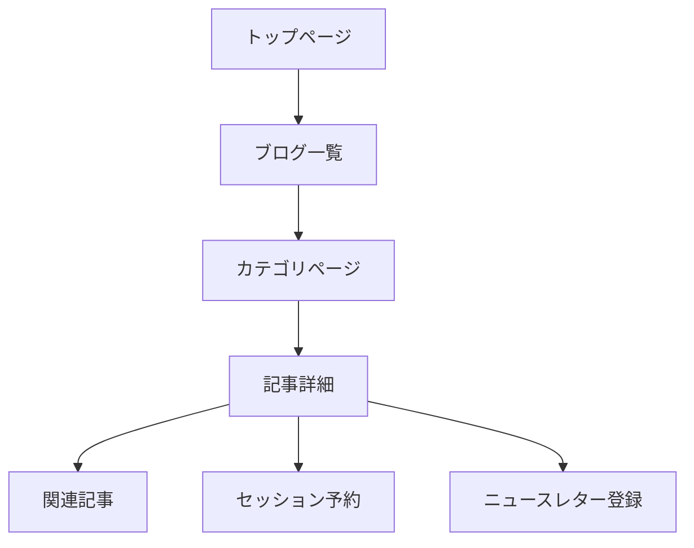

# SEOチェックリスト

## 📌 概要

本山貴裕のポートフォリオサイトのSEO（検索エンジン最適化）改善のためのチェックリスト。

**作成日**: 2026-01-30
**対象ページ数**: 54記事 + 固定ページ
**担当**: PM (Sisyphus)

---

## 🎯 目標KPI

| 指標 | 現在値 | 目標値（6ヶ月後） |
|------|--------|-------------------|
| 月間PV | - | 10,000 |
| 検索流入 | - | 5,000 |
| 平均滞在時間 | - | 2分 |
| 直帰率 | - | 60%以下 |

---

## ✅ 技術的SEO

### サイト設定

- [x] Next.js App RouterによるSSR/SSG設定済み
- [ ] メタデータの標準化（title, description, og:tags）
- [ ] 構造化データ（JSON-LD）の実装
- [ ] サイトマップの自動生成確認
- [ ] robots.txtの設定確認

### パフォーマンス

- [ ] Lighthouseスコア確認（目標: 90以上）
- [ ] Core Web Vitalsの最適化
  - [ ] LCP（Largest Contentful Paint）< 2.5秒
  - [ ] FID（First Input Delay）< 100ミリ秒
  - [ ] CLS（Cumulative Layout Shift）< 0.1
- [ ] 画像の最適化（WebP, 遅延読み込み）
- [ ] フォントの最適化

### モバイル対応

- [ ] レスポンシブデザインの確認
- [ ] モバイルでのユーザビリティチェック
- [ ] タップ可能な要素のサイズ（44px以上）

---

## 📝 コンテンツSEO

### 各記事の改善ポイント

#### 1. タイトル（title）

- [ ] クリック率を意識したタイトル（数字、疑問形、具体性）
- [ ] 文字数は30〜60文字
- [ ] キーワードを含める（自然な形で）

**改善例**:

| Before | After |
|--------|-------|
| 最高の休息法 | 【保存版】疲れが取れない人へ：最高の休息法5選 |
| ノウハウ依存からの卒業 | 脱ノウハウ依存：自分で決める力を取り戻す5ステップ |
| 完璧主義からの解放 | 完璧主義を手放す - 80点で始めて、完了から磨く技術 |

#### 2. メタディスクリプション（description）

- [ ] 検索結果でのCTR向上を目指す
- [ ] 文字数は120〜160文字
- [ ] 記事の要点と読むメリットを含める
- [ ] アクションを促す言葉を含める

**例**:
```
完璧を目指すあまり行動できないあなたへ。80点でまず走り出し、そこから反復して磨く方法。今日からできる3つのステップで、完璧主義を手放しましょう。
```

#### 3. 見出し（H1, H2, H3）

- [ ] H1: 記事タイトルと一致
- [ ] H2: セクションの区切り、キーワードを含める
- [ ] H3: 詳細なサブセクション
- [ ] 見出しの階層構造を維持

#### 4. 画像

- [ ] Altテキストの記述（代替テキスト）
- [ ] ファイル名にキーワードを含める
- [ ] 画像サイズの最適化
- [ ] キャプションの記述（必要に応じて）

#### 5. 内部リンク

- [ ] 関連記事へのリンクを3〜5個配置
- [ ] アンカーテキストにキーワードを含める
- [ ] カテゴリページへのリンク
- [ ] トップページへのパンくずリスト

#### 6. コンテンツ品質

- [ ] 記事の長さは1,500〜2,500文字
- [ ] 具体例・事例を含める
- [ ] ステップバイステップの説明
- [ ] 読者の問題解決に焦点を当てる

---

## 🔗 内部リンク構造

### リンク戦略



### 実装チェックリスト

- [x] 記事内にカテゴリへのリンク
- [ ] 関連記事の表示（タグ・カテゴリベース）
- [ ] 人気記事のサイドバー表示
- [ ] 「次に読む」記事の提案

---

## 📊 キーワード戦略

### プライマリーキーワード

| カテゴリ | キーワード | 検索ボリューム（想定） |
|---------|----------|----------------------|
| キャリア | キャリア転換 | 高 |
| コーチング | コーチング 効果 | 中 |
| 生産性 | 生産性向上 | 高 |
| 思考法 | 思考法 ビジネス | 中 |
| マインドセット | マインドセット | 中 |

### ロングテールキーワード

- 30代からキャリア転換
- 働き方 変えたい
- AI活用 キャリア
- 脱ノウハウ依存
- 完璧主義 手放す方法

---

## 📈 アクセス解析

### 設定

- [x] Vercel Analyticsの導入済み
- [ ] Google Analytics 4の設定
- [ ] Google Search Consoleの登録

### 定期的な確認

- [ ] 月次: 検索クエリの分析
- [ ] 月次: 流入元ページの分析
- [ ] 月次: 直帰率と滞在時間の確認

---

## 🚀 優先実施項目（Week 1-2）

### 高優先度

1. **メタデータの標準化**
   - [ ] 全54記事のtitleタグ確認
   - [ ] 全54記事のdescriptionタグ確認

2. **内部リンクの強化**
   - [ ] 関連記事表示機能の実装
   - [ ] カテゴリページからのリンク確認

3. **サイトマップの更新**
   - [ ] 新規記事の反映
   - [ ] 削除記事の除外

### 中優先度

4. **構造化データの実装**
   - [ ] Articleスキーマの実装
   - [ ] BreadcrumbListスキーマの実装

5. **コンテンツの品質向上**
   - [ ] 優先10記事のタイトル・メタディスクリプション改善
   - [ ] 具体例・事例の追加

---

## 📝 定期タスク

### 月次

- [ ] 検索クエリの分析と対応
- [ ] 新規記事のSEOチェック
- [ ] 内部リンクの見直し

### 四半期

- [ ] コンテンツギャップの分析
- [ ] キーワード戦略の見直し
- [ ] 競合サイトの分析

---

## 🔗 関連リンク

- [Google Search Console](https://search.google.com/search-console)
- [Google Analytics](https://analytics.google.com/)
- [Next.js SEO Documentation](https://nextjs.org/docs/app/building-your-application/optimizing/metadata)
- [Lighthouse](https://developers.google.com/web/tools/lighthouse)

---

**作成日**: 2026-01-30
**最終更新**: 2026-01-30
**担当**: PM (Sisyphus)
**ステータス**: チェックリスト作成完了（実行待ち）
