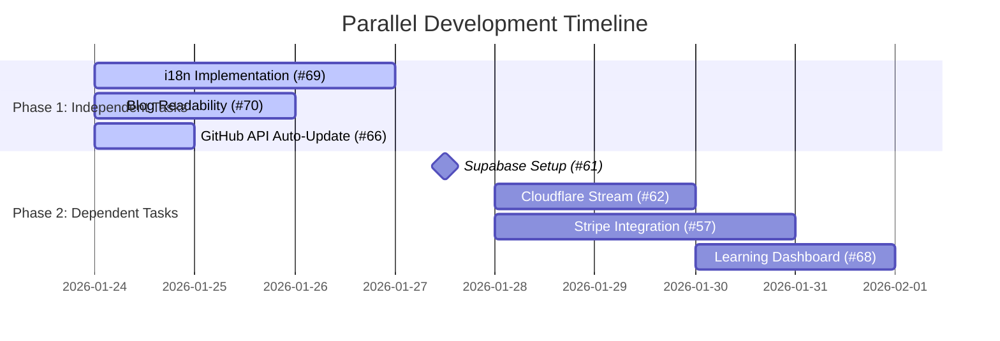

# Delegation Plan: Parallel Development

**作成日**: 2026-01-24
**目的**: 最適なエージェントを使用して並列開発を効率化する

---

## 📊 タスク分類

### 🔵 独立タスク（即時開始可能）

| Issue | タスク | 優先度 | 推定時間 | 依存 |
|-------|--------|---------|----------|------|
| #69 | i18n Implementation (next-intl) | 中 | 6-10時間 | なし |
| #70 | Blog Readability Enhancement | 低 | 4-6時間 | なし |
| #66 | GitHub API Auto-Update | 中 | 3-4時間 | なし |

### 🟡 依存タスク（先行タスク完了後に開始）

| Issue | タスク | 優先度 | 推定時間 | 依存 |
|-------|--------|---------|----------|------|
| #61 | Supabase Infrastructure Setup | 高 | 2-3時間 | ユーザー作業（Supabaseプロジェクト作成） |
| #62 | Cloudflare Stream Integration | 高 | 4-6時間 | #61 |
| #57 | Stripe Payment Integration | 高 | 5-7時間 | #61 |
| #68 | Learning Dashboard | 高 | 4-6時間 | #61, #62 |

---

## 🚀 並列実行プラン

### Phase 1: 独立タスク（即時開始）

#### Track A: i18n Implementation (#69)
**担当**: `frontend-ui-ux-engineer` + `oracle`
**推定時間**: 6-10時間
**開始時期**: 即時

**タスク**:
1. next-intl インストールと基本設定
2. コアページの多言語化
3. コンポーネントの更新
4. SEO タグ設定
5. テスト

**成果物**:
- `/ja/...` と `/en/...` のルーティング
- LanguageSwitcher コンポーネント
- 翻訳された全ページ

---

#### Track B: Blog Readability Enhancement (#70)
**担当**: `frontend-ui-ux-engineer`
**推定時間**: 4-6時間
**開始時期**: 即時

**タスク**:
1. Typography 最適化
2. 見出しスタイル改善
3. コードブロック強化
4. 目次（TOC）実装
5. 画像・図解最適化
6. テスト

**成果物**:
- TableOfContents コンポーネント
- 改善されたブログ記事スタイル
- シンタックスハイライト強化

---

#### Track C: GitHub API Auto-Update (#66)
**担当**: `explore` + `librarian`
**推定時間**: 3-4時間
**開始時期**: 即時

**タスク**:
1. GitHub API Client 作成
2. プロジェクト情報取得
3. README からサマリー抽出
4. 自動更新システム実装
5. テスト

**成果物**:
- `/api/github/projects` エンドポイント
- 自動更新スクリプト

---

### Phase 2: 依存タスク（Phase 1 完了後またはユーザー作業完了後）

#### Track D: Supabase Infrastructure Setup (#61)
**担当**: `oracle` + `librarian`
**推定時間**: 2-3時間
**開始条件**: ユーザーが Supabase プロジェクトを作成した後

**タスク**:
1. Supabase プロジェクト作成ガイド（ユーザー用）
2. データベーススキーマ適用
3. RLS ポリシー設定
4. 認証フロー検証

**成果物**:
- Supabase プロジェクトセットアップ完了
- データベーステーブル作成済み
- 認証機能動作確認済み

---

#### Track E: Cloudflare Stream Integration (#62)
**担当**: `frontend-ui-ux-engineer` + `oracle`
**推定時間**: 4-6時間
**開始条件**: #61 完了後

**タスク**:
1. Cloudflare Stream アカウント設定ガイド
2. VideoPlayer コンポーネント実装
3. 署名付きURL 生成 API
4. 動画管理システム
5. テスト

**成果物**:
- VideoPlayer コンポーネント
- `/api/stream/sign` エンドポイント
- 動画アップロード機能

---

#### Track F: Stripe Payment Integration (#57)
**担当**: `oracle` + `librarian`
**推定時間**: 5-7時間
**開始条件**: #61 完了後

**タスク**:
1. Stripe アカウント設定ガイド
2. Checkout ページ実装
3. Webhook 処理
4. 購入後フロー
5. テスト

**成果物**:
- `/checkout/[course_slug]` ページ
- `/api/stripe/checkout` エンドポイント
- `/api/webhooks/stripe` エンドポイント

---

#### Track G: Learning Dashboard (#68)
**担当**: `frontend-ui-ux-engineer` + `oracle`
**推定時間**: 4-6時間
**開始条件**: #61, #62 完了後

**タスク**:
1. VideoPlayer 統合
2. レッスン・モジュールナビゲーション
3. 進捗管理機能
4. ナビゲーションコントロール
5. レスポンシブデザイン
6. テスト

**成果物**:
- `/learn/[slug]` ページの完全実装
- 進捗バー・ナビゲーション機能

---

## 👥 エージェント割り当て詳細

### frontend-ui-ux-engineer
**担当タスク**:
- #69: i18n Implementation (Phase 2-3)
- #70: Blog Readability Enhancement (全タスク)
- #62: VideoPlayer コンポーネント実装
- #68: Learning Dashboard UI 実装

**強み**: UI/UX 設計、スタイリング、アニメーション、レスポンシブデザイン

### oracle
**担当タスク**:
- #69: i18n アーキテクチャ設計
- #61: Supabase インフラ設計・トラブルシューティング
- #62: Cloudflare Stream アーキテクチャ設計
- #57: Stripe 統合設計・セキュリティ検証
- #68: 学習ダッシュボードアーキテクチャ

**強み**: 高度な推論、アーキテクチャ設計、トラブルシューティング、複雑な問題解決

### explore
**担当タスク**:
- #66: GitHub API 実装（調査・実装）
- コードベース調査
- ベストプラクティス探索

**強み**: コード探索、実装調査、パターン発見

### librarian
**担当タスク**:
- #61: Supabase ドキュメント調査
- #57: Stripe ドキュメント調査
- #62: Cloudflare Stream ドキュメント調査
- #66: GitHub API ドキュメント調査

**強み**: 外部ドキュメント調査、公式 API ドキュメント、ベストプラクティス収集

---

## 📅 タイムライン

---

## 🎯 実行手順

### 現在（即時開始）

1. **Track A**: `frontend-ui-ux-engineer` で i18n 実装開始
2. **Track B**: `frontend-ui-ux-engineer` でブログ視認性向上開始
3. **Track C**: `explore` で GitHub API 実装開始

### Phase 1 完了後またはユーザー作業完了後

4. **Track D**: `oracle` で Supabase インフラ設計・実装（ユーザーが Supabase プロジェクト作成後）
5. **Track E**: `frontend-ui-ux-engineer` で Cloudflare Stream 統合（#61 完了後）
6. **Track F**: `oracle` で Stripe 決済統合（#61 完了後）
7. **Track G**: `frontend-ui-ux-engineer` で学習ダッシュボード（#61, #62 完了後）

---

## 📊 進捗追跡

各トラックの進捗を以下のメトリクスで追跡:
- タスク完了率 (%)
- 経過時間
- ブロックされる課題
- テスト成功率

---

## 🔄 コミュニケーション

- トラック間の依存関係を明確に管理
- 依存タスクの完了を通知
- ブロックされている課題を即時報告
- 定期的な進捗レビュー

---

## 📝 注意事項

1. **並列実行の制約**:
   - 同じファイルを編集するタスクは競合を避けるためシーケンシャルに実行
   - データベーススキーマの変更は一度に一人のみ

2. **ユーザー依存**:
   - Supabase プロジェクト作成（#61）はユーザー作業
   - Stripe アカウント作成（#57）はユーザー作業
   - Cloudflare Stream アカウント作成（#62）はユーザー作業

3. **環境変数**:
   - `.env.local` に必要な環境変数をユーザーに提供
   - `.env.example` を更新して必要な変数をドキュメント化

---

## 🎉 成功基準

### Phase 1 (独立タスク)
- [ ] i18n 実装完了、言語切り替え機能
- [ ] ブログ視認性向上、TOC 実装
- [ ] GitHub API 自動更新機能

### Phase 2 (依存タスク)
- [ ] Supabase インフラ稼働、認証機能
- [ ] Cloudflare Stream 動画ホスティング
- [ ] Stripe 決済統合、購入フロー
- [ ] 学習ダッシュボード完全実装

### 全体
- [ ] すべての GitHub Issues 完了
- [ ] ビルド成功、Lighthouse スコア達成
- [ ] 本番環境へのデプロイ準備完了
