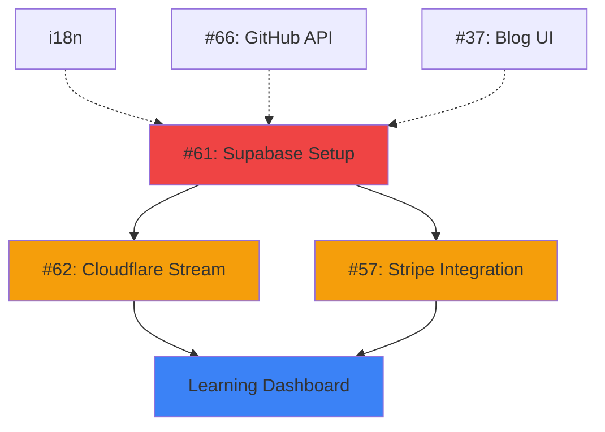

# Next Phases Work Breakdown

**作成日**: 2026-01-24
**バージョン**: 1.0

---

## 📊 プロジェクト全体観

### 現在の進捗

| Phase | 名称 | 進捗 | 状態 |
|-------|------|------|------|
| Phase 1 | 基盤整備 | 100% | ✅ 完了 |
| Phase 2 | コンテンツ充実 | 100% | ✅ 完了 |
| Phase 3 | コンテンツ拡充とエンゲージメント | 86% | 🟡 基本完了 |
| Phase 4 | 専門性の確立と収益化 | 85% | 🟡 決済未完了 |
| Phase 5 | プラットフォーム化とコミュニティ形成 | 60% | 🟡 インフラ未完了 |

### 技術スタック確認

```yaml
Framework: Next.js 16.1.1 (App Router, Turbopack)
UI: React 19.2.3
Styling: Tailwind CSS v4
Language: TypeScript
Auth: Supabase Auth (Magic Links, Social Login)
Database: Supabase (PostgreSQL)
Video: Cloudflare Stream (署名付きURL)
Payment: Stripe
Analytics: Google Analytics 4
Comments: Giscus
Newsletter: Resend + Supabase
```

### 既存のGitHub Issues

| # | タイトル | 状態 | 優先度 |
|---|----------|------|--------|
| #57 | [Phase4] Paid Content Sales (Stripe) | OPEN | 高 |
| #61 | [Phase5] Infrastructure Setup (Supabase & Auth) | OPEN | 高 |
| #62 | [Phase5] Video Hosting Integration (Cloudflare Stream) | OPEN | 高 |
| #66 | Projects Auto-Update from GitHub API | OPEN | 中 |
| #37 | [Epic] ブログ記事の視認性・読了率向上 | OPEN | 低 |

---

## 🎯 次のフェーズの優先順位

### 🔴 高優先（次のマイルストーン）

#### 1. Supabase プロジェクトの本番設定 (#61 残り)
**目標**: Supabase プロジェクトを作成し、認証・データベースを稼働させる

**サブタスク**:
- [ ] Supabase プロジェクト作成
  - [ ] https://supabase.com でプロジェクト作成
  - [ ] 環境変数を `.env.local` に追加 (`NEXT_PUBLIC_SUPABASE_URL`, `NEXT_PUBLIC_SUPABASE_ANON_KEY`)
  - [ ] Region, Database URL を確認

- [ ] データベーススキーマ適用
  - [ ] `supabase/migrations/001_newsletter_system.sql` を実行（既存）
  - [ ] コース用テーブルスキーマの作成（courses, modules, lessons, enrollments, user_progress）
  - [ ] RLSポリシーの適用

- [ ] 認証フローの検証
  - [ ] Magic Links でログインテスト
  - [ ] Social Login 設定（オプション）
  - [ ] セッション管理の検証

**依存**: なし
**推定時間**: 2-3時間
**担当**: バックエンド/インフラ専門

#### 2. Cloudflare Stream 統合 (#62)
**目標**: 動画ホスティングを Cloudflare Stream で実装する

**サブタスク**:
- [ ] Cloudflare Stream アカウント設定
  - [ ] Stream プロジェクト作成
  - [ ] API Key の取得
  - [ ] 環境変数設定 (`CLOUDFLARE_ACCOUNT_ID`, `CLOUDFLARE_API_TOKEN`)

- [ ] VideoPlayer コンポーネント実装
  - [ ] Cloudflare Stream Player 統合
  - [ ] 署名付きURL 生成 API
  - [ ] 動画再生・一時停止・進捗追跡

- [ ] 動画管理システム
  - [ ] 動画アップロード機能（管理者用）
  - [ ] 動画メタデータ管理
  - [ ] サムネイル生成

**依存**: #61
**推定時間**: 4-6時間
**担当**: フロントエンド/バックエンド

#### 3. Stripe 決済統合 (#57)
**目標**: コース購入機能を Stripe で実装する

**サブタスク**:
- [ ] Stripe アカウント設定
  - [ ] Stripe Dashboard でアカウント作成
  - [ ] API Keys (publishable, secret) 取得
  - [ ] Webhook エンドポイント設定

- [ ] Checkout ページ実装
  - [ ] `/checkout/[course_slug]` ページ作成
  - [ ] Stripe Checkout セッション作成 API
  - [ ] 成功・キャンセルページ

- [ ] Webhook 処理
  - [ ] `/api/webhooks/stripe` エンドポイント
  - [ ] `checkout.session.completed` イベント処理
  - [ ] Supabase `enrollments` テーブル更新

- [ ] 購入後フロー
  - [ ] 購入確認メール送信
  - [ ] `/learn/[course_slug]` へリダイレクト
  - [ ] 受講状態の即時反映

**依存**: #61
**推定時間**: 5-7時間
**担当**: バックエンド/決済専門

#### 4. 学習ダッシュボード実装
**目標**: 受講者がコースを学習するための UI を実装する

**サブタスク**:
- [ ] `/learn/[slug]` ページ拡張
  - [ ] 動画プレイヤーの統合
  - [ ] モジュール・レッスン一覧（サイドバー）
  - [ ] レッスン完了チェックボタン

- [ ] 進捗管理機能
  - [ ] `user_progress` テーブルとの同期
  - [ ] コース全体の進捗バー
  - [ ] 最終視聴位置の保存

- [ ] レッスンナビゲーション
  - [ ] 次のレッスンへの自動遷移
  - [ ] 前のレッスンへの戻る
  - [ ] 任意のレッスンへジャンプ

**依存**: #61, #62
**推定時間**: 4-6時間
**担当**: フロントエンド/UI

### 🟡 中優先

#### 5. 多言語対応 (i18n)
**目標**: next-intl を使用してサイトを多言語化する

**サブタスク**:
- [ ] Phase 1: 基本設定 (1-2時間)
  - [ ] `npm install next-intl`
  - [ ] `src/i18n/request.ts`, `src/i18n/config.ts` 作成
  - [ ] `next.config.ts` 更新
  - [ ] `src/app/[locale]/layout.tsx` 作成

- [ ] Phase 2: コアページ (2-3時間)
  - [ ] home, about, philosophy, sessions, contact ページ更新
  - [ ] `useTranslations()` を使用してハードコードテキスト置換

- [ ] Phase 3: コンポーネント (1-2時間)
  - [ ] Header, Footer コンポーネント更新
  - [ ] LanguageSwitcher コンポーネント作成

- [ ] Phase 4: SEO設定 (1-2時間)
  - [ ] hreflang タグ追加
  - [ ] 言語別メタデータ
  - [ ] sitemap 更新

- [ ] Phase 5: テスト (1時間)
  - [ ] 言語切り替えテスト
  - [ ] 全ページ翻訳確認

**依存**: なし
**推定時間**: 6-10時間
**担当**: フロントエンド

#### 6. Projects Auto-Update from GitHub API (#66)
**目標**: GitHub API を使用してプロジェクト情報を自動更新する

**サブタスク**:
- [ ] GitHub API 設定
  - [ ] Personal Access Token 取得
  - [ ] 環境変数設定 (`GITHUB_TOKEN`)
  - [ ] GitHub API Client 作成

- [ ] データ取得機能
  - [ ] 指定したリポジトリの情報取得
  - [ ] README からサマリー抽出
  - [ ] 最新コミット・リリース情報

- [ ] 自動更新システム
  - [ ] 定期的なデータ更新 (cron job)
  - [ ] Webhook 連携（オプション）
  - [ ] キャッシュ戦略

**依存**: なし
**推定時間**: 3-4時間
**担当**: バックエンド

### 🟢 低優先

#### 7. ブログ記事の視認性・読了率向上 (#37)
**目標**: ブログ記事の読みやすさを向上させる

**サブタスク**:
- [ ] 文字サイズ・行間・余白の最適化
- [ ] 見出しスタイルの改善
- [ ] コードブロックのシンタックスハイライト強化
- [ ] 画像・図解の表示最適化
- [ ] 目次（TOC）の実装
- [ ] 読了時間の精度向上

**依存**: なし
**推定時間**: 4-6時間
**担当**: フロントエンド/UI

---

## 📋 タスク依存関係図



---

## 🚀 並列開発プラン

### Team A: インフラ・バックエンド (高優先)
**担当タスク**:
1. #61: Supabase プロジェクト設定
2. #57: Stripe 決済統合
3. #66: GitHub API 統合

**エージェント**:
- `oracle` (アーキテクチャ設計、トラブルシューティング)
- `explore` (実装パターン調査)
- `librarian` (Stripe/Supabase/Cloudflare ドキュメント調査)

### Team B: フロントエンド・UI (高優先)
**担当タスク**:
1. #62: VideoPlayer コンポーネント
2. 学習ダッシュボード実装
3. i18n 実装

**エージェント**:
- `frontend-ui-ux-engineer` (UI/UX 設計、アニメーション)
- `explore` (コンポーネント調査)
- `oracle` (パフォーマンス最適化、アーキテクチャ)

### Team C: コンテンツ・品質 (中優先)
**担当タスク**:
1. #37: ブログ記事視認性向上
2. コース本番データ準備

**エージェント**:
- `document-writer` (ドキュメント更新)
- `explore` (読書性調査)

---

## 📝 新規 GitHub Issue 作成計画

### 作成する Issues

1. **#68: Learning Dashboard Implementation**
   - Phase 5
   - `/learn/[slug]` ページの完全実装
   - サブタスク: 動画プレイヤー、進捗管理、ナビゲーション

2. **#69: i18n Implementation (next-intl)**
   - Phase 5 (p5-6 再開)
   - 5フェーズの多言語対応実装
   - サブタスク: 基本設定、コアページ、コンポーネント、SEO、テスト

3. **#70: Blog Readability Enhancement**
   - Phase 3 拡張
   - ブログ記事の読みやすさ向上
   - サブタスク: 文字サイズ、見出し、コードブロック、目次

---

## 🎯 成功基準

### Supabase Setup (#61)
- [ ] ローカル環境で Magic Links ログイン成功
- [ ] データベーススキーマが正常に適用
- [ ] RLSポリシーが正しく機能
- [ ] 本番環境の Supabase プロジェクトが稼働

### Cloudflare Stream (#62)
- [ ] 動画が正常に再生される
- [ ] 署名付きURLが機能し、動画が保護されている
- [ ] 管理者から動画をアップロードできる
- [ ] 動画の進捗が正しく追跡される

### Stripe Integration (#57)
- [ ] Checkout ページが正常に表示される
- [ ] 決済完了後、Supabase `enrollments` テーブルに記録される
- [ ] Webhook が正しく処理される
- [ ] 購入後、学習ダッシュボードへリダイレクトされる

### Learning Dashboard
- [ ] 動画がシームレスに再生される
- [ ] 進捗バーが正しく更新される
- [ ] レッスン完了状態が保存される
- [ ] 受講したコースのみアクセスできる

### i18n (#69)
- [ ] 言語切り替えが機能する
- [ ] 全ページで翻訳が適用されている
- [ ] hreflang タグが正しく設定されている
- [ ] ビルドが成功する

---

## 📊 推定工数

| タスク | 推定時間 | 優先度 |
|--------|----------|--------|
| #61 Supabase Setup | 2-3時間 | 高 |
| #62 Cloudflare Stream | 4-6時間 | 高 |
| #57 Stripe Integration | 5-7時間 | 高 |
| Learning Dashboard | 4-6時間 | 高 |
| #69 i18n | 6-10時間 | 中 |
| #66 GitHub API | 3-4時間 | 中 |
| #37 Blog UI | 4-6時間 | 低 |
| **合計** | **28-42時間** | - |

---

## 🔗 関連リソース

- [ROADMAP.md](./ROADMAP.md)
- [PROJECT_OVERVIEW.md](./PROJECT_OVERVIEW.md)
- [docs/specs/ONLINE_COURSE_ARCHITECTURE.md](./docs/specs/ONLINE_COURSE_ARCHITECTURE.md)
- [docs/i18n-implementation-plan.md](./docs/i18n-implementation-plan.md)
- [GitHub Issues](https://github.com/tndg16-bot/portfolio-site/issues)
