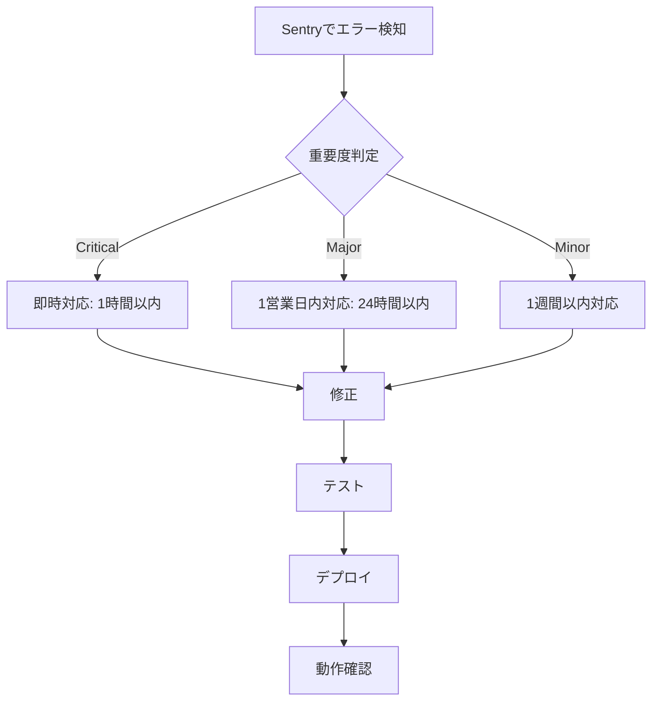

# ポートフォリオサイトメンテナンス計画 (Maintenance Plan)

作成日: 2026-02-15
担当: Subagent (portfolio-renewal)
GitHub Issue: #210 (tndg16-bot/portfolio-site)

---

## 1. 定期更新スケジュール (Regular Update Schedule)

### 1.1 週次タスク (Weekly Tasks)
| 日時 | タスク | 担当 | 目的 |
|------|------|------|------|
| 毎週水曜日 | アクセス解析の確認 | - | 人気ページの把握、滞在時間の分析 |
| 毎週水曜日 | 人気記事のチェック | - | トレンド記事の特定 |
| 毎週水曜日 | エラーログの確認 | - | 早期発見・対応 |

### 1.2 月次タスク (Monthly Tasks)
| 日時 | タスク | 担当 | 目的 |
|------|------|------|------|
| 毎月第1木曜日 | コンテンツ更新 | - | 新規記事の公開 |
| 毎月第1木曜日 | SEOスコアの確認 | - | SEO改善の継続 |
| 毎月第1木曜日 | ニュースレター送信 | - | 読者への情報発信 |
| 毎月第2木曜日 | 古い記事の見直し | - | コンテンツの鮮度維持 |
| 毎月第3木曜日 | Google Search Consoleの確認 | - | 検索パフォーマンスの分析 |
| 毎月第4木曜日 | Lighthouseスコアのチェック | - | パフォーマンスの監視 |

### 1.3 四半期タスク (Quarterly Tasks)
| 日時 | タスク | 担当 | 目的 |
|------|------|------|------|
| 各四半期第1月 | 全面レビュー（UI/UX） | - | ユーザー体験の改善 |
| 各四半期第1月 | コンテンツ戦略の見直し | - | 戦略の最適化 |
| 各四半期第1月 | テクニカル監査 | - | 技術的課題の特定 |
| 各四半期第2月 | セキュリティチェック | - | セキュリティの維持 |
| 各四半期第2月 | 依存関係の更新 | - | セキュリティパッチの適用 |
| 各四半期第3月 | 四半期レビュー | - | 目標達成状況の確認 |

### 1.4 年次タスク (Yearly Tasks)
| 日時 | タスク | 担当 | 目的 |
|------|------|------|------|
| 1月 | 全体戦略の見直し | - | 年間計画の策定 |
| 12月 | 年次振り返り | - | 成果の評価・反省 |

---

## 2. バックアップ計画 (Backup Plan)

### 2.1 コンテンツバックアップ (Content Backup)

#### Gitバージョン管理 (完了済み)
- **リポジトリ**: https://github.com/tndg16-bot/portfolio-site
- **ブランチ**: `main` (本番)
- **方法**: GitHub で自動バックアップ
- **復元**: `git clone` で完全復元

#### ローカルバックアップ
| 頻度 | タスク | 方法 |
|------|------|------|
| 月1回 | リポジトリのローカルクローン | `git clone https://github.com/tndg16-bot/portfolio-site backup-YYYY-MM` |

### 2.2 データバックアップ (Data Backup)

#### Supabase (ニュースレター購読者)
| 頻度 | タスク | 方法 |
|------|------|------|
| 月1回 | 購読者データのエクスポート | Supabase Dashboard > Export > CSV |

#### Google Forms (お問い合わせ・予約)
| 頻度 | タスク | 方法 |
|------|------|------|
| 月1回 | 回答データのダウンロード | Google Forms > 回答 > スプレッドシートへ |

### 2.3 ドキュメントバックアップ

| ドキュメント | バックアップ場所 | 頻度 |
|-------------|------------------|------|
| 運用計画 | Google Drive / Notion | 更新時 |
| メンテナンス計画 | Google Drive / Notion | 更新時 |
| 分析レポート | Google Drive / Notion | 更新時 |

---

## 3. モニタリング設定 (Monitoring Setup)

### 3.1 Google Analytics 4 (緊急)

#### 設定手順
1. **GA4 プロパティ作成**
   - Google Analytics にアクセス: https://analytics.google.com/
   - 「管理」 > 「アカウントを作成」
   - プロパティ設定: ウェブ
   - ウェブサイト名: 本山貴大 ポートフォリオサイト
   - ウェブサイトのURL: https://takahiro-motoyama.vercel.app
   - レポートのタイムゾーン: 日本
   - 通貨: 日本円 (JPY)

2. **データストリームの作成**
   - ウェブストリームを作成
   - 測定IDを確認 (形式: G-XXXXXXXXXX)

3. **環境変数の設定**
   ```bash
   # .env.local に追加
   NEXT_PUBLIC_GA_MEASUREMENT_ID=G-XXXXXXXXXX
   ```

4. **デプロイと確認**
   ```bash
   git add .env.local
   git commit -m "Add Google Analytics Measurement ID"
   git push origin main
   ```
   - Vercel で自動デプロイ
   - Google Analytics でリアルタイムアクセスを確認

#### 監視項目
- リアルタイムユーザー数
- ページビュー数
- 平均滞在時間
- 直帰率
- リピート率
- 人気ページ
- 参照元

### 3.2 Vercel Analytics (緊急)

#### 設定手順
1. **Vercel Dashboard で有効化**
   - https://vercel.com/dashboard にアクセス
   - `portfolio-site` プロジェクトを選択
   - 「Analytics」タブを開く
   - 「Enable Analytics」をクリック

2. **パッケージのインストール**
   ```bash
   cd C:\Users\chatg\.openclaw\workspace\portfolio-site
   npm install @vercel/analytics
   ```

3. **コンポーネントの追加**
   ```tsx
   // src/app/layout.tsx
   import { Analytics } from '@vercel/analytics/react';

   export default function RootLayout({ children }: { children: React.ReactNode }) {
     return (
       <html>
         <head>
           {/* ... */}
         </head>
         <body>
           {/* ... */}
           <Analytics />
         </body>
       </html>
     );
   }
   ```

4. **デプロイ**
   ```bash
   git add src/app/layout.tsx package.json package-lock.json
   git commit -m "Add Vercel Analytics"
   git push origin main
   ```

#### 監視項目
- Web Vitals (LCP, FID, CLS)
- パフォーマンススコア
- 地域分布
- デバイス分布
- ブラウザ分布

### 3.3 Sentry (エラー監視) (緊急)

#### 設定手順
1. **Sentry アカウント作成**
   - https://sentry.io/signup/ にアクセス
   - アカウントを作成
   - プロジェクトを作成: `Next.js`

2. **パッケージのインストール**
   ```bash
   cd C:\Users\chatg\.openclaw\workspace\portfolio-site
   npm install @sentry/nextjs
   ```

3. **Sentry初期化**
   ```bash
   npx @sentry/wizard@latest -i nextjs
   ```

4. **環境変数の設定**
   ```bash
   # .env.local に追加
   SENTRY_DSN=https://xxxxxxx@o1234.ingest.sentry.io/123456
   SENTRY_AUTH_TOKEN=sntrys_xxxxxxx
   ```

5. **デプロイ**
   ```bash
   git add .env.local sentry.*.* tsconfig.json next.config.ts
   git commit -m "Add Sentry for error monitoring"
   git push origin main
   ```

#### 監視項目
- エラー発生数
- エラーの種類
- エラー発生箇所
- パフォーマンスの低下
- 例外トラッキング

---

## 4. エラーハンドリングと対応手順 (Error Handling & Response)

### 4.1 エラーの分類

| エラー種別 | 重要度 | 対応時間 | 対応担当 |
|----------|--------|---------|---------|
| **Critical** | 高 | 1時間以内 | - |
| - サイト全体がダウン |  |  |  |
| - データベース接続エラー |  |  |  |
| **Major** | 中 | 24時間以内 | - |
| - 特定ページでエラー |  |  |  |
| - APIエラー |  |  |  |
| **Minor** | 低 | 1週間以内 | - |
| - UI表示の不具合 |  |  |  |
| - タイポグラフィエラー |  |  |  |

### 4.2 エラー対応フロー



---

## 5. セキュリティメンテナンス (Security Maintenance)

### 5.1 依存関係の更新

| 頻度 | タスク | コマンド |
|------|------|---------|
| 月1回 | 依存関係の確認 | `npm outdated` |
| 月1回 | セキュリティスキャン | `npm audit` |
| 四半期1回 | メジャーアップデート | `npm update` |

### 5.2 セキュリティベストプラクティス

#### 環境変数の管理
- ✅ `.env.local` を `.gitignore` に追加済み
- ✅ `.env.example` でテンプレートを管理
- ✅ GitHubトークンを環境変数に保存

#### APIキーの管理
- ✅ `NEXT_PUBLIC_` プレフィックスで公開可能なキーを識別
- ⚠️ 機密キーはサーバーサイドでのみ使用

#### パスワードポリシー
- ✅ 管理画面用パスワードの定期的な変更
- ✅ 強力なパスワードの使用（12文字以上、大文字小文字、記号）

---

## 6. パフォーマンスメンテナンス (Performance Maintenance)

### 6.1 画像最適化
- ✅ Next.js Image コンポーネントを使用
- ✅ AVIF, WebP 形式をサポート
- ⚠️ 定期的な画像サイズの確認と最適化

### 6.2 コード分割
- ✅ `optimizePackageImports` でパッケージを最適化
- ✅ 動的インポートの使用

### 6.3 キャッシュ戦略
- ✅ Vercel Edge Cache を活用
- ⚠️ キャッシュ期間の適切な設定

---

## 7. コンテンツメンテナンス (Content Maintenance)

### 7.1 記事の見直しスケジュール

| 記事の古さ | 対応 |
|----------|------|
| 3ヶ月以内 | 変更不要 |
| 3〜6ヶ月 | リンク切れの確認 |
| 6〜12ヶ月 | 情報の更新、統計の修正 |
| 12ヶ月以上 | 完全なリライトまたはアーカイブ |

### 7.2 リンクチェック
- ⚠️ 外部リンクの切れを月1回確認
- ⚠️ 内部リンクの正確性を確認

### 7.3 コメント管理
- ✅ Giscus (GitHub Discussions) を活用
- ⚠️ スパムコメントの削除
- ⚠️ 読者コメントへの返信

---

## 8. 緊急時対応計画 (Emergency Response Plan)

### 8.1 サイトダウン時の対応

#### 手順
1. **現状確認**: Vercel Dashboard でログ確認
2. **原因特定**: Sentry でエラー確認
3. **一時的対応**: メンテナンスページの表示
4. **修正**: 問題の修正とテスト
5. **復旧**: 本番環境へのデプロイ
6. **報告**: ユーザーへの状況報告

#### メンテナンスページ
```tsx
// src/app/maintenance/page.tsx
export default function Maintenance() {
  return (
    <div className="flex items-center justify-center min-h-screen">
      <div className="text-center">
        <h1>メンテナンス中</h1>
        <p>ただいまメンテナンス中です。しばらくお待ちください。</p>
      </div>
    </div>
  );
}
```

### 8.2 データ損失時の対応

#### 手順
1. **状況確認**: データの損失範囲を特定
2. **バックアップ確認**: 最新のバックアップを確認
3. **復元**: バックアップからのデータ復元
4. **検証**: データの整合性確認
5. **原因特定**: 損失原因の特定
6. **防止策**: 再発防止策の実装

---

## 9. まとめ (Summary)

このメンテナンス計画に従って、以下のタスクを実施することで、サイトの安定性と信頼性を維持できます。

### 優先順位
1. **緊急 (1週間以内)**
   - Google Analytics 4 設定
   - Vercel Analytics 有効化
   - Sentry 導入

2. **高 (1ヶ月以内)**
   - 定期更新スケジュールの開始
   - バックアップ計画の実施

3. **中 (3ヶ月以内)**
   - 四半期レビューの実施
   - セキュリティチェック

4. **低 (継続)**
   - 月次・週次タスクの実施

---

**作成日**: 2026-02-15
**更新予定**: 四半期ごとに見直し
