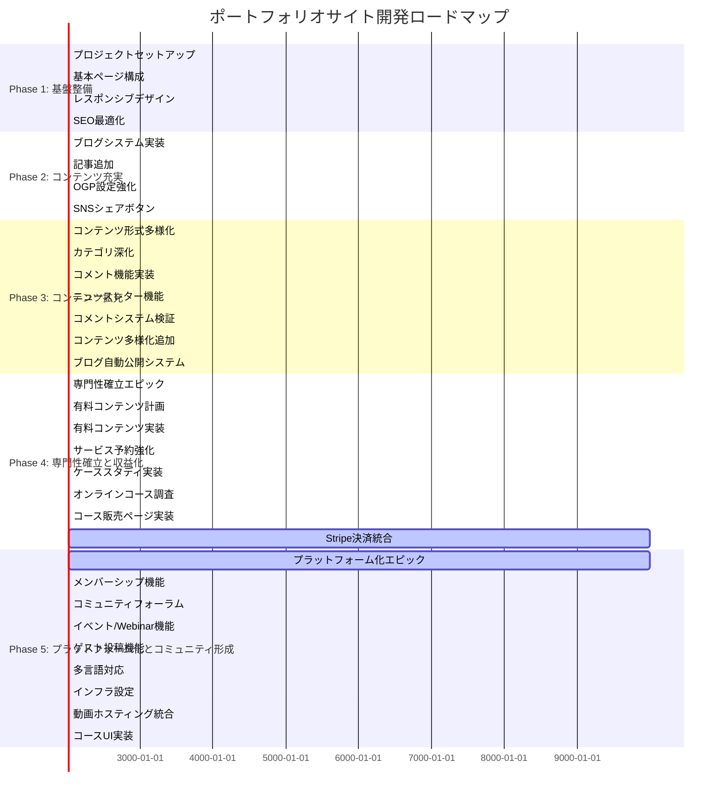

# プロジェクト概要 (Project Overview)

## 🎯 ビジョン

本山貴裕のプロフェッショナルなオンラインプレゼンスを確立し、以下を実現するポートフォリオサイト。

1. **個人ブランディング** - AIを活用した自己啓発・副業支援のエキスパートとしての認知
2. **サービス提供** - カウンセリングセッション、コンサルティングサービスの窓口
3. **コンテンツ発信** - ブログ記事、技術記事を通じた知見の共有
4. **信頼構築** - 実績、哲学、FAQ等を通じた透明性のある情報発信

## 🏗️ アーキテクチャ

### 技術選定の理由

| 技術 | 選定理由 |
|------|----------|
| **Next.js 16** | App Router による優れたSEO、部分レンダリング、高速なページ遷移 |
| **React 19** | Concurrent Features、Suspense による優れたUX |
| **Tailwind CSS v4** | 高速なスタイリング、一貫性のあるデザインシステム |
| **Framer Motion** | 流れるようなアニメーションでプレミアム感を演出 |
| **TypeScript** | 型安全性による開発効率と品質向上 |

### デプロイメント

- **ホスティング**: Vercel
- **本番URL**: https://takahiro-motoyama.vercel.app
- **自動デプロイ**: GitHub main ブランチへのマージで自動デプロイ

## 📄 主要ページ構成

| ページ | URL | 目的 |
|--------|-----|------|
| ホーム | `/` | ファーストインプレッション、主要CTAへの誘導 |
| About | `/about` | 経歴、スキル、パーソナリティの紹介 |
| セッション | `/sessions` | 提供サービスの詳細と予約 |
| 哲学 | `/philosophy` | 価値観、アプローチの説明 |
| FAQ | `/faq` | よくある質問への回答 |
| お役立ち情報 | `/useful-info` | 無料コンテンツ、リソースの提供 |
| お問い合わせ | `/contact` | 連絡フォーム |
| ブログ一覧 | `/blog` | 全記事の一覧、検索 |
| 記事詳細 | `/blog/[slug]` | 個別の記事ページ |
| タグ検索 | `/blog/tag/[tag]` | タグによる記事フィルタリング |
| コースカタログ | `/courses` | オンラインコース一覧 |
| コース詳細 | `/courses/[slug]` | コース販売ページ |

## 🎨 デザイン原則

### カラーパレット

| 色 | 変数 | HEX | 用途 |
|-----|--------|-----|------|
| Indigo | japan-indigo | #1B365D | メインテキスト、ヘッダー、ボタン |
| Cream | japan-cream | #F5F1E8 | 背景色、カード背景 |
| Vermilion | japan-vermilion | #D9381E | CTAボタン、強調 |
| Charcoal | japan-charcoal | #2D2D2D | 本文テキスト |
| Gold | japan-gold | #C5A059 | アクセント、強調 |

### 背景・パターン

| パターン | 用途 |
|---------|------|
| 和紙質感 | 主要背景（ノイズテクスチャ） |
| 青海波 (Seigaiha) | ヒーローセクション、フィロソフィーセクション |
| 麻の葉 (Asanoha) | CTAセクション、カード装飾 |

### アニメーション

- **マイクロインタラクション**: ボタンホバー、ページ遷移のアニメーション
- **パララックス**: 背景パララックスによる奥行き感
- **カスタムカーソル**: LiquidCursor によるインタラクティブ体験

### レスポンシブ

- モバイルファースト設計
- ブレークポイント: sm(640px), md(768px), lg(1024px), xl(1280px)

## 🔄 開発フロー

1. **Issue作成** - 新機能・修正はGitHub Issue先行
2. **ブランチ作成** - `feature/[機能名]` 形式
3. **開発** - ローカル開発サーバーでの実装
4. **PR作成** - レビュー依頼
5. **マージ** - 承認後mainにマージ
6. **自動デプロイ** - Vercelで自動デプロイ

## 📊 プロジェクトフェーズ全体図



## 📈 各フェーズ進捗詳細

### Phase 1: 基盤整備 ✅ 100%
```
[████████████████████] 完了
```
**完了タスク:**
- ✅ プロジェクトセットアップ
- ✅ 基本ページ構成
- ✅ レスポンシブデザイン
- ✅ SEO最適化

---

### Phase 2: コンテンツ充実 ✅ 100%
```
[████████████████████] 完了
```
**完了タスク:**
- ✅ ブログシステム実装
- ✅ 記事追加（100記事）
- ✅ OGP設定強化
- ✅ SNSシェアボタン
- ✅ コンテンツ形式多様化（図解・インフォグラフィック）
- ✅ カテゴリ深化
- ✅ コメント機能（Giscus）
- ✅ ニュースレター機能
- ✅ SEO強化

---

### Phase 3: コンテンツ拡充とエンゲージメント向上 ✅ 90%
```
[█████████████████░░░░] 90%
```
**完了タスク:**
- ✅ コンテンツ形式多様化
- ✅ カテゴリ深化
- ✅ コメント機能実装
- ✅ ニュースレター機能
- ✅ コメントシステム検証
- ✅ コンテンツ多様化追加
- ✅ ブログ自動公開システム（Issue #65）
- ✅ プロジェクト自動更新（GitHub API連携）（Issue #66）

**未完了タスク:**
- ⚠️ 予約システム統合
- ⚠️ アナリティクス強化
- ⚠️ パフォーマンス最適化

---

### Phase 4: 専門性の確立と収益化 🟡 85%
```
[████████████████░░░░] 85%
```
**完了タスク:**
- ✅ 専門性確立エピック
- ✅ 有料コンテンツ計画
- ✅ 有料コンテンツ実装
- ✅ サービス予約強化
- ✅ ケーススタディ実装
- ✅ オンラインコース調査
- ✅ コース販売ページ実装

**未完了タスク:**
- ⚠️ #57: Stripe決済統合（有料コンテンツ販売機能）

---

### Phase 5: プラットフォーム化とコミュニティ形成 🟡 60%
```
[███████████░░░░░░░░░] 60%
```
**完了タスク:**
- ✅ プラットフォーム化エピック
- ✅ メンバーシップ機能
- ✅ コミュニティフォーラム
- ✅ イベント/Webinar機能
- ✅ ゲスト投稿機能
- ✅ 多言語対応
- ✅ #63: コースUI実装

**未完了タスク:**
- ⚠️ #61: インフラ設定（Supabase & Auth）
- ⚠️ #62: 動画ホスティング統合（Cloudflare Stream）

---

## 🎯 今後のロードマップ

### 🔴 高優先（次のマイルストーン）

| Issue | Phase | タスク | 依存関係 |
|--------|--------|--------|----------|
| #61 | Phase5 | Infrastructure Setup (Supabase & Auth) | なし |
| #62 | Phase5 | Video Hosting Integration (Cloudflare Stream) | なし |
| #57 | Phase4 | Paid Content Sales (Stripe) | Issue #61 |
| #65 | Phase3 | Blog Automatic Publishing System (Daily Rebuild) | なし | ✅ 完了 |

### 🟡 中優先

| タスク | 優先度 | 備考 |
|--------|---------|--------|
| 予約システム統合 | 中 | Supabase連合が必要 |
| アナリティクス強化 | 中 | Vercel Analytics導入検討 |
| パフォーマンス最適化 | 中 | Core Web Vitals監視 |

## 📊 KPI

- **ページ読み込み速度**: < 3秒 (LCP)
- **アクセシビリティスコア**: 90+ (Lighthouse)
- **SEOスコア**: 90+ (Lighthouse)
- **パフォーマンススコア**: 80+ (Lighthouse)

## 🔗 関連リソース

- [プロジェクト構造](./PROJECT_STRUCTURE.md)
- [コントリビューションガイド](./CONTRIBUTING.md)
- [リポジトリ関係性ガイド](./REPOSITORY_GUIDE.md)
- [フェーズ進捗詳細](./ROADMAP.md)
- [GitHub Issues](https://github.com/tndg16-bot/portfolio-site/issues)
