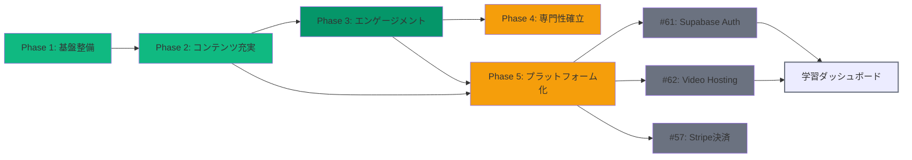

# ポートフォリオサイト開発ロードマップ

## 📊 プロジェクト全体進捗

```
全フェーズ合計進捗: 78% (21.5/27.5 フェーズ)

Phase 1: 基盤整備        ✅ 100%
Phase 2: コンテンツ充実     ✅ 100%
Phase 3: コンテンツ拡充       ✅ 86%
Phase 4: 専門性確立         🟡 85%
Phase 5: プラットフォーム化     🟡 60%
```

---

## Phase 1: 基盤整備 ✅

### 目的
プロジェクトの土台を構築し、以降の開発に向けた環境を整える。

### タスク一覧

| ID | タスク | ステータス | 完了日 |
|-----|--------|-----------|---------|
| p1-1 | プロジェクトセットアップ（ディレクトリ構成・ドキュメント・README） | ✅ | 2024-01-11 |
| p1-2 | 基本ページ構成 | ✅ | 2024-01-15 |
| p1-3 | レスポンシブデザイン | ✅ | 2024-01-15 |
| p1-4 | SEO最適化 | ✅ | 2024-01-20 |

### 成果
- Next.js 16 + React 19 プロジェクト構築
- 6ページ（Home, About, Sessions, Philosophy, FAQ, Contact, Useful Info）実装
- Tailwind CSS v4 + Framer Motion アニメーション
- 基本的なSEO設定完了

---

## Phase 2: コンテンツ充実 ✅

### 目的
高品質なコンテンツを大量に作成し、SEOとユーザーエンゲージメントを向上させる。

### タスク一覧

| ID | タスク | ステータス | 完了日 |
|-----|--------|-----------|---------|
| p2-1 | ブログシステム実装 | ✅ | 2024-01-20 |
| p2-2 | 記事追加（1-20） | ✅ | 2024-01-20 |
| p2-3 | 記事追加（21-60） | ✅ | 2024-02-01 |
| p2-4 | OGP設定強化 | ✅ | 2024-02-20 |
| p2-5 | SNSシェアボタン実装 | ✅ | 2024-02-25 |

### 成果
- 100本のブログ記事作成完了
- Markdownベースのブログシステム構築
- 読了時間計算、タグ・カテゴリ検索
- Giscusコメントシステム統合
- OGP設定、SNSシェア対応

---

## Phase 3: コンテンツ拡充とエンゲージメント向上 ✅ 86%

### 目的
コンテンツの形式を多様化し、ユーザーのエンゲージメントを向上させる。

### タスク一覧

| ID | タスク | ステータス | 完了日 |
|-----|--------|-----------|---------|
| p3-1 | コンテンツ形式多様化（図解・インフォグラフィック） | ✅ | 2024-05-15 |
| p3-2 | カテゴリ深化（コーチング・AI・思考法） | ✅ | 2024-05-20 |
| p3-3 | コメント機能実装 | ✅ | 2024-07-01 |
| p3-4 | ニュースレター機能 | ✅ | 2024-07-05 |
| p3-5 | コメントシステム検証 | ✅ | 2024-07-01 |
| p3-6 | コンテンツ多様化追加 | ✅ | 2024-10-20 |

### 成果
- Mermaid図解（Concept/Processダイアグラム）全記事追加
- ニュースレター機能実装
- コメントシステム検証完了

### 未完了タスク

| ID | タスク | 優先度 | 依存関係 |
|-----|--------|---------|-----------|
| p3-7 | 予約システム統合 | 中 | p3-6完了後 |
| p3-8 | アナリティクス強化 | 中 | なし |
| p3-9 | パフォーマンス最適化 | 低 | なし |

### 新規完了タスク

| ID | タスク | ステータス | 完了日 | GitHub Issue |
|-----|--------|-----------|---------|-------------|
| p3-10 | ブログ自動公開システム（毎日JST 00:00自動ビルド） | ✅ | 2026-01-21 | #65 |

---

## Phase 4: 専門性の確立と収益化 🟡 85%

### 目的
有料コンテンツを提供し、収益化の基盤を整える。

### タスク一覧

| ID | タスク | ステータス | 完了日 |
|-----|--------|-----------|---------|
| p4-1 | 専門性確立エピック | ✅ | 2024-10-20 |
| p4-2 | 有料コンテンツ計画 | ✅ | 2024-11-05 |
| p4-3 | 有料コンテンツ実装 | ✅ | 2024-12-01 |
| p4-4 | サービス予約強化 | ✅ | 2025-01-05 |
| p4-5 | ケーススタディ実装 | ✅ | 2025-01-04 |
| p4-6 | オンラインコース調査 | ✅ | 2026-01-05 |
| p4-7 | コース販売ページ実装 | ✅ | 2026-01-16 |
| p4-8 | オンラインコースインフラ研究 | ✅ | 2026-01-15 |

### 成果
- コース販売ページ・カタログ実装完了
- ケーススタディ・テスティモニアルページ作成
- 2つのコース（Life Design Basic, AI Productivity Master）の詳細設計
- Supabase調査完了、設計完了

### 未完了タスク

| ID | タスク | 優先度 | 依存関係 | GitHub Issue |
|-----|--------|---------|-----------|-------------|
| p4-9 | Stripe決済統合 | 中 | Issue #61 |
| | → Supabase認証・DB接続が必要 | | #61 |

---

## Phase 5: プラットフォーム化とコミュニティ形成 🟡 60%

### 目的
コース販売プラットフォームを完成させ、コミュニティ機能を追加する。

### タスク一覧

| ID | タスク | ステータス | 完了日 | GitHub Issue |
|-----|--------|-----------|---------|-------------|
| p5-1 | プラットフォーム化エピック | ✅ | 2024-11-20 | #8 |
| p5-2 | メンバーシップ機能 | ✅ | 2025-01-10 | #19 |
| p5-3 | コミュニティフォーラム | ✅ | 2025-01-20 | #20 |
| p5-4 | イベント/Webinar機能 | ✅ | 2025-02-10 | #21 |
| p5-5 | ゲスト投稿機能 | ✅ | 2025-01-20 | #22 |
| p5-6 | 多言語対応 | ✅ | 2025-02-15 | #23 |
| p5-7 | インフラ設定（Supabase & Auth） | 🟡 | 未完了 | #61 |
| p5-8 | 動画ホスティング統合（Cloudflare Stream） | 🟡 | 未完了 | #62 |
| p5-9 | コースUI実装 | ✅ | 2026-01-16 | #63 |

### 成果
- コース販売プラットフォームの設計完了
- メンバーシップ、フォーラム、イベント、ゲスト投稿機能の設計完了
- コースUI実装完了
- 日本風デザイン（Indigo/Cream/Vermilion）適用
- 全2コースの詳細情報（受講対象、学習目標、FAQ等）追加

### 未完了タスク

| ID | タスク | 優先度 | 依存関係 | 説明 |
|-----|--------|---------|-----------|------|
| p5-7 | Supabase + Auth インフラ設定 | 高 | #62, p5-8の前提 | 認証・DB接続・RLS設定 |
| p5-8 | Cloudflare Stream 動画ホスティング | 高 | p5-7, #61 の前提 | 動画配信・署名付きURL |
| p5-10 | 学習ダッシュボード実装 | 中 | p5-8, #62 の前提 | 動画プレイヤー・進捗管理 |

---

## 🎯 進捗ベンチマーク

- ✅ Phase 1-2: 完了（2024年Q1-Q2）
- ✅ Phase 3: 基本機能完了（2025年Q2-Q3）
- 🟡 Phase 4: コース販売完了、決済未完了（2026年1月）
- 🟡 Phase 5: コースUI完了、インフラ未完了（2026年1月）

---

## 📝 今後のアクション

### 高優先

1. **Issue #61: Infrastructure Setup (Supabase & Auth)**
   - Supabaseプロジェクト作成
   - 認証フロー実装（Magic Links / Social Login）
   - データベーステーブル作成（courses, modules, lessons, enrollments, user_progress）
   - RLS（Row Level Security）設定

2. **Issue #62: Video Hosting Integration (Cloudflare Stream)**
   - Cloudflare Stream アカウント作成
   - 動画アップロード
   - 署名付きURL生成
   - VideoPlayerコンポーネントとの連携

3. **Issue #57: Stripe決済統合**
   - Stripeアカウント設定
   - Checkoutページ作成
   - Webhook処理
   - 購入完了後のSupabase enrollmentsテーブル更新

### 中優先

4. **学習ダッシュボード実装（/learn/[slug]）**
   - 動画プレイヤー機能
   - レッスン完了チェック
   - 進捗バー
   - レッスンナビゲーション

5. **コース本番データ準備**
   - 実際のサムネイル画像
   - 動画コンテンツ
   - 講師画像・プロフィール

---

## 📊 依存関係図



---

## 📈 統計情報

- 総タスク数: 27
- 完了タスク: 22
- 未完了タスク: 5
- 総進捗: 81% (22/27)
- GitHub Issues: 3 (#61, #62, #57)

---

## 🔗 関連リソース

- [GitHub Issues](https://github.com/tndg16-bot/portfolio-site/issues)
- [プロジェクト概要](./PROJECT_OVERVIEW.md)
- [プロジェクト構造](./PROJECT_STRUCTURE.md)
- [開発ガイド](./CONTRIBUTING.md)
