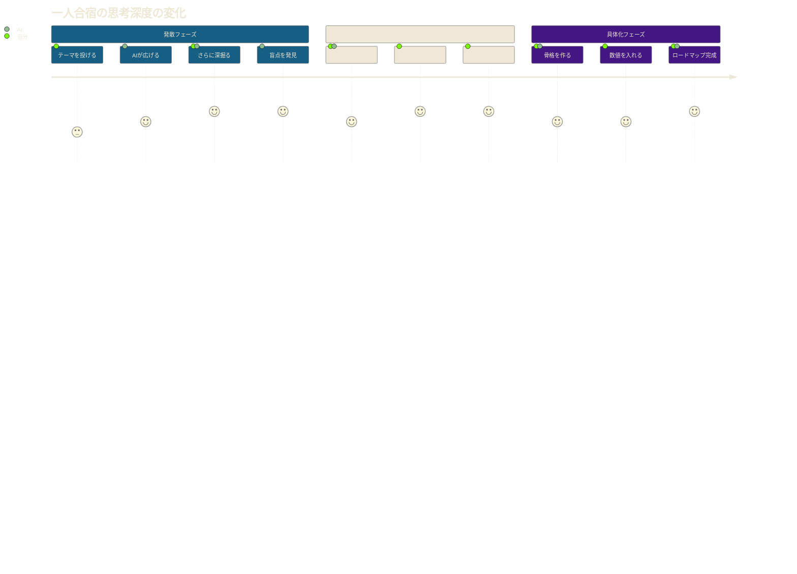

「...結局、今日も何も決まらなかったな」

金曜日の夜、佐藤さん（34歳・マーケティング担当）はオフィスの椅子にもたれかかりながら、つぶやいた。新規事業のアイデアを3週間考え続けている。毎日少しずつ考えてはいるが、まとまった思考の時間が取れない。Slackの通知、会議、上司からの「ちょっといい？」。思考は毎回、途中で寸断される。

翌週の土曜日、佐藤さんは近所のビジネスホテルに一人でチェックインした。持ち物はノートPC1台と、充電器。スマホの通知はすべてオフ。チェックアウトまでの8時間、ChatGPTだけを相手に、徹底的に思考を深める「一人合宿」を決行した。

結果、佐藤さんは4時間で事業コンセプト、ターゲット設計、収益モデル、3ヶ月のロードマップを完成させた。普段の業務中に3ヶ月かけても出なかった成果が、たった半日で形になった。

この記事では、生成AIを壁打ち相手にした「一人合宿」の具体的な進め方を、準備から振り返りまで完全に解説する。

## なぜ「一人合宿」が必要なのか

### 現代の思考環境は壊れている

カリフォルニア大学の研究によると、オフィスワーカーが一つのタスクに集中できる平均時間はわずか**11分**。そして、一度中断された思考を元の深さまで戻すには**23分**かかる。つまり、オフィスにいる限り、深い思考はほぼ不可能に近い。

一人合宿は、この構造的な問題を力技で突破する方法だ。日常から物理的に離れ、まとまった時間を確保し、AIという「疲れない壁打ち相手」と思考を深める。

### AIが変えた「一人で考える」の質

従来の一人合宿では、自分の頭の中にあるものしか出てこなかった。しかし、生成AIの登場で状況は一変した。

- **自分の盲点を指摘してもらえる** -- 「その前提、本当に正しいですか？」
- **異なる視点を瞬時に得られる** -- 「競合の立場から見ると、どう映りますか？」
- **膨大な知識を即座に参照できる** -- 「類似の成功事例を5つ挙げてください」
- **思考を構造化してもらえる** -- 「今の話を整理すると、3つの論点があります」

一人なのに、まるで優秀なコンサルタント3人と議論しているような密度の思考が可能になる。

## 一人合宿の全体フロー

合宿の流れを時系列で見てみよう。

```mermaid
%%{init: {'theme': 'base', 'themeVariables': {'primaryColor': '#165E83', 'primaryTextColor': '#F0E8D6', 'lineColor': '#E6B422', 'secondaryColor': '#F0E8D6', 'tertiaryColor': '#27221F'}}}%%
timeline
    title AI一人合宿タイムライン（8時間モデル）
    section 準備フェーズ（前日）
        テーマ設定 : 解決したい問い1つに絞る
        環境準備 : 場所予約、道具チェック
        プロンプト設計 : AIの役割設定テンプレ作成
    section 午前：発散（3時間）
        9:00 開始宣言 : 瞑想10分でスイッチON
        9:15 ブレスト : AIに問いを投げまくる
        10:30 休憩 : 散歩15分
        10:45 深掘り : AIに反論・別視点を求める
    section 午後：収束と具体化（4時間）
        12:00 昼食 : 軽めに30分
        12:30 収束 : 核心の3つに絞る
        13:30 休憩 : ストレッチ15分
        13:45 具体化 : アウトプットの骨格を作る
        15:00 仕上げ : ロードマップ完成
    section 振り返り（1時間）
        16:00 整理 : AIと対話ログを要約
        16:30 Next Action : 翌週の具体的行動を決定
```

## 準備：環境と道具の整え方

### 物理的な環境の選び方

一人合宿を成功させるには、まず環境から整えることが重要だ。ポイントは「日常との断絶」にある。

**おすすめの場所：**

| 場所 | メリット | デメリット | コスト目安 |
|------|---------|-----------|-----------|
| ビジネスホテル | 完全な個室、WiFi完備 | コストがかかる | 5,000-8,000円 |
| コワーキングスペース | 集中しやすい雰囲気 | 周囲の音がある | 1,000-3,000円 |
| 図書館の個室 | 無料、静か | 予約が必要 | 無料 |
| 自宅の一室 | コスト0 | 誘惑が多い | 無料 |

コーチングクライアントの田中さん（28歳）は、最初は自宅で一人合宿を試みたが、「冷蔵庫を開ける回数が多すぎて集中できなかった」と振り返る。2回目からはビジネスホテルのデイユースに切り替え、生産性が**3倍**になった。

### AIツールの事前準備

ChatGPTやClaudeなどの生成AIを使う場合、事前にプロンプトのテンプレートを準備しておくと効率的だ。

**役割設定プロンプトの例：**

```
あなたは以下の3つの役割を切り替えて対話してください。
1. 戦略コンサルタント：論理的に分析し、フレームワークを提案する
2. 批判的レビュアー：私のアイデアの穴や弱点を指摘する
3. クリエイティブディレクター：常識にとらわれない発想を提案する

私が「モード1」と言ったらコンサルタント、「モード2」はレビュアー、
「モード3」はクリエイティブとして回答してください。
```

カスタムGPTsを事前に構築しておけば、さらに効率が上がる。特定のテーマに特化したAIを用意しておくことで、文脈の再説明なしに深い対話が可能になる。

## 集中ワークの3段階フロー

### 第1段階：発散（アイデアの出し切り）-- 2〜3時間

一人合宿の前半は、とにかくアイデアを出し切る時間だ。頭の中にある思考をすべて書き出し、AIに投げかける。

**発散フェーズの対話例：**

> **あなた：** 「30代向けのオンラインコーチング事業を考えている。どんな切り口があり得る？」
>
> **AI：** 「いくつかの切り口を提案します。(1) キャリア転換支援、(2) ライフデザイン、(3) 副業立ち上げ支援...」
>
> **あなた：** 「モード2で。キャリア転換支援の弱点は？」
>
> **AI：** 「最大の弱点は差別化の難しさです。転職エージェントとの違いが不明確で...」

この段階では批判や整理は不要。とにかく量を重視し、AIとの対話を通じて思考の幅を広げる。2〜3時間かけて、テーマの周辺にある可能性を網羅的に探ろう。

### 第2段階：収束（本質の絞り込み）-- 1〜2時間

発散したアイデアの中から、核心となるものを選び出す段階だ。AIに「今まで出てきたアイデアの中で、最も重要な3つを選んで理由を説明してください」と依頼し、客観的な視点を借りる。

自分でも「これは本当に必要か？」「本質を捉えているか？」と自問しながら、不要な枝葉を切り落としていく。

**収束の判断基準：**
- **インパクト：** 実現したとき、どれだけの価値を生むか？
- **実現可能性：** 自分のリソースで3ヶ月以内に始められるか？
- **独自性：** 自分だからこそできる要素はあるか？

### 第3段階：具体化（アウトプットの形成）-- 2時間

絞り込んだアイデアを具体的な形に落とし込む段階だ。プレゼン資料なら構成案を、文章なら目次とキーポイントを、事業プランなら数値目標と実行ステップを固めていく。



AIに「この構成でプレゼン資料を作る場合、どのような流れが良いですか？」と相談し、論理的な構成を整える。必要に応じて各セクションのドラフトもAIに作成してもらい、ベースとなる骨組みを作り上げよう。

## ケーススタディ：2人の一人合宿

### ケース1：田中さん（28歳・エンジニア）の副業設計合宿

**課題：** 技術ブログを1年続けているが、収益化の道筋が見えない

**合宿前の状態：**
- 月間PV 3,000程度
- 収益はほぼゼロ
- 「このまま続けて意味があるのか」と迷っている

**合宿での対話ハイライト：**

田中さんはChatGPTに「技術ブログの収益化で、最も成功確率が高い方法は？」と質問。AIから「広告収入ではなく、ブログを名刺代わりにした技術コンサルティングへの導線設計」という提案を受けた。

さらに「モード2（批判的レビュー）」に切り替え、この案の弱点を洗い出した結果、「コンサルの単価設定」と「最初のクライアント獲得」が最大のボトルネックだと判明。

**合宿後の成果：**
- 収益モデルを「広告→コンサル導線」に転換
- 3ヶ月の行動計画を策定
- 翌月、最初の技術コンサル案件を**月額8万円**で受注

### ケース2：鈴木さん（41歳・管理職）の部門戦略合宿

**課題：** 来期の部門戦略を考えなければならないが、日常業務に追われて全く進まない

**合宿前の状態：**
- 部下15名のマネジメントで毎日12時間勤務
- 戦略を考える時間が物理的にゼロ
- 期限は2週間後

**合宿での工夫：**

鈴木さんはAIに自社の業界データと競合情報を入力し、「SWOT分析→戦略オプション→実行計画」の流れで思考を構造化。AIが提示した5つの戦略オプションそれぞれについて、「部下の田村に説明したら何と言うか？」とシミュレーションし、実現可能性を検証した。

**合宿後の成果：**
- 部門戦略の骨格が1日で完成
- 経営会議での発表資料のドラフトまで作成
- 上長から「こんな短期間でこのクオリティは初めて」と評価

## 一人合宿を成功させる5つのコツ

### 1. 時間の区切りを明確にする

「朝9時から夕方5時まで」というように、明確な時間枠を設定する。終了時刻があることで緊張感が生まれ、没頭しやすくなる。90分〜2時間ごとに15分の休憩を取ることで、集中力を持続させよう。

### 2. 問いの質にこだわる

AIとの対話で最も重要なのは、投げかける「問い」の質だ。「何かいいアイデアない？」では浅い回答しか返ってこない。「30代で子育て中の女性が、月3万円の副収入を得るために、最も少ない時間投資で始められる方法は？」のように、制約条件を明確にした問いが深い対話を生む。

問いの力をさらに深めたい方は、[AI時代に最も重要なスキル：問いの力](/blog/ai-era-question-power)も参考にしてほしい。

### 3. AIとの対話を記録する

合宿中のやり取りは、すべて記録しておこう。ChatGPTの履歴機能や、別途メモ帳に思考の過程を残すことで、後から振り返った時に思考の軌跡を追える。これは次の合宿や、類似テーマに取り組む時の貴重な資産になる。

### 4. 「反論」を意図的に求める

AIは基本的に同意してくれる。だからこそ、意図的に反論を求めることが重要だ。「このアイデアに対する最も厳しい批判は何か？」「この計画が失敗するとしたら、どの段階でどんな理由で失敗するか？」と聞くことで、思考の甘さが浮き彫りになる。

### 5. 終了後の行動を決めておく

一人合宿は「考える時間」であり「完遂する時間」ではない。終了時に「次に何をするか」を明確にしておくことが大切だ。「来週の会議でこの構成案を共有する」「明日の朝に第一章のドラフトを完成させる」など、具体的な次のアクションを設定して合宿を終えよう。

## よくある質問

**Q. 一人合宿の頻度はどれくらいが適切？**
月1回が理想。最低でも四半期に1回。大きなプロジェクトの立ち上げ前や、キャリアの転換期には臨時開催も有効だ。

**Q. 半日でも効果はある？**
ある。4時間あれば、発散・収束・具体化の3段階を一通り回せる。まずは半日から試して、効果を実感してから終日合宿に移行するのがおすすめだ。

**Q. どのAIツールがおすすめ？**
ChatGPT（GPT-4以上）かClaudeがおすすめ。長い文脈を覚えてくれるClaudeは特に一人合宿向き。複数のAIを使い分けて、異なる視点を得るのも効果的だ。AIを使ったブレストの詳細は[AIブレインストーミング完全ガイド](/blog/ai-brainstorming)で詳しく解説している。

## 明日から始める一人合宿

一人合宿は、生成AIの登場により誰でも手軽に実践できるようになった集中ワークの手法だ。環境を整え、発散・収束・具体化の3段階を意識し、記録を残すことで、飛躍的な成果を生み出すことができる。

**今すぐ始めるアクションステップ：**

1. **今日中に** -- 今週末の4時間を一人合宿用にブロックする
2. **明日までに** -- 解決したい課題やまとめたいテーマを1つ選ぶ
3. **前日に** -- ChatGPTやClaudeを開き、専門家役のプロンプトを設定する
4. **当日の朝** -- スマホの通知をオフにし、10分の瞑想で集中モードに入る

最初の一人合宿の後、きっとこう思うはずだ。「なぜもっと早くやらなかったんだろう」と。

---

## あなたの「一人合宿」を一緒に設計しませんか？

一人合宿のテーマ設定や、AIを使った思考の深め方に迷っている方へ。**体験セッション（無料）**では、あなたの課題に合わせた一人合宿の設計を一緒に行います。

[→ 体験セッションの詳細を見る](/sessions)
