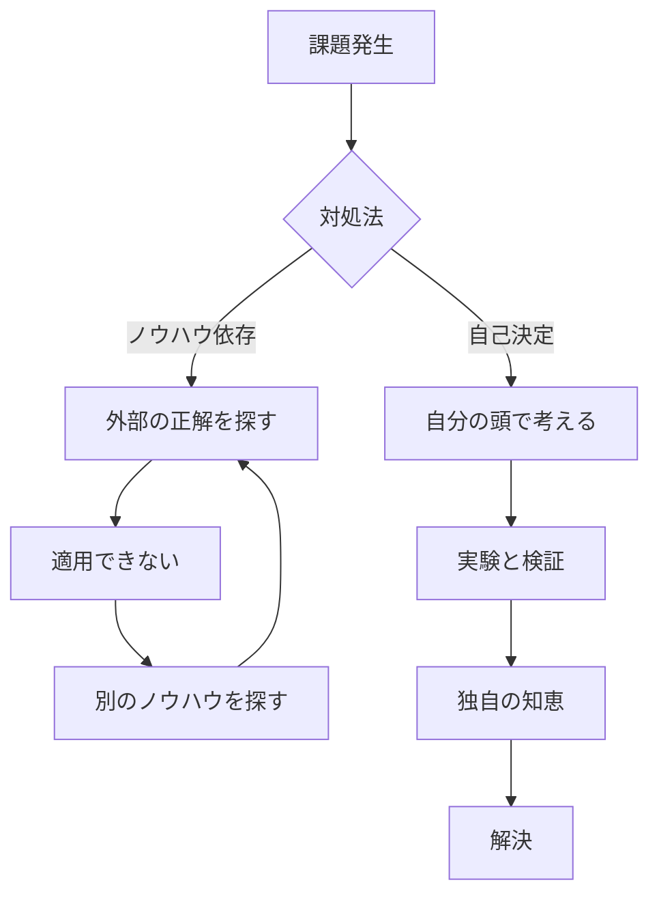

## はじめに

現代、情報過多の時代。Googleで検索すれば、あらゆる「答え」が見つかります。本がブログが、YouTubeが、SNSが。知識は溢れています。

でも、なぜ多くの人が迷い続けるのか？

答えは簡単だからです。**「自分の判断軸」がないからです。**

---

## ノウハウコレクターの罠

多くの人が陥る「ノウハウへの依存」。それはまるで、泳ぎ方を知っているだけで泳げると錯覚するようなものです。

### 概念図解

## なぜノウハウだけでは不十分なのか

1. **状況の不一致**: 他人の成功法則は、その人の前提条件に基づいています。
2. **思考停止**: 「答え」を探す癖がつくと、自分で考える力が衰えます。

---

## ノウハウ依存とは？

ノウハウ依存とは、以下のような状態を指します：

- 他人の成功事例を鵜呑みにする
- 「正解」を探し続ける
- 自分の判断を信じられない
- 行動する前に「正しさ」を確認する

これらは一見「慎重」と思えるかもしれませんが、実は**自分で決める力の放棄**です。

---

## なぜ危険なのか？

### 1. 成功事例は「結果」でしかない

誰かの成功方法が、あなたに当てはまる保証はありません。
- 環境が違う
- 価値観が違う
- リソースが違う

### 2. 「正解」は存在しない

人生において唯一無二の正解なんてありません。
あるのは「今の自分にとっての最適解」だけです。

### 3. 行動が遅れる

「正解」を探し続けることで、行動が遅れます。
そして行動しない限り、何も変わりません。

---

## 脱却するための第一歩

### Step 1: 「情報収集」を止めるタイミングを決める

- 30分で情報を集める
- その後は「自分の判断」で決める

### Step 2: 小さな実験をする

- 1週間だけ試してみる
- 結果を見て、修正する

### Step 3: 失敗を「データ」と捉える

- 「失敗した」のではなく、「わかった」
- 次の判断に活かす

---

## セッションでできること

私のセッションでは、以下をサポートします：

- あなたの価値観の言語化
- 判断軸の整理
- 次の一歩の決定

「答えを渡す」のではなく、「自分で答えを見つける力」を育みます。

---

## まとめ

ノウハウ依存からの卒業は、一夜で成し遂げられるものではありません。

でも、小さな一歩から始められます。

今日、何か一つだけ。**「自分の判断」で決めてみてください。**

---

もっと深く、自分と向き合いたい方は、セッションへお気軽にご連絡ください。
