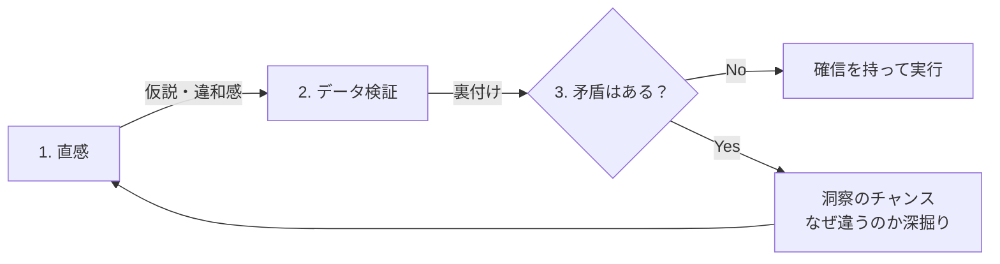

## はじめに

「データで判断しろ」「直感を信じろ」

一見、矛盾するアドバイス。でも、本当に優れた意思決定者は、両方を使いこなしています。

データだけに頼る人は、数字に表れない重要なシグナルを見逃します。
直感だけに頼る人は、バイアスの罠にはまります。

では、どうすれば両者を統合できるのか？

---

## 直感の正体

直感とは、実は「無意識の経験の蓄積」です。

- 過去の経験が脳に蓄積される
- パターンとして記憶される
- 似た状況で瞬時に引き出される

つまり、直感は「根拠のない思いつき」ではありません。**言語化されていない経験知**です。

---

## データの限界

一方、データにも限界があります。

### 1. 過去のデータは未来を保証しない
市場環境、技術、社会は常に変化しています。

### 2. 数字に表れないものがある
人間関係、モチベーション、組織文化。重要なのに数値化しにくい。

### 3. データ収集にはタイムラグがある
決断が必要な瞬間に、完璧なデータは揃わない。

---

## 統合のフレームワーク

### 直感 × データ 統合ループ

### Step 1: まず直感を言語化する

決断を迫られたとき、最初に感じたことを書き出します。

- 「なんとなくAがいい気がする」
- 「Bは不安を感じる」

この「なんとなく」の正体を探ります。

### Step 2: データで検証する

直感の根拠を、データで確認します。

- 直感が正しければ、データがそれを裏付ける
- 直感と矛盾するなら、どちらが正しいか深掘り

### Step 3: 矛盾を歓迎する

直感とデータが矛盾したら、チャンスです。

- なぜ矛盾しているのか？
- 見落としている変数はないか？
- 前提が間違っていないか？

矛盾こそ、深い洞察への入り口です。

---

## 実践のコツ

### 小さな決断で練習する

日常の小さな決断で、このプロセスを練習しましょう。

- ランチの選択
- 買い物の判断
- スケジュールの優先順位

### 振り返りを習慣化する

決断後、結果を振り返ります。

- 直感は当たっていたか？
- データは正確だったか？
- 何を見落としていたか？

---

## まとめ

直感とデータは、対立するものではありません。

**直感でアイデアを生み、データで検証する。**
**データで傾向を掴み、直感で決断する。**

両者を行き来することで、意思決定の質は飛躍的に高まります。

---

自分の意思決定パターンを見直したい方は、セッションでお話ししましょう。
