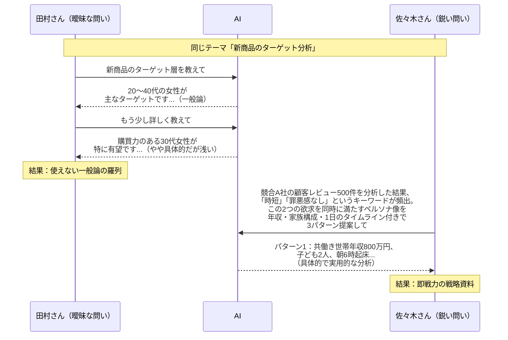
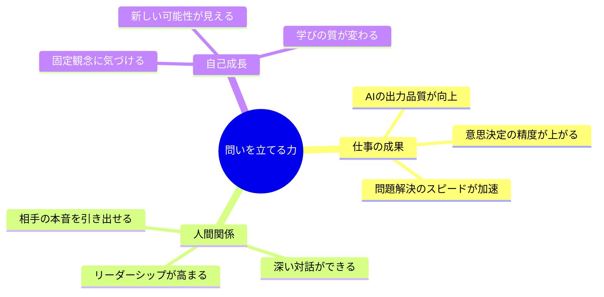

「AIが書いた文章、なんか微妙なんですよね。使えなくはないけど、そのまま使えるレベルじゃなくて......」

先日、マーケティング部門で働く田村さん（仮名・32歳）がセッションの冒頭でそう漏らしました。同僚の佐々木さんは同じAIツールを使って、毎週のレポート作成時間を3時間から40分に短縮している。一方、田村さんは「AIに書かせた文章を手直しする時間」が増えて、むしろ以前より忙しくなっている。

「佐々木さんと私の違いって何だと思いますか？」と田村さんに尋ねると、しばらく考えてこう答えました。

「......聞き方、ですかね」

その通りでした。AI時代に最も重要なスキルは、プログラミングでもデータ分析でもありません。**「問いを立てる力」**です。

## 答えが無料になった時代に、問いの価値が急騰している

ChatGPTの登場以降、「答えを得ること」のコストは劇的に下がりました。かつては専門家に数十万円払って得ていた知識が、数秒で手に入る。しかし、ここに落とし穴があります。

**答えの質は、問いの質に完全に依存している**ということです。

同じAIに同じテーマで質問しても、問いの立て方次第で返ってくる答えの質は天と地ほど違います。これは単なるプロンプトのテクニックの話ではありません。もっと根本的な「思考の質」の問題です。



この図が示すように、問いの質が出力の質を決定します。佐々木さんの問いには「具体的なデータ」「明確な仮説」「求める出力フォーマット」が含まれている。田村さんの問いは「教えて」で終わっている。この差が、成果の10倍の差を生んでいたのです。

## ケース1：5Whysで「本当の問い」に辿り着いた中島さん

中島さん（仮名・38歳）は、IT企業のプロジェクトマネージャー。チームの生産性が低下していることに悩み、AIに「チームの生産性を上げるには？」と聞いていました。AIは「タスク管理ツールの導入」「スクラム手法の採用」「定期的な1on1の実施」などを提案してきましたが、どれも既に試したことばかり。

セッションで私は中島さんに、トヨタ生産方式の「5Whys」をAIとの対話に組み込むことを提案しました。

**中島さんのAIとの対話（5Whys適用後）：**

- **問題**：チームの生産性が低下している
- **なぜ1**：「タスクの完了が遅れている」→ なぜ？
- **なぜ2**：「メンバーが作業に集中できていない」→ なぜ？
- **なぜ3**：「会議と割り込みが多すぎる」→ なぜ？
- **なぜ4**：「情報共有の仕組みがなく、口頭確認に頼っている」→ なぜ？
- **なぜ5**：「チームが暗黙知に依存していて、ドキュメント文化がない」

5回目の「なぜ」で、問題は「生産性」ではなく「ドキュメント文化の不在」だと判明しました。中島さんはこの本質的な問いをAIに投げ直しました。

「チームに無理なくドキュメント文化を根付かせるために、既存のSlackの会話ログを自動的にナレッジベースに変換する仕組みを提案してください。チームは8人、全員エンジニア、Slack・Notion・GitHub使用中」

AIから返ってきたのは、Slack→Notion自動連携の具体的なワークフローと、段階的な導入計画。中島さんはこれを実装し、**3ヶ月後にはチームの会議時間が週12時間から4時間に激減**しました。

「最初の問い方では、絶対にこの答えには辿り着けなかったですね」と中島さんは振り返ります。

## 習慣1：「なぜ」を5回繰り返してから問う

中島さんの事例が示すように、最初に浮かんだ問いは「表面的な症状」を聞いているだけのことが多い。5Whysは、問いの層を掘り下げる最もシンプルな手法です。

**実践のポイント：**

1. 問題を感じたら、まず紙に書き出す
2. 「なぜそれが問題なのか？」を5回繰り返す
3. 5回目の答えに対して、AIに問いを立てる
4. AIの回答に対しても「なぜ？」を重ねる

これをAIとの対話に組み込むと、こんなプロンプトになります：

```
私は「〇〇」という問題を抱えています。
この問題に対して5Whys分析を行い、根本原因を特定してください。
各「なぜ」に対して、複数の可能性を挙げたうえで、
最も確率の高い原因を選んでください。
最終的な根本原因に対する解決策を3つ提案してください。
```

ただし、AIが提示する「なぜ」は仮説に過ぎません。自分の現場の状況と照合しながら、AIの推論を検証することが不可欠です。

## ケース2：「反論者」としてのAIを活用した山口さん

山口さん（仮名・45歳）は、中小企業の経営者。新規事業として「シニア向けオンライン料理教室」の立ち上げを検討していました。市場調査をAIに依頼したところ、「シニアのデジタル活用が進んでいる」「健康志向の高まり」「コロナ後のオンライン学習需要」など、ポジティブな材料ばかりが返ってきました。

「AIに聞くと、何でも『いいですね！』って言うんですよ」と山口さんは苦笑しました。

そこで私は、AIに**「デビルズアドボケート（悪魔の代弁者）」の役割**を与えることを提案しました。

山口さんが投げた問い：

```
あなたは投資委員会の厳格な審査官です。
「シニア向けオンライン料理教室」の事業計画に対して、
以下の観点から徹底的に批判してください。

1. 市場規模の過大評価の可能性
2. ターゲット顧客の技術的ハードル
3. 競合との差別化の弱さ
4. 収益モデルの脆弱性
5. 撤退コストのリスク

各批判に対して、1〜10のリスクスコアをつけてください。
```

AIからの回答は厳しいものでした。特に「シニアのオンライン学習の継続率は一般に15%以下」「料理教室の対面→オンラインの転換は、五感の共有ができず価値が大幅に低下する」という指摘は、山口さんが見落としていた致命的な弱点でした。

この反論をもとに山口さんは事業計画を大幅に修正。「完全オンライン」から「月1回の対面+日常のオンラインフォロー」というハイブリッドモデルに転換し、**初年度の会員継続率は72%**を達成しました。

「あのまま進んでいたら、半年で撤退していたと思います」と山口さんは言います。

## 習慣2：自分の仮説に「反論」をぶつけてから意思決定する

山口さんの事例が示すのは、AIの最も強力な使い方の一つが「賛同者」ではなく「批判者」としての活用だということです。

人間は確証バイアス（自分の信念を裏付ける情報ばかり集めてしまう傾向）を持っています。AIにポジティブな質問を投げれば、ポジティブな答えが返ってくる。しかし、意思決定の質を上げるためには、意図的にネガティブな問いを立てる必要があります。

**反論を引き出すプロンプトのパターン：**

- 「この計画の最大の弱点を3つ指摘してください」
- 「5年後にこの事業が失敗しているとしたら、最も可能性の高い原因は何ですか？」
- 「競合がこのアイデアを聞いたら、どう対抗してきますか？」
- 「この仮説が完全に間違っている場合、どんなデータがそれを証明しますか？」

## ケース3：「境界を壊す問い」で転職を成功させた吉田さん

吉田さん（仮名・29歳）は、大手メーカーの営業職。「転職すべきか、残るべきか」という二者択一で半年間悩んでいました。AIに相談しても「メリット・デメリットを比較しましょう」という回答ばかり。比較表は何度も作ったけれど、決められない。

セッションで気づいたのは、吉田さんの問い自体が「AかBか」という閉じた構造になっていることでした。

私はこう提案しました。「転職するか残るかではなく、もっと根本的な問いをAIに投げてみませんか？」

吉田さんが投げた新しい問い：

```
私は29歳の営業職です。
「転職か残留か」ではなく、以下の観点から私のキャリアを分析してください。

1. 私が営業職で最も充実感を感じる瞬間はどんな場面か
   （ヒント：新規顧客の課題を聞いているとき）
2. その充実感を最大化できる働き方にはどんな選択肢があるか
3. 転職・残留以外の第3、第4の選択肢は何か
4. 5年後に「あの選択をしてよかった」と思える条件は何か
```

AIは「社内異動によるソリューション営業への転換」「副業としてのコンサルティング開始」「現職での新規事業提案」など、転職・残留以外の5つの選択肢を提示。吉田さんは結果的に「現職に残りながら、社内の新規事業チームに異動する」という第3の道を選びました。

**異動後6ヶ月で、新規事業の売上が前年比180%に**。吉田さんは「問いを変えた瞬間に、見える世界が変わった」と話しています。

## 習慣3：「AかBか」を超える問いを意識的に立てる

私たちの脳は、無意識のうちに問いを二者択一に狭めてしまいます。「やるかやらないか」「賛成か反対か」「転職か残留か」。しかし、現実の選択肢は常に2つ以上あります。

**固定観念を壊す問いの型：**

- 「AとBの間にある第3の選択肢は何か？」
- 「この問題の前提そのものが間違っている可能性はないか？」
- 「この問題を他の業界の人ならどう捉えるか？」
- 「10年後の自分から見て、今の悩みはどう見えるか？」
- 「この制約がなかったとしたら、何をしたいか？」

これらの「境界を壊す問い」をAIに投げると、既存の枠組みの外にある発想を引き出すことができます。AIは人間のように「常識」にとらわれないため、意外な選択肢を提示してくれることがあります。

## 問いの質を高める実践トレーニング

ここまでの3つの習慣を統合して、日常的にトレーニングする方法を紹介します。

### 朝の「問いジャーナリング」（15分）

毎朝15分、その日の最も重要な「問い」を3つ書き出します。これは目標設定とは異なります。「何を達成するか」ではなく「何を解明するか」にフォーカスします。

例：
- 「今日のクライアントミーティングで、相手が本当に困っていることは何か？」
- 「今のプロジェクトで最大の不確実性はどこにあるか？」
- 「チームの中で、声を上げられていない人は誰か？」

### AIとの「問い壁打ち」

自分が立てた問いをAIに投げ、「この問いをさらに深く、鋭くするにはどうすればいいですか？」と聞きます。

```
私は「どうすれば売上を伸ばせるか」という問いを立てました。
この問いの問題点を3つ指摘し、
それぞれより本質的な問いに修正してください。
```

AIは「主語が不明確」「時間軸が曖昧」「指標が単一」などの問題を指摘し、「どの顧客セグメントの、どの購買段階で、3ヶ月以内に改善可能なボトルネックは何か」のような、より精密な問いに変換してくれます。

### 問いログの蓄積

良い問いを思いついたら、専用のノートに記録しておきましょう。日付・文脈・効果をセットで記録すると、自分の「問い力」の成長が可視化できます。

```
日付：2026-03-15
問い：「顧客が本当に買っているのは製品か、それとも安心感か？」
文脈：新サービスの価格設定会議
効果：価格を15%上げても解約率が変わらなかった
      → 顧客は「安心感」に対価を払っていたことが判明
```

## 問いの力が変える3つのもの



問いを立てる力は、AI活用のスキルを超えて、あなたの仕事・人間関係・人生そのものを変えるポテンシャルを持っています。

## 明日から始める3つのアクション

田村さんは、3つの習慣を1ヶ月間実践した結果、AIの出力に対する手直し時間が**1/4以下**に減りました。「問いを変えるだけで、こんなに変わるとは思わなかった」と話しています。

あなたも、明日からこの3つを始めてみてください。

1. **朝15分の「問いジャーナリング」**：今日最も重要な問いを3つ書き出す
2. **問題に出会ったら「5Whys」**：表面の症状ではなく、根本原因を問う
3. **意思決定の前に「反論プロンプト」**：AIに自分の仮説を徹底的に批判させる

答えが溢れる時代だからこそ、問いの質があなたの価値を決めます。良い問いを立てられる人は、どんなAIツールが登場しても、常にその恩恵を最大限に引き出せる人です。

問いの旅を、今日から始めましょう。

---

**関連記事：**
- [AIプロンプトエンジニアリングの実践ガイド](/blog/ai-prompt-engineering) - 問いの力をプロンプトに落とし込む技術
- [クリティカルシンキングで思考の質を高める](/blog/critical-thinking) - 問いの土台となる批判的思考法
- [人を変える「パワフルクエスチョン」の技術](/blog/powerful-questions-transformation) - コーチングにおける問いの力

---

## あなたの「問い」を一緒に磨きませんか？

「AIをもっと上手く活用したい」「自分の思考の癖に気づきたい」という方へ。

**体験セッション（無料）**では、あなたの実際の課題を題材に、「問いの立て方」を一緒にトレーニングします。セッション後、AIとの対話の質が変わったことを実感していただけるはずです。

[→ 体験セッションに申し込む](/sessions)
