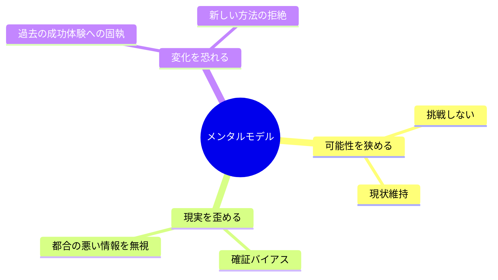

## はじめに

「自分には無理だ」
「こういうものだ」
「仕方ない」

こんな言葉が、口癖になっていませんか？

これらは「メンタルモデル」と呼ばれる、無意識の思い込みです。
そして、この思い込みこそが、あなたの成長を妨げている可能性があります。

---

## メンタルモデルとは？

メンタルモデルとは、「世界はこういうものだ」という無意識の前提です。

例えば：
- 「成功するには長時間働く必要がある」
- 「人に頼るのは弱さの証拠だ」
- 「失敗は恥ずかしいことだ」

これらは、過去の経験や教育から形成されます。
そして、無意識のうちに行動を制限します。

---

## なぜ危険なのか？

### 1. 可能性を狭める

「自分には無理」と思った瞬間、挑戦しなくなります。
挑戦しなければ、成長もありません。

### 2. 現実を歪める

メンタルモデルに合う情報だけを集め、合わない情報を無視します。
これを「確証バイアス」と呼びます。

### 3. 変化を恐れる

「今のやり方が正しい」と信じていると、新しい方法を試せません。

---

## 自分のメンタルモデルを見つける方法

### 1. 「〜すべき」「〜ねばならない」を探す

日常の中で、この言葉を使っていないか意識します。

- 「社会人なら〜すべき」
- 「親なら〜ねばならない」

これらは、メンタルモデルのサインです。

### 2. 感情の反応を観察する

強い感情（怒り、不安、焦り）が湧いたとき、その裏にある前提を探ります。

「なぜこんなに腹が立つのか？」
→ 「人は約束を守るべき」という前提があるから

### 3. 「なぜ？」を5回繰り返す

行動の理由を深掘りします。

- なぜ残業する？ → 仕事が終わらないから
- なぜ終わらない？ → 量が多いから
- なぜ断らない？ → 断れないから
- なぜ断れない？ → 嫌われるのが怖いから
- なぜ怖い？ → **「人に嫌われたら終わり」という前提があるから**

---

## メンタルモデルを書き換える

### Step 1: 認識する

まず、自分のメンタルモデルに気づくこと。
気づかなければ、変えられません。

### Step 2: 検証する

「本当にそうか？」と問いかけます。

- 反例はないか？
- 他の解釈はできないか？
- 誰かの受け売りではないか？

### Step 3: 実験する

新しい前提で、小さく行動してみます。

「人に頼ってみる」
「失敗を共有してみる」

実験の結果が、新しいメンタルモデルを形成します。

---

## 注意点

メンタルモデルの書き換えは、時間がかかります。
長年かけて形成されたものは、簡単には変わりません。

焦らず、少しずつ。
それが一番の近道です。

---

## まとめ

あなたの「当たり前」は、本当に当たり前でしょうか？

一度立ち止まって、自分の前提を疑ってみてください。
そこに、成長のヒントが隠れているかもしれません。

---

自分のメンタルモデルを一緒に探りたい方は、セッションでお待ちしています。
