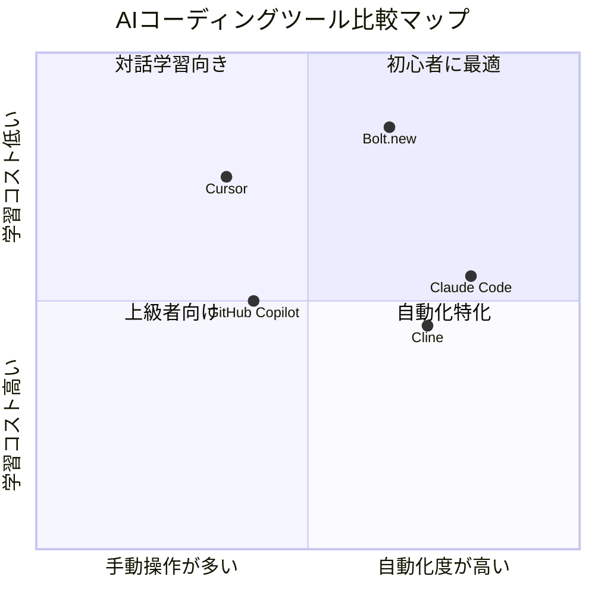

## 「自分だけのツールが欲しい」から、すべてが始まった

佐々木さん（34歳・営業事務）は毎日18時を過ぎると、うんざりしながらExcelを開いていた。日報の作成だ。訪問先、商談内容、次のアクション――同じフォーマットに同じ情報を手打ちする30分。「このフォーマットに自動で流し込むツールがあれば……」と何度も思ったが、プログラミングは未経験。外注すれば数十万円。社内SEに相談しても「優先度が低い」と後回しにされる。

ある日、同僚から「Cursorっていうエディタ、日本語で指示するだけでコードを書いてくれるらしいよ」と聞いた。半信半疑で試した佐々木さんは、3日後に自作の日報作成アプリを完成させた。プログラミングの知識はゼロのまま。

この記事では、佐々木さんと同じように「欲しいツールはあるけど、作る技術がない」と感じている人に向けて、AIコーディングで自分専用ツールを作る具体的な方法を解説する。

## AIコーディングツールの全体像

まず、今使えるAIコーディングツールの特徴を整理しよう。



### Cursor ― 対話しながら学びたい人向け

VS Codeをベースにしたエディタで、チャット形式でコードを生成できる。日本語での指示が可能で、エラーの解決もAIが手伝ってくれる。「何をやっているのか理解しながら進めたい」タイプの人に向いている。

### Cline ― ガッツリ自動化したい人向け

VS Codeの拡張機能として動作し、ファイルの自動編集やターミナルコマンドの実行まで自律的に行う。複雑なタスクも分解して処理するため、「とにかく結果が欲しい」タイプの人に合う。

### 選び方の基準

- **初めてで、対話的に学びたい** → Cursor
- **VS Codeを使っていて、自動化を進めたい** → Cline
- **Webアプリをすぐ形にしたい** → Bolt.new

## ケーススタディ1：佐々木さんの日報アプリ開発記

佐々木さん（34歳・営業事務）がCursorで日報アプリを作った3日間を追ってみよう。

### Day 1：アイデアを言語化する（2時間）

佐々木さんはまず、自分が毎日やっている作業を書き出した。

| 作業 | 所要時間 | 苦痛度(5段階) |
|------|----------|---------------|
| 日報のフォーマット入力 | 15分 | ★★★★★ |
| 訪問先情報の転記 | 10分 | ★★★★ |
| 次のアクション記入 | 5分 | ★★ |

**Cursorへの最初のプロンプト：**

```
「以下の機能を持つシンプルなWebアプリを作りたいです：
- テキスト入力欄に今日の商談メモを箇条書きで入力
- ボタンを押すと日報フォーマット（訪問先・内容・次のアクション）に自動整形
- 結果をクリップボードにコピーできる

プログラミング完全初心者です。HTML+JavaScriptで、
ファイル1つで動く最もシンプルな方法で作ってください。」
```

### Day 2：動くものを作る（3時間）

Cursorが生成したHTMLファイルをブラウザで開くと、それだけで動いた。佐々木さんは「えっ、これだけ？」と声を出した。

しかし問題が出た。整形結果がイマイチだったのだ。

「整形のルールがもっと細かく必要かも」

そこで追加の指示を出した。

```
「整形ルールを変更してください：
- 1行目は必ず【訪問先】として出力
- 箇条書きの中から数字が含まれる行は【成果】に分類
- 『次回』『今後』を含む行は【次のアクション】に分類
- それ以外は【商談内容】に分類」
```

### Day 3：仕上げと実戦投入（1時間）

最後に見た目を整え、過去の日報を保存する機能を追加。佐々木さんの日報作成時間は**30分から3分に短縮**された。

「プログラミングを学んだわけじゃない。でも、自分の仕事を楽にするツールは作れた」

## 開発プロセスの全体フロー

初心者がAIコーディングでツールを作る際の、推奨フローを示す。

```mermaid
journey
    title AIコーディングで自作ツールを完成させるまで
    section Day 1: 設計
      困りごとを言語化する: 3: 自分
      欲しい機能を箇条書きにする: 4: 自分
      AIに技術スタックを相談: 5: 自分, AI
    section Day 2: 開発
      AIにコード生成を依頼: 5: AI
      動作確認してフィードバック: 3: 自分
      エラーをAIに投げて修正: 4: 自分, AI
      機能を1つずつ追加: 4: 自分, AI
    section Day 3: 仕上げ
      見た目を整える: 4: AI
      実際の業務で使ってテスト: 3: 自分
      改善点を洗い出す: 4: 自分
      完成・運用開始: 5: 自分
```

## ケーススタディ2：中村さんの顧客管理ツール

中村さん（28歳・フリーランスデザイナー）は、案件管理にスプレッドシートを使っていた。クライアント15社の進捗、請求書の発行状況、次の連絡予定――シートが複雑になりすぎて「どこに何があるかわからない」状態だった。

Cline（VS Code拡張）を使い、5日間で簡易CRMアプリを完成させた。

**Before：** スプレッドシート3つを行き来、週に2回は「あのクライアントへの連絡を忘れてた」が発生
**After：** 1画面でクライアント情報・進捗・次のアクションを一覧表示。リマインダー機能で連絡漏れゼロに

「最初は『CRMなんて自分に作れるわけない』と思ってました。でもClineに『フリーランスデザイナー向けの案件管理アプリを作りたい』と言ったら、データベースの設計から画面レイアウトまで全部提案してくれたんです」

## ケーススタディ3：田中さんのファイル整理ツール

田中さん（41歳・経理部）は毎月、200件以上の請求書PDFを手作業で仕分けしていた。取引先名でフォルダを分け、ファイル名を「日付_取引先名_金額」に統一する作業に毎月4時間を費やしていた。

Cursorで作ったPythonスクリプトが、この作業を**4時間から15分に短縮**した。

```
「以下の処理をするPythonスクリプトを作ってください：
- 指定フォルダ内のPDFファイル名から取引先名を抽出
- 取引先名ごとのサブフォルダに自動振り分け
- ファイル名を『日付_取引先名』に統一リネーム
- 処理結果をログファイルに出力」
```

田中さんは言う。「4時間の単純作業が15分になった。その分の時間で、経費分析のレポートを作るようになりました。上司からの評価も変わりましたね」

## よくあるトラブルと突破法

### トラブル1：エラーが止まらない

**原因：** 指示が曖昧で、AIが意図と違うコードを生成している

**突破法：**
1. エラーメッセージをそのままコピーしてAIに貼り付ける
2. 「初心者向けに、エラーの原因と修正方法を説明してください」と追加
3. OS、ブラウザ、使用言語のバージョンを伝える

佐々木さんも最初の2時間はエラーとの格闘だった。「でも、エラーメッセージを貼るだけで直してくれるのが衝撃でした」

### トラブル2：思っていたものと違う

**突破法：**
- 機能を一気に伝えず、**1つずつ**追加する
- スクリーンショットや手書きのスケッチをAIに見せる
- 「現在の動作は〇〇だが、期待する動作は△△」と差分を明確にする

### トラブル3：作ったあとのメンテナンスが不安

**突破法：**
- AIに「すべての処理にコメントを付けてください」と依頼する
- 変更するたびに「何を変えたか」をメモ（AIに要約させるのもアリ）
- GitHubに保存しておけば、過去のバージョンにいつでも戻れる

## 実践ロードマップ：最初の30日

「やってみたい」と思ったら、以下のロードマップで進めよう。

```mermaid
timeline
    title AIコーディング 最初の30日ロードマップ
    section Week 1 : 環境準備
        Day 1-2 : Cursorインストール & 初期設定
        Day 3-4 : Hello Worldレベルのアプリを作る
        Day 5-7 : 変数・関数・if文の基礎をAIに聞いて学ぶ
    section Week 2 : 小さなツール
        Day 8-10 : 自分の困りごとを1つ選ぶ
        Day 11-14 : 最小限の機能でツールを作る
    section Week 3 : 改善
        Day 15-17 : 実業務で使ってみる
        Day 18-21 : フィードバックをもとに改善
    section Week 4 : 発展
        Day 22-25 : 機能を追加する
        Day 26-28 : 同僚に使ってもらう
        Day 29-30 : 次に作りたいツールを考える
```

## 最低限知っておくと楽になる概念

完全にゼロ知識でもAIはコードを書いてくれるが、以下の4つの概念だけ理解しておくと、AIへの指示がグッと的確になる。

| 概念 | 一言で言うと | 例 |
|------|-------------|-----|
| 変数 | データを入れる箱 | 「名前」という箱に「佐々木」を入れる |
| 関数 | 処理をまとめたもの | 「日報を整形する」という一連の処理 |
| 条件分岐 | もし〇〇なら△△する | もし金額が10万以上なら赤字にする |
| ループ | 繰り返し処理 | 100件のファイルに同じ処理をする |

これらはAIに「初心者向けに〇〇とは何か教えて」と聞けば、1〜2時間で把握できる。[プロンプトの書き方](/blog/ai-prompt-engineering)を工夫すれば、さらに効率的に学べる。

## AIコーディングが変える「仕事の民主化」

佐々木さん、中村さん、田中さんに共通するのは、「プログラミングを学んだ」のではなく「自分の問題を解決した」ということだ。

AIコーディングツールの本質は、技術の民主化にある。かつてはエンジニアだけが作れたものを、課題を言語化できる人なら誰でも作れる時代になった。

[AIを使ったブレインストーミング](/blog/ai-brainstorming)で「何を作るか」のアイデアを出し、この記事の方法で実際に形にする。[ディープワーク](/blog/deep-work)の時間を確保して集中すれば、週末だけでも十分にツールが完成する。

大切なのは、完璧なコードを書くことではない。**自分の30分を3分に変える道具を、自分の手で作ること**だ。

---

## あなただけの「業務効率化ツール」、一緒に設計しませんか？

「作りたいものはあるけど、最初の一歩がわからない」――そんな方のために、体験セッションでは**あなたの業務を一緒に分析し、AIコーディングで自動化できるポイントを特定**します。30分の会話で「これ、自分で作れるかも」と思えるところまでお連れします。

[体験セッションの詳細を見る →](/sessions)
