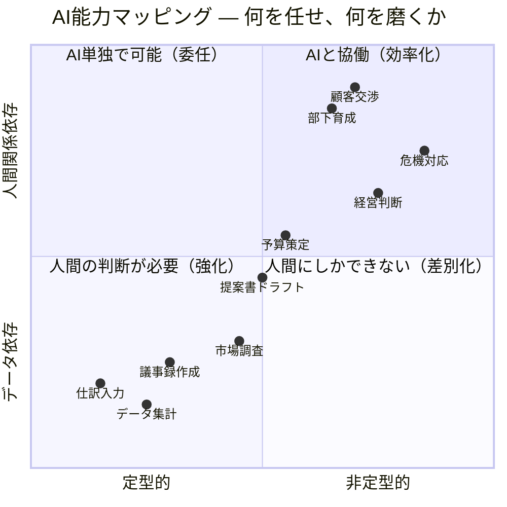
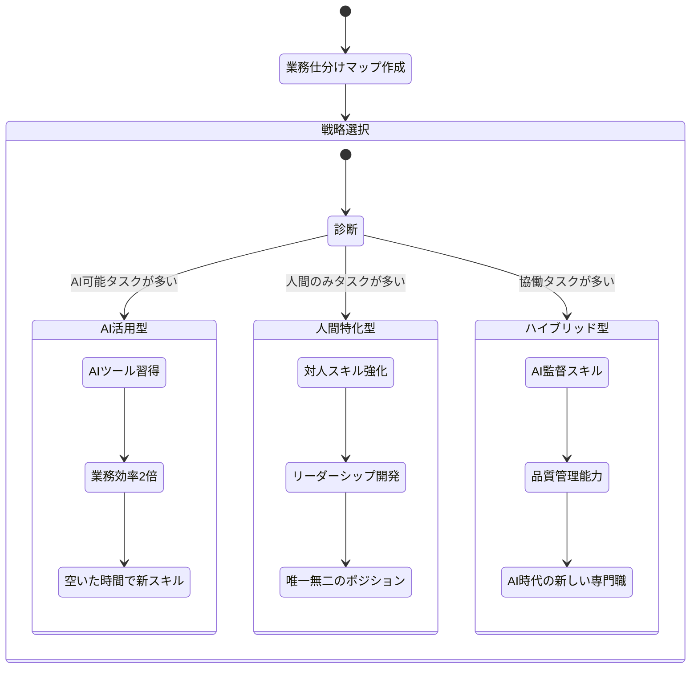

## 深夜のオフィスで聞こえた、ある一言

木村さん（31歳・経理部主任）は、月末の締め処理を終えた夜22時、同僚の声を聞いた。

「ねえ、この仕訳入力って、もうAIでできるんだって。経理って将来なくなるのかな」

冗談めかした口調だったが、木村さんの胸にはずしりと響いた。仕訳入力は自分の業務の3割を占めている。簿記2級を取り、7年間この仕事を積み上げてきた。「なくなる」と言われたら、何が残るのか。

翌週、木村さんは自分の業務を全タスク洗い出し、AI代替リスクを1つずつ評価するという作業をやった。結果は、想像とまったく違っていた。「奪われる」のではなく「任せられる」タスクが大量にあり、自分にしかできない仕事が浮き彫りになったのだ。

この記事では、木村さんが実践した**業務仕分けマップ**の作り方と、AI時代に生き残る3つのキャリア戦略を解説する。

## AIの「得意・苦手」を正確に理解する

まず前提として、AIには明確な得意・苦手がある。「何でもできる万能ツール」でもなければ、「何もできない張りぼて」でもない。

**左下（AI単独で可能）** に位置するタスクほどAI代替リスクが高い。しかし裏を返せば、ここを「AIに任せる」ことで、**右上（人間にしかできない）** 領域に時間を集中できる。

## 業務仕分けマップの作り方 ― 3ステップ

木村さんが実践した方法を追体験しよう。

### Step 1：業務を細かく分解する

まず、自分の仕事を「これ以上分けられない」レベルまで分解する。木村さんの経理業務は36タスクに分かれた。

**コツ：** 「経理をやる」ではなく「請求書の金額を会計ソフトに入力する」「取引先ごとの売掛金残高を確認する」のように具体化する。

### Step 2：各タスクのAI代替可能性を評価する

以下の3段階で評価する。

| 評価 | 基準 | 例 |
|------|------|-----|
| ○ AI可能 | ルールが明確で、データが揃えば人間不要 | 仕訳入力、データ集計 |
| △ 協働 | AIがドラフトを作り、人間が判断・修正 | 予算案作成、報告書 |
| × 人間のみ | 文脈理解・信頼関係・判断力が必要 | 経営層への提言、部門間交渉 |

### Step 3：価値の源泉を特定する

「×」がついたタスクこそ、あなたのキャリアの核になる部分だ。木村さんの場合：

- 経営層への月次報告における「数字の裏にあるストーリー」の解説
- 部門長との予算交渉
- 新人経理メンバーの育成
- イレギュラー案件（税務調査対応など）の判断

「仕訳入力がなくなっても、私の仕事はなくならない。むしろ、今まで仕訳に取られていた時間を、分析や提言に使えるようになる」――木村さんはそう気づいた。

## 3つのキャリア戦略

業務仕分けマップができたら、次に取るべき戦略を選ぶ。

### 戦略1：AI活用型 ― 「使いこなす側」になる

AIを道具として使いこなし、生産性を圧倒的に上げる戦略。

**こんな人向き：** AI代替可能なタスクが業務の半分以上を占める人

**具体的なアクション：**
- [プロンプトエンジニアリング](/blog/ai-prompt-engineering)を学び、AIへの指示精度を上げる
- ChatGPT、Claude、Geminiを1週間ずつ試して自分に合うツールを見つける
- 「AIで30分短縮できたタスク」を記録し、月末に振り返る

### 戦略2：人間特化型 ― AIが苦手な領域を極める

対人コミュニケーション、リーダーシップ、創造的な問題解決など、AIが本質的に苦手な領域に特化する。

**こんな人向き：** すでに「人間のみ」タスクが多い人（マネージャー、営業、コーチなど）

**具体的なアクション：**
- 傾聴力・共感力を意識的にトレーニングする
- ファシリテーションやコーチングのスキルを習得する
- 「この仕事は、なぜ人間がやる必要があるのか」を言語化する習慣をつける

### 戦略3：ハイブリッド型 ― AIと人間の橋渡し

AIの出力を監視・評価・改善する「AI監督者」としてのポジションを確立する。

**こんな人向き：** 「協働」タスクが多い人（マーケター、ライター、アナリストなど）

**具体的なアクション：**
- AIが生成したドラフトの品質チェック基準を自分で作る
- 複数のAIツールを組み合わせたワークフローを設計する
- AIの限界を理解し、「ここから先は人間がやる」ラインを引ける判断力を磨く

## ケーススタディ：3人のキャリアシフト

### 松田さん（27歳・マーケティング担当）― AI活用型を選択

業務仕分けマップを作ったら、SNS投稿文の作成、競合分析、レポート作成など、**業務の60%がAI代替可能**だった。

「最初はショックでした。でも逆に考えたら、その60%をAIに任せれば、残りの40%――キャンペーン企画やインフルエンサーとの関係構築――に集中できる」

松田さんはAIツールを徹底的に学び、レポート作成時間を月20時間から5時間に短縮。浮いた15時間を新規企画に充てた結果、担当キャンペーンのROIが**前年比180%**に向上した。

### 河野さん（39歳・管理職）― 人間特化型を選択

部署のマネジメントが主業務の河野さんは、「人間のみ」タスクが**業務の75%**を占めていた。

「AIは部下のモチベーション管理はできないし、部門間の政治的な調整もできない。自分の強みがはっきり見えました」

河野さんはコーチング研修を受け、1on1ミーティングの質を改善。チームの離職率が前年の15%から5%に低下した。

### 吉田さん（33歳・Webライター）― ハイブリッド型を選択

記事のドラフト作成はAIに任せられるが、取材・構成設計・ファクトチェックは人間の判断が必要。「協働」タスクが**業務の55%**だった。

「AIが書いた文章をそのまま出すライターは淘汰される。でも、AIのドラフトに人間ならではの温度感や取材で得た生の声を加えられるライターは、むしろ価値が上がる」

吉田さんは「AI編集者」としてのブランディングを確立。執筆速度は2倍になり、クライアント数は1.5倍に増えた。

## 今日から始める3つのアクション

### 1. 業務仕分けマップを作る（30分）

紙でもスプレッドシートでもいい。自分の業務を全タスク書き出し、○△×で評価する。「奪われる」のではなく「任せられる」視点で見ると、景色が変わる。

### 2. AIツールを1つ使ってみる（15分）

まだAIツールを触っていないなら、今日ChatGPTかClaudeに登録して、明日の業務で1回使ってみよう。[AIへの質問力](/blog/ai-era-question-power)を高めるだけで、得られる回答の質が劇的に変わる。

### 3. 「人間のみ」スキルを1つ選んで磨く（今週中）

業務仕分けマップで×がついたタスクの中から、最も価値が高いものを1つ選ぶ。それを[意識的に深める](/blog/deep-work)計画を立てよう。

## 恐れるのではなく、仕分ける

木村さんは業務仕分けマップを作った翌月、上司にこう提案した。

「仕訳入力をAI自動化すれば、月40時間が浮きます。その時間で、各部門の予算執行状況をリアルタイムでダッシュボード化するプロジェクトをやらせてください」

上司は驚いた顔をしたが、提案は通った。木村さんは今、「AIに仕事を奪われた経理」ではなく「AIを活用して経営に貢献する経理」として、新しいキャリアを歩き始めている。

AIの進化は止められない。でも、それを恐れる必要はない。自分の仕事を「仕分ける」だけで、不安は戦略に変わる。

---

## あなたの業務仕分けマップ、一緒に作りませんか？

「自分の仕事のどこがAIに任せられて、どこに集中すべきかわからない」――体験セッションでは、**あなたの業務を一緒に分解し、AI時代のキャリア戦略を具体的に設計**します。漠然とした不安を、明日からの行動計画に変えましょう。

[体験セッションの詳細を見る →](/sessions)
