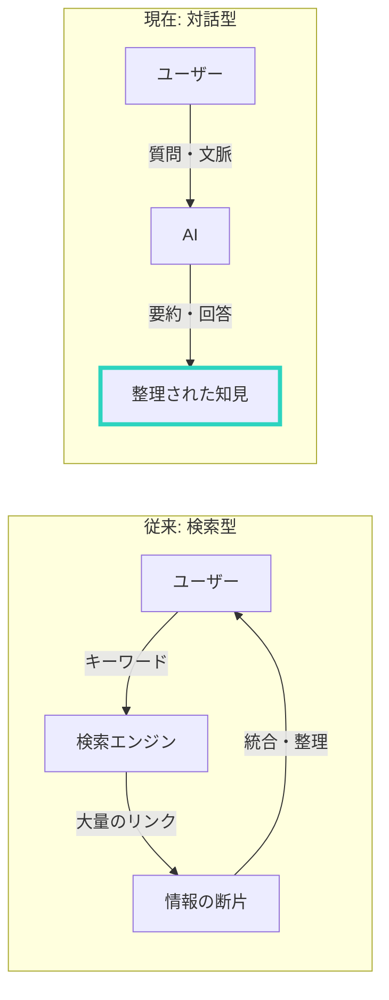

## はじめに

「ググればわかる」

長年、これが情報収集の常識でした。

でも今、AIの登場で情報収集のパラダイムが変わっています。
検索から対話へ。この変化を理解し、活用できる人が圧倒的に有利になります。

---

## 検索の限界

### 1. 答えを探す作業が必要

検索結果から、必要な情報を自分で探し出す必要があります。
10個のサイトを開いて、比較して、まとめる。時間がかかります。

### 2. 質問の仕方に依存

検索は「キーワード」ベース。
的確なキーワードを思いつかなければ、欲しい情報にたどり着けません。

### 3. 断片的な情報

検索結果は、断片的な情報の羅列。
自分で文脈を理解し、つなぎ合わせる必要があります。

---

## AI対話の強み

### 検索 vs AI対話

### 1. 質問を理解してくれる

AIは自然言語を理解します。
「〇〇について教えて」と言えば、文脈を汲んで回答してくれます。

### 2. 要約・整理してくれる

複数の情報源から、要点をまとめて提示してくれます。
自分でまとめる手間が省けます。

### 3. 深掘りができる

「もっと詳しく」「具体例は？」「反対意見は？」
対話を通じて、どんどん深掘りできます。

---

## AI情報収集の実践テクニック

### テクニック1: 役割を与える

「あなたは〇〇の専門家です」と前置きすると、より専門的な回答が得られます。

例：
「あなたはマーケティングの専門家です。SNS広告の最新トレンドを教えてください」

### テクニック2: 制約を与える

「3つに絞って」「初心者向けに」「200文字以内で」
制約を与えると、より使いやすい回答が得られます。

### テクニック3: 複数の視点を求める

「賛成派と反対派の意見をそれぞれ教えて」
一方的な情報ではなく、多角的な視点が得られます。

### テクニック4: 具体例を求める

「具体的な事例を3つ挙げて」
抽象的な説明より、具体例の方が理解しやすい。

---

## 検索とAIの使い分け

### 検索が向いている場面

- 最新のニュース・速報
- 特定の商品・サービスの情報
- 公式サイト・一次情報へのアクセス

### AIが向いている場面

- 概念の理解・学習
- 情報の整理・要約
- アイデア出し・ブレインストーミング
- 文章の作成・推敲

---

## 注意点

### AIの情報は検証が必要

AIは間違った情報を自信満々で言うことがあります。
重要な情報は、必ず一次情報で確認しましょう。

### 最新情報には弱い

AIの学習データには時間差があります。
最新のトレンドや速報は、検索で確認が必要です。

---

## 私の活用法

私は情報収集を以下のように使い分けています。

1. **まずAIに聞く** - 全体像を把握
2. **深掘りしたい点を対話** - 理解を深める
3. **検索で検証** - 一次情報を確認
4. **AIでまとめる** - 整理・言語化

この流れで、情報収集の効率が3倍以上になりました。

---

## まとめ

情報収集は「検索」から「対話」の時代へ。

AIを使いこなせるかどうかで、情報格差が生まれます。
今日から、AIとの対話を始めてみてください。

---

AI活用について詳しく知りたい方は、セッションでお話ししましょう。
