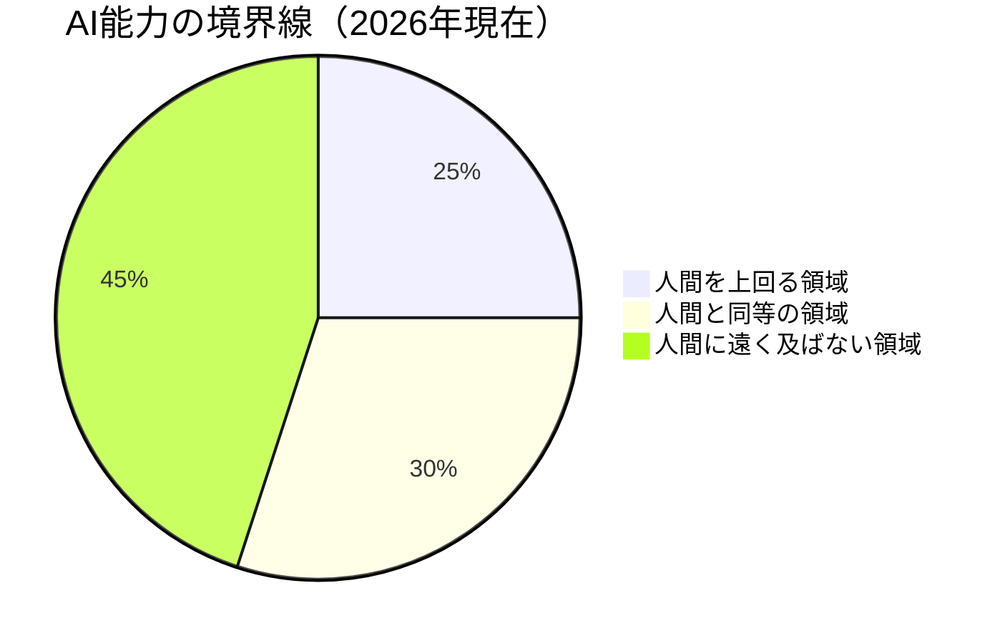
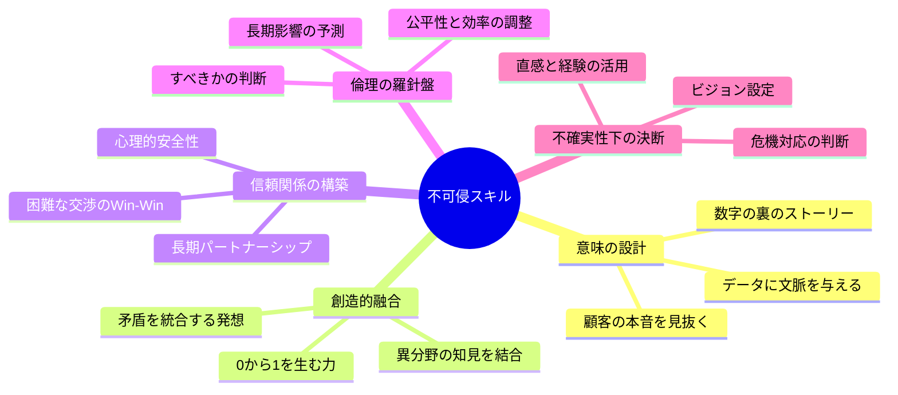
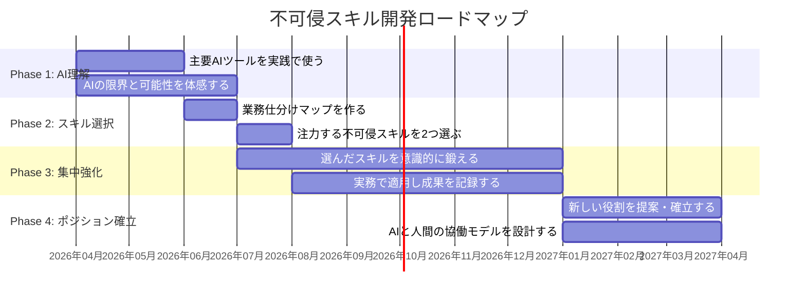

## 「あなたの仕事、AIでよくないですか？」

橋本さん（36歳・社内広報）は、役員会議でこの言葉を聞いたとき、頭が真っ白になった。

社内報の編集、プレスリリースの作成、SNS運用――橋本さんが担当する業務の多くを、AI導入推進チームが「自動化候補」としてリストアップしていたのだ。

「確かに、文章を書くだけならAIにもできる。でも、社員の本音を引き出すインタビューや、経営メッセージを現場に伝わる言葉に翻訳する仕事は？」

橋本さんは悔しさと危機感から、自分の仕事の本質を掘り下げ始めた。3ヶ月後、橋本さんは「AI時代の社内コミュニケーション戦略」を役員会で提案し、新設ポジションの責任者に就任した。

この記事では、橋本さんのように「自分の仕事はAIに代替されるのか」と不安を感じている人に向けて、AIが**絶対に代替できない5つの不可侵スキル**を解説する。

## AI能力の境界線 ― できること・できないこと

まず、AIの現在の能力を正確に把握しよう。「何でもできる」も「たいしたことない」も、どちらも間違いだ。

AIが人間を上回るのは、パターン認識・大量データ処理・定型文章生成など、全体の約25%。同等レベルが約30%。そして残りの45%――文脈の深い理解、創造的ブレイクスルー、人間関係の構築――では、AIは人間に遠く及ばない。

この「45%」こそが、あなたのキャリアの主戦場になる。

## 5つの不可侵スキル

AIが本質的に代替できないスキルを5つに整理した。これらは「今のAIにできない」ではなく、「AIの原理的な限界により、長期的にも代替されにくい」ものだ。

### 不可侵スキル1：意味の設計

AIはデータを処理できるが、それに**意味**を与えるのは人間だ。

**具体例：** 顧客満足度調査で「満足度78%」という数字が出たとする。AIは「前年比3ポイント低下」と報告する。しかし人間は、「先月の価格改定が影響している可能性がある」「ただし、新規顧客の満足度は92%で、既存顧客の不満は旧プランとの比較に起因する」といった、数字の裏にある物語を読み解ける。

**鍛え方：**
- データを見たとき「なぜこの数字になったのか」を3つ以上の仮説で考える習慣をつける
- [ファーストプリンシプル思考](/blog/first-principles-thinking)で、表面的な情報の奥にある本質を掘る
- 週1回、自分の仕事の成果を「ストーリー」として語る練習をする

### 不可侵スキル2：創造的融合

AIは既存データの組み合わせは得意だが、**まったく新しいコンセプトの創出**は人間の領域だ。

**具体例：** Netflixが「映像コンテンツ」と「データサイエンス」を融合してレコメンドエンジンを作ったのは、人間の創造的融合だ。AIに「新しいビジネスモデルを考えて」と聞けば、既存事例の変形は出てくる。しかし、異なる業界の知見を結びつけて「まだ誰も見たことない何か」を生み出すのは、人間の直感と経験が必要になる。

**鍛え方：**
- 自分の業界以外の本を月1冊読む
- [AIブレインストーミング](/blog/ai-brainstorming)で発散し、最後の統合は自分で行う
- 「もし〇〇業界のやり方をうちに持ち込んだら？」という問いを習慣にする

### 不可侵スキル3：信頼関係の構築

ビジネスの根幹は人間同士の信頼だ。AIがどれだけ高度なメールを書いても、「この人なら任せられる」という感情は生まれない。

**具体例：** ある法人営業の現場で、AIが作成した完璧な提案書よりも、担当者が雑談の中で拾ったクライアントの悩み――「実は来期、組織再編があって不安なんです」――に寄り添った一言のほうが、契約の決め手になることがある。

**鍛え方：**
- 1日1回、相手の話を「最後まで遮らずに聞く」練習をする
- チーム内で[心理的安全性](/blog/psychological-safety-team-results)を意識的に高める行動を取る
- 「この人に相談したい」と思われる存在を目指して、自分の専門性を言語化する

### 不可侵スキル4：倫理の羅針盤

AIは「できること」を示すが、「すべきかどうか」を判断するのは人間だ。

**具体例：** マーケティングチームがAIで顧客の行動データを分析し、「深夜2時に通知を送ると開封率が最も高い」という結果を得た。AIはこれを実行しようとする。しかし人間は「深夜のプッシュ通知は睡眠を妨げ、ブランドイメージを損ない、長期的な顧客離れにつながる」と判断して止められる。

**鍛え方：**
- 意思決定の際に「短期の利益」と「長期の影響」を必ず両方考える
- 「ステークホルダー全員にとってフェアか」を判断基準に加える
- [サンクコストの罠](/blog/sunk-cost-fallacy)に陥らず、倫理的に正しい撤退判断ができる力を持つ

### 不可侵スキル5：不確実性の中での意思決定

データが不完全で、前例がなく、時間も限られている状況で決断を下すのは、人間にしかできない。

**具体例：** コロナ禍で多くの企業が直面した「出社かリモートか」の判断。データはまだ揃っておらず、正解は誰にもわからない状況で、経営者は不完全な情報をもとに決断し、組織を動かす必要があった。

**鍛え方：**
- 小さな意思決定を「即断する」習慣をつけ、[決断疲れ](/blog/decision-fatigue)を減らす
- 判断の結果を記録し、定期的に振り返る（判断日記）
- 「80%の情報で決断する」というルールを自分に課す

## ケーススタディ：不可侵スキルで飛躍した3人

### 橋本さん（36歳・社内広報）― 「意味の設計」で新ポジション獲得

冒頭で紹介した橋本さんは、「文章を書く」という業務をAIに任せ、自分は「社内の声を拾い、経営メッセージを現場の言葉に翻訳する」という**意味の設計**に集中した。

**Before：** 社内報記事を月4本執筆（うち3本はAIで代替可能）
**After：** 社内コミュニケーション戦略の責任者。経営と現場の橋渡し役として、AI化推進プロジェクトのチェンジマネジメントも担当

「AIに書ける文章を書いていたら、いずれ必要なくなる。でも、社員50人にインタビューして、組織の本当の課題を言語化する仕事は、AIにはできない」

### 黒田さん（42歳・プロジェクトマネージャー）― 「信頼関係の構築」でチーム変革

黒田さんはAI導入で進捗管理の自動化が進む中、自分の役割を「タスク管理」から「チームの心理的安全性の確保」にシフトした。

**Before：** Excelでの進捗管理が業務の40%。ステータス確認のための会議が週3回
**After：** AI自動レポートで進捗管理はゼロに。浮いた時間で1on1を充実させ、チームの心理的安全性スコアが**5点中3.2→4.5**に向上

「進捗管理はAIのほうが正確で速い。でも、メンバーが『実は悩んでます』と言える場を作るのは、人間にしかできない」

### 小林さん（29歳・データアナリスト）― 「創造的融合」で新規事業を提案

データ分析自体はAIが高速・高精度で行うようになった。小林さんは分析の「実行」ではなく「問いの設計」にフォーカスした。

**Before：** 依頼されたデータを集計・可視化するのが主業務
**After：** 「なぜこのデータを見るのか」「何がわかれば意思決定できるのか」を設計する役割に。異業種のデータ活用事例を研究し、自社の物流データとSNSデータを掛け合わせた需要予測モデルを提案。**在庫回転率が23%改善**

「AIにデータ分析で勝とうとしても無理。でも『何を分析すべきか』という問いを立てる力は、業界知識と創造性がないとできない」

## スキル開発のロードマップ

### Phase 1（1〜3ヶ月）：AIリテラシーの獲得

まずAIツールを実際に使い、「何ができて、何ができないか」を体感する。使いこなすことで、逆に「ここは人間の出番だ」というラインが見えるようになる。

### Phase 2（3〜4ヶ月目）：自分の不可侵スキルを特定

[業務仕分けマップ](/blog/ai-career-future)を作り、自分の業務の中で「AIに絶対できない部分」を洗い出す。5つの不可侵スキルのうち、自分が最も発揮できる2つに絞る。

### Phase 3（4〜12ヶ月目）：集中的に鍛える

選んだスキルに時間とエネルギーを集中投下する。本を読み、研修を受け、実務で意識的に使い、[振り返り](/blog/feedback-mindset)で精度を上げていく。

### Phase 4（1年目以降）：新しいポジションを確立する

鍛えたスキルを武器に、AI時代の新しい役割を社内で提案する。橋本さんが「社内コミュニケーション戦略責任者」を、黒田さんが「チームウェルビーイング推進役」を作ったように。

## 今日から始める3つのこと

1. **自分の業務を10個リストアップし、AIに代替できるか○△×で評価する**（15分）
2. **5つの不可侵スキルの中で、自分が最も自信のあるものを1つ選ぶ**（5分）
3. **今週の仕事で、そのスキルを意識的に使う場面を1つ設定する**（1分）

「AIに仕事を奪われる」という不安は、自分の仕事を解像度高く見つめ直すことで「AIに仕事を任せ、人間にしかできない価値で勝負する」という戦略に変わる。

---

## あなたの「不可侵スキル」、言語化してみませんか？

「自分の強みが何か、うまく言葉にできない」「AIに代替されない自分だけの価値を見つけたい」――体験セッションでは、**あなたの経験・スキル・仕事を棚卸しし、AI時代に武器になる不可侵スキルを一緒に特定**します。

[体験セッションの詳細を見る →](/sessions)
