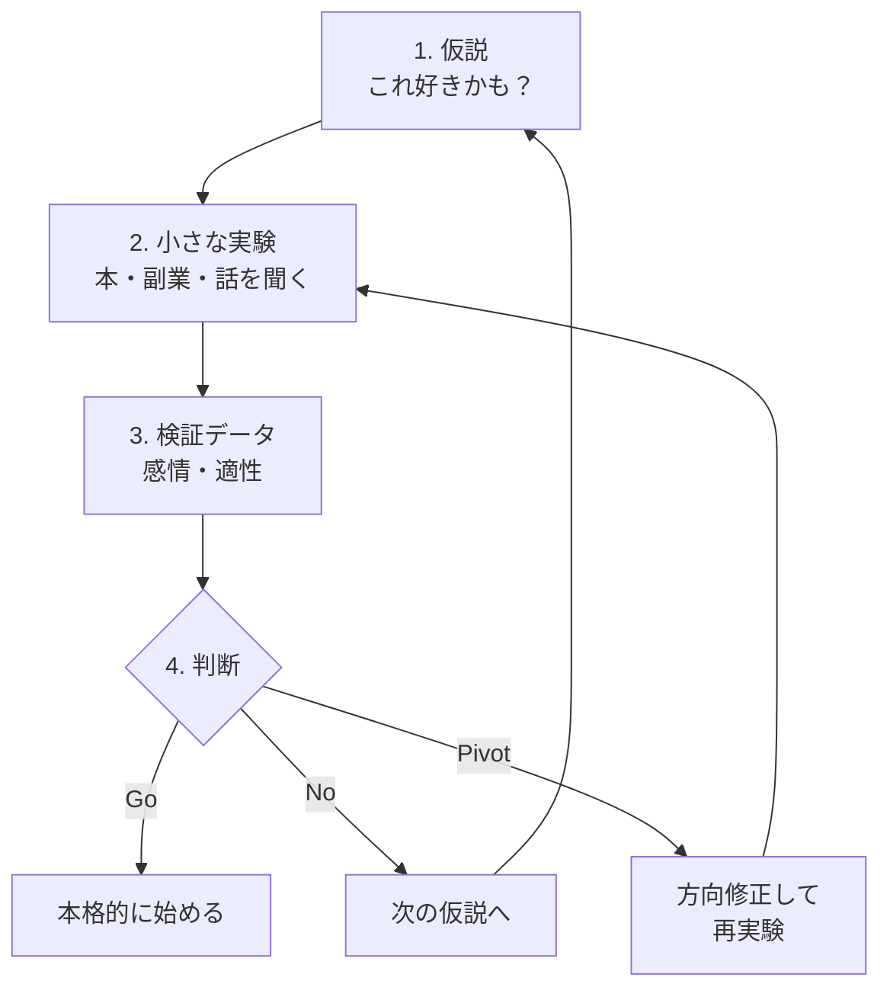

## はじめに

「やりたいことがわからない」
「天職を見つけたい」

こんな悩みを抱えていませんか？

実は、「やりたいこと」を見つけようとすること自体が、間違いかもしれません。

---

## 「やりたいこと探し」の罠

### 1. 完璧な答えを求めてしまう

「これだ！」という確信が得られるまで動けない。
でも、確信は行動の前には得られません。

### 2. 頭の中だけで考える

実際にやってみないと、本当に好きかどうかはわかりません。
想像と現実は、しばしば異なります。

### 3. 一度決めたら変えられないと思っている

キャリアは、一本道ではありません。
何度でも方向転換できます。

---

## 「仮説検証」アプローチ

### キャリアを「実験」と捉える

科学者は、仮説を立てて実験で検証します。
キャリアも同じ。

「これが好きかもしれない」という仮説を立て、
実際にやってみて検証する。

### 失敗は「データ」

実験に失敗はありません。
「この仮説は間違いだった」というデータが得られるだけ。

---

## 仮説検証の具体的ステップ

### キャリアの実験サイクル

### Step 1: 興味のリストを作る

今、少しでも興味があることを書き出します。

- 仕事に関すること
- 趣味・プライベート
- 昔好きだったこと
- 「いいな」と思った人の仕事

完璧でなくてOK。思いつくままに。

### Step 2: 仮説を立てる

リストから、「これをやってみたら、こう感じるかも」という仮説を立てます。

例：
- 「プログラミングを学んだら、楽しいかもしれない」
- 「ライティングの仕事は、自分に合っているかもしれない」

### Step 3: 小さく実験する

仮説を検証するための、小さな実験を設計します。

- オンライン講座を1つ受けてみる
- 副業で少しやってみる
- その仕事をしている人に話を聞く
- 本を3冊読んでみる

### Step 4: 振り返る

実験後、以下を振り返ります。

- 楽しかったか？
- 時間を忘れて没頭できたか？
- もっとやりたいと思ったか？
- 苦痛に感じた部分は？

### Step 5: 次の仮説へ

検証結果をもとに、次の仮説を立てます。

「プログラミングは楽しかったけど、一人作業が寂しい」
→ 「チームで開発する仕事なら、もっと楽しいかも」

---

## 実験のコツ

### 小さく始める

いきなり転職・独立は危険。
まずは、今の環境でできる実験から。

### 期限を決める

「3ヶ月だけ試す」と決めると、始めやすくなります。

### 複数並行する

一つに絞らず、2-3個の実験を並行すると、比較ができます。

---

## 私の例

私も「やりたいこと」を探して迷った時期がありました。

- コンサルティング → 面白いけど、何か足りない
- プログラミング → 楽しいけど、人と話したい
- コーチング → これだ！

何度も仮説検証を繰り返して、今の仕事にたどり着きました。

---

## まとめ

「やりたいこと」は、頭の中で見つかるものではありません。

**小さく試して、感じて、また試す。**

このサイクルを回すことでしか、見つかりません。

今日、何か一つ小さな実験を始めてみませんか？

---

キャリアの仮説検証を一緒に進めたい方は、セッションでお待ちしています。
