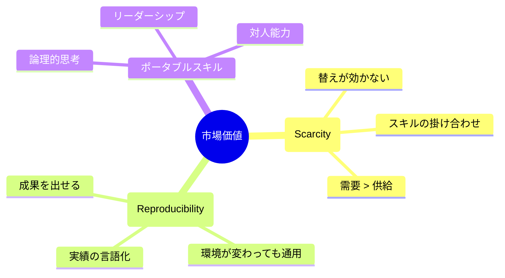

## はじめに

「転職しようかな」

そう思ったとき、すぐに求人サイトを開いていませんか？

ちょっと待ってください。
転職活動を始める前に、やるべきことがあります。

それは、**自分の市場価値を把握すること**です。

---

## なぜ市場価値の把握が先か？

### 1. 適正年収がわからない

自分の価値を知らないと、安売りしてしまう可能性があります。
逆に、高望みして苦戦することも。

### 2. アピールポイントが曖昧

「何ができるか」を客観的に説明できないと、面接で苦労します。

### 3. 転職すべきか判断できない

実は今の会社が、市場より好条件かもしれません。
客観的な比較なしに判断するのは危険です。

---

## 市場価値を測る3つの指標

### 指標1: スキルの希少性

「どれだけ代替しにくいか」

以下の質問に答えてみてください。

- あなたと同じスキルを持つ人は、何人いる？
- そのスキルは、1年で身につく？10年かかる？
- 需要に対して、供給は多い？少ない？

希少性が高いほど、市場価値は上がります。

### 指標2: 再現性のある実績

「何を成し遂げたか」を、数字で示せるか。

- 売上を〇〇%向上させた
- コストを〇〇円削減した
- プロジェクトを〇ヶ月で完了させた
- チームの離職率を〇%改善した

抽象的な貢献より、具体的な数字が説得力を持ちます。

### 指標3: ポータブルスキル

「どの会社でも使えるスキル」をどれだけ持っているか。

- 業界特有の知識 → ポータブルではない
- コミュニケーション能力 → ポータブル
- 特定ツールの操作 → 微妙
- 問題解決能力 → ポータブル

ポータブルスキルが多いほど、選択肢が広がります。

---

## 市場価値を確認する方法

### 1. 転職エージェントに相談

実際に転職しなくても、相談だけでOK。
「どのくらいの年収が見込めるか」を聞いてみましょう。

### 2. 求人情報をチェック

自分のスキルに該当する求人を探し、年収レンジを確認。

### 3. LinkedInを整備する

プロフィールを充実させると、スカウトが来ます。
スカウトの内容で、市場評価がわかります。

### 4. 副業・複業で試す

実際にお金を払ってもらえるか、試してみる。
これが最もリアルな市場価値です。

---

## 市場価値を高める方法

### 1. 希少性を高める

- 複数のスキルを掛け合わせる
- ニッチな専門性を深める
- 最新技術・トレンドをキャッチアップ

### 2. 実績を作る

- 数字で語れる成果を意識する
- プロジェクトリードの経験を積む
- 社外でも通用する実績を作る

### 3. ポータブルスキルを磨く

- コミュニケーション
- ロジカルシンキング
- プロジェクトマネジメント
- リーダーシップ

---

## 転職すべきか、残るべきか

市場価値を把握したら、以下を比較します。

| 項目 | 現職 | 転職先候補 |
|------|------|------------|
| 年収 | | |
| 成長機会 | | |
| 働き方 | | |
| 人間関係 | | |
| 将来性 | | |

総合的に判断して、転職が本当に最適か考えましょう。

---

## まとめ

転職を考えたら、まず自分の市場価値を把握する。

**スキルの希少性、再現性のある実績、ポータブルスキル。**

この3つを客観的に評価することで、正しい判断ができます。

---

キャリアの棚卸しを一緒に行いたい方は、セッションでサポートします。
