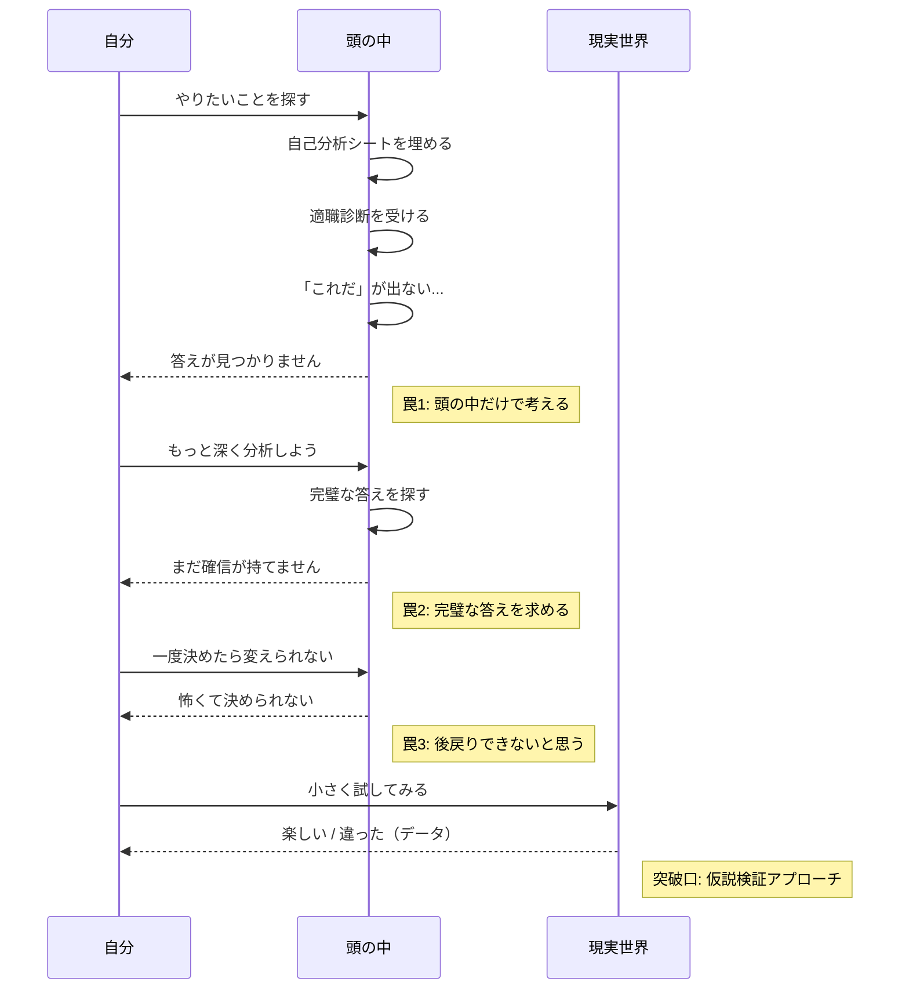
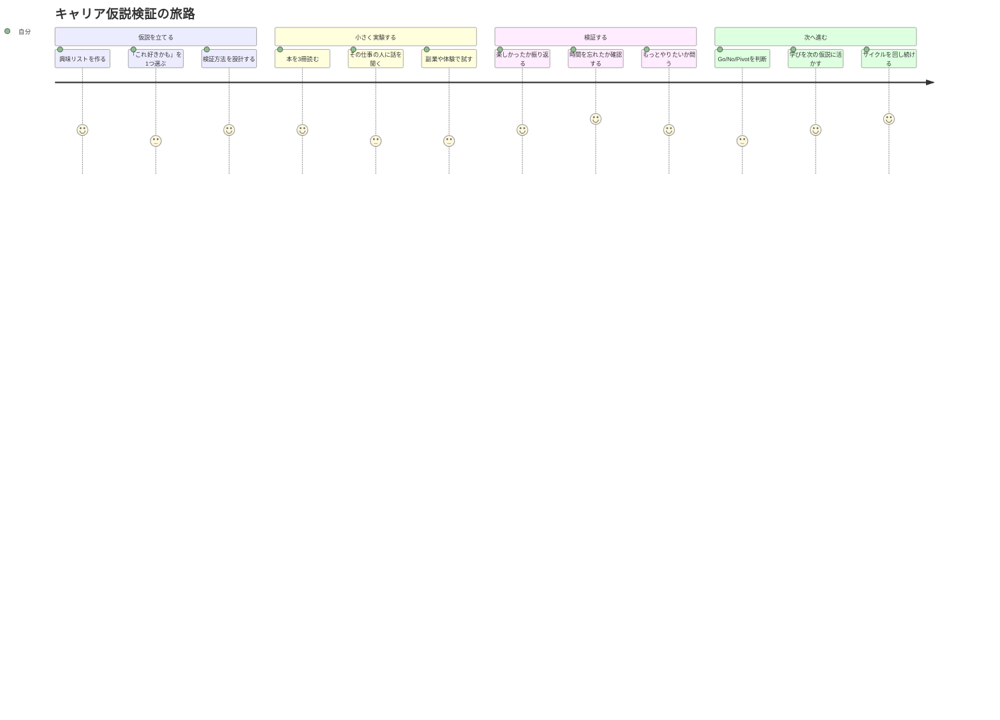

## 「やりたいことは何ですか？」が一番つらい質問だった

高橋さん（27歳・メーカー営業3年目）は、転職エージェントとの面談で固まった。

「高橋さんの"やりたいこと"は何ですか？次のキャリアでは何を実現したいですか？」

5秒の沈黙。10秒。15秒。

「……すみません、それがわからないんです」

帰りの電車で、高橋さんはスマホで「やりたいこと 見つけ方」と検索した。出てきたのは「自己分析シート」「価値観リスト」「ストレングスファインダー」。全部やった。自己分析シートは3回やり直した。でも「これだ」という答えは出なかった。

高橋さんのような人は、圧倒的に多い。内閣府の調査によると、20〜30代の約6割が「やりたいことが明確ではない」と回答している。これは「自分探し」が足りないのではない。**探し方そのものが間違っている**のだ。

## 「やりたいこと探し」の3つの罠

なぜ「やりたいこと」は見つからないのか。そこには、多くの人が陥る3つの罠がある。

### 罠1：頭の中だけで考える

「やりたいこと」は思考では見つからない。なぜなら、実際にやってみないと好きかどうかわからないからだ。コーヒーを飲んだことがない人に「コーヒーは好きですか？」と聞いても答えられないのと同じだ。

### 罠2：完璧な答えを求める

「これだ！」という雷に打たれるような確信を待っている人が多い。しかし、キャリアにおける「これだ」は、行動の前ではなく**行動の後**にやってくる。やってみて「あ、これ好きかも」と気づく。その繰り返しで確信が育つ。

### 罠3：一度決めたら変えられないと思っている

キャリアは一本道ではない。方向転換も、Uターンも、寄り道もできる。[30代からのキャリアチェンジ](/blog/30s-career-change-guide)は珍しくないし、複数のキャリアを経験することでしか得られない強みもある。

## 「仮説検証」アプローチとは何か

科学者は、答えを知ってから実験するのではない。「こうかもしれない」という仮説を立て、実験で検証する。キャリアも同じだ。

**「やりたいことを"探す"」のをやめて、「やりたいかもしれないことを"試す"」に切り替える。**

これが仮説検証アプローチの本質だ。

### 仮説検証サイクル

### 失敗は「データ」である

ここで重要なのは、実験に「失敗」はないということだ。

「プログラミングを試したけど、全然楽しくなかった」――これは失敗ではない。「自分はプログラミングには向いていない」という**貴重なデータ**だ。次の仮説がより正確になる。

「コーチングを試したら、人の話を聞くのは好きだけど、1対1より1対多のほうが楽しい」――これも失敗ではなく、「研修講師やファシリテーターのほうが合うかもしれない」という次の仮説につながるデータだ。

## 仮説検証の5ステップ

### Step 1：興味のリストを作る（30分）

今、少しでも気になっていることを20個書き出す。完璧でなくていい。「ちょっと気になる」レベルで十分。

**書き出すヒント：**
- 最近読んで面白かった記事のテーマ
- 「いいな」と思った人の仕事
- 子どもの頃に夢中だったこと
- SNSでつい見てしまうジャンル
- 「自分にもできたら」と思ったスキル

### Step 2：仮説を立てる（15分）

リストから3つ選び、「もし〇〇をやったら、自分は△△と感じるだろう」という仮説を立てる。

**高橋さんの仮説例：**
- 仮説A：「コーチングを学んだら、人の成長を支援する仕事にやりがいを感じるかもしれない」
- 仮説B：「Webライティングをやったら、言葉で伝える仕事が楽しいと感じるかもしれない」
- 仮説C：「プログラミングを学んだら、ものを作る喜びを感じるかもしれない」

### Step 3：小さく実験する（2週間〜1ヶ月）

仮説を検証するための、**リスクの低い実験**を設計する。

| 実験方法 | コスト | 時間 | 解像度 |
|----------|--------|------|--------|
| 関連書籍を3冊読む | 5,000円 | 10時間 | ★★ |
| その仕事をしている人に話を聞く | 0円（SNSでDM） | 2時間 | ★★★ |
| オンライン講座を受ける | 1〜3万円 | 20時間 | ★★★★ |
| 副業やボランティアで体験する | 0〜数万円 | 40時間 | ★★★★★ |

**ポイント：** いきなり転職や独立はしない。まず「今の環境にいながら試せる方法」から始める。

### Step 4：感情データを記録する（毎日5分）

実験中、以下の質問に1〜10で点数をつけて記録する。

- **没頭度：** 時間を忘れるほど集中できたか？
- **充実感：** やった後に「いい時間だった」と思えたか？
- **継続欲：** 「もっとやりたい」と感じるか？
- **苦痛度：** 嫌だと感じた部分はあったか？

この数値が、仮説の検証データになる。頭で考えるのではなく、**自分の感情を客観的に観察する**のがコツだ。

### Step 5：Go / No / Pivot を判断する

2週間〜1ヶ月の実験が終わったら、データをもとに判断する。

- **Go（前進）：** 没頭度・充実感が高い → 本格的に時間を投下する
- **No（撤退）：** 楽しくなかった → 「合わない」というデータを得た。次の仮説へ
- **Pivot（方向修正）：** 一部は楽しいが一部は合わない → 仮説を修正して再実験

## ケーススタディ：3人の仮説検証記録

### 高橋さん（27歳・メーカー営業）― 4回の実験で天職に出会う

| 回 | 仮説 | 実験 | 結果 | 判断 |
|----|------|------|------|------|
| 1 | コーチングが合うかも | コーチング入門講座（3日間） | 没頭度9、充実感8 | Go → でも「1対1は疲れる」 |
| 2 | 研修講師のほうが合うかも | 社内勉強会で講師をやる | 没頭度10、充実感10 | Go! |
| 3 | 企業研修講師として独立できるかも | 知人の会社で研修を実施 | 没頭度9、充実感9、「でも独立は不安」 | Pivot |
| 4 | 企業に属しながら研修部門に移るのはどうか | 人事部の研修チームに社内異動を相談 | 異動決定。営業経験×研修スキルで独自ポジション | Go! |

高橋さんは現在、メーカーの人材開発部門で新人研修のプログラムを設計している。「"やりたいこと"を探していたら一生見つからなかった。試してみて、ようやくわかった」

### 大西さん（32歳・事務職）― 「No」のデータで前進

大西さんは3つの仮説を立てた。

- 仮説A：Webデザインが合うかも → 没頭度3。「デザインは好きだけど、クライアントの要望に合わせるのが苦痛」 → **No**
- 仮説B：料理教室の運営が合うかも → 没頭度7。「料理自体は楽しいが、教室運営の事務作業が嫌」 → **Pivot** → レシピ開発に特化
- 仮説C：フードスタイリストが合うかも → 没頭度9、充実感10 → **Go!**

「3回の"違った"がなかったら、フードスタイリストという選択肢にはたどり着かなかった。Noのデータが一番役に立ちました」

### 伊藤さん（45歳・管理職）― 年齢の壁を超えた実験

「45歳でキャリアの方向転換なんて」と思っていた伊藤さんだが、[レジリエンス](/blog/resilience)を意識して最初の一歩を踏み出した。

- 仮説：長年の経験を活かして、中小企業のDXコンサルができるかもしれない
- 実験：知人の中小企業で無料のDX相談を3社実施
- 結果：「経営者と対話して課題を整理する工程が、めちゃくちゃ楽しい」
- 判断：Go → 副業としてDXコンサルを開始。半年で月10万円の収入に

「頭の中で考えていたら"もう遅い"と思い込んでいたはず。やってみたら、45歳の経験こそが武器だとわかった」

## 実験を成功させる3つのコツ

### コツ1：小さく始める

いきなり転職や独立はNG。今の環境でできる実験から始める。

- 社内の別部署のプロジェクトに手を挙げる
- 週末に2時間だけ副業してみる
- オンラインコミュニティに参加する

### コツ2：期限を決める

「3ヶ月だけ試す」と決めると、始めるハードルが一気に下がる。終わりがあるから始められる。[インポスター症候群](/blog/imposter-syndrome)で「自分なんかが」と思う人ほど、期限付きの実験が効果的だ。

### コツ3：2〜3個を並行する

1つに絞ると「これがダメだったら終わり」というプレッシャーがかかる。2〜3個を同時に試せば、比較もできるし、精神的な余裕も生まれる。

## 今日から始める仮説検証

「やりたいこと」は、机の上で見つかるものではない。世界と接触することで、初めて自分の中から浮かび上がってくるものだ。

**今日できること：**

1. **興味リストを20個書き出す**（30分） ― 紙でもスマホのメモでもいい。「ちょっと気になる」レベルで書き出す
2. **その中から3つ選び、仮説を立てる**（15分） ― 「もし〇〇をやったら、自分は△△と感じるだろう」
3. **最も低コストで試せる実験を1つ設計する**（10分） ― 本を1冊買う、その仕事の人のブログを読む、など

「これだ」という答えは、行動の先にしかない。小さく試して、感じて、また試す。そのサイクルの中にしか、「やりたいこと」はない。

---

## あなたの「最初の仮説」、一緒に立ててみませんか？

「興味はあるけど、何から試せばいいかわからない」「自分の経験をどう活かせるか整理したい」――体験セッションでは、**あなたの経験・興味・価値観を棚卸しし、最初に検証すべきキャリア仮説と具体的な実験方法を一緒に設計**します。

[体験セッションの詳細を見る →](/sessions)
