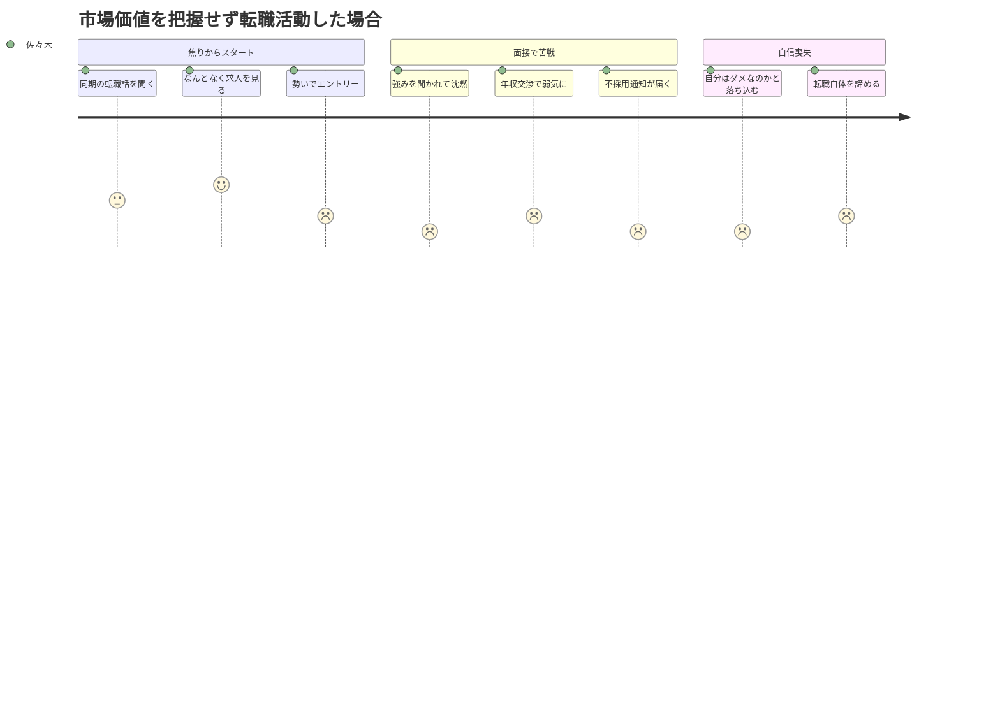
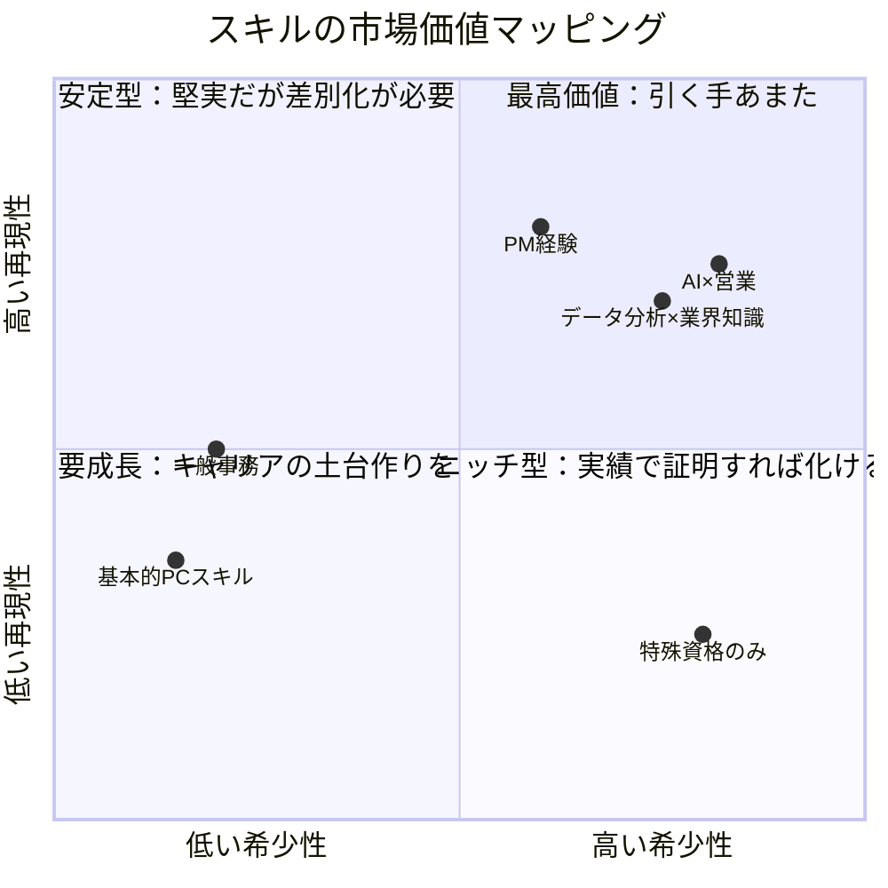
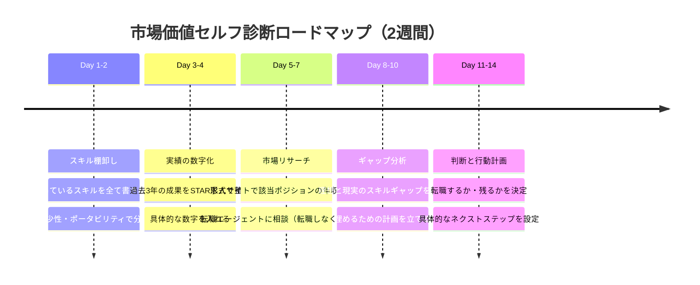

佐々木さん（31歳・メーカー営業）は、金曜の夜、転職サイトの求人を眺めていた。「年収500万って、自分だと高いのかな、妥当なのかな......」。同期の中村は去年転職して年収が80万上がったと聞いた。焦りから3社にエントリーしたが、面接で「あなたの強みは？」と聞かれて沈黙。結果は全滅だった。

実はこれ、転職で最もよくある失敗パターンだ。**自分の市場価値を把握しないまま転職活動を始めてしまう**こと。求人サイトを開く前に、まず自分の「値札」を知ることが、転職成功の第一歩になる。

## 市場価値を知らないまま転職するとどうなるか

佐々木さんの失敗には3つの根本原因がある。

**1. 適正年収がわからない**
自分のスキルセットに対して市場がいくら払うのかを知らなければ、安売りも高望みも起きる。佐々木さんは「500万」という数字が高いのか低いのかすら判断できなかった。

**2. アピールポイントが言語化できていない**
「営業を8年やりました」では差別化にならない。面接官が知りたいのは「あなたがいることで、何がどう変わるのか」だ。

**3. 転職すべきかの判断軸がない**
実は今の会社の方が市場平均より好条件かもしれない。比較対象がなければ、正しい判断はできない。

## 市場価値を構成する3つの指標

では、市場価値はどう測るのか。ここでは「希少性」「再現性」「ポータビリティ」の3軸で整理する。

### 指標1：スキルの希少性 ── 「替えが効かない」度合い

希少性とは、「あなたと同じことができる人が市場にどれだけいるか」という指標だ。

**セルフチェック項目：**
- あなたと同じスキルセットを持つ人は、100人中何人いる？
- そのスキルの習得に何年かかる？（1年以下なら希少性は低い）
- 需要に対して供給は？（求人数 vs 該当人材数）

重要なのは、**単体スキルではなく「掛け合わせ」で希少性を生む**こと。「営業ができる人」は大勢いるが、「営業 × データ分析 × SaaS業界知識」を持つ人はぐっと減る。

### 指標2：再現性のある実績 ── 「数字で語れる」成果

「頑張りました」では伝わらない。市場が評価するのは、**環境が変わっても再現できる実績**だ。

**実績を言語化する公式：**

> 【状況】→【課題】→【行動】→【結果（数字）】

例えば：
- 「新規開拓が停滞していた（状況）」→「見込み客リストの質が低かった（課題）」→「データ分析で優先ターゲットを再定義した（行動）」→「商談数が月15件から28件に増加（結果）」

### 指標3：ポータブルスキル ── 「どこでも通用する」能力

特定の会社でしか使えないスキルと、どの業界でも通用するスキルがある。

| スキルタイプ | 例 | ポータビリティ |
|---|---|---|
| 業界特有の知識 | 社内システム操作、業界規制の詳細 | 低い |
| 汎用ビジネススキル | 論理的思考、プレゼン力、交渉力 | 高い |
| テクニカルスキル | プログラミング、データ分析、デザイン | 中〜高い |
| マネジメントスキル | チーム管理、プロジェクト推進、育成 | 高い |

ポータブルスキルが多いほど、転職先の選択肢は広がる。逆に「今の会社でしか使えないスキル」に偏っている場合は、意識的にポータブルスキルを積み上げる必要がある。

## ケーススタディ：市場価値の見える化で転職が変わった3人

### Case 1：佐々木さん（31歳・メーカー営業）── 自己分析で年収70万アップ

冒頭で全滅した佐々木さんは、3ヶ月後にリベンジした。

「まず自分のスキルを書き出したんです。営業8年、新規開拓メイン、SaaS商材の経験もある。でも面接では『営業やってました』としか言えなかった」

彼がやったのは、**実績の数字化**だった。

- 新規顧客開拓：年間48社（部署平均の1.8倍）
- 担当顧客のLTV：平均2,400万円（前任比+35%）
- 後輩育成：3名のOJTを担当し、全員が半年で目標達成

「数字にしたら、自分の価値が見えた。転職エージェントに見せたら『これなら年収550〜600万は十分狙えます』と言われて、自信がついた」

結果、SaaS企業に年収570万で転職。前職から70万アップを実現した。

### Case 2：鈴木さん（28歳・人事）── 「ポータブルスキル不足」に気づいて方向転換

鈴木さんは人事3年目。「もっと成長できる環境に行きたい」と転職を考えたが、自己分析で壁にぶつかった。

「自分のスキルを書き出したら、8割が社内システムの操作や自社の評価制度に関するものだった。これ、転職先では使えない......」

気づいたのは、**ポータブルスキルの圧倒的な不足**。鈴木さんは転職を一旦保留し、現職でポータブルスキルを積む戦略に切り替えた。

- 採用面接の設計と実施（面接スキル）
- 人事データの分析と経営への提言（データ分析力）
- 外部研修の企画運営（プロジェクトマネジメント）

「1年間で意識的にポータブルなスキルを増やした。結果、翌年の転職では書類通過率が3倍になりました」

### Case 3：田中さん（35歳・エンジニア）── 副業で市場価値を「実証」

田中さんは社内では「頼れるベテラン」だったが、「外の市場で自分が通用するかわからない」という不安を抱えていた。

「転職エージェントに登録はしたけど、提示される年収が今と変わらない。自分にはもっと価値があると思うんだけど......」

田中さんが選んだのは、**副業での実証**だった。クラウドソーシングでPythonのデータ分析案件を受注。最初は時給換算2,000円程度だったが、実績が積み上がるにつれ、時給5,000円の案件が来るようになった。

「副業の実績が、転職面接でも効いた。『社外でもこれだけの評価をもらっています』と言えると、説得力が全然違う」

最終的に、年収650万から780万へのステップアップに成功。副業の実績が「再現性の証明」になったケースだ。

## 市場価値セルフ診断：5つのステップ

### Step 1：スキル棚卸し（Day 1-2）

ノートを開き、以下を書き出す。

- **業務スキル**：日常的に使っているスキル全て
- **成功体験**：うまくいったプロジェクトや施策
- **他者からの評価**：褒められたこと、頼られること
- **好きなこと**：時間を忘れて没頭できる業務

### Step 2：実績の数字化（Day 3-4）

Step 1で出した成功体験を、STAR形式で言語化する。

- **S（状況）**：どんな状況だったか
- **T（課題）**：何が問題だったか
- **A（行動）**：何をしたか
- **R（結果）**：数字でどう変わったか

**最低3つ**の実績を数字付きで整理しよう。

### Step 3：市場リサーチ（Day 5-7）

自分のスキルセットに合う求人を20件ほどチェックし、年収レンジを確認する。同時に転職エージェントへの相談も有効だ。**転職する気がなくても相談だけでOK**。「今の市場感を知りたい」と伝えれば、快く教えてくれる。

### Step 4：ギャップ分析（Day 8-10）

市場リサーチの結果と自分のスキルを突き合わせる。

- 自分に足りないスキルは何か？
- そのスキルは何ヶ月で身につくか？
- 現職で身につけられるか、転職しないと無理か？

### Step 5：判断と行動計画（Day 11-14）

ここまでの情報を総合して、最終判断を下す。

| 比較項目 | 現職 | 転職した場合 |
|---|---|---|
| 年収 | 具体的な金額 | 市場リサーチの結果 |
| 成長機会 | 今後1-2年で何を学べるか | 新環境で何を得られるか |
| 働き方 | 残業、リモート可否 | 条件面の改善度 |
| 人間関係 | 上司・チームとの関係 | 未知数（リスク） |
| 将来性 | 会社の成長性、ポジション | キャリアパスの広がり |

「年収だけ」で判断しないこと。成長機会や働き方も含めた総合判断が、後悔しない転職につながる。

## 市場価値を高める3つの戦略

今すぐ転職しない場合でも、市場価値は日々高められる。

**1. スキルの掛け合わせで希少性を上げる**
今の専門スキルに、もう1つ別の軸を足す。「マーケティング × データ分析」「人事 × テクノロジー」のように。[AIスキルを掛け合わせる](/blog/ai-career-future)のは、今最も効果的な希少性の作り方だ。

**2. 社外でも通用する実績を意識的に作る**
社内プロジェクトでも、「この経験は転職先で語れるか？」と自問する習慣をつける。数字で語れる成果を意識的に積み上げよう。

**3. ポータブルスキルを毎日少しずつ磨く**
[ディープワーク](/blog/deep-work)の時間を確保して論理的思考やプレゼン力を鍛える。[フィードバックを受ける姿勢](/blog/feedback-mindset)も、どの環境でも通用する貴重なスキルだ。

## 今日からできるアクション

転職を考えているなら、まず今週中に以下の1つだけやってみてほしい。

1. **ノートを開いて、自分のスキルを20個書き出す**（15分）
2. **そのうち3つを「数字付きの実績」に変換する**（30分）
3. **求人サイトで自分のスキルに合う求人を10件チェックし、年収レンジをメモする**（20分）

この3つで、自分の市場価値の輪郭が見えてくる。「なんとなく不安」が「具体的な課題」に変わる。それだけで、次のアクションが明確になるはずだ。

---

## あなたの市場価値、一緒に整理しませんか？

「スキルの棚卸しを1人でやるのは難しい」「客観的な視点がほしい」──そんな方には、キャリアの壁打ち相手がいると突破口が見つかりやすくなります。セッションでは、あなたの経験を一緒に言語化し、市場価値の「見える化」をサポートします。

[セッションの詳細を見る](/sessions)
