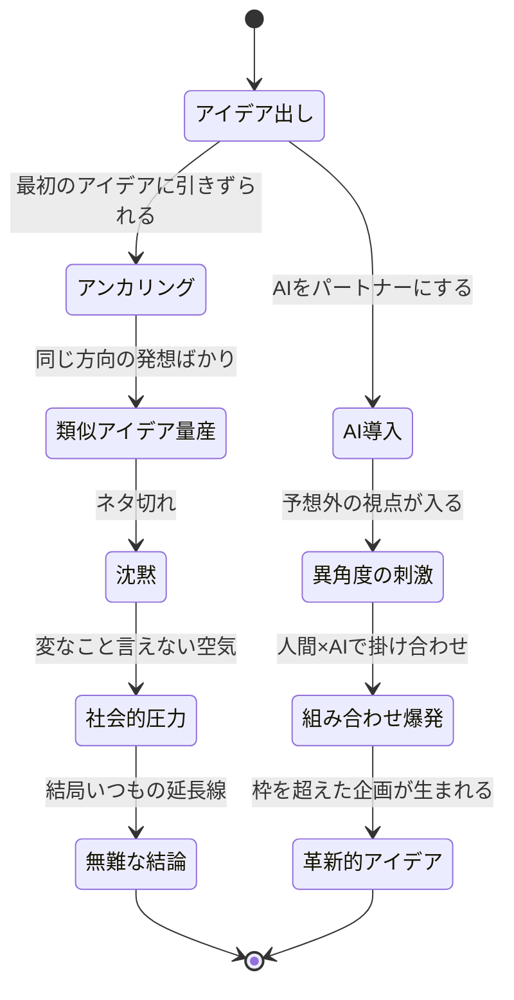

木村さん（34歳・食品メーカー商品企画）は、会議室のホワイトボードを見つめていた。「新しい健康飲料のアイデア出し」と書かれたタイトルの下に、付箋が5枚。2時間のブレスト会議で出たのは、たったこれだけ。しかも全て「既存商品のフレーバー違い」だった。「毎回こうなんだよな......」。隣の後輩が気まずそうに目をそらす。

これは木村さんだけの問題ではない。**従来のブレインストーミングは、構造的な限界を抱えている**。そしてその限界を突破する強力なパートナーが、AIだ。

## なぜ人間だけのブレストは行き詰まるのか



従来のブレストが行き詰まる3つの理由：

**アンカリング効果** ── 最初に出たアイデアが「基準点」になり、そこから大きく離れた発想が出にくくなる。木村さんのチームが「フレーバー違い」ばかり出したのは、最初の1人が「抹茶味はどうか」と言ったのがきっかけだった。

**社会的圧力** ── 上司の前で突飛なことは言いにくい。「馬鹿にされるかも」という無意識のブレーキが、最も革新的なアイデアを殺す。

**経験の偏り** ── 同じ業界、同じ会社のメンバーで集まると、知識ベースが似通う。異業種の視点が入らない。

AIはこの3つ全てを解決できる。批判しない、疲れない、あらゆる業界の知識を持っている。

## AIブレスト「4ステージ法」── 90分で企画案を量産する

```mermaid
gantt
    title AIブレスト 4ステージ法（90分）
    dateFormat X
    axisFormat %M分
    section Stage 1
        問題の再定義    :a1, 0, 15
    section Stage 2
        アイデア量産    :a2, 15, 45
    section Stage 3
        組み合わせと進化 :a3, 45, 65
    section Stage 4
        実現可能性の検討  :a4, 65, 90
```



### Stage 1：問題の再定義（15分）── 「そもそも何を解くのか」を疑う

ほとんどのブレストは「正しい問い」を立てる前に解き始めてしまう。Stage 1では、AIと一緒に問題定義そのものを見直す。

**実践プロンプト：**

```
以下の企画テーマについて、問題定義を見直してください。

【現在の問題定義】
20〜30代女性向けの新しい健康飲料を開発したい

【依頼】
1. この問題を5つの異なる角度から再定義してください
2. 「顧客が本当に求めているのは商品か？それとも状態か？」を深掘り
3. 類似の課題を異業種がどう解決したか、3つのケーススタディ
4. 私たちが見落としている前提は何か？
```

木村さんがこのプロンプトを使ったところ、AIは「顧客が求めているのは『健康飲料』ではなく『午後3時の集中力回復』かもしれない」と返してきた。問いが変わると、答えの幅が一気に広がる。

### Stage 2：アイデアの量産（30分）── 質より量、批判は封印

ここが最も重要なステージ。**20分で20個以上**のアイデアを出すことを目標にする。

**実践プロンプト：**

```
以下のテーマで、既存の常識にとらわれないアイデアを20個生成してください。

【テーマ】
「午後3時の集中力回復体験」を提供する新商品・新サービス

【ルール】
- 技術的・コスト的な制約は一旦無視
- 飲料に限定しない（食品、サービス、デジタル、空間なんでもOK）
- 競合がやっていないことを重視
- 異業種（ゲーム、フィットネス、エンタメ等）の仕組みを積極的に借用

【出力形式】各アイデアにつき
1. アイデア名（キャッチーに）
2. 一言での説明
3. 参考にした異業種（あれば）
4. 意外性ポイント
```

コツは**「制約を外す」指示を明示する**こと。「飲料に限定しない」と書くだけで、AIの出力の幅が劇的に変わる。

### Stage 3：組み合わせと進化（20分）── 掛け合わせで化学反応を起こす

Stage 2で出たアイデアの中から、有望なものを3〜5個ピックアップ。それらを**掛け合わせて新しいアイデアを生む**。

**実践プロンプト：**

```
先ほどのアイデアから、以下の組み合わせで新しいアイデアを創出してください。

【組み合わせ指示】
1. 「3分間マインドフルネスドリンク」×「ゲーミフィケーション」
2. 「パーソナライズサプリ」を飲料業界の文脈で再解釈
3. 最も突飛なアイデアを、来月発売できるレベルにブラッシュダウン
4. 「もし子ども向けだったら？」「もし70代向けだったら？」で再考

【出力】各アイデアにつき
- 商品コンセプト名
- 具体的な仕組み・体験設計
- ターゲット顧客のペルソナ
- 既存商品との明確な違い
```

### Stage 4：実現可能性の検討（25分）── 夢を現実に落とし込む

有望アイデアを3つに絞り、現実的な視点で検討する。

**実践プロンプト：**

```
以下の3つのアイデアについて、実現可能性を検討してください。

【検討対象】
（Stage 3で選んだ上位3つ）

【検討項目】
1. SWOT分析
2. 必要な技術・リソースの特定と概算コスト
3. 想定される障害と対処法（各3つ）
4. 競合との差別化ポイント
5. 収益モデルの仮説（単価×数量×頻度）
6. MVP（最小限のプロトタイプ）までのステップ
```

## ケーススタディ：AIブレストで生まれた企画3選

### Case 1：木村さん（34歳・食品メーカー）── 「午後3時の儀式」で新カテゴリ創出

冒頭の木村さんは、4ステージ法を試した結果、「飲料」ではなく「体験」に軸をずらした企画にたどり着いた。

「AIが『お茶の文化は飲み物ではなく儀式だった』と返してきた瞬間、全員の目の色が変わりました」

最終企画は「3:00 Ritual」── 3分間のマインドフルネス体験とセットになった機能性ドリンク。パッケージにQRコードがあり、読み取ると3分間のガイド瞑想が流れる。

「従来のブレストでは絶対に出なかった。飲料の枠にとらわれていたのは、自分たちだった」

社内コンペで1位を獲得し、テスト販売に進んでいる。

### Case 2：高橋さん（29歳・IT企業マーケティング）── 1人ブレストで30案を量産

高橋さんは小さなチームで、ブレスト相手がいないのが悩みだった。

「企画会議が自分1人のこともある。壁に向かってアイデア出ししても、5個が限界でした」

AIブレストを導入してからは、**1人でも30分で30案**を出せるようになった。

「AIに『もっと突飛に』『逆説的に考えて』と追加指示を出すと、自分では絶対に思いつかない角度が来る。それに触発されて、自分からもアイデアが出る。1人なのに"ブレスト感"がある」

具体的には、新サービスのLP訴求コピーを考える際、AIに「この商品を嫌いな人はなぜ嫌いか？」と聞いたところ、「便利すぎて人間味がないと感じる層がいる」という回答が出た。そこから「不便の価値」をキーメッセージにした広告案が生まれ、CTRが従来比2.1倍を記録した。

### Case 3：渡辺さん（42歳・メーカー新規事業部長）── チームブレストのファシリテーションにAIを活用

渡辺さんの悩みは「ブレスト会議で発言するのが毎回同じ3人」だったこと。

「8人のチームなのに、アイデアを出すのはいつも声の大きい3人。残りの5人は黙っている」

渡辺さんが導入したのは、**AIを「匿名のアイデア生成装置」として使う方法**だ。会議前に全員がAIで個別にアイデアを10個ずつ出し、匿名で共有シートに投入。会議では「誰のアイデアか」ではなく「どのアイデアが面白いか」だけを議論する。

「発言しなかった5人の中から、最も革新的なアイデアが出ました。AIが思考の補助輪になって、全員が『自分にもアイデアが出せる』と実感できたのが大きい」

## 高度テクニック：AIブレストの精度を上げる3つの技

### テクニック1：異業界からの強制類推

特定の業界を指定して、強制的にアイデアを借用させる。

```
以下の業界の成功事例を、私たちの企画に強制的に応用してください。
応用が無理矢理でも構いません。

【業界】
- ゲーム業界（報酬設計・エンゲージメント）
- 航空業界（サービスクラス・ロイヤリティ設計）
- 寺社仏閣（空間演出・静寂の設計）
```

「無理矢理でも構いません」という一文が重要。AIは丁寧に「関連がない」と断る傾向があるので、**強制的に接続させる**指示が突飛なアイデアを引き出す。

### テクニック2：極端なシナリオ設定

制約を極端にすると、思考のブレイクスルーが起きやすい。

- 「予算が100分の1だったら？」
- 「ターゲットを正反対の層にしたら？」
- 「物理的な製品を一切作れなかったら？」
- 「1日で完成させなければならなかったら？」

### テクニック3：未来逆算法

```
5年後、この企画が大成功して業界を変えたと仮定します。
1. 成功の決定打になった3つの判断は何だったか
2. 今（5年前）に戻って最初にすべきことは何か
3. 当時見落としていたリスクは何か
4. 競合は何をしていたか
```

この手法は[仮説思考でキャリアを設計する](/blog/career-hypothesis)考え方とも通じる。「未来の成功を先に描き、逆算で今やるべきことを決める」フレームだ。

## AIブレストで失敗しないための3つの原則

**原則1：AIは「発想のスパーク」、判断は人間が行う**
AIのアイデアをそのまま採用するのではなく、触発された自分のひらめきを大事にする。AIは着火剤であり、火を育てるのは人間だ。

**原則2：[良い問いを立てる](/blog/ai-era-question-power)ことに時間をかける**
プロンプトの質がアウトプットの質を決める。Stage 1の「問題の再定義」を飛ばさないこと。

**原則3：出たアイデアは全て記録する**
ブレスト中に「これは使えない」と捨てたアイデアが、3ヶ月後に最高のアイデアの種になることがある。[AIツールを活用して](/blog/ai-no-code-tools)記録を自動化するのもおすすめだ。

## 今日からできるアクション

**今日やること（15分）：**
1. 今抱えている企画テーマを1つ選ぶ
2. Stage 1のプロンプトをコピーして、テーマを入れ替え、AIに投げる
3. 返ってきた「問題の再定義」を読んで、1つでも「お、面白い」と思えたら成功

**今週やること（90分）：**
- 4ステージ法をフルで1回実行する
- 出たアイデアをドキュメントにまとめる
- チームメンバーに共有して反応を見る

たった90分で、これまでの数時間の会議では出なかったアイデアに出会える。まずは1回、試してみてほしい。

---

## AIブレストのやり方、一緒に設計しませんか？

「自分のテーマでプロンプトをどう書けばいいかわからない」「チームに導入したいが進め方に迷っている」──そんな方は、セッションで一緒にAIブレストを実際にやってみましょう。あなたのテーマに最適なプロンプト設計から、チーム導入の進め方までサポートします。

[セッションの詳細を見る](/sessions)
