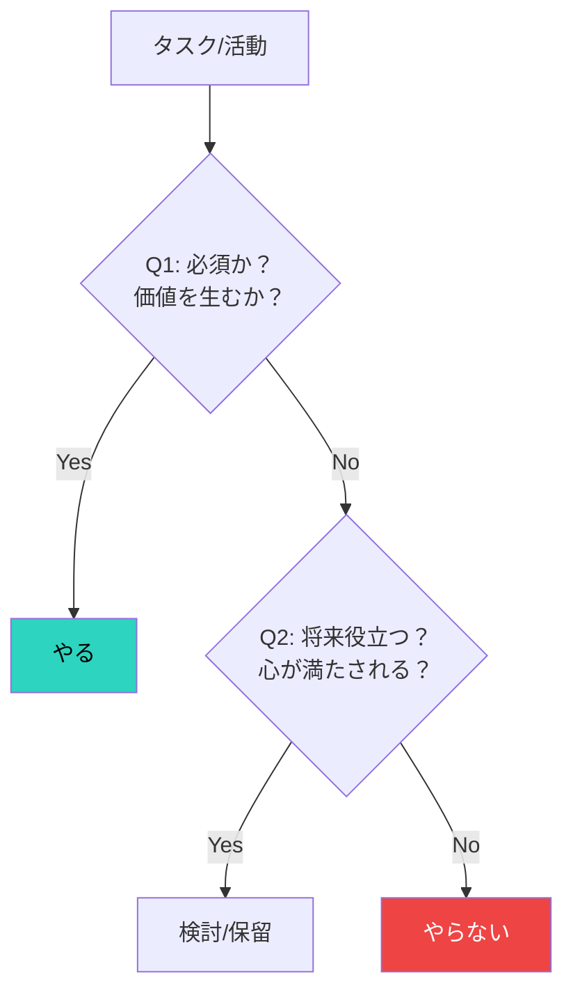

## はじめに

ToDoリストは誰もが知っています。

でも、「やらないことリスト」を持っている人は少ない。

実は、**やらないことを決める**方が、やることを決めるより重要です。

---

## なぜ「やらないこと」が大事か？

### 1. 時間は有限

1日24時間。これは誰にも平等。
やることを増やすには、何かをやめなければなりません。

### 2. 機会費用

Aをやっている時間は、Bをやれない。
「やる」と決めることは、「やらない」と決めることでもあります。

### 3. 集中力の分散を防ぐ

あれもこれもやろうとすると、全てが中途半端に。
やらないことを決めることで、本当に大事なことに集中できます。

---

## やらないことリストの作り方

### タスク仕分けフロー

### Step 1: 時間を奪っているものを書き出す

まず、日常で時間を使っているものを全て書き出します。

- 仕事のタスク
- プライベートの活動
- 習慣
- 人間関係

### Step 2: 分類する

書き出したものを、3つに分類します。

1. **必須**: やらなければならない、価値を生む
2. **検討**: やった方がいいが、優先度は低い
3. **不要**: やらなくていい、時間の無駄

### Step 3: 「不要」を捨てる

「不要」に分類されたものを、やらないことリストに入れます。

### Step 4: 「検討」を吟味する

「検討」の中から、本当に必要なものだけ残す。
残りは「やらないことリスト」へ。

---

## 典型的な「やらないこと」例

### 仕事編

- 意味のない会議に出席する
- 全てのメールに即レスする
- 完璧を目指して時間をかけすぎる
- 自分でやらなくていい仕事を抱え込む

### プライベート編

- ダラダラとSNSを見る
- 興味のない飲み会に参加する
- 義務感だけの付き合いを続ける
- テレビをつけっぱなしにする

### 思考編

- 変えられない過去を悔やむ
- 他人と自分を比較する
- 完璧主義に陥る
- 人の評価を気にしすぎる

---

## 「No」と言う技術

### 1. 即答しない

頼まれたら「確認して連絡します」と一度持ち帰る。
冷静に判断する時間を作る。

### 2. 代替案を出す

「できません」だけでなく、「代わりに〇〇ならできます」と提案。

### 3. 理由を簡潔に

長々と言い訳しない。
「スケジュールの都合で」「他の優先事項があり」で十分。

### 4. 断っても関係は壊れない

断ることで嫌われると思いがちですが、実際はそうでもない。
むしろ、いつもYesの人より信頼されることも。

---

## 私のやらないことリスト

参考までに、私のリストの一部を共有します。

- スマホを寝室に持ち込まない
- 夜10時以降は仕事のメールを見ない
- 興味のないイベントには参加しない
- SNSで他人と比較しない
- 完璧でないと出せないと思わない

---

## 注意点

### 定期的に見直す

状況は変わります。
月に1回、やらないことリストを見直しましょう。

### 「やらない」と「できない」は違う

「やらない」は主体的な選択。
「できない」は受動的な制限。

あくまで「選んでやらない」という意識を持つ。

---

## まとめ

生産性を上げたいなら、やることを増やすのではなく、やらないことを決める。

**「No」と言う勇気が、「Yes」を言える時間を生み出す。**

今日、やらないことリストを一つ作ってみてください。

---

時間の使い方を見直したい方は、セッションでサポートします。
