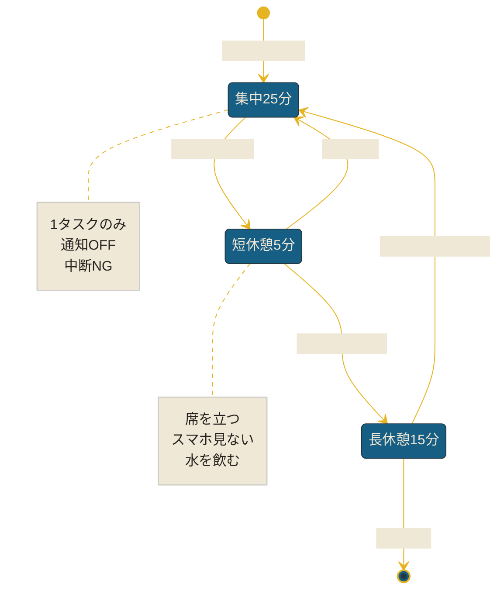

午後3時。画面を見つめたまま、もう20分が経っている。企画書の2ページ目から一文字も進んでいない。

中村さん（29歳・企画職）は、自分の集中力のなさに愕然としていた。朝は調子がいいのに、午後になると頭にモヤがかかったように何も進まない。気づけばSlackを開き、Xを眺め、またSlackに戻る。「自分は集中力がない人間なんだ」と思い始めていた。

ある日、先輩から教えてもらった「ポモドーロ・テクニック」を半信半疑で試してみた。25分だけ集中して、5分休む。たったこれだけのルール。

1週間後、中村さんのデスクには「本日のポモドーロ：8回完了」と書かれた付箋が貼ってあった。以前は1日かけていた企画書が、午前中の4ポモドーロ（約2時間）で完成するようになっていた。

「集中力がなかったんじゃない。集中の"使い方"を知らなかっただけだった」

この記事では、ポモドーロ・テクニックの基本から、科学的に正しい休憩の取り方まで、生産性を劇的に変える方法を解説する。

---

## ポモドーロ・テクニックとは

1980年代、イタリアの大学生フランチェスコ・シリロが、トマト型のキッチンタイマー（pomodoro=イタリア語でトマト）を使って編み出した時間管理術。シンプルだが、脳科学の知見と驚くほど一致している。

### 基本ルール

1. **25分間**、一つのタスクだけに集中する
2. タイマーが鳴ったら**必ず手を止め**、5分間の休憩を取る
3. これを**4回繰り返した**ら、15〜30分の長い休憩を取る

---

## なぜ25分が「魔法の時間」なのか

### 脳の集中力には生物学的な限界がある

認知心理学の研究によると、人間の持続的注意力（sustained attention）は**20〜30分**で大きく低下する。これは意志力の問題ではなく、脳の神経伝達物質の消耗による生理的な現象だ。

25分という設定は、この「集中の限界」のちょうど手前で止めることで、脳を疲弊させずに高い集中力を維持できる絶妙なラインにある。

### 「ちょっとだけ」の心理効果

「2時間勉強しよう」と思うと腰が重い。でも「25分だけやろう」なら始められる。

これは心理学で**「開始コストの低減」**と呼ばれる効果だ。人は「長時間の苦痛」を予期すると行動を先延ばしにするが、「短時間で終わる」と思えば行動を開始しやすい。そして一度始めれば、作業興奮（ツァイガルニク効果）によって「もう少しやりたい」という気持ちが生まれる。

### 締め切り効果

「25分で終わらせる」という小さな締め切りが、パーキンソンの法則（仕事は与えられた時間いっぱいに膨張する）に抗う。制限時間があることで、脳は自然と「今やるべきこと」に焦点を絞る。

---

## 1日のポモドーロ設計図

実際に中村さんが実践している1日のスケジュールを紹介しよう。

```mermaid
%%{init: {'theme': 'base', 'themeVariables': {'primaryColor': '#165E83', 'primaryTextColor': '#fff', 'lineColor': '#E6B422', 'secondaryColor': '#F0E8D6', 'tertiaryColor': '#27221F', 'crit0': '#E6B422', 'done0': '#165E83'}}}%%
gantt
    title 1日のポモドーロスケジュール
    dateFormat HH:mm
    axisFormat %H:%M

    section 午前ゴールデンタイム
    集中1（最重要タスク）     :done, a1, 09:00, 25min
    短休憩                   :crit, b1, 09:25, 5min
    集中2（最重要タスク）     :done, a2, 09:30, 25min
    短休憩                   :crit, b2, 09:55, 5min
    集中3（最重要タスク）     :done, a3, 10:00, 25min
    短休憩                   :crit, b3, 10:25, 5min
    集中4（最重要タスク）     :done, a4, 10:30, 25min
    長休憩                   :crit, lb1, 10:55, 20min

    section 午前セカンド
    集中5（資料作成）         :done, a5, 11:15, 25min
    短休憩                   :crit, b5, 11:40, 5min
    集中6（資料作成）         :done, a6, 11:45, 25min
    昼休憩                   :crit, lunch, 12:10, 50min

    section 午後
    集中7（メール・連絡）     :active, a7, 13:00, 25min
    短休憩                   :crit, b7, 13:25, 5min
    集中8（ミーティング準備）  :active, a8, 13:30, 25min
    短休憩                   :crit, b8, 13:55, 5min
    集中9（クリエイティブ作業）:active, a9, 14:00, 25min
    短休憩                   :crit, b9, 14:25, 5min
    集中10（振り返り・翌日準備）:active, a10, 14:30, 25min
```

**ポイント：** 午前の「ゴールデンタイム」に最重要タスクを集中投入する。脳が最も冴えている時間帯に、最も頭を使う仕事を当てるのが鉄則だ。

---

## 科学的に正しい休憩の取り方

ポモドーロ・テクニックの真の力は、実は**休憩**にある。多くの人が休憩を軽視しているが、休憩の質が次の25分のパフォーマンスを決定的に左右する。

### なぜ休憩がこれほど重要なのか

**脳科学が示す3つの理由：**

1. **注意力の回復** -- 集中は有限の認知資源。休憩で注意力が補充される
2. **記憶の定着** -- 休憩中に脳のデフォルトモードネットワークが活性化し、短期記憶が整理・定着される
3. **身体のリセット** -- 眼精疲労の回復、筋肉の緊張緩和、血流の改善

### 間違った休憩のワースト3

**1. スマホを見る**
「ちょっとXを見るだけ」が最悪の休憩だ。スマホは視覚的注意を消費し続けるため、脳は全く休まない。むしろ「情報の切り替えコスト」が発生し、次の集中に入るハードルが上がる。

**2. 同じ姿勢のまま**
席についたまま「何もしない」のも不十分。座りっぱなしは血行を悪化させ、脳への酸素供給を低下させる。

**3. 長すぎる休憩**
5分の予定が15分になると、フロー状態への再突入が困難になる。「もう少し休みたい」という惰性に流されるのが最大の敵だ。

### 理想的な5分休憩 -- 3つのレベル

#### レベル1：基本（これだけは必ずやる）

- **席を立つ** -- 椅子から離れ、身体を動かす
- **遠くを見る** -- 20-20-20ルール（20分ごとに20秒間、6メートル先を見る）を意識
- **スマホに触らない** -- 通知、SNS、メール、すべて禁止

#### レベル2：推奨（効果をさらに高める）

- **軽いストレッチ** -- 首回し、肩回し、立位前屈（30秒ずつ）
- **水分補給** -- 脳の75%は水分。脱水は集中力を最大25%低下させる
- **深呼吸** -- 4秒吸う → 7秒止める → 8秒吐く（4-7-8呼吸法を2回）

#### レベル3：上級（最大のリフレッシュ効果）

- **短い瞑想** -- 呼吸に意識を向ける1〜2分のマインドフルネス
- **外の空気を吸う** -- 自然光と外気は脳のリセットに効果的
- **軽い社交** -- 同僚との30秒の雑談が気分転換になる

### 長休憩（15〜30分）の過ごし方

4ポモドーロ完了後の長休憩は、回復のための「投資時間」だ。

| 活動 | 効果 | おすすめ度 |
|------|------|-----------|
| 外を散歩する | 血流改善、創造性アップ | ★★★★★ |
| パワーナップ（20分） | 注意力と記憶力の回復 | ★★★★★ |
| 軽食を取る | 血糖値の安定 | ★★★★ |
| 音楽を聴く | リラクゼーション | ★★★ |
| SNSを見る | ほぼ効果なし | ★ |

---

## ケーススタディ：ポモドーロで人生が変わった2人

### ケース1：中村さん（29歳・企画職）-- 「午後のゾンビ」からの脱却

**Before：**
- 午後は集中力が崩壊し、1日の後半はほぼ非生産的
- 企画書1本に丸2日かかる
- 「自分は集中力がない人間」だと思い込んでいた

**中村さんが実践した3つの変更：**
1. 午前中の4ポモドーロで「最重要タスク」を終わらせる
2. 休憩では必ず席を立ち、窓の外を見る
3. 午後は「思考負荷の低いタスク」をポモドーロで回す

**After（1ヶ月後）：**
- 企画書が午前中の4ポモドーロ（2時間）で完成
- 午後の生産性が体感で**2倍**に
- 定時退社が週3回→週5回に
- 「集中力がないんじゃなくて、使い方の問題だった」と実感

### ケース2：渡辺さん（45歳・管理職）-- 休憩の質が仕事の質を変えた

**Before：**
- 管理職として毎日10時間以上勤務
- 休憩は「デスクでスマホを見る」だけ
- 夕方には頭がぼんやりし、重要な判断を翌日に先送りしていた

**渡辺さんの発見：**
ポモドーロを試した当初、25分の集中は問題なくできた。しかし、休憩でスマホを見る習慣を変えられなかった。「5分だけニュースを見るだけ」と思っていたが、次のポモドーロで集中に入るまで5分以上かかることに気づいた。

思い切って休憩中の「スマホ禁止ルール」を設け、代わりにオフィスの廊下を1往復するようにした。

**After（2ヶ月後）：**
- 1日のポモドーロ完了数が6回→10回に増加
- 夕方5時でも頭がクリアで、重要な判断ができるように
- 「休憩を変えただけで、仕事の質がここまで変わるとは思わなかった」
- 部下にもポモドーロを推奨し、チーム全体の生産性が向上

---

## よくある失敗と対処法

### 失敗1：休憩をスキップする

「調子がいいから続けよう」は最も多い失敗。短期的にはうまくいくが、2時間後に一気に疲労が来て、午後の生産性が壊滅する。

**対処法：** タイマーが鳴ったら、文章の途中でも必ず手を止める。むしろ途中で止めることで、再開時にスムーズに没入できる（ツァイガルニク効果）。

### 失敗2：25分が長く感じる

集中の「筋力」が弱い状態では、25分が永遠に感じることがある。

**対処法：** 最初は15分から始めてOK。1週間ごとに5分ずつ延ばし、3週間で25分に到達する。「できた」という成功体験の積み重ねが重要だ。

### 失敗3：タスクが大きすぎる

「企画書を書く」のような大きなタスクは、25分では終わらない不安から集中しにくい。

**対処法：** タスクを「25分で完了できる粒度」に分解する。「企画書を書く」→「企画書のアウトラインを作る」→「第1章のドラフトを書く」→「データを挿入する」。

### 失敗4：中断が入る

同僚からの「ちょっといい？」やSlackの通知で集中が途切れる。

**対処法：** ポモドーロ中は「集中中」のサインを出す。ヘッドフォンをつける、デスクに「集中中：○時まで」のカードを置く。Slackのステータスを「集中中」にする。本当に緊急でなければ、「あと10分で手が空きます」と返答する。

---

## おすすめツール

### アプリ

| アプリ名 | 特徴 | おすすめの人 |
|---------|------|------------|
| **Forest** | 木を育てるゲーム要素で楽しく続けられる | ゲーム好き、習慣化が苦手な人 |
| **Focus To-Do** | タスク管理とポモドーロが一体化 | タスク管理も一緒にしたい人 |
| **Be Focused** | シンプルで使いやすい | 余計な機能が不要な人 |
| **Toggl Track** | 時間記録と分析が充実 | データで振り返りたい人 |

### 物理タイマー

スマホを見たくない人には、キッチンタイマーがおすすめだ。「回す」という物理的な動作が、集中モードへのスイッチになる。スマホのタイマーだと、つい他のアプリを開いてしまうリスクがある。

---

## 応用テクニック

### シチュエーション別の休憩最適化

**目が疲れた時：** 20-20-20ルール（20分ごとに20秒間、6メートル先を見る）に加えて、目を閉じて眼球を上下左右にゆっくり動かす。

**腰が痛い時：** 立位前屈、猫背・反り背のストレッチ、腰回し。次のポモドーロはスタンディングデスクで。

**頭がこんがらがった時：** 冷水で顔を洗う。外の空気を吸う。甘いもの（チョコレート1かけ）で糖分補給。

### ポモドーロ x エネルギー管理

ポモドーロの効果を最大化するには、[エネルギーの波を活用したスケジューリング](/blog/energy-wave-scheduling)と組み合わせるのが効果的だ。

- **高エネルギー帯（午前）：** クリエイティブな仕事を4ポモドーロ
- **中エネルギー帯（午後前半）：** 分析・整理の仕事を3ポモドーロ
- **低エネルギー帯（午後後半）：** ルーティン作業を2ポモドーロ

### 効果測定の方法

1週間ごとに「ポモドーロ完了数」を記録し、生産性の変化を可視化しよう。

**記録項目：**
- 1日のポモドーロ完了数
- 各ポモドーロの集中度（1〜5段階の自己評価）
- 休憩の過ごし方
- 1日の達成感（1〜10段階）

2週間も続ければ、「どの時間帯にどんな休憩を取ると、次の集中がうまくいくか」というパターンが見えてくる。判断の質を高める方法は[決断疲れの正体と対処法](/blog/decision-fatigue)も参考になるだろう。

---

## まとめ：25分が人生を変える

「時間がない」は幻想だ。問題は、集中力の「使い方」にある。

25分の集中と5分の正しい休憩。このシンプルなリズムを取り入れるだけで、生産性は劇的に変わる。

**今日から始める3ステップ：**

1. **今すぐ：** スマホのタイマーを25分にセットし、目の前の1つのタスクに取り組む
2. **今週中：** 5分休憩で「席を立つ、遠くを見る、スマホを見ない」の3つを徹底する
3. **来週から：** 1日のポモドーロ完了数を記録し、自分の最適パターンを探す

最初の1ポモドーロで、あなたの「時間がない」という思い込みは変わり始める。

---

## 集中力と時間管理のサポートが必要ですか？

ポモドーロ・テクニックの導入から、1日の時間設計まで。**体験セッション（無料）**では、あなたの働き方に合った生産性向上プランを一緒に考えます。

[→ 体験セッションの詳細を見る](/sessions)
