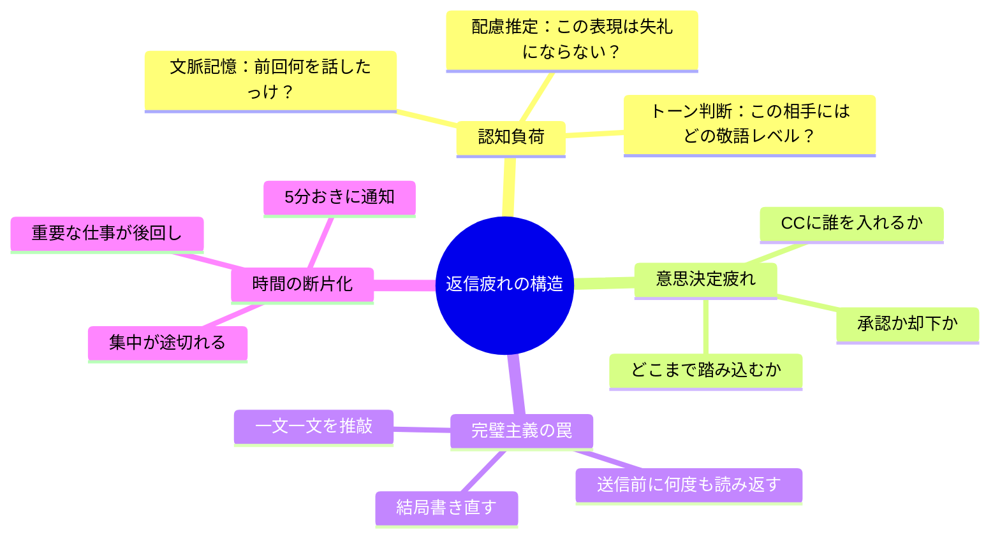
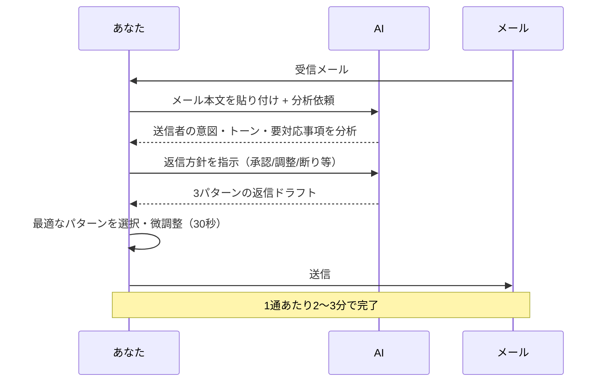
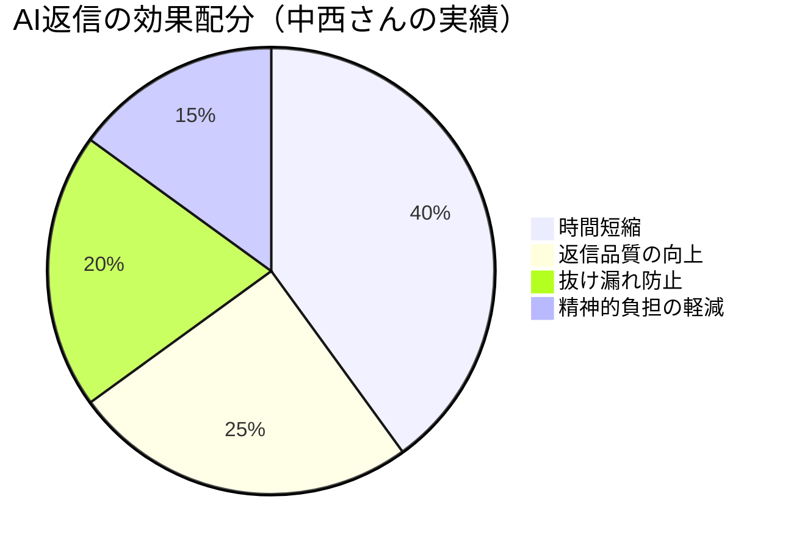

中西さん（33歳・営業マネージャー）は、月曜の朝、受信トレイを開いて固まった。未読67件。そのうち「要返信」のフラグが立っているのが23件。「この返信だけで午前中が終わる......」。丁寧に書こうとすると1通15分。雑に書くと誤解を生む。結局、午前中いっぱいかけてメールを処理し、本来やるべき商談準備は午後に後回し。こんな月曜日が、もう半年続いていた。

**メール返信は、現代のビジネスパーソンが最も時間を浪費している作業の一つ**だ。McKinsey Global Instituteの調査では、平均的なビジネスパーソンは業務時間の28%をメール処理に費やしている。しかしAIを活用すれば、この時間を劇的に削減できる。中西さんが月曜のメール処理を「2時間半から45分」に短縮した方法を、具体的なプロンプト付きで解説する。

## 返信メール作成が疲れる本当の理由



返信が疲れるのは「文章を書く作業」が大変なのではない。**1通ごとに「判断」と「配慮」を求められる認知負荷**が問題なのだ。特に日本のビジネスメールは、敬語のレベル、季節の挨拶、相手との関係性など、考慮すべき変数が多い。

これは[決断疲れ](/blog/decision-fatigue)と同じメカニズム。小さな判断が積み重なって、脳のリソースを消耗する。AIにこの「判断の下書き」を任せることで、人間は最終チェックだけに集中できるようになる。

## AI返信ワークフロー：3ステップで返信を秒速作成



### Step 1：受信メールの分析を依頼する

まず、受信メールをAIに分析させる。ここで重要なのは**「何を分析してほしいか」を明確にする**こと。

**分析プロンプト：**

```
以下の受信メールを分析してください。

【分析項目】
1. 送信者の意図・目的（何を求めているか）
2. 求められている対応（回答/承認/調整/情報提供/お礼のみ）
3. 緊急度（今日中/今週中/急ぎではない）
4. 相手のトーン（フォーマル度合い、感情の温度感）
5. 返信に含めるべきポイント（箇条書き）
6. 注意すべき点（敏感な話題、配慮が必要な箇所）

【受信メール】
（ここにメール本文を貼り付け）
```

中西さんはこの分析ステップで「返信に含めるべきポイント」を確認することで、**返信の抜け漏れが激減**したと言う。「以前は返信した後に『あ、あれも書くべきだった』と追加メールを送ることが週に3回はあった。今はゼロです」。

### Step 2：返信ドラフトを3パターン生成

分析結果を確認したら、返信方針を決めてドラフトを依頼する。

**返信生成プロンプト：**

```
上記の分析に基づき、返信メールのドラフトを3パターン作成してください。

【パターン1：丁寧・標準的】
- 適切なビジネス敬語
- 必要な情報を網羅
- 丁寧だが簡潔

【パターン2：友好的・関係構築】
- 少し親しみやすいトーン
- 相手を気遣う一文を含む
- プロフェッショナルさは維持

【パターン3：超簡潔】
- 3行以内
- 要点のみ
- 忙しい相手向け

【私の返信方針】
（例：提案を受け入れる。ただし納期は1週間延長を依頼したい）

【制約】
- 「です/ます」調
- 200字以内
- 次のアクションを明記
```

### Step 3：選択・微調整・送信

3パターンの中から最も適切なものを選び、以下だけチェックして送信。

**最終チェックリスト（30秒）：**
- [ ] 固有名詞（人名、社名、日付）は正しいか
- [ ] 機密情報が含まれていないか
- [ ] 自分の言葉として違和感がないか
- [ ] 次のアクションが明確か

「パターン2の2段落目だけパターン1に差し替え」のような組み合わせもよく使う。慣れると、**1通あたり2〜3分**で質の高い返信が完成する。

## 状況別プロンプト集：コピペですぐ使える

### プロンプト1：承認依頼への返信

```
承認依頼のメールに対し、以下で返信を作成してください。

【判断】承認 / 条件付き承認 / 要検討（選択）
【条件・理由】（条件付き・要検討の場合）
【次のステップ】
【トーン】丁寧 / 友好的 / 簡潔（選択）

【受信メール】
（貼り付け）
```

### プロンプト2：日程調整

```
日程調整の返信を作成してください。

【候補日時】（3つ提示）
【場所】オンライン / 対面（場所名）
【所要時間】
【議題】（簡潔に）
【事前準備の依頼】（あれば）

【受信メール】
（貼り付け）
```

### プロンプト3：お詫び・苦情対応

```
苦情/問題報告への返信を作成してください。

【事実関係】（確認済みの事実）
【お詫びのレベル】全面謝罪 / 部分的謝罪 / 遺憾表明
【対応策】（具体的に）
【再発防止策】（あれば）
【フォローアップの約束】

【受信メール】
（貼り付け）
```

### プロンプト4：断りのメール

```
依頼を断る返信を作成してください。

【断る理由】（相手を責めない表現で）
【代替案】（可能であれば）
【関係性維持】（今後の協力姿勢を示す）
【トーン】丁寧かつ明確、曖昧さを残さない

【受信メール】
（貼り付け）
```

### プロンプト5：催促メール

```
未返信の相手への催促メールを作成してください。

【催促の背景】（何を待っているか）
【期限】（希望する返信期限）
【トーン】プレッシャーをかけすぎず、でも明確に
【相手への配慮】（忙しいことへの理解を示す）

【前回送ったメール】
（貼り付け）
```

## ケーススタディ：AI返信で仕事が変わった3人

### Case 1：中西さん（33歳・営業マネージャー）── メール処理2時間半→45分

冒頭の中西さんは、3ステップ法を導入した初日から効果を実感した。

「最初は半信半疑でした。でも、1通目の分析結果を見て驚いた。『このメールは承認を求めているが、裏には予算への不安がある』とAIが指摘してくれた。自分では気づかなかったポイントです」

導入前後の変化：

| 項目 | 導入前 | 導入後 |
|---|---|---|
| 月曜朝のメール処理時間 | 2時間30分 | 45分 |
| 1通あたりの返信時間 | 12〜15分 | 2〜3分 |
| 返信の抜け漏れ | 週3回 | ほぼゼロ |
| 追加メール（言い忘れ） | 週5通 | 週1通以下 |

「浮いた時間で商談準備に集中できるようになった。営業成績も上がって、上司に『最近レスポンス早くなったね』と言われました」

### Case 2：山口さん（27歳・カスタマーサクセス）── 苦情対応の品質が安定

山口さんはカスタマーサクセス担当で、1日に受けるクレームメールが平均5通。精神的な負担が大きかった。

「怒っているお客様のメールを読むと、こっちも感情が動いて冷静に書けなくなる。defensive（防御的）なトーンになってしまって、さらに炎上させたこともありました」

AIを介在させることで、**感情のバッファ**が生まれた。

「まずAIに分析させることで、1クッション置ける。『お客様の本当の不満は納期ではなく、事前説明の不足にある』と指摘されると、冷静に対処できる。お詫びメールの品質も安定しました」

クレーム対応後の顧客満足度スコアが、導入前の3.2から4.1（5点満点）に改善。エスカレーション率も40%減少した。

### Case 3：松田さん（45歳・部長）── 英語メールのハードルが消えた

松田さんは海外拠点とのやり取りが増え、英語メールに苦戦していた。

「1通書くのに30分。翻訳ツールを使っても、ビジネス英語のニュアンスが合っているか不安で、何度も書き直していました」

AIに日本語で返信方針を伝え、英語のドラフトを生成する方法に切り替えたところ、**英語メール1通あたりの所要時間が30分から5分に短縮**。

「日本語で『この件はOK、ただし来週の会議で詳細を詰めたい、カジュアルなトーンで』と指示するだけ。出てくる英文のクオリティが、自分で書くより明らかに高い」

## AI返信を運用するときの注意点

### 絶対に守るべき3つのルール

**ルール1：機密情報をAIに渡さない**
顧客の個人情報、未公開の経営数字、契約の詳細などは、プロンプトに含めない。社名や固有名詞を伏せて依頼し、後から自分で書き足す。

**ルール2：最終チェックは必ず人間が行う**
AIは文脈を誤解することがある。特に皮肉、暗黙の了解、社内の人間関係など、テキストに表れない情報は把握できない。

**ルール3：「自分の言葉」を失わない**
AI任せにしすぎると、全てのメールが同じトーンになり、「この人のメール、急に人間味がなくなった」と思われるリスクがある。時々は完全に自分の言葉で書く。特に重要な相手へのメールや、お祝い・お悔やみなどの感情を込めるべきメールは、AIを使わない方がいい。

### 継続的な改善サイクル



効果を最大化するには、週1回の振り返りが有効だ。

1. **今週AIが生成した返信で、特に良かったものを保存**
2. **自分で修正した箇所を確認**（AIの弱点パターンが見える）
3. **よく使うプロンプトをブラッシュアップ**
4. **新しい状況のプロンプトを追加**

この改善サイクルを回すことで、AIの出力精度は週を追うごとに上がっていく。[ポモドーロ・テクニック](/blog/pomodoro-technique)の1セッションで振り返りをやるのがおすすめだ。

## 今日からできるアクション

**今日（10分）：**
1. この記事の「分析プロンプト」をコピーする
2. 受信トレイから返信すべきメールを1通選ぶ
3. AIに分析 → ドラフト生成 → 微調整 → 送信を1回やってみる

**今週（30分）：**
- 状況別プロンプト集から、自分がよく使うパターン3つをカスタマイズ
- 1日3通をAIアシストで返信する習慣を始める

**2週間後：**
- 返信にかかる時間を計測して、導入前と比較する
- [ディープワークの時間](/blog/deep-work)が増えたか確認する

メール返信は「仕事の本質」ではない。AIに任せられることは任せて、あなたにしかできない仕事に時間を使おう。

---

## メール返信の効率化、一緒に設計しませんか？

「自分の業務に合ったプロンプトを作りたい」「チームにAI活用を広げたい」──そんな方は、セッションであなたの具体的なメールパターンを分析し、最適なワークフローを一緒に設計しましょう。

[セッションの詳細を見る](/sessions)
