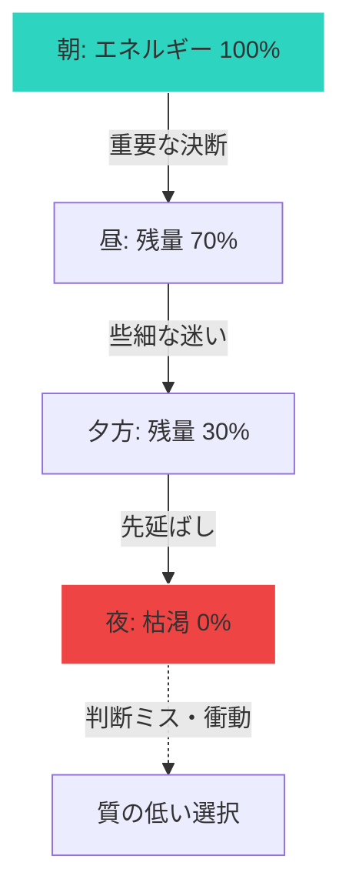

## 決断疲れとは

朝起きてから「今日は何を着ようか」「朝食は何を食べようか」と決断を繰り返す。
1日に人間が下す決断の数は、なんと35,000回とも言われています。

そして、決断には精神的なエネルギーを消費します。
決断を繰り返すほど、判断力が低下していく現象を「決断疲れ」と呼びます。

## 決断疲れの影響

### 1. 判断の質が低下する

疲れると、短絡的な選択をしやすくなる。
「もういいや」と投げやりに決めてしまう。

### 2. 先延ばしが増える

決断すること自体を避けるようになる。
「後で考えよう」が増える。

### 3. 衝動的になる

自制心が弱まり、衝動買いや暴飲暴食をしやすくなる。

## 決断疲れとは？

私たちは1日に35,000回もの決断をしていると言われています。夕方になるとパフォーマンスが落ちるのは当然です。

## 決断疲れのメカニズム

## 対策：決断を減らす

スティーブ・ジョブズが同じ服を着ていたのは有名ですが、これは「服を選ぶ」という決断を節約するためです。
通勤ルートを決める。

小さな決断を減らすことで、重要な決断に力を残せます。

### 2. 重要な決断は午前中に

判断力は朝が最も高い。
大きな決断、創造的な仕事は午前中に。

### 3. 選択肢を減らす

服の数を減らす。
メニューの少ないレストランを選ぶ。
選択肢が多いほど、決断エネルギーを消費します。

### 4. 事前に決めておく

「もし〜なら、〇〇する」というルールを作っておく。
その場で考えなくて済みます。

### 5. 休憩を取る

決断が続くときは、意識的に休憩する。
軽い運動や仮眠で回復します。

## 重要なことにエネルギーを使う

すべての決断が同じ重要度ではありません。

些細なことで悩む時間とエネルギーを減らし、本当に重要な決断に集中しましょう。

明日から、一つだけルーティン化してみてください。
その分のエネルギーを、大切なことに使えるはずです。
