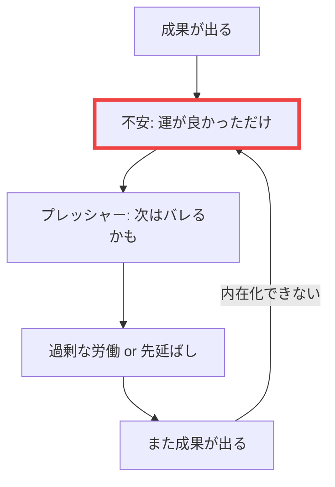

## 成功しても、なぜか不安

昇進した。プロジェクトを成功させた。クライアントから感謝された。

それなのに、心のどこかで「いつかバレるんじゃないか」という不安が消えない。
「たまたま運が良かっただけ」「周りが優秀なおかげ」「本当の自分はこんなもんじゃない」

これは、あなたの謙虚さではありません。
**インポスター症候群（詐欺師症候群）**という心理現象です。

## インポスター症候群とは

1978年に心理学者ポーリン・クランスとスザンヌ・アイムスによって提唱された概念。
自分の成功を内面的に認められず、「自分は周囲を騙している詐欺師だ」と感じる状態を指します。

驚くべきことに、この症状は成功者ほど多く見られます。
ハーバード大学の学生の70%以上が、入学後にこの感覚を経験したという調査結果もあります。

## なぜ起こるのか

### インポスターの悪循環

### 1. 高い基準を持っている

完璧主義者ほどインポスター症候群に陥りやすい。
「100点でなければ0点」という思考が、自己評価を歪めます。

### 2. 成功の内在化ができていない

外部の評価（昇進、年収、肩書き）は受け入れられても、
それを「自分の能力の結果」として内在化できない。

### 3. 比較の罠

SNSでは他人の「ハイライト」だけが見える。
自分の「舞台裏」と他人の「本番」を比較してしまう。

## 克服のための3つのステップ

### Step 1: 証拠を記録する

「成功したこと」「感謝されたこと」「達成したこと」を日記につける。
感情ではなく、事実を記録することが重要です。

毎日1つでいい。
積み重ねることで、客観的な「自分の価値の証拠」が蓄積されます。

### Step 2: 「十分」を定義する

「完璧」ではなく「十分」を目指す。

- 100%ではなく80%で提出する
- 全員の期待ではなく、主要な関係者の期待に応える
- すべてを知っているのではなく、学ぶ姿勢を持つ

### Step 3: 感情と事実を分離する

「自分はダメだと感じる」と「自分はダメである」は違います。

感情は事実ではない。
感情はただの信号であり、必ずしも現実を反映していません。

## 誰もが初心者だった

あなたが尊敬するあの人も、最初は何も知らなかった。
「自分はまだ足りない」と感じるのは、成長している証拠でもあります。

問題は、その感覚に**支配される**か、**活用する**かです。

足りないから努力する。知らないから学ぶ。
インポスター症候群は、うまく付き合えば成長のエンジンになります。

まずは今日、一つだけ「自分ができたこと」を書き出してみてください。
それが、自己肯定感を取り戻す最初の一歩です。
