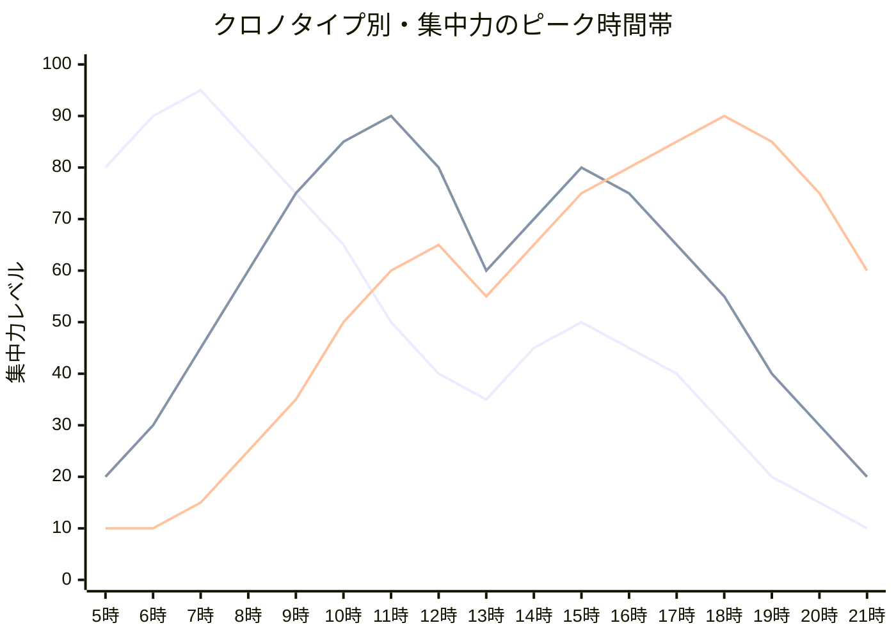
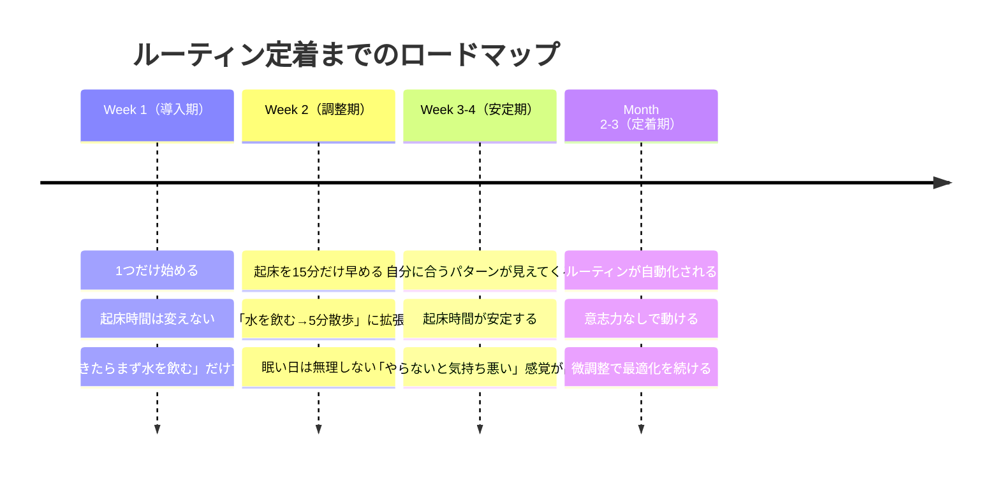

川島さん（30歳・Webディレクター）は、4月に「5時起き生活」を始めた。成功者の本に書いてあったからだ。初日は高揚感で乗り切った。2日目は眠気と戦いながらジョギングした。3日目の朝、アラームを止めた記憶すらなく、気づけば8時。4日目は「明日からやろう」と自分に言い聞かせた。5日目に本棚の「早起き本」をそっと裏返した。

川島さんの失敗は「意志が弱いから」ではない。**そもそも自分の体質に合わないルーティンを選んでしまった**からだ。朝の過ごし方には「正解のテンプレート」はない。あるのは「あなたの体と脳に合った設計」だけだ。

## 「5時起きが最強」は本当か？── クロノタイプという科学

睡眠研究者マイケル・ブレウスが提唱する「クロノタイプ」によると、人の体内時計は大きく3タイプに分かれる（正確には4タイプだが、ここでは主要な3つで解説する）。

**朝型（ライオン型）**：人口の約15〜20%。早朝に覚醒度が高く、午前中にピークパフォーマンスを発揮。夜は早く眠くなる。

**中間型（クマ型）**：人口の約50%で最も多い。太陽のリズムに沿って活動するタイプ。午前10時〜午後2時が最も集中できる。

**夜型（オオカミ型）**：人口の約15〜20%。午後から夜にかけてエンジンがかかる。無理な早起きはパフォーマンスを下げる。

川島さんが5時起きに失敗したのは当然だった。**彼は典型的なクマ型で、最適な起床時間は7時前後**だったのだ。5時に起きると、本来の覚醒ピークの3時間前に脳を叩き起こすことになり、午前中にパフォーマンスが出ないまま消耗するだけだった。

## タイプ別・最適なモーニングルーティン設計

### 朝型（ライオン型）のルーティン

早朝に覚醒度が高い人は、この時間帯を「最重要タスク」に充てるのが最適解。

**推奨ルーティン：**
- 5:00〜5:10 起床、水を1杯飲む
- 5:10〜5:20 軽いストレッチ or 散歩
- 5:20〜7:00 [ディープワーク](/blog/deep-work)（最も頭を使うタスク）
- 7:00〜7:30 朝食、身支度
- 7:30〜 通常業務へ

**ポイント**：せっかくの覚醒ピークをメールチェックやSNSに使わない。朝の100分を「最重要タスク専用時間」として死守する。

### 中間型（クマ型）のルーティン

最も多いタイプ。無理な早起きは不要だが、起きてからの「助走」が重要。

**推奨ルーティン：**
- 6:30〜6:40 起床、カーテンを開けて日光を浴びる
- 6:40〜6:50 白湯を飲みながら、今日の最重要タスク1つを決める
- 6:50〜7:10 軽い運動（ヨガ、散歩など）
- 7:10〜7:30 朝食
- 7:30〜8:00 身支度、通勤
- 9:00〜 覚醒ピークに入る（ここからディープワーク開始）

**ポイント**：起きてすぐには集中力が出ないタイプなので、「起動プロセス」をルーティン化する。特に**日光を浴びること**がセロトニン分泌のトリガーになり、覚醒を早める。

### 夜型（オオカミ型）のルーティン

無理に朝型になろうとしないこと。朝は「最低限の準備」に留め、エンジンがかかる時間帯に勝負する。

**推奨ルーティン：**
- 7:30〜7:40 起床、目覚ましにシャワー
- 7:40〜8:00 朝食（しっかり食べてエネルギー補給）
- 8:00〜8:30 身支度、通勤
- 午前中 ルーティンワーク（メール返信、事務作業など）
- 午後〜夜 ディープワーク（本領発揮の時間帯）

**ポイント**：朝に無理をしない代わりに、[午後の集中時間を確保する仕組み](/blog/pomodoro-technique)を作ることが最重要。

## ケーススタディ：ルーティンを変えたら何が変わった？

### Case 1：川島さん（30歳・Webディレクター）── 5時起き→7時起きで生産性が上がった

冒頭の川島さんは、自分がクマ型だと気づき、ルーティンを再設計した。

「5時起きで自己啓発の本を読んでいたけど、眠くて内容が頭に入らなかった。7時起きに変えて、朝は『今日やる最重要タスク1つを決める』だけにした」

変えたのは起床時間だけではない。**朝の使い方の設計思想を変えた**。

**Before（5時起き時代）：**
- 5:00 起床 → 眠い
- 5:15 ジョギング → つらい
- 6:00 読書 → 内容が入らない
- 7:00 朝食 → ようやく目が覚める
- 9:00 始業 → もう疲れている

**After（7時起き・設計後）：**
- 7:00 起床 → カーテンを開けて日光
- 7:10 白湯 + 今日の最重要タスクを紙に書く（5分）
- 7:15 10分間の散歩
- 7:30 朝食
- 8:00 出社
- 9:00 覚醒ピークで最重要タスクに着手

「午前中の集中力が全然違う。以前は10時まで"暖機運転"だったのが、9時からフルスロットルで動けるようになりました。結果、退社時間が1時間早くなった」

### Case 2：岡田さん（26歳・デザイナー）── 朝の「選択」を減らして創造性が上がった

岡田さんは朝が弱いわけではなかったが、朝の準備で消耗していた。

「朝起きてから『何を着るか』『何を食べるか』『どの電車に乗るか』を毎回考えていた。決めることが多すぎて、会社に着く頃にはもう疲れている」

これはまさに[決断疲れ](/blog/decision-fatigue)の典型だ。岡田さんは「朝の選択をゼロにする」をテーマにルーティンを設計した。

**仕組み化した項目：**
- 服：平日5パターンを曜日で固定
- 朝食：月〜金で固定メニュー（月水金=オートミール、火木=トースト+ゆで卵）
- 出発時間：毎日7:45で固定
- 朝のルーティン：起床→シャワー→着替え→朝食→出発（この順番を絶対に変えない）

「朝に判断を1つもしない。脳のリソースを全て仕事に回せる。デザインのアイデア出しの質が明らかに上がりました」

### Case 3：高木さん（38歳・営業部長）── 家族のために「自分の朝」を作った

高木さんは2児の父。朝は子どもの準備で手一杯だった。

「6時に起きても、子どもを起こして着替えさせて朝食を食べさせて保育園の準備をして......自分の時間はゼロ。朝活なんて夢のまた夢」

高木さんが試したのは、**「子どもが起きる30分前」だけを自分の時間にする**方法。

- 5:30 起床（子どもは6:00に起きる）
- 5:30〜5:40 コーヒーを入れて、窓辺で飲む
- 5:40〜5:55 ジャーナリング（今日の目標と感謝を3つ書く）
- 5:55〜6:00 深呼吸3回
- 6:00〜 子どもたちの朝がスタート

「たった30分だけど、自分で選んだ時間がある。それだけで一日の心の余裕が全然違います。子どもにイライラしなくなったのが一番の変化」

## モーニングルーティンを「習慣化」する科学的アプローチ

### 原則1：最初は「1つだけ」始める

最大の失敗パターンは、初日から「5時起き→ジョギング→瞑想→読書→ジャーナリング」とフルセットで始めること。**最初の1週間は「起きたら水を1杯飲む」だけでいい**。

### 原則2：前夜の準備が9割

気合で起きるのではなく、**起きやすい環境を作る**。

- 寝る時間を固定する（起きる時間ではなく寝る時間が先）
- 寝る前にスマホを触らない（ブルーライトが入眠を遅らせる）
- 翌日の服と持ち物を準備しておく
- カーテンを少し開けておく（朝日で自然に目覚める）

### 原則3：「完璧な週5」より「ゆるい週3」

週5回完璧にやろうとして挫折するより、週3回ゆるく続ける方が長期的な効果は高い。**やれなかった日を責めないこと**。「また明日」で十分だ。

### 原則4：ご褒美を仕組みに組み込む

ルーティン完了後に小さな楽しみを設定する。

- お気に入りのコーヒーを飲む
- 好きな音楽を1曲聴く
- 5分だけ好きなYouTubeを見る

脳が「朝のルーティン＝快感」と紐づけると、意志力なしで動けるようになる。

## 朝起きられない人のための「環境設計」

それでも朝がつらい人へ。意志力ではなく、**環境を変える**ことで解決しよう。

| 対策 | 具体的な方法 | 効果 |
|---|---|---|
| 光の活用 | 起床時刻にスマートライトが自動点灯 | 体内時計がリセットされる |
| アラーム配置 | スマホをベッドから3m離れた場所に置く | 物理的に起き上がる必要がある |
| 温度管理 | 起床30分前にエアコンが起動するよう設定 | 布団から出るハードルが下がる |
| 就寝時間固定 | 毎日同じ時刻にベッドに入る | 入眠が自然になり、朝の目覚めが改善 |
| 楽しみの先出し | 朝に「好きなこと」を置く | 起きるモチベーションになる |

「朝起きられない」は性格の問題ではなく、環境設計の問題だ。仕組みで解決しよう。

## 今日からできるアクション

**ステップ1（今日・5分）：**
自分のクロノタイプを推測する。以下の質問に答えてみてほしい。
- 休日、アラームなしで何時に目が覚める？ → 6時前なら朝型、7〜8時なら中間型、9時以降なら夜型
- 最も集中できるのは何時頃？
- 夜10時に眠くなる？ → Yesなら朝型の傾向

**ステップ2（明日の朝・1分）：**
起きたら水を1杯飲む。それだけ。他は何もしなくていい。

**ステップ3（今週末・15分）：**
この記事のタイプ別ルーティンを参考に、[自分の仮説](/blog/first-principles-thinking)として1週間のルーティンを紙に書き出す。

大事なのは「正しいルーティン」を見つけることではなく、**自分に合うルーティンを実験しながら見つけていくこと**。正解は本の中ではなく、あなたの体の中にある。

---

## あなたに合ったルーティン、一緒に設計しませんか？

「自分のタイプがわからない」「何度も挫折していて自信がない」──そんな方は、セッションで一緒にルーティンを設計しましょう。あなたの生活パターン、仕事のスタイル、性格に合わせた「続けられる朝習慣」を見つけるお手伝いをします。

[セッションの詳細を見る](/sessions)
