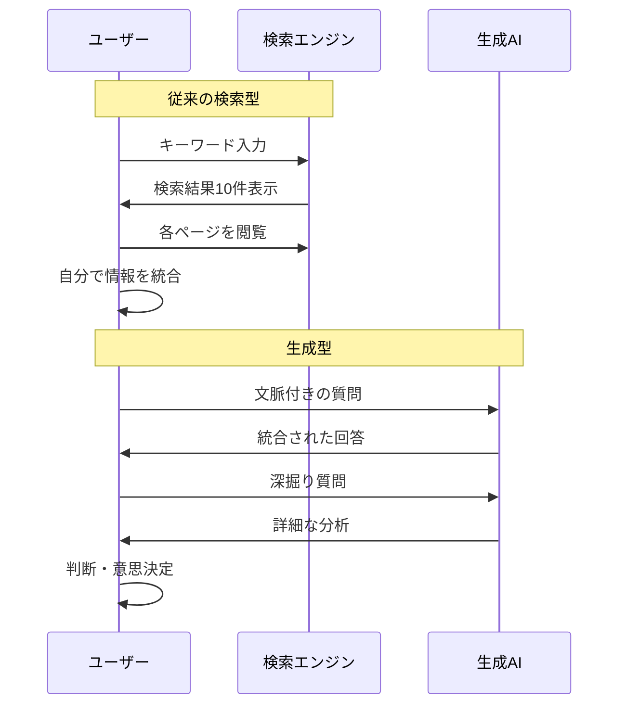
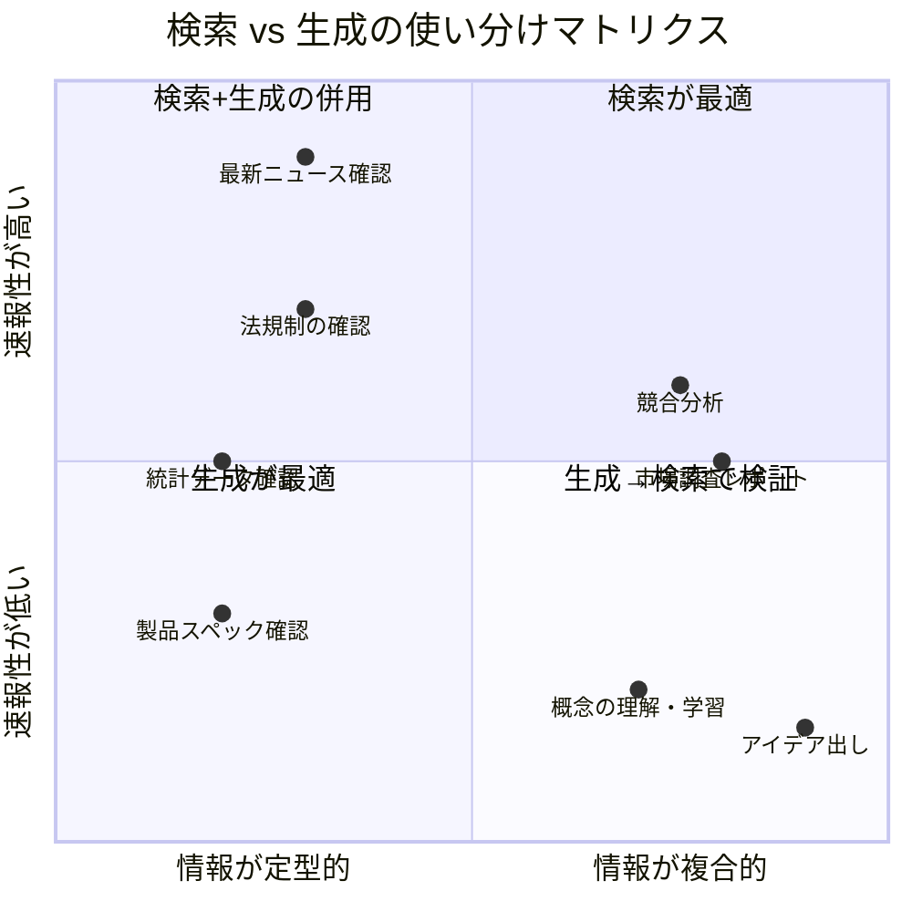

佐藤さん（32歳・法人営業）は、毎週月曜日の朝が憂鬱だった。翌日の提案に向けて、競合分析・市場動向・顧客業界のトレンドを調べなければならない。Google検索で20個以上のタブを開き、情報をExcelに整理し、上司に提出できるレベルにまとめる。気づけば3時間が過ぎている。「調べるだけで午前中が終わる。提案書を書く時間がない...」。ある日、同期の田中さんから「AIに聞けば30分で終わるよ」と言われた。半信半疑で試したその結果は、佐藤さんの働き方を根本から変えることになった。

## 検索と生成 ── 2つのパラダイムを理解する

「ググる」と「AIに聞く」は、根本的に違う思考プロセスです。

**検索型**は、キーワードを入力し、複数のページを巡回し、自分の頭で情報を統合する。いわば「図書館で本を探す」行為です。

**生成型**は、質問を投げかけ、AIが複数の情報源を統合した回答を返す。いわば「専門家に相談する」行為です。



重要なのは、どちらかが優れているのではなく、**場面によって使い分ける**こと。次のフレームワークで判断できます。



## ケーススタディ1：営業の佐藤さん ── 提案準備が3時間から30分へ

冒頭の佐藤さんは、こう変えた。

**Before（従来の検索型）：**
- 競合企業のHPを5社分巡回（40分）
- 業界ニュースサイトを3つチェック（30分）
- 市場調査レポートの無料部分を読む（40分）
- Excelに情報を整理（30分）
- 上司向けにサマリー作成（40分）
- **合計：約3時間**

**After（ハイブリッド型）：**
1. AIに「○○業界の直近3ヶ月のトレンドを、市場規模・競合動向・技術革新の3軸で整理して」と依頼（5分）
2. AIの回答を読み、気になるデータポイントを検索で原典確認（10分）
3. AIに「この情報を踏まえて、A社への提案に使える切り口を3つ挙げて」と依頼（5分）
4. 上司向けサマリーをAIで下書き → 自分で編集（10分）
- **合計：約30分**

「最初は『本当にこれで大丈夫か？』と不安でした」と佐藤さんは振り返る。「でも上司に見せたら『情報の網羅性が上がったね』と言われた。自分で探していた頃は、見つけた情報だけで満足していたんです。AIは自分が思いつかない切り口も提示してくれる」

## 4段階の移行フレームワーク

検索型から生成型への移行は、一気にではなく段階的に進めるのが成功の鍵です。

```mermaid
journey
    title 検索→生成への移行ジャーニー
    section Stage 1: 試してみる
      AIに簡単な質問をする: 3: ユーザー
      検索結果と比較する: 4: ユーザー
    section Stage 2: 使い分ける
      場面別に使い分ける: 5: ユーザー
      プロンプトを工夫する: 4: ユーザー
    section Stage 3: 組み合わせる
      ハイブリッドワークフロー: 5: ユーザー
      検証ルーチンを確立: 5: ユーザー
    section Stage 4: 再設計する
      業務プロセス全体を最適化: 5: ユーザー
      チームに展開する: 4: ユーザー
```

### Stage 1：まず試してみる

いきなり全面移行する必要はありません。まずは「いつもの検索」を1日1回、AIへの質問に置き換えてみてください。

**実践のコツ：**
- 同じテーマを検索とAIの両方で調べ、結果を比較する
- AIの回答で「これは便利だ」と思った点をメモする
- 逆に「これは検索の方がいい」と思った点もメモする

### Stage 2：場面で使い分ける

検索が向いている場面と、生成が向いている場面を体感で覚えます。

**検索が有効な場面：**
- 最新の一次情報が必要なとき（速報ニュース、公式発表）
- 具体的な数値・日付を確認するとき
- 法規制やガイドラインの原文を読みたいとき

**生成が有効な場面：**
- 複数の情報を統合して概要を把握したいとき
- アイデアの壁打ちやブレインストーミング
- 自分の知らない分野の全体像をつかみたいとき

この使い分けの感覚は、[AIブレインストーミング](/blog/ai-brainstorming)の記事でも詳しく解説しています。

### Stage 3：ハイブリッドワークフローを確立する

検索と生成を組み合わせた「ハイブリッド型」が最も強力です。

**ハイブリッドの基本パターン：**

1. **生成 → 検索（全体像→検証）**：AIで概要を把握し、重要な事実を検索で裏取り
2. **検索 → 生成（素材→統合）**：検索で集めた素材をAIに投入して分析・統合
3. **生成 → 検索 → 生成（対話→検証→深化）**：AIの回答を検索で検証し、その結果を踏まえてさらにAIと対話

### Stage 4：業務プロセスを再設計する

個人の情報収集だけでなく、チームの業務プロセス全体を最適化するフェーズです。

## ケーススタディ2：人事の渡辺さん ── 採用市場調査を変革

渡辺さん（28歳・人事部）は、毎月の採用市場レポートに苦しんでいた。

「求人サイト5つを巡回して、競合の募集要項を30社分チェックして、給与相場と求人倍率をまとめる。丸一日かかっていました」

渡辺さんが確立したハイブリッドワークフロー：

1. **AIに依頼**：「ITエンジニアの採用市場について、給与トレンド・求人倍率・候補者の志向変化を分析して」
2. **検索で検証**：AIが提示した数値を、厚労省や転職サイトの公式データで確認
3. **AIで深掘り**：「当社の条件（年収○○万円、リモート可）で、競合と比較した場合の訴求ポイントは？」
4. **レポート作成**：AIに下書きを依頼し、自分の考察を加えて仕上げ

**結果：**
- レポート作成時間：8時間 → 2時間（75%削減）
- 情報の網羅性：自己評価で40%向上
- 上司からのフィードバック：「分析の視点が広がった」

## プロンプト設計 ── 「問いの力」が成果を決める

検索では「キーワード選び」がスキルでしたが、生成では「問いの設計」がスキルになります。これは[AI時代の「問う力」](/blog/ai-era-question-power)で解説している概念と直結します。

**悪い質問の例：**
「マーケティングについて教えてください」
→ 広すぎて、一般論しか返ってこない

**良い質問の例：**
「私はBtoB SaaS企業のマーケティング担当です。月間リード獲得数を現在の50件から100件に増やしたいのですが、予算は月50万円で、チームは3人です。コンテンツマーケティングとリスティング広告のどちらに注力すべきか、それぞれのメリット・デメリットと推奨を教えてください」
→ 文脈・制約・出力形式が明確で、実用的な回答が返る

**プロンプト設計の3原則：**

1. **文脈を伝える** ── 自分の立場、業界、背景を明示する
2. **制約を設定する** ── 予算、期間、人数など現実の条件を入れる
3. **出力形式を指定する** ── 箇条書き、比較表、ステップなど望む形を伝える

より詳しいプロンプトの書き方は[プロンプトエンジニアリング入門](/blog/ai-prompt-engineering)を参照してください。

## ケーススタディ3：フリーランスの木村さん ── 情報リテラシーの壁を越えて

木村さん（35歳・フリーランスライター）は、AIを使い始めて最初の1ヶ月で「幻覚」に3回引っかかった。

「AIが提示した統計データをそのまま記事に使ったら、クライアントから『この数字の出典は？』と聞かれて答えられなかった。存在しないレポートの名前まで書いてあったんです」

この経験から、木村さんは**検証ルーチン**を確立した。

**木村さんの検証チェックリスト：**
- 固有名詞（企業名、レポート名、人名）は必ず検索で確認
- 統計データは一次情報源まで遡る
- 「○○によると」という引用は、原文を実際に読む
- 重要な主張は、別のAIにも同じ質問をして回答を比較

「検証のひと手間を加えるだけで、AIの回答の精度が劇的に上がる。というより、精度が低い部分を見抜けるようになる。**AIの回答を鵜呑みにしないスキル**こそ、これからの情報リテラシーの核だと思います」

## 明日から始める3つのアクション

### アクション1：「検索ジャーナル」をつけてみる

今週1週間、自分が検索エンジンを使ったすべての場面を記録してください。そして、そのうちどれが「AIに聞いた方が早い」かを振り返ります。

### アクション2：「同じ質問」比較を3回やる

同じテーマを検索エンジンとAIの両方で調べ、結果を比較してください。3回やれば、使い分けの感覚が身につきます。

### アクション3：マイプロンプトテンプレートを1つ作る

自分がよく調べるテーマについて、文脈・制約・出力形式を含んだプロンプトテンプレートを1つ作ってください。それを保存しておけば、次回からすぐに使えます。

---

## あなたの情報収集、一緒に最適化しませんか？

「自分の仕事では、具体的にどう検索と生成を使い分ければいいのか」。その答えは、業界・職種・タスクによって異なります。体験セッションでは、あなたの日常業務をヒアリングし、最適なハイブリッドワークフローを一緒に設計します。

[体験セッションに申し込む](/sessions)
