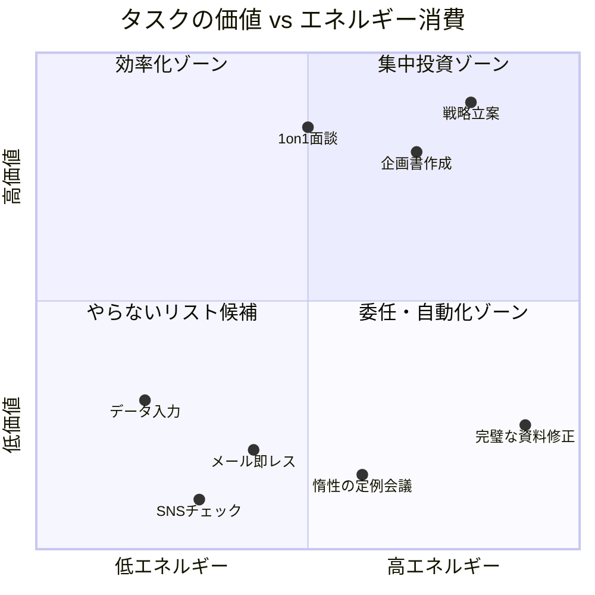
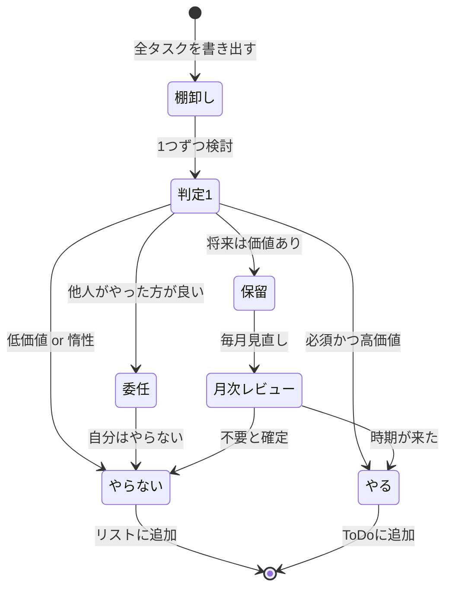

佐藤さん（34歳・マーケティング職）は、毎朝ToDoリストに15個のタスクを書き出していた。「今日こそ全部終わらせる」と意気込むが、結局3つしか完了できず、残り12個が翌日に繰り越される。その繰り返しが半年続いた朝、彼女はふと気づいた。「問題は"やること"が多すぎるんじゃなくて、"やらなくていいこと"をやり続けていることだ」。その日から佐藤さんが始めたのは、ToDoリストではなく**「やらないことリスト」**だった。

---

## 「やらないことリスト」が生産性を変える理由

多くの人がToDoリストを使って生産性を上げようとしますが、本当に効果があるのは**引き算の戦略**です。なぜなら、人間の認知リソースには厳しい上限があるからです。

### 認知リソースの有限性

脳科学の研究によれば、人間が1日に下せる質の高い意思決定は**約35,000回**。そのうち多くは「あれもやらなきゃ」「これも対応しなきゃ」という小さな判断に消費されています。やらないことを事前に決めておけば、この判断コストをゼロにできます。

### 機会費用という見えないコスト

「Aをやる」と決めた瞬間、「Bをやる時間」が失われます。つまり、全てのタスクには**見えない代償**がある。やらないことを決めることは、本当にやるべきことに全力を注ぐための前提条件なのです。



左下の「やらないリスト候補」に入るタスクこそ、真っ先に手放すべきものです。

---

## やらないことリストの作成フレームワーク

### 4ステップ仕分けフロー



### Step 1: 時間を奪っているものを全て書き出す

まず、あなたの1週間を振り返って、時間を使っている全ての活動を書き出します。仕事のタスクだけでなく、プライベートの活動、習慣、人間関係の付き合いまで含めてください。

**書き出すカテゴリ:**
- 仕事の定常業務（会議、メール、レポート等）
- プライベートの習慣（SNS、テレビ、付き合い等）
- 思考パターン（悩み、比較、完璧主義等）
- 人間関係の義務（断れない誘い、惰性の付き合い等）

### Step 2: 4つの基準で仕分ける

書き出した項目を、以下の4つの基準で評価します。

| 基準 | 質問 | Noなら要注意 |
|------|------|-------------|
| 戦略的価値 | この活動は、半年後の自分の目標に繋がるか？ | やらないリスト候補 |
| エネルギー対効果 | 投入するエネルギーに見合う成果があるか？ | 委任 or やらない |
| 代替不可能性 | 自分でなければできないことか？ | 委任候補 |
| 心の充実 | 終わった後に充実感があるか？ | やらないリスト候補 |

### Step 3: 3階層のリストに整理する

**今日やらないこと（毎朝更新）**
- メールの即レス（1日3回のチェックに限定）
- 完璧な資料作成（80点で出す）
- 予定外の会議への飛び入り参加

**今月やらないこと（月初に設定）**
- 新規プロジェクトの検討（来月に延期）
- 過去の失敗の反省（振り返りは月末に1回）

**原則としてやらないこと（半年に1回見直し）**
- 自分の時給に見合わない作業
- 戦略的価値のない付き合い
- エネルギー消費が大きい割に成果の小さい作業

### Step 4: 毎朝5分の更新ルーティン

リストは作って終わりではありません。毎朝5分、以下の手順で更新します。

1. 前日のリストを確認（守れたか？）
2. 今日の予定と優先事項を確認
3. 今日の「やらないこと」を3つ選ぶ
4. 必要に応じてチームや家族と共有

---

## ケーススタディ: 3人の「やらないことリスト」革命

### Case 1: 中村さん（29歳・SE）――残業月40時間がゼロに

中村さんの問題は「全ての依頼にYesと言ってしまう」ことだった。上司から頼まれた雑務、同僚からの「ちょっといい？」、後輩の質問対応。気づけば自分のコア業務は定時後にしか手がつけられない。

**やらないことリスト（抜粋）:**
- 「ちょっといい？」への即座の対応 → 「15時以降なら対応できます」と返す
- 自分の担当外の障害対応 → 担当者に引き継ぐ
- 完璧なコードレビュー → 重要箇所のみ集中レビュー

**結果:** 3ヶ月後、残業時間が月40時間から月2時間に減少。しかも、コア業務の品質は上がり、上司からの評価も向上した。

「断ることで評価が下がると思っていたんです」と中村さんは振り返る。「でも実際は逆でした。"この人は本当に大事なことに集中している"と思われるようになった」。

### Case 2: 山田さん（41歳・管理職）――決断疲れからの解放

山田さんは部下10人を抱えるマネージャー。毎日100通以上のメール、15件の承認依頼、5つの会議。夕方には頭がぼんやりして、重要な判断ができなくなっていた。いわゆる[決断疲れ](/blog/decision-fatigue)の典型例だ。

**やらないことリスト（抜粋）:**
- 10万円以下の経費承認を自分で判断する → 部下に権限委譲
- 全ての定例会議に出席する → 月曜と木曜のみ、他はメモで共有
- メールを逐一チェックする → 朝・昼・夕の3回に限定

**結果:** 1日の意思決定数が約40%減少。午後でも頭がクリアな状態を維持でき、戦略的な判断に集中できるようになった。

「やらないことリストは、管理職にこそ必要です」と山田さんは言う。「部下に権限を渡すことは、信頼のメッセージにもなる」。

### Case 3: 木村さん（26歳・フリーランス）――収入が1.5倍に

フリーランスのWebデザイナー木村さんは、どんな案件も引き受けていた。単価の低い修正案件、興味のない業種のLP制作、深夜の緊急対応。忙しいのに収入が増えない状態が続いていた。

**やらないことリスト（抜粋）:**
- 時給換算3,000円以下の案件を受ける → 最低ラインを5,000円に設定
- 23時以降の作業依頼に即対応する → 翌営業日に対応
- 興味のない業種の案件を引き受ける → 得意分野に特化

**結果:** 案件数は3割減ったが、月収は1.5倍に。さらに、得意分野での実績が増えたことで指名案件が増加した。

---

## 「No」と言う技術 ― 関係を壊さない断り方

やらないことリストを運用する上で最大のハードルが「断ること」。しかし、上手に断れば関係は壊れません。むしろ強化されます。

### 断り方の5パターン

**1. 即答しない（持ち帰り型）**
「ありがとうございます。スケジュールを確認して、今日中にお返事しますね」
冷静に判断する時間を確保する。

**2. 代替案を出す（提案型）**
「私は対応が難しいですが、この件は△△さんが詳しいので相談されてはいかがでしょう？」
単に断るのではなく、解決策を一緒に考える。

**3. 条件付きで受ける（交渉型）**
「来週以降でしたら対応可能です。スケジュールを調整しましょうか？」
「いつまでなら」「どの範囲なら」を明確にする。

**4. 優先順位を説明する（透明型）**
「現在○○プロジェクトが最優先で、そちらに集中しています。今回は見送らせてください」
理由を簡潔に伝える。長い言い訳は不要。

**5. 感謝+辞退（丁寧型）**
「声をかけていただきありがとうございます。今回は参加が難しいですが、次の機会にはぜひ」
相手の気持ちを受け止めた上で断る。

```mermaid
journey
    title 「No」と言えるようになるまでの道のり
    section 第1週: 小さな断り
      不要なメルマガを解除: 5: 自分
      興味のないSNS投稿をミュート: 4: 自分
    section 第2週: 仕事での断り
      惰性の定例会議を欠席: 3: 自分
      即レスをやめる: 3: 自分
    section 第3週: 対人での断り
      飲み会の誘いを断る: 2: 自分
      追加業務の依頼を保留にする: 3: 自分
    section 第1ヶ月後: 習慣化
      断ることに罪悪感がなくなる: 4: 自分
      空いた時間で成果が出る: 5: 自分
```

---

## 典型的な「やらないこと」チェックリスト

### 仕事編

- [ ] 全てのメールに即レスする → 1日3回のバッチ処理へ
- [ ] 意味の薄い定例会議に毎回出る → 隔週参加 or 議事録確認
- [ ] 完璧を目指して提出が遅れる → 80点で出して改善サイクルを回す
- [ ] 自分でやらなくていい仕事を抱え込む → 委任リストを作る
- [ ] 「念のため」のCC返信 → 本当に必要な人だけに返す

### プライベート編

- [ ] ダラダラとSNSを見る → 1日2回、計30分まで
- [ ] 興味のない飲み会に参加する → 月2回までと決める
- [ ] 義務感だけの付き合いを続ける → 半年に1回見直す
- [ ] 寝る前のスマホいじり → 寝室にスマホを持ち込まない

### 思考パターン編

- [ ] 変えられない過去を悔やむ → 「今から何ができるか」に切り替え
- [ ] 他人と自分を比較する → [比較の罠](/blog/comparison-trap)を意識する
- [ ] 「〜すべき」思考に囚われる → 「〜したい」に変換する
- [ ] 人の評価を気にしすぎる → [自分軸](/blog/self-axis)を持つ

---

## 注意点: やらないことリストの落とし穴

### 「やらない」と「できない」は違う

「やらない」は**主体的な選択**。「できない」は受動的な制限。やらないことリストは、あくまで「自分の意志で選んでやらない」というリストです。この違いを意識することで、リストが制約ではなく解放のツールになります。

### 過度な断りのリスク

何でもかんでも断ればいいというわけではありません。以下は「やらないことリスト」に入れてはいけないものです。

- 重要な人間関係を維持するための最低限の付き合い
- 緊急かつ重要なこと（本当の緊急事態）
- 責任を伴う約束やコミットメント

### 定期的な見直しが必須

状況は変わります。3ヶ月前に「やらない」と決めたことが、今は「やるべきこと」になっているかもしれません。最低でも月に1回はリストを見直してください。

---

## 今日から始める3ステップ

**Step 1（今夜10分）:** 過去1週間で「これ、やらなくてよかったな」と感じた活動を3つ書き出す。

**Step 2（明日の朝5分）:** その3つを「やらないことリスト」としてメモアプリや紙に書き、見える場所に置く。

**Step 3（1週間後）:** リストを守れたか振り返り、新たに「やらないこと」を2つ追加する。

[ポモドーロ・テクニック](/blog/pomodoro-technique)や[ディープワーク](/blog/deep-work)と組み合わせれば、「やらないことを減らした時間」を最大限に活かせます。[朝のルーティン](/blog/morning-routine)にリスト更新を組み込むのも効果的です。

---

## あなたの「やらないことリスト」、一緒に作りませんか？

「何をやめればいいかわからない」「断ることに罪悪感がある」――そんな方は、一人で悩まなくて大丈夫です。体験セッションでは、あなたの仕事・生活の状況をヒアリングした上で、最初の「やらないことリスト」を一緒に設計します。捨てることで生まれる時間の大きさに、きっと驚くはずです。

[体験セッションに申し込む](/sessions)
