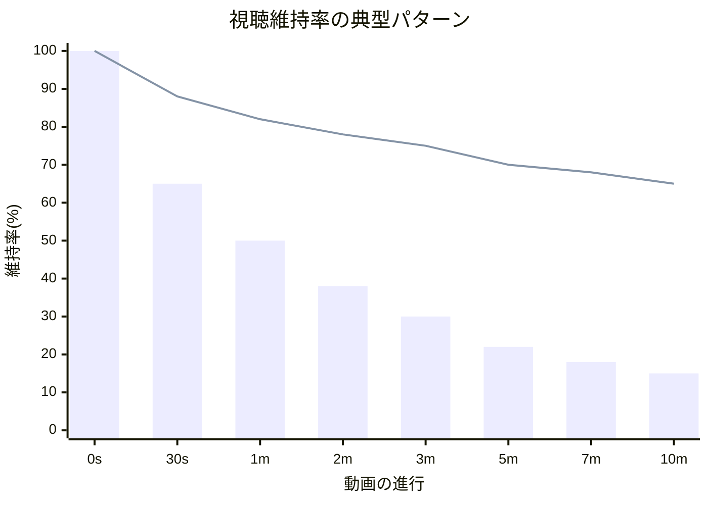
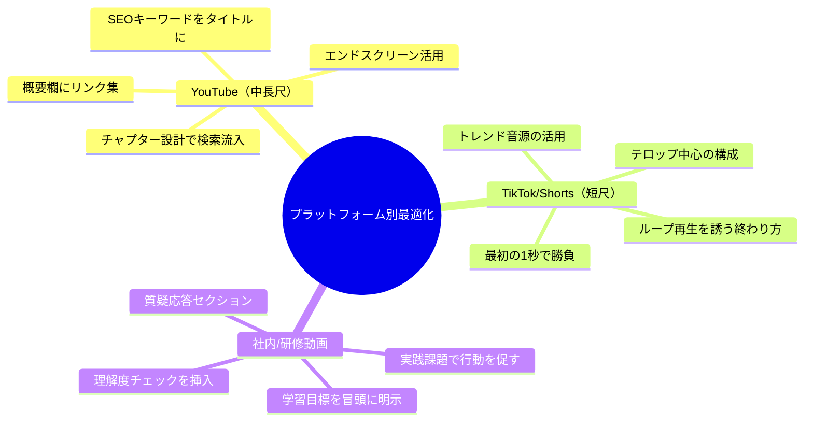

中村さん（27歳・副業YouTuber）は、投稿した動画の分析画面を見て頭を抱えていた。平均視聴維持率22%。つまり、10分の動画を2分すら見てもらえていない。「内容には自信がある。でもなぜか離脱される...」。週末を丸々2日使って撮影・編集しているのに、再生数は200回前後。登録者は500人から半年間ほぼ増えていなかった。ある日、動画マーケティングの勉強会で講師がこう言った。「問題は内容じゃない。構造です。AIを使えば、視聴者が最後まで見たくなる構造を論理的に設計できますよ」。中村さんのチャンネルが変わり始めたのは、その日からだった。

## なぜ「良い内容」なのに見られないのか

動画コンテンツの成否を決めるのは、内容の質だけではありません。**構造の設計**が決定的に重要です。

視聴者が動画を見続けるかどうかは、最初の10秒で決まります。そして、最後まで見るかどうかは、セクションごとの「引き」の設計で決まります。



上のグラフで、棒グラフは構造設計なしの典型パターン。折れ線グラフは構造設計ありのパターンです。差は歴然 ── 最後まで見てもらえる動画には、明確な構造があります。

## AIスクリプト構造化の5ステップ

```mermaid
journey
    title スクリプト構造化ジャーニー
    section Step 1: ペルソナ定義
      視聴者像を具体化する: 5: クリエイター
      視聴者の悩みを特定する: 4: クリエイター
    section Step 2: フック設計
      最初の3秒を設計する: 3: クリエイター
      AIで5パターン生成する: 5: クリエイター, AI
    section Step 3: 構造設計
      感情曲線を設計する: 4: クリエイター, AI
      セクション配分を決める: 5: AI
    section Step 4: セクション執筆
      各パートを肉付けする: 4: クリエイター, AI
    section Step 5: 最適化
      CTA設計と全体調整: 5: クリエイター
```

### Step 1：ペルソナを「AIと対話」で具体化する

「20代男性向け」のような曖昧なペルソナでは、刺さるスクリプトは書けません。AIとの対話で、視聴者像を解像度高く描きます。

**実践プロンプト：**
```
あなたは動画マーケティングの専門家です。
以下の動画企画について、視聴者ペルソナを3つ作成してください。

【動画テーマ】○○
【プラットフォーム】YouTube（10分前後）
【チャンネルのジャンル】△△

各ペルソナについて以下を出力：
1. 名前・年齢・職業・生活スタイル
2. この動画を見る動機（何に困っているか）
3. 視聴後にどうなりたいか
4. 響く言葉と響かない言葉
5. 離脱しやすいポイント
```

### Step 2：フック（冒頭10秒）をAIで5パターン生成

動画の命運を握るフックは、1パターンでは足りません。AIに複数パターンを生成させ、最も刺さるものを選びます。

**フックの5つの型：**

| 型 | 例 | 効果 |
|---|---|---|
| 疑問型 | 「なぜ○○すると△△になるか知っていますか？」 | 好奇心の喚起 |
| 数字型 | 「○○を変えるだけで、売上が3倍になりました」 | 具体性と信頼 |
| 共感型 | 「○○で悩んでいませんか？私もそうでした」 | 自分ごと化 |
| 対立型 | 「○○は完全に間違いです」 | 常識の否定で注意を引く |
| ストーリー型 | 「3ヶ月前、私は○○の状態でした」 | 物語への引き込み |

### Step 3：感情曲線を設計する

視聴者を最後まで引きつけるには、感情の起伏が必要です。ずっと同じテンションでは飽きられます。

**AIへの依頼例：**
```
以下の動画構成について、感情曲線（テンションの上下）を設計してください。

【動画構成】
- フック（0-10秒）
- 問題提起（10-60秒）
- 解決策パート1（1-3分）
- 解決策パート2（3-5分）
- 解決策パート3（5-7分）
- まとめ＆CTA（7-10分）

各セクションで：
1. 感情のレベル（1-10）
2. どんな感情を狙うか
3. 前のセクションからの繋ぎ方
4. 離脱防止の仕掛け
```

### Step 4：各セクションをAIで肉付けする

構造が決まったら、各セクションの具体的なナレーション・ビジュアル指示を作成します。

### Step 5：CTA（行動喚起）を最適化する

動画の最後に「チャンネル登録お願いします」だけでは弱い。**視聴者が得た価値と次のアクションを結びつける**CTAが効果的です。

## ケーススタディ1：中村さんの変化 ── 維持率22%→58%

冒頭の中村さんは、AIスクリプト術を導入して3ヶ月後にこう語った。

「一番変わったのはフックです。以前は『こんにちは、中村です。今日は○○について話します』と始めていた。AIに5パターン作ってもらって、数字型のフック『たった1つの設定を変えるだけで、作業時間が半分になります』に変えたら、最初の30秒の維持率が40%→85%に跳ね上がりました」

**中村さんのBefore/After：**
- 平均視聴維持率：22% → 58%
- 月間総再生数：約4,000回 → 約12,000回（3倍）
- チャンネル登録者：500人 → 1,200人（3ヶ月で）
- スクリプト作成時間：6時間 → 2時間

「特に効いたのが、各セクションの頭に『次は○○について話しますが、これが一番重要です』のような引きを入れること。AIが『離脱防止フック』として自動的に提案してくれるんです」

## ケーススタディ2：企業の広報・鈴木さん ── 社内研修動画の革命

鈴木さん（34歳・広報部）は、社内研修動画の制作を担当していた。

「研修動画って、誰も最後まで見ないんですよ。『コンプライアンス研修』なんて、再生ボタンを押して放置している人がほとんど。でも内容は本当に大事なことなんです」

鈴木さんはAIに「コンプライアンス研修の内容を、Netflix のドキュメンタリー風の構成にしてください」と依頼した。

**Before：**
- 形式：PowerPointのスライドを読み上げるだけ
- 完走率：15%（社内アンケート）
- 理解度テスト平均：62点

**After（AI構造化後）：**
- 形式：実際の事例ベースのストーリー＋解説＋クイズ
- 完走率：78%
- 理解度テスト平均：84点

「AIに『この研修で一番伝えたいメッセージは何ですか？』と聞かれて、自分でもうまく答えられなかった。構造化の過程で、伝えたいことが明確になる ── これがAIスクリプト術の隠れたメリットです」

## プラットフォーム別・最適化チェックリスト



## ケーススタディ3：料理チャンネルの山口さん ── ショート動画で月10万再生

山口さん（40歳・料理教室講師）は、レシピ動画をYouTubeに投稿していたが、長尺動画では伸び悩んでいた。

「AIに相談したら、『まず60秒のショート動画でフックを作り、詳細は長尺動画に誘導する構成にしましょう』と提案されたんです」

AIが設計したショート動画の構造：
1. **0-3秒**：完成した料理のアップ＋「これ、材料3つだけです」
2. **3-15秒**：材料を見せる（テンポよくカット）
3. **15-45秒**：調理のハイライト（早回し）
4. **45-55秒**：完成＋実食リアクション
5. **55-60秒**：「詳しいレシピは概要欄から」

**結果：**
- ショート動画の月間再生数：10万回超
- 長尺動画への流入：ショート経由で30%増
- 料理教室の問い合わせ：月2件 → 月8件

## 実践テンプレート：今日から使えるAIスクリプト依頼文

```
以下の条件で、動画スクリプトの構造を設計してください。

【基本情報】
- テーマ：（ここに入力）
- プラットフォーム：YouTube / TikTok / 社内研修
- 尺：○分
- ターゲット：（年代・属性・悩み）

【依頼内容】
1. フック案を5パターン（疑問型/数字型/共感型/対立型/ストーリー型）
2. ストーリー構成（各セクションの目的・時間配分・感情レベル）
3. 各セクション冒頭の「離脱防止フック」
4. CTAの設計（視聴後の行動を明確に）
5. テロップのタイミングと内容（主要なもの5つ）

出力形式：セクションごとに分けて、ナレーション原稿とビジュアル指示を並記してください。
```

このプロンプトの設計力をさらに高めたい方は、[プロンプトエンジニアリング入門](/blog/ai-prompt-engineering)も参考になります。

## やってはいけない3つの落とし穴

**1. AIの出力をそのまま読む**
AIが書いたナレーションをそのまま読むと、不自然になります。必ず自分の言葉に置き換えてください。AIは構造を作るツールであり、あなたの個性を代替するものではありません。

**2. データなき「構造」に頼る**
どんなに美しい構造でも、視聴者のデータ（維持率、離脱ポイント）を見なければ改善できません。投稿後のアナリティクス分析も、AIに手伝ってもらいましょう。

**3. 1回で完璧を目指す**
最初から完璧なスクリプトはできません。AIブレインストーミングの要領で、[まずは量を出してから質を絞る](/blog/ai-brainstorming)アプローチが有効です。

## 明日から始める3ステップ

1. **今日**：次に作る動画のテーマを決め、上のテンプレートでAIにスクリプト構造を依頼する
2. **今週**：AIが提案したフック5パターンから最も刺さるものを選び、撮影・投稿する
3. **来週**：アナリティクスで視聴維持率を確認し、AIに「この離脱ポイントをどう改善すべきか」を相談する

---

## あなたの動画、一緒に「構造化」しませんか？

「自分のチャンネルに合ったスクリプト構造が知りたい」「AIへの依頼の仕方がわからない」。体験セッションでは、あなたの動画コンテンツの課題を分析し、AIを活用したスクリプト改善の具体的なプランを一緒に作ります。

[体験セッションに申し込む](/sessions)
