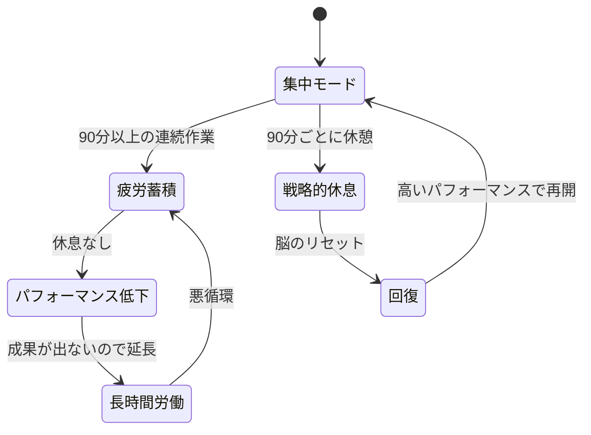
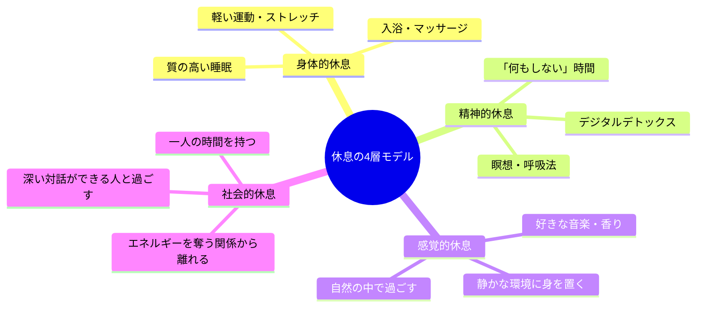

高橋さん（34歳・営業マネージャー）は、毎朝6時に出社し、夜10時まで働いていた。休日も「やり残した仕事」が頭から離れず、スマホで社内チャットをチェックし続ける。月曜の朝、鏡に映る自分の顔色の悪さに気づいても「今は踏ん張りどころだ」と自分に言い聞かせていた。チームの売上は下位30%。部下からは「高橋さん、大丈夫ですか？」と心配される始末。ある日、産業医との面談でこう言われた。「高橋さん、あなたは休み方を知らない。それが成果が出ない最大の原因です」。高橋さんは耳を疑った ── 休まないから成果が出ないなんて、逆じゃないのか？

## 「休めない」は能力の問題ではなく、設計の問題

多くの人が「休む=サボる」と無意識に思っています。しかし脳科学の研究では、**休息は脳のメンテナンス時間**であり、創造性・判断力・記憶の定着に不可欠であることが繰り返し証明されています。

問題は意志の弱さではなく、**休息をスケジュールに組み込んでいない**こと。つまり設計の問題です。

上の図が示す通り、休まずに働き続けると「疲労→低パフォーマンス→長時間労働→さらなる疲労」の悪循環に陥ります。一方、戦略的に休息を入れると「集中→休息→回復→集中」の好循環が生まれます。

## 休息の4層モデル ── 本当の「休み方」を知る

「休む」と一口に言っても、休息には複数の層があります。体を休めるだけでは不十分です。

多くの人が「身体的休息」だけに偏っています。「週末に寝だめしたのに疲れが取れない」のは、精神的休息・感覚的休息・社会的休息が足りていないからです。

## ケーススタディ1：高橋さんの変化 ── 「休む勇気」で売上トップへ

産業医のアドバイスを受けた高橋さんは、半信半疑で以下の3つを実践した。

**1. 90分ルールの導入**
90分集中したら、15分間は完全に仕事から離れる。散歩する、コーヒーを淹れる、窓の外を眺める。スマホは触らない。

**2. 週1回の「予定ゼロデー」**
日曜日は予定を一切入れない。朝起きた気分で過ごす。掃除したければする。散歩したければする。何もしたくなければ何もしない。

**3. 就寝前1時間のデジタルオフ**
22時以降はスマホ・PCを見ない。代わりに読書か入浴。

**結果（3ヶ月後）：**
- チーム売上：下位30% → 上位10%
- 高橋さん自身の体重：5kg減（ストレス食いがなくなった）
- 部下の離職率：2名/半年 → 0名
- 本人の実感：「頭がクリアになった。以前は霧の中で仕事をしていた感覚だった」

「一番驚いたのは、労働時間が減ったのに成果が上がったこと。以前は疲れた頭で3時間かけていた企画書が、休息後は1時間で書ける。しかもクオリティが高い」

## 「何もしない」の科学

脳科学では、何もしていないときに活性化する**デフォルトモードネットワーク（DMN）**という脳の回路が知られています。DMNは以下の機能を担います。

- **記憶の整理と定着** ── 学んだことを長期記憶に変換する
- **創造的な発想** ── 一見無関係な情報を結びつける
- **自己内省** ── 自分の状態や価値観を振り返る
- **共感と社会的理解** ── 他者の気持ちを想像する

つまり、「ぼーっとしている時間」は**脳がフル回転している時間**なのです。常に何かに集中していると、このDMNが働く余地がなくなります。

[ポモドーロ・テクニック](/blog/pomodoro-technique)で25分集中・5分休憩のサイクルが推奨されるのも、このDMNの活性化が理由の一つです。

## ケーススタディ2：エンジニアの加藤さん ── デジタルデトックスで突破口

加藤さん（29歳・Webエンジニア）は、週末もコードを書いていた。

「プログラミングが好きだから苦じゃないんです。でも、新しいアーキテクチャの設計が必要な場面で、全くアイデアが出なくなっていた。同じパターンの繰り返しばかり」

加藤さんが試したのは、**週末の土曜日だけ完全デジタルデトックス**。PC・スマホ・タブレットに一切触れない日を月4回作った。

「最初の2時間は禁断症状みたいにソワソワしました（笑）。でも3時間目くらいから、頭の中がスッキリしてくる。散歩しながら、ふと『あのシステム、こう設計すればいいんじゃないか』とアイデアが降ってくるんです」

**結果：**
- 技術的なブレイクスルー：月0回 → 月2-3回
- コードレビューでの指摘数：平均8件 → 平均3件（品質向上）
- 月曜朝の疲労感：10段階で8 → 3

「何もしない時間が、一番生産的な時間だった。これは本当に逆説的ですが、事実です」

## 休息の罪悪感を手放すフレームワーク

休息に罪悪感を感じる人が多いのは、「休む=怠ける」という思い込みがあるからです。この思い込みを書き換えるフレームワークがあります。

**リフレーミングの実践：**

| 思い込み | リフレーミング |
|---------|-------------|
| 「休んでいる場合じゃない」 | 「休まないと、来週のパフォーマンスが落ちる」 |
| 「みんな頑張っているのに」 | 「休息も仕事の一部。プロアスリートも休む」 |
| 「もっとできるはず」 | 「疲れた状態の120%より、回復後の80%の方が高い」 |
| 「休日に何もしなかった」 | 「脳のDMNを活性化する最高の投資をした」 |

[決断疲れ](/blog/decision-fatigue)の記事で解説しているように、判断力は有限のリソースです。休息はそのリソースを回復させる唯一の方法です。

## ケーススタディ3：ワーキングマザーの松本さん ── 「自分の時間」を取り戻す

松本さん（38歳・マーケティング部・2児の母）は、仕事と育児の間で自分の時間がゼロだった。

「朝5時に起きて家事、7時に出勤、18時に退社して保育園のお迎え、夕食・入浴・寝かしつけ。21時に子どもが寝たら、残りの仕事。自分の時間は1分もない。休むなんて贅沢だと思っていました」

松本さんが実践したのは、**マイクロ休息**という考え方。

**マイクロ休息の実践：**
1. **通勤電車の10分** ── スマホを見ず、窓の外を眺める
2. **昼休みの5分** ── 一人でコーヒーを飲みながら深呼吸
3. **子どもの昼寝中の15分** ── 何もせず、ただ座っている（週末）

「たった5分でも、意識的に『何もしない』を選択すると、脳がリセットされる感覚がある。30分の昼寝より、5分の完全オフの方が効果があるときもあります」

**結果（2ヶ月後）：**
- 仕事のミス：月3-4件 → 月0-1件
- イライラの頻度：毎日 → 週1-2回
- 夫からの言葉：「最近、表情が穏やかになったね」

## 今日から始める「戦略的休息」プラン

### 平日の休息設計

1. **90分サイクル**：集中作業は90分を上限に、15分の完全休憩を入れる
2. **ランチは席を離れる**：デスクで食べながら仕事をしない
3. **退勤時のリセット儀式**：帰りの電車で「今日の仕事は終わり」と意識的に切り替える

### 週末の休息設計

1. **予定は半日まで**：丸一日予定を詰め込まない
2. **デジタルオフの時間帯**：最低2時間はスマホを別の部屋に置く
3. **自然に触れる**：公園の散歩、空を眺める、植物に水をやる

### 月間の休息設計

1. **月1回の「一人時間」**：誰にも会わない半日を確保する
2. **振り返りの時間**：先月の自分の状態を10段階で評価する
3. **休息の質を見直す**：「疲れが取れていない」と感じたら、4層モデルで不足を特定する

[朝の習慣](/blog/morning-routine)と組み合わせれば、1日の始まりから休息を織り込んだリズムを作ることができます。

---

## 「休み方」を一緒に設計しませんか？

「頭では分かっているけど、休めない」。それは意志の問題ではなく、仕組みの問題です。体験セッションでは、あなたの生活パターンをヒアリングし、無理なく続けられる戦略的休息プランを一緒に設計します。休むことで、むしろ成果が上がる ── その体験を、まずは1ヶ月試してみませんか？

[体験セッションに申し込む](/sessions)
