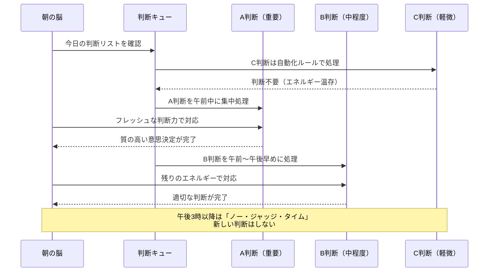

## 金曜日の夜、スーパーで30分立ち尽くす

「今日の夕飯、何にしよう」

金曜日の午後7時。スーパーの惣菜コーナーの前で、立ち尽くす自分がいる。鶏肉にしようか、魚にしようか。いや、もう惣菜でいいか。でもどの惣菜にするか決められない。

結局、カップ麺を買って帰る。

月曜の朝なら5秒で決められることが、金曜の夜にはできない。これは意志の弱さではありません。**決断疲れ（Decision Fatigue）**という、脳の仕組みに根ざした現象です。

スタートアップCEOの吉田健太さん（仮名・38歳）は、この現象にもっと深刻な形で向き合っていました。

「午前中の商談では冴えた判断ができるのに、午後の会議になるとどうでもよくなる。夕方に重要な採用面接を入れてしまい、明らかにミスマッチの人材を通してしまったことがあります。あの判断のせいで、チームが3ヶ月間苦しんだ」

## 1日35,000回の「見えない消耗」

人間は1日に約35,000回の意思決定を行っていると言われています（コーネル大学の研究チーム推計）。そのうち食事に関する決定だけで226回以上。

問題は、この35,000回の決断の一つひとつが、同じ「精神エネルギー」のプールから引き出されていることです。

社会心理学者ロイ・バウマイスターの研究は、これを「自我消耗（Ego Depletion）」と名付けました。意思決定や自制心の行使は、筋肉と同じように疲労する。朝のフレッシュな判断力は、些細な決断の積み重ねで、夕方にはほぼ枯渇しています。

### イスラエルの仮釈放委員会の衝撃的データ

バウマイスターらが分析した有名な研究があります。イスラエルの仮釈放委員会の判決データ1,112件を調査したところ、**午前中の仮釈放承認率は約65%だったのに対し、昼食前には0%近くまで低下**していました。そして昼食後にまた65%に回復する。

つまり、犯罪者の釈放という極めて重要な判断でさえ、「判事がいつ判断するか」によって結果が大きく変わっていた。人間の判断力がいかに有限な資源であるかを、これ以上ないほど示すデータです。

```mermaid
timeline
    title 1日の判断力エネルギーの推移
    section 朝（6:00-9:00）
      エネルギー90-100% : 最も質の高い判断が可能
                        : 創造的な仕事に最適
                        : 重要な意思決定のゴールデンタイム
    section 午前（9:00-12:00）
      エネルギー70-85% : メール対応・会議で徐々に消耗
                       : まだ複雑な判断が可能
                       : ここまでに重要な決断を済ませたい
    section 昼食後（13:00-15:00）
      エネルギー50-65% : 血糖値の変動で一時的に回復
                       : しかし急速に低下
                       : ルーティンワーク向き
    section 夕方（15:00-18:00）
      エネルギー20-35% : 決断回避・先延ばしが増加
                       : 衝動的な判断をしやすい
                       : 「もういいや」の投げやり決定
    section 夜（18:00以降）
      エネルギー0-15% : 判断力はほぼ枯渇
                      : 衝動買い・暴食のリスク最大
                      : 重要な決断は絶対に避ける
```

## ケーススタディ1：吉田CEOの「判断力崩壊」と再建

冒頭の吉田さんの1日を詳しく見てみましょう。

**改善前の吉田さんの典型的な1日：**

- 7:00 — 今日着る服を選ぶ（5分）
- 7:15 — 朝食のメニューを考える（3分）
- 8:00 — 出社後、メールを150件チェック。返信の優先順位を判断
- 9:00 — チームのSlack通知30件に対応
- 10:00 — 商談1件目（提案内容の最終判断）
- 11:00 — 採用候補者のレジュメ5通を選別
- 12:00 — ランチの店を決められず、コンビニで済ます
- 13:00 — 商談2件目（値引き交渉の判断）
- 14:00 — プロダクトの新機能について5つの選択肢から決定
- 15:00 — 予算配分の再調整（数字が頭に入らない）
- 16:00 — **採用面接（判断力は枯渇状態）**
- 17:00 — 「もういいや」と思いながらメール返信
- 20:00 — 夕食後、Amazonで衝動買い

吉田さんは1日に数百回の意思決定を、フラットに処理していました。重要度の高い判断も低い判断も、「来た順番」で対応する。結果として、最も判断力が枯渇した時間帯に、最も重要な判断（採用）を行っていたのです。

### 吉田さんが導入した「判断力プロテクト・システム」

コーチングを通じて、吉田さんは3ヶ月かけて以下の仕組みを構築しました。

**1. 判断の「格付け」**
すべての判断をA（不可逆・影響大）、B（影響中）、C（影響小・可逆）の3段階に分類。A判断は必ず午前10時までに行うルールを設定。

**2. C判断の自動化**
服：平日5日分のコーディネートを日曜に決定（ハンガーに月〜金のラベル）。朝食：3パターンのローテーション。ランチ：曜日ごとに固定店舗。

**3. 「ノー・ジャッジ・タイム」の設定**
午後3時以降は新しい判断をしない。メールは翌朝に回す。この時間帯はルーティン作業（データ入力、議事録整理など）に充てる。

**改善3ヶ月後の結果：**
- 採用のミスマッチ：月2件 → 0件
- 夕方の衝動的な判断（後悔する決定）：週5回以上 → 週1回以下
- 本人の主観的な「判断の質」評価：10点中4点 → 8点



## ケーススタディ2：ワーキングマザー・高橋さんの「選択肢地獄」

高橋裕子さん（仮名・34歳）は、IT企業のマーケティングマネージャーとして働きながら、5歳と2歳の子供を育てています。

「朝6時に起きて、子供の服を選び、朝食を用意し、保育園の準備をして、自分の身支度をして、8時半に出社。そこからは会議、企画判断、部下のレビュー、予算の承認……。17時に退社して保育園にお迎え、夕飯のメニューを考え、子供の習い事の送迎、寝かしつけ。21時になる頃には、もう何も考えたくない」

高橋さんの場合、仕事の判断に加えて**家庭の判断**が膨大にありました。1日の判断回数は、独身の同僚の推定1.5倍以上。慢性的な決断疲れの状態にあったのです。

深刻だったのは、夜の「反動」でした。子供を寝かしつけた後、SNSを2時間スクロールしたり、ネットショッピングで不要な物を買ったり。「自分の時間」のはずなのに、翌朝は自己嫌悪で始まる。

「脳が疲れすぎて、もう何も判断したくない。でもスマホを見ることだけは止められない。受動的に情報を受け取ることが、唯一の"休息"だと脳が錯覚していたんだと思います」

### 高橋さんが構築した「判断ダイエット」

**週末の30分で1週間分を前決め：**
- 月〜金の夕食メニュー（5パターンを日曜に決定、食材はネットスーパーで一括注文）
- 子供の服（5日分を日曜にコーディネート、引き出しの手前に並べる）
- 自分の服（3パターンのローテーション。月水金はパターンA、火木はパターンB）

**「もし〜なら」ルールの設定：**
- 子供が熱を出したら → 夫が午前、自分が午後
- 残業が確定したら → 夕食は冷凍ストックのCメニュー
- 19時を過ぎたら → スマホはリビングの充電器に置いて寝室に入る

**結果（2ヶ月後）：**
- 夕食の準備時間：平均45分 → 20分
- 夜のSNSスクロール時間：平均120分 → 30分
- 朝の自己嫌悪：週5日 → 週1日以下
- 睡眠時間：5.5時間 → 6.5時間

高橋さんは振り返ります。

> 「決断疲れを知る前は、自分の意志が弱いと思っていた。夜にスマホを見てしまうのは、自分がだらしないからだと。でも違った。**判断力という有限のリソースを、朝から晩まで使い果たしていた**だけだったんです。仕組みで判断を減らしたら、夜に自分をコントロールできる余裕が戻ってきました」

## 決断疲れを防ぐ7つの具体的システム

### システム1：判断の「時間帯マッピング」

[エネルギーマネジメント](/blog/energy-management)の記事でも触れていますが、判断力には最適な時間帯があります。

| 時間帯 | 判断力レベル | 適した判断 |
|--------|------------|-----------|
| 6:00-10:00 | 最高 | 戦略的判断、創造的決定、重要な交渉 |
| 10:00-12:00 | 高い | 分析的判断、レビュー、フィードバック |
| 13:00-15:00 | 中程度 | 協議的判断（チームで議論して決める） |
| 15:00-17:00 | 低い | ルーティン判断のみ |
| 17:00以降 | 最低 | 新しい判断はしない |

### システム2：「2分ルール」で小さな判断を即処理

2分以内で完了する判断は、その場で即決する。「後で考えよう」とストックすると、未処理の判断が脳のバックグラウンドでエネルギーを消費し続けます（ツァイガルニク効果）。

### システム3：選択肢を3つに絞る

レストランのメニューが20種類あると選べないのに、3種類なら即決できる。あらゆる判断で、選択肢を意図的に3つ以下に絞る。

### システム4：「デフォルト」を設定する

迷ったときの「デフォルト選択」を事前に決めておく。

- 会議の時間：迷ったら30分
- 返信の優先度：迷ったら翌営業日
- 外食の店：迷ったら行きつけの店
- 休日の予定：迷ったら散歩

### システム5：バッチ処理で同種の判断をまとめる

メールを1通ずつ見るのではなく、10時と15時の2回にまとめる。[ポモドーロ・テクニック](/blog/pomodoro-technique)と組み合わせると、「25分で判断系タスクをまとめて処理」という効率的なバッチ処理が可能になります。

### システム6：「判断日記」で消耗パターンを把握する

1週間、自分が行った判断と、そのときの「迷い度（1-5）」を記録する。迷い度が高い判断を特定し、それをルール化・自動化の対象にする。

### システム7：血糖値を安定させる

判断力は血糖値と密接に関係しています。急激な血糖値の上下を避けるために、GI値の低い食事を選ぶ。特に昼食後の血糖値スパイクは、午後の判断力を直撃します。

## 「判断しない」は「怠け」ではない

決断疲れ対策の本質は、「判断しないこと」ではなく、**「判断すべきことに集中するために、判断しなくていいことを仕組み化すること」**です。

スティーブ・ジョブズが毎日同じ黒のタートルネックを着ていたのは、おしゃれを諦めたからではありません。「服を選ぶ」という判断を省き、その分のエネルギーをAppleの製品設計に注ぎ込むためでした。

マーク・ザッカーバーグも同じグレーのTシャツ。バラク・オバマも紺かグレーのスーツだけ。一流の人ほど、「判断力は有限だ」という事実を受け入れ、その配分を戦略的に設計しています。

[朝時間を制する者は人生を制す](/blog/morning-routine)で紹介したモーニングルーティンも、根底にあるのは同じ原理です。朝の行動を自動化することで、判断力をその日の最重要タスクに温存する。

あなたの判断力は、あなたが思っている以上に貴重な資源です。今日から一つだけ、「毎回迷っていたこと」をルール化してみてください。明日の夕方、あなたは驚くほどクリアな頭で、大切な判断に向き合えるはずです。

---

**「毎日がなんとなく疲れる」の正体を知りたいあなたへ**

ライフ自己決定コーチングでは、あなたの1日の「判断パターン」を一緒に分析し、エネルギーを最適配分するための仕組みづくりをサポートします。がんばり方を変えるだけで、同じ24時間の密度が変わります。

[無料セッションに申し込む →](/sessions)
