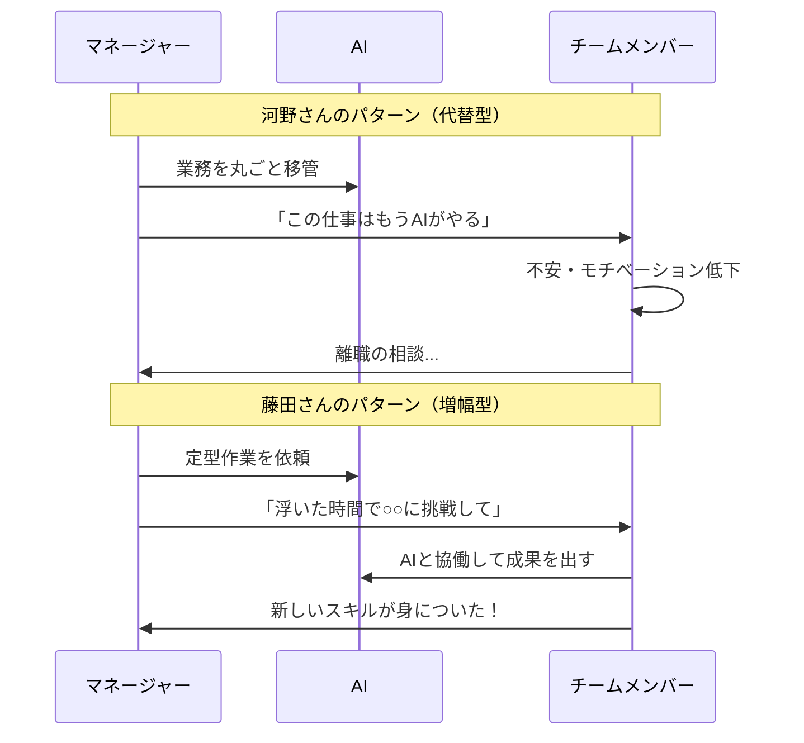
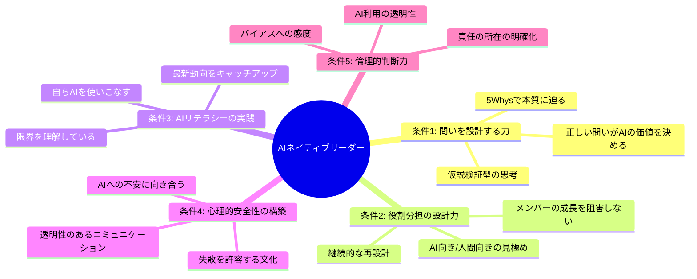
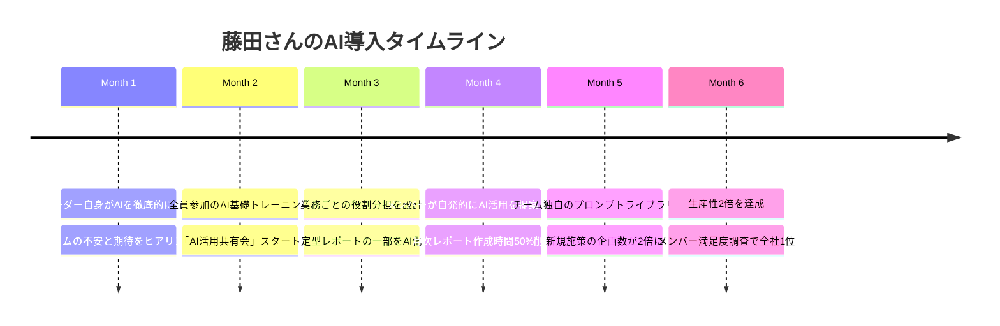

同じ会社の隣の部署に、2人のマネージャーがいた。河野さん（38歳・営業部マネージャー）と、藤田さん（41歳・マーケティング部マネージャー）。2人とも2025年のAI導入推進プロジェクトのリーダーに任命された。半年後、結果は真逆だった。河野さんのチームは離職率が急上昇し、モチベーション調査で全社最下位に。一方、藤田さんのチームは生産性が2倍になり、メンバーから「この部署に来てよかった」と言われるようになった。同じAIツール、同じ予算、同じ期間。何が違ったのか？

## 2人のマネージャーの「決定的な違い」

河野さんは、AIを「人間の代替」として導入した。

「このレポート、AIで自動化できるだろ。田中、もう君がやる必要ないから」

部下たちは自分の存在意義を脅かされたと感じた。AIが入るたびに「次は自分の仕事がなくなるのでは」という不安が広がった。

藤田さんは、AIを「チームの増幅器」として導入した。

「このレポート作成、AIに下書きをやってもらおう。浮いた時間で、田中さんにはクライアントとの関係構築に集中してほしい。それは人間にしかできない仕事だから」

部下たちは「AIのおかげで、より価値の高い仕事ができるようになった」と感じた。

この違いが、AIネイティブリーダーの本質です。技術を知っているだけでは不十分。**AIと人間のチームをどう設計するか** ── それがリーダーの真価です。

## AIネイティブリーダーの5つの条件

### 条件1：「答え」ではなく「問い」を設計する力

AIは答えを出すのが得意です。しかし、**正しい問いを立てなければ、正しい答えは得られません**。

河野さんは「このデータを分析して」とAIに丸投げした。出てきた結果を見て「ふーん、そうか」で終わり。

藤田さんは違った。「このデータから、来期の戦略に影響する変化を3つ特定して。特に競合の動きと顧客の行動変化に注目して。それぞれについて、我々がとるべきアクションの選択肢を2つずつ提示して」

同じデータ、同じAI。しかし「問いの質」が違うから、出てくる答えの質が全く違う。

**問いを設計するための3つの習慣：**

1. **「そもそも」を問う** ── 「このレポートは何のために作っているのか？」
2. **制約条件を明示する** ── 「予算○○万円、期間3ヶ月で」
3. **判断基準を先に決める** ── 「何が分かれば、意思決定できるのか？」

この「問う力」の詳細は、[AI時代の「問う力」](/blog/ai-era-question-power)で解説しています。

### 条件2：人間とAIの役割分担を設計する力

「何をAIに任せ、何を人間がやるか」。この判断を間違えると、河野さんのように部下のモチベーションを破壊します。

**役割分担の設計フレームワーク：**

| 判断軸 | AI向き | 人間向き |
|-------|--------|---------|
| 速度が重要 | データ集計・分析 | ── |
| 正確性が重要 | 定型チェック・校正 | ── |
| 創造性が重要 | ── | 戦略立案・コンセプト設計 |
| 共感が重要 | ── | 顧客対応・チームケア |
| 判断が重要 | ── | 倫理的決断・責任を伴う意思決定 |
| 学習機会になる | ── | 新人の成長に必要なタスク |

**見落としがちなポイント：** AIに任せられるからといって、すべて任せるべきではない。新人が「データ分析の基礎」を学ぶ機会まで奪ってしまうと、将来のスキル不足につながります。

### 条件3：自らAIを使いこなすリテラシー

「部下にAIを使わせる」だけでは不十分です。リーダー自身がAIの可能性と限界を体感で理解している必要があります。

藤田さんは、毎朝15分を「AIトレーニング」に使っている。

「新しい機能が出たら必ず自分で試す。部下に『これ使って』と言うとき、自分が使ったことないものは勧められない。AIの限界も、自分で使い倒してみないと分からないんです」

**リーダーが最低限押さえるべきAIリテラシー：**
- 主要AIツール3つ以上を実務で使った経験
- プロンプトの書き方の基本（[プロンプトエンジニアリング入門](/blog/ai-prompt-engineering)参照）
- AIの「幻覚」（誤情報生成）を見抜く感覚
- 機密情報の取り扱いルールの理解

### 条件4：AI時代の心理的安全性を構築する力

AI導入で最も見落とされるのが、**チームメンバーの心理的反応**です。

「自分の仕事がなくなるのでは」
「AIの方が優秀だと思われるのでは」
「ついていけない自分は評価されなくなるのでは」

こうした不安に向き合わず、ただ「AI使え」と言うだけのリーダーは、チームを壊します。

**藤田さんが実践した3つの施策：**

1. **AI導入の目的を明確に伝える**：「効率化で浮いた時間を、より創造的な仕事に使ってもらうため」
2. **全員が学ぶ機会を平等に提供する**：週1回の「AI活用共有会」で、成功事例も失敗事例も共有
3. **AIスキルの差を評価に直結させない**：「AIを使えるか」ではなく「成果を出せるか」で評価

### 条件5：倫理的・社会的な判断力

AIの利用には、常に倫理的な判断が伴います。これはAIに判断させてはいけない、リーダー固有の責務です。

**実例 ── 藤田さんが直面した判断：**
マーケティング部でAIを使って顧客セグメントの分析をしていたとき、AIが「この層は購買確率が低いので、マーケティング予算の配分を減らすべき」と提案した。

藤田さんは立ち止まった。「その層には、長年のロイヤルカスタマーが含まれている。数字だけで切り捨てていい判断じゃない」

AIのデータ分析は正確だったが、**関係性の価値**はAIには測れない。この判断ができるかどうかが、リーダーとしての分水嶺です。

## ケーススタディ：藤田さんのチーム変革の全貌

藤田さんがマーケティング部で実施した変革を、時系列で見てみましょう。

**成果の数字：**
- チーム生産性：2倍（同じ人数で施策数が2倍に）
- 定型業務の時間：月40時間 → 月15時間（チーム合計）
- メンバーの新スキル習得：平均3つ/人
- 離職率：0%（半年間）

## あなたのチームは「代替型」か「増幅型」か

以下の質問に答えてみてください。

- AI導入の目的を、メンバー全員が言語化できるか？
- AIに仕事を取られる不安を、メンバーが安心して口にできる環境があるか？
- リーダー自身が、週に何時間AIを実際に使っているか？
- AIの提案を「採用する/しない」の判断基準が明確か？
- AIスキルの差がチーム内の評価格差に直結していないか？

1つでも「No」があれば、改善の余地があります。

[第一原理思考](/blog/first-principles-thinking)で「そもそもAIをなぜ導入するのか？」から考え直すと、進むべき方向が見えてきます。

## 明日から始める3つのアクション

### アクション1：自分のAI利用時間を測る

今週1週間、自分がAIを使った時間と場面を記録してください。「部下に使わせる」前に、自分が使いこなしているかを客観視します。

### アクション2：メンバーに「AI導入で不安なこと」を聞く

1on1の場で、率直に聞いてみてください。出てきた不安に対して、「その仕事はなくならない。AIで効率化した分、○○に集中してほしい」と具体的に答えられるかが試されます。

### アクション3：1つの業務で「増幅型」の導入を試す

チームの定型業務を1つ選び、AIで効率化します。ただし、浮いた時間を「削減」ではなく「より価値の高い仕事への再配分」として設計してください。

---

## AIと人間のチーム設計、一緒に考えませんか？

「自分のチームに合ったAI導入の進め方が分からない」「メンバーの反発が怖い」。体験セッションでは、あなたのチームの状況をヒアリングし、増幅型のAI導入ロードマップを一緒に設計します。リーダーとしての次の一歩を、ここから踏み出してみませんか。

[体験セッションに申し込む](/sessions)
