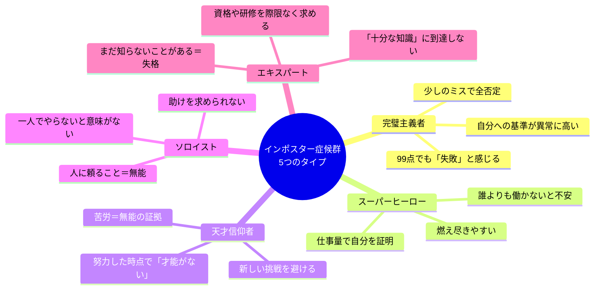
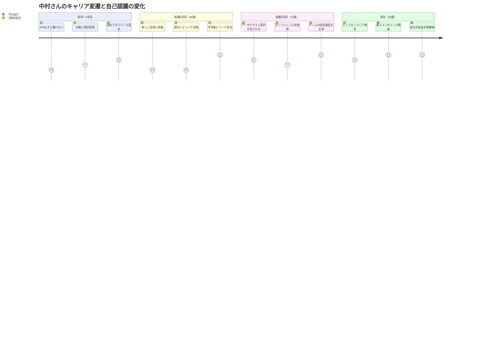
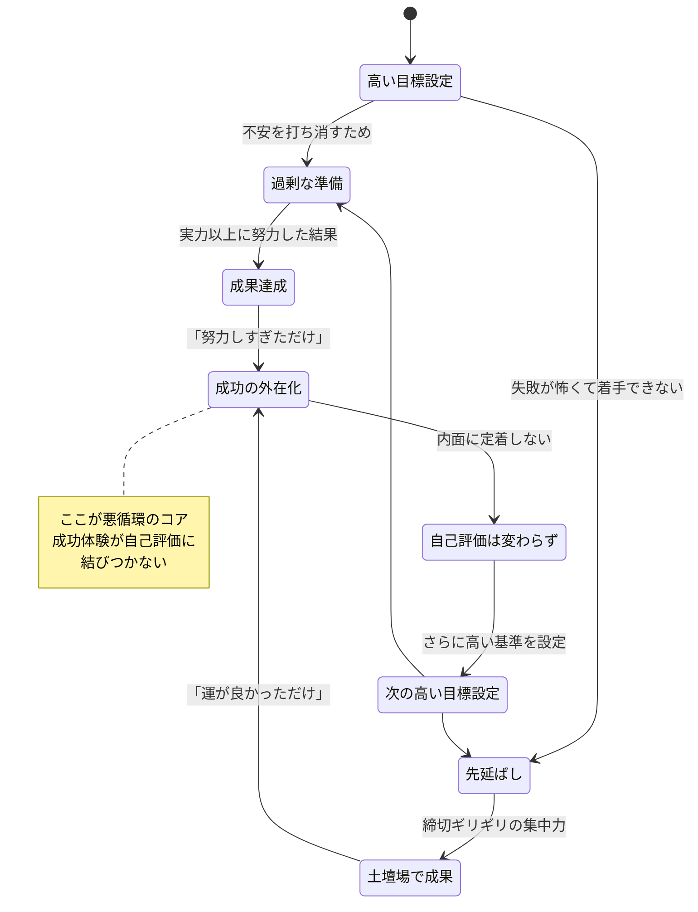

## 「この昇進、何かの間違いじゃないですか」

水曜日の夕方、佐々木美咲さん（仮名・30歳）は、上司の言葉を聞いた瞬間、体が固まった。

「来月からプロジェクトマネージャーをお願いしたい。美咲さんが適任だと思う」

嬉しいはずだった。3年間、誰よりも遅くまで資料を作り、クライアントとの関係を築いてきた。評価されてもおかしくない。頭ではわかっている。

でも、口から出た言葉は「ありがとうございます」ではなかった。

「あの……私で大丈夫でしょうか。もっと経験のある方がいらっしゃると思うんですが」

上司は笑って「謙虚だな」と言った。でも美咲さんの胸の内は、謙虚さとはまるで違うものだった。

**「いつかバレる」**

この一言が、昇進の喜びを塗りつぶしていた。

美咲さんの感覚は、単なる謙虚さではありません。**インポスター症候群**という、成功者ほど陥りやすい心理現象です。そして驚くことに、働く人の約70%が人生のどこかでこの感覚を経験しているという研究データがあります。

## あなたは「詐欺師」ではない——インポスター症候群の正体

1978年、心理学者のポーリン・クランスとスザンヌ・アイムスが提唱したこの概念は、当初は高学歴の女性に特有の現象と考えられていました。しかし、その後の研究で性別、年齢、職業を問わず広く見られることが明らかになっています。

国際行動科学ジャーナルに掲載されたレビュー論文（2011年）によると、**調査対象者の約70%が、キャリアのどこかの時点でインポスター感覚を経験**していました。ハーバード大学の新入生調査でも、入学後に「自分はここにふさわしくない」と感じた学生は70%を超えています。

つまり、あなたが感じている「場違い感」は、あなたの能力の低さを反映しているのではなく、人間の脳に組み込まれた認知の偏りなのです。

### インポスター症候群の5つのタイプ

クランス博士の後続研究により、インポスター症候群には5つのサブタイプがあることがわかっています。

## ケーススタディ1：昇進した美咲さんの6ヶ月

冒頭の美咲さんは、プロジェクトマネージャーに就任してから6ヶ月間、毎朝こんなことを考えていました。

**就任1ヶ月目：**「メンバーの方が自分より優秀。なぜ自分がリーダーなのか」
**就任3ヶ月目：**「プロジェクトがうまくいっているのはチームのおかげ。自分は何も貢献していない」
**就任5ヶ月目：**「次の四半期レビューで、上層部に実力がバレる」

美咲さんは典型的な「完璧主義者タイプ」でした。プロジェクトの成功率は92%。チームの満足度調査では部門トップ。それでも「たまたま優秀なメンバーに恵まれただけ」と自分の貢献を否定し続けていました。

転機は、社外のコーチングセッションで「成果ジャーナル」をつけ始めたことです。毎日、「今日自分が行った判断」と「その結果」を記録する。感情ではなく、事実だけを書く。

3週間後、美咲さんはノートを見返して涙を流しました。

「こんなにたくさんの判断を、自分がしていたんですね。チームが動いていたのは、メンバーの力だけじゃなかった。私が毎日、小さな判断を積み重ねていたからだったんだ」

6ヶ月後のインタビューで、美咲さんはこう語っています。

> 「インポスター症候群が完全に消えたわけじゃないんです。でも、あの声が聞こえたとき、ノートを開いて事実を確認できるようになった。**感情と事実は違う**ということを、体で理解できたのが一番大きかったと思います」

## ケーススタディ2：転職3回目の中村さん（35歳・エンジニア）

中村拓也さん（仮名・35歳）は、3回の転職を経て大手IT企業のシニアエンジニアに。年収は前職から200万円アップ。周囲からは「順調なキャリアだね」と言われる立場です。

しかし中村さんには、ずっと抱えていた秘密がありました。

**技術カンファレンスで登壇するたびに、前日は一睡もできない。**

「自分の知識なんて浅い。質疑応答で突っ込まれたら終わりだ」

中村さんは典型的な「エキスパートタイプ」のインポスターでした。技術書を月に5冊読み、オンラインコースを常に3つ並行受講。それでも「まだ足りない」という感覚が消えない。

中村さんの場合、転機は意外なところにありました。チームの新入社員メンタリングを担当したとき、新人が「中村さんみたいになりたいです」と言った。その瞬間、自分がかつての新人時代から、どれだけ成長したかを初めて客観視できたのです。

コーチングでは「タイムライン・エクササイズ」に取り組みました。自分のキャリアを時系列で書き出し、各時点で「できなかったこと」と「今できること」を並べる。

中村さんは言います。

> 「タイムラインを書き出したとき、8年前の自分が今の自分を見たら『すごい人だ』と思うだろうなと気づいた。でも渦中にいると、今の自分しか見えない。**成長は、振り返らないと見えない**んですよね」

## インポスター症候群の「悪循環」を断ち切るメカニズム

なぜインポスター症候群は、成功すればするほど強くなるのでしょうか。そこには明確なメカニズムがあります。

ポイントは「成功の外在化」です。成果が出ても「努力が異常だっただけ」「環境に恵まれただけ」と外部要因に帰属させてしまう。だから成功体験が積み重なっても、自己評価は一向に上がらない。むしろ「次はもっと頑張らないとバレる」と基準が上がり、悪循環が加速します。

## 克服への5つのステップ

インポスター症候群を「完全に消す」ことは目標にしません。それは非現実的です。目標は、**インポスターの声が聞こえたとき、それに支配されずに行動できるようになること**です。

### Step 1：成果ジャーナルをつける（毎日3分）

毎日、退勤前に3つだけ書く。

- **今日自分が下した判断**（例：「Aプランを提案した」）
- **その結果**（例：「クライアントが承認した」）
- **他者からの具体的なフィードバック**（例：「同僚に『わかりやすい資料だった』と言われた」）

感情ではなく事実を記録することが鍵です。「うまくいった気がする」ではなく、「売上が前月比15%増加した」と書く。

### Step 2：「十分」の基準を先に決める

完璧主義は、ゴールが動き続けるから苦しい。タスクに取りかかる前に「何ができたら十分か」を定義する。

- 資料作成：「要点が3つ伝わればOK」
- プレゼン：「質問に7割答えられればOK」
- プロジェクト：「期限内に8割の品質で納品できればOK」

この「十分ライン」を事前に紙に書いておく。達成したら、それ以上磨くのは「ボーナスタイム」と位置づける。

### Step 3：感情と事実を分離する

「自分はダメだと感じる」と「自分はダメである」は、まったく別の文です。

感情が湧いたとき、こう自問する。「この感情を裏付ける客観的な証拠は何か？」

多くの場合、証拠は見つかりません。見つかるのは、Step 1で記録した成功の事実です。

### Step 4：インポスターの声に名前をつける

認知行動療法の技法の一つです。内なる批判的な声に名前をつけることで、**自分自身と切り離す**ことができます。

美咲さんは内なる声を「ネガティブ部長」と名付けました。「あ、またネガティブ部長が会議に来た。聞くけど、採用はしない」と対処できるようになったそうです。

### Step 5：「成長の証拠」として受け入れる

インポスター症候群を感じるということは、あなたが**コンフォートゾーンの外に出ている証拠**です。新しい挑戦をしている証拠です。

もし一切の不安を感じないなら、それはあなたが成長を止めているサインかもしれません。不安を感じつつも行動できる——それが本当の自信です。

## ケーススタディ3：起業した田中さん（42歳・元大手メーカー管理職）

田中雄一さん（仮名・42歳）は、20年勤めた大手メーカーを退職し、コンサルティング会社を起業しました。前職では部長職。年収1,200万円。社内では「エース」と呼ばれていた。

しかし、起業してから最初の3ヶ月、田中さんは1件も受注できませんでした。

「やっぱり、大企業の看板があったから評価されていただけだ。自分個人には何の価値もなかったんだ」

田中さんは「スーパーヒーロータイプ」と「ソロイストタイプ」の複合でした。大企業時代は誰よりも長時間働き、すべてを一人で抱え込むスタイル。起業後も同じパターンで、営業からサービス設計まで一人で完璧にこなそうとして、何も進まなくなっていた。

コーチングで取り組んだのは「価値の棚卸し」です。田中さんが大企業で実際に行った判断、解決した問題、チームに与えた影響を一つずつ書き出しました。

書き出した結果、A4用紙で7枚分。

「こんなにやってたのか……」

さらに、前職の部下5人に匿名アンケートを実施。「田中さんから学んだこと」を聞いたところ、全員が具体的なエピソードとともに回答を寄せてくれました。

> 「20年間、『看板のおかげ』だと思っていた。でも部下たちの回答を読んで、**自分が提供していた価値は、看板ではなく自分自身のスキルと姿勢だった**と、ようやく腑に落ちました」

起業6ヶ月後、田中さんの月商は120万円に。「完璧でなくても動く。人に頼ることは弱さではない」と考えられるようになったことが、最大の変化だったそうです。

## インポスター症候群と「うまく付き合う」ということ

インポスター症候群は「治す」ものではなく、「付き合い方を変える」ものです。

[「比較」をやめられない脳との付き合い方](/blog/comparison-trap)でも触れていますが、人間の脳には他者と自分を比較する本能が組み込まれています。インポスター症候群も、根本は同じ脳の仕組みから来ています。

大切なのは、この声を**消す**ことではなく、**音量を下げる**ことです。

[フィードバックは「攻撃」ではない](/blog/feedback-mindset)の記事で紹介した「観察者の視点」も有効です。自分の感情を一歩引いて観察し、「ああ、インポスターが来ているな」と気づけるだけで、反応は大きく変わります。

そして、自分のスキルや強みを客観的に理解するために、[ストレングスファインダー活用術](/blog/strengths-finder)のようなアセスメントツールを使うことも効果的です。「自分の強みは何か」を感情ではなくデータで理解することで、インポスターの声に対抗する武器が手に入ります。

## 最後に：あなたは「ここにいていい」

もしあなたが今、「自分にはその資格がない」と感じているなら、一つだけ覚えておいてほしいことがあります。

**その感覚は、あなたが真剣に取り組んでいる証拠です。**

本当に能力がない人は、自分の能力不足を認識できません（ダニング=クルーガー効果）。「自分はまだ足りない」と感じられるということは、あなたが成長の途上にいる証拠であり、自分を客観視する知性を持っている証拠です。

今日、一つだけやってみてください。

退勤前に、「今日自分が行った判断」を1つだけ書き出す。それを1週間続ける。7日後、そのリストを見返したとき、あなたはきっと、自分が思っているよりもずっと多くのことを成し遂げている自分に気づくはずです。

---

**インポスター症候群に振り回される日々を変えたいあなたへ**

ライフ自己決定コーチングでは、あなたの「成果」と「感情」を丁寧に切り分け、客観的な自己評価を取り戻すサポートをしています。「なぜか自信が持てない」「昇進したのに不安が消えない」——その感覚には、必ず突破口があります。

[無料セッションに申し込む →](/sessions)
