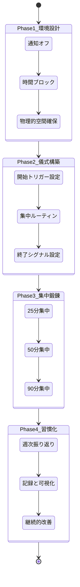
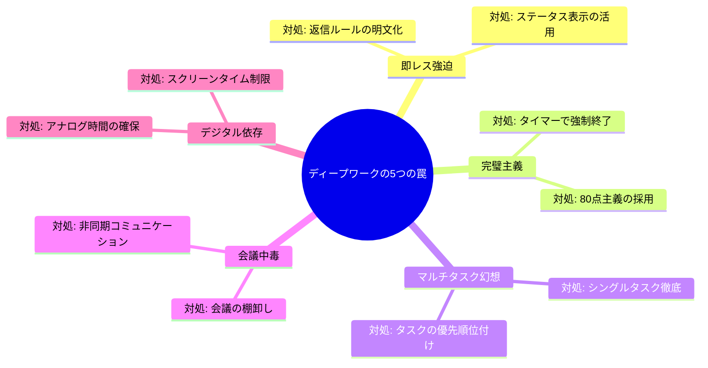

「すみません、ちょっといいですか？」――午前10時、企画書に没頭していた高橋翔太（32歳・IT企業プロジェクトマネージャー）の集中が途切れた。Slackの通知、上司からの電話、同僚の相談。気づけば午後3時。「今日、本当に進んだ仕事ってなんだっけ…」。手帳を見返しても、チェックがついたのは雑務だけ。肝心の企画書は3行しか書けていなかった。

この状況に心当たりがあるなら、あなたは「集中力の危機」の真っ只中にいます。

## 現代の集中力が直面する構造的な問題

カリフォルニア大学アーバイン校のGloria Mark教授の研究によると、現代のナレッジワーカーは平均して**11分に1回**作業を中断されます。そして、中断された集中状態に戻るには**23分**かかる。

計算してみましょう。8時間の勤務中、1時間あたり約5回中断されるとすると、**本当に集中できている時間は1日わずか1〜2時間**という計算になります。

```mermaid
timeline
    title ある日の「集中」の実態（8時間勤務）
    section 午前
      9:00 : メールチェック30分
      9:30 : 企画書に着手
      9:45 : Slack通知で中断
      10:00 : 定例会議（1時間）
      11:00 : 企画書再開 → 15分で上司から電話
      11:30 : 昼前の雑務処理
    section 午後
      13:00 : 企画書3度目の着手
      13:20 : 同僚からの相談
      14:00 : 別件の会議
      15:00 : メール返信の嵐
      16:00 : やっと集中… → もう退勤準備
      17:00 : 「今日何やったっけ？」
```

これはあなたの意志力の問題ではありません。**環境の構造的な問題**です。

## ディープワークとは何か――カル・ニューポートの提唱

コンピューターサイエンティストのカル・ニューポートが著書『Deep Work』で提唱した概念。定義はこうです。

> **「認知能力の限界まで使い、注意散漫のない状態で行う、プロフェッショナルな活動」**

対義語は**シャローワーク**。メール返信、会議出席、書類整理など、集中力をほとんど必要としない業務を指します。

ニューポートの核心的な主張はシンプルです。

**「ディープワークの能力は、まさに21世紀のスーパーパワーである」**

なぜか？ 3つの理由があります。

### 理由1: AIに代替されにくい

定型業務はAIが処理する時代です。しかし、深い思考を要する創造的な仕事――新しいアーキテクチャの設計、複雑な問題の本質を見抜く分析、人の心を動かす企画――これらは依然として人間のディープワークの領域です。

[AI時代の「質問力」](/blog/ai-prompt-engineering)で触れたように、AIは強力なツールですが、**何を問うべきかを決めるのは深い思考**です。

### 理由2: 希少性が急速に高まっている

オープンオフィス、常時接続のチャットツール、「即レス文化」。現代の職場環境は、ディープワークを妨げる方向に最適化されています。だからこそ、集中できる人材の市場価値は相対的に上がり続けています。

### 理由3: 少ない時間で圧倒的な成果が出る

ニューポートの公式はこうです。

**質の高いアウトプット = 集中した時間 x 集中の深さ**

ダラダラ8時間より、完全集中の2時間の方が成果が出る。これは精神論ではなく、認知科学が裏付ける事実です。

## ケーススタディ1: 「会議漬け」から脱出したPMの変革

**佐藤明日香（35歳・SaaS企業プロダクトマネージャー）の場合**

佐藤さんの1週間は会議で埋め尽くされていました。月曜から金曜まで、1日平均6時間の会議。残りの2時間で企画書作成、データ分析、チームへの指示出しをこなそうとしていました。

「毎日21時まで残業しているのに、肝心のプロダクト戦略が全然進まない。このままだとチーム全体が迷走する」

佐藤さんが実行した3つの変更:

1. **火曜と木曜の午前を「会議禁止ゾーン」に設定** → カレンダーに「ディープワーク」ブロックを予約し、チーム全体に共有
2. **会議の棚卸し** → 週30時間の会議を精査し、「出席不要」「メモ共有で代替」を仕分け。結果、週18時間に削減
3. **集中環境の整備** → 会議室を1人で予約し、Slackの通知を完全オフ。ノイズキャンセリングイヤホンを常備

**3ヶ月後の結果:**

- プロダクトロードマップの策定期間: 3週間 → 1週間
- 残業時間: 月60時間 → 月20時間
- チーム満足度スコア: 3.2 → 4.1（5点満点）

「以前は『忙しい=頑張っている』と思い込んでいました。でもディープワークを始めて気づいたんです。**忙しさは成果の指標じゃない**って」

## ディープワーク実践の4フェーズ・フレームワーク



### Phase 1: 環境設計 ――「意志力に頼らない」仕組みを作る

ディープワークの最大の敵は、あなたの意志力の弱さではなく、**注意を奪う環境設計**です。

**具体的なアクション:**

- **時間ブロック**: カレンダーに「ディープワーク」を会議と同格で予約する。おすすめは**午前9時〜11時**。起床後2〜4時間が脳のゴールデンタイムです
- **通知の完全遮断**: スマホはサイレント＋裏返し。PCの通知はすべてオフ。Slackは「集中モード」に設定
- **物理的空間**: 可能なら個室。無理なら会議室予約、カフェ移動、ノイズキャンセリングイヤホン

[朝の「ゴールデンタイム」](/blog/morning-routine)を活用すると、ディープワークの効果はさらに高まります。

### Phase 2: 儀式構築 ――脳に「集中モード」のスイッチを入れる

儀式（ルーティン）は、脳に「今から集中する」と知らせるトリガーです。アスリートが試合前にルーティンを持つのと同じ原理です。

**儀式の例:**

- 同じ場所に座る
- 同じ飲み物を用意する（コーヒー、ハーブティーなど）
- 同じ音楽（環境音楽・ホワイトノイズ）を再生する
- デスク上の不要な物を片付け、「今日の最重要タスク1つ」をポストイットに書いて貼る
- 5分間の深呼吸で精神を整える

**終了の儀式も重要です。** 集中セッションの最後に「次に何をやるか」をメモしておくと、次回のセッション開始がスムーズになります。作家ヘミングウェイも「文章の途中で書くのをやめる」というテクニックを使っていました。

### Phase 3: 集中鍛錬 ――筋トレのように段階的に負荷を上げる

集中力は筋肉と同じです。いきなりフルマラソンは走れません。

**段階的なトレーニングプラン:**

| ステージ | 集中時間 | 休憩 | 目安期間 |
|---------|---------|------|---------|
| 入門 | 25分 | 5分 | 1〜2週間 |
| 初級 | 50分 | 10分 | 2〜4週間 |
| 中級 | 90分 | 20分 | 1〜2ヶ月 |
| 上級 | 120分 | 30分 | 3ヶ月以降 |

[ポモドーロ・テクニック](/blog/pomodoro-technique)の25分サイクルから始めるのが最も取り組みやすい方法です。

**退屈を許容するトレーニング**: 電車の待ち時間、エレベーターの中、信号待ち。こうした「隙間時間」にスマホを見ない練習をしましょう。退屈に耐える力が、集中力の土台を作ります。

### Phase 4: 習慣化 ――記録と振り返りで定着させる

**記録すべき指標:**

- ディープワークの時間（分単位で記録）
- 取り組んだタスクと達成度
- 集中が途切れた原因（外的要因 vs 内的要因）

**週次振り返りの質問:**

1. 今週のディープワーク合計時間は？（目標: 週10〜15時間）
2. 最も集中できた日の条件は？
3. 来週改善できるポイントは？

## ケーススタディ2: フリーランスエンジニアの「生産性3倍」の軌跡

**中村拓也（28歳・フリーランスWebエンジニア）の場合**

中村さんはフリーランス3年目。複数のクライアントを抱え、毎日12時間以上PCに向かっていました。しかし、実際にコードを書いている時間を計測してみると、衝撃の結果が出ました。

「12時間のうち、本当にコーディングに集中していたのは**2時間半**。残りはSlackの返信、見積もり作成、SNSの巡回、なんとなくのブラウジング…。正直ショックでした」

中村さんが導入したディープワーク・システム:

1. **午前中（9:00-12:00）を「コーディング専用タイム」に固定** → クライアントには「午前中は返信が遅れます」と事前告知
2. **RescueTimeで作業を自動計測** → 「集中時間」と「非集中時間」を可視化
3. **週3回、カフェを「サテライトオフィス」として利用** → 自宅の誘惑（ベッド、テレビ、冷蔵庫）から物理的に離れる
4. **SNSは14時と18時の1日2回だけ** → ブラウザからSNSのブックマークを削除

**6ヶ月後の変化:**

| 指標 | Before | After |
|------|--------|-------|
| 1日の集中コーディング時間 | 2.5時間 | 5.5時間 |
| 月間完了プロジェクト数 | 2件 | 4件 |
| 月収 | 55万円 | 95万円 |
| 労働時間 | 12時間/日 | 8時間/日 |
| クライアント満足度 | 普通 | 高い（リピート率90%） |

「労働時間は減ったのに、収入は1.7倍になりました。今まで**時間を売っていた**のが、**集中力を売る**ように変わったんです」

## ケーススタディ3: 子育て中の時短勤務ワーカーが見つけた「2時間の武器」

**田中美咲（38歳・メーカー経理部・時短勤務）の場合**

田中さんは小学2年生と年中の2人の子供を育てながら、時短勤務（10:00-16:00）で働いていました。

「フルタイムの同僚は8時間ある。私は6時間。でも会議や雑務は同じ量を求められる。決算期は毎回『もう無理…』って泣きそうになっていました」

田中さんの戦略:

1. **10:00-12:00を「聖域」として死守** → 上司と交渉し、この時間帯の会議を免除してもらう代わりに、午後に会議を集中配置
2. **決算作業の分解** → 大きなタスクを「25分で完了できる単位」に分割し、毎朝3つだけピックアップ
3. **「やらないことリスト」の作成** → 出席不要の会議、CC止まりのメール確認、完璧な体裁の資料作りを排除

**結果:**

- 決算処理の所要日数: 12日 → 7日
- 残業（持ち帰り仕事）: 月15時間 → 月3時間
- 上司からの評価: 「田中さんの仕事は速くて正確」 → 翌年、フルタイム復帰時に昇格

「時間が少ないことがむしろ武器になった。**限られた時間だからこそ、集中するしかない**。その覚悟がディープワークの本質だったんです」

[「やらないことリスト」](/blog/not-to-do-list)は、ディープワークの環境を守るために極めて有効なツールです。

## ディープワークを阻む「5つの罠」と対処法



### 罠1: 即レス強迫 ――「すぐ返信しないと評価が下がる」

**現実:** Slackの返信が30分遅れて怒る上司は、マネジメントに問題があります。本当に緊急なら電話が来ます。

**対処法:** 「午前中は集中タイムのため、返信は12時以降になります」とステータスに明記する。最初は勇気がいりますが、成果で証明すれば誰も文句を言いません。

### 罠2: 完璧主義 ――「もう少しだけ…」で終われない

**対処法:** タイマーが鳴ったら途中でも手を止める。完璧を目指す時間を、次のタスクの集中に回す方が総合的な成果は上がります。

### 罠3: マルチタスク幻想 ――「同時にやれば効率的」

脳は実際にはタスクを「高速切り替え」しているだけで、切り替えのたびに認知コストが発生します。研究によると、マルチタスクは生産性を**最大40%低下**させます。

### 罠4: 会議中毒 ――「とりあえず集まろう」文化

**対処法:** 会議の前に「この会議のゴールは何か？メールやチャットで代替できないか？」を自問する。組織全体でこの文化を変えるのは難しいですが、自分の裁量の範囲から始められます。

### 罠5: デジタル依存 ――無意識のスマホチェック

**対処法:** ディープワーク中はスマホを別の部屋に置く。「視界に入るだけ」で注意の一部が持っていかれることが、テキサス大学の研究で明らかになっています。

## 実践ロードマップ: 今日から始める7日間

| Day | アクション | 所要時間 |
|-----|----------|---------|
| Day 1 | 自分の「集中時間」を1日計測する（ストップウォッチ使用） | 計測のみ |
| Day 2 | 明日の午前中に「ディープワーク1時間」をカレンダーに予約 | 1分 |
| Day 3 | 初回ディープワーク実施。通知オフ、1タスクに集中 | 1時間 |
| Day 4 | 振り返り。集中できた？途切れた原因は？ | 10分 |
| Day 5 | 環境改善を1つ実施（場所変更、イヤホン導入など） | 適宜 |
| Day 6 | ディープワーク2回目。前回の改善点を反映 | 1時間 |
| Day 7 | 1週間の振り返り。来週のディープワーク計画を立てる | 15分 |

## ディープワークがもたらす「集中」以上のもの

ディープワークの実践者が口を揃えて語るのは、生産性の向上だけではありません。

**「フロー状態」への到達** ――心理学者ミハイ・チクセントミハイが提唱した、完全没入の状態。時間の感覚が消え、自己と作業が一体化する。この体験そのものが、人間にとって最も深い満足感をもたらすと言われています。

**「意味のある仕事をした」という実感** ――1日の終わりに「今日は何を成し遂げたか」を明確に答えられる。この感覚が、慢性的な疲労感や「忙しいのに空しい」という現代病への処方箋になります。

**決断疲れの軽減** ――[決断疲れ](/blog/decision-fatigue)で消耗するエネルギーを、環境設計と儀式で節約できる。意志力を「何に集中するか」の判断に使うのではなく、集中そのものに投入できるようになります。

## まとめ: 集中力は「才能」ではなく「技術」

ディープワークは一部の天才のための特殊能力ではありません。環境を設計し、儀式を構築し、段階的に鍛え、習慣として定着させる。誰でも実践できる**技術**です。

最初は1日1時間で十分です。その1時間が、あなたのダラダラ8時間より価値のある成果を生み出します。

明日の午前中、最も重要な仕事を1つだけ選び、通知を切って取り組んでみてください。きっと、「こんなに進むのか」と驚くはずです。

---

## 集中力を武器にしたいあなたへ

「ディープワークを試してみたいけど、自分の仕事にどう取り入れればいいかわからない」「会議が多すぎて時間が取れない」――そんな方のために、**体験セッション（無料）**であなたの1日のスケジュールを一緒に分析し、ディープワークを組み込む具体的なプランを設計します。

[あなた専用のディープワーク・プランを作る](/sessions)
