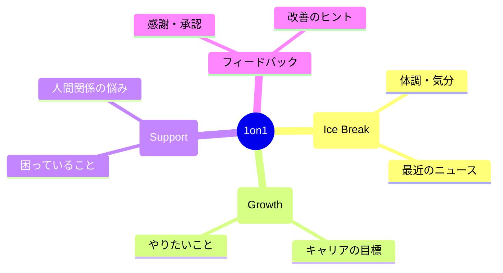

## 1on1を無駄にしていませんか

「今週どうだった？」「特に問題ないです」「じゃあまた来週」

こんな1on1を繰り返していませんか？

1on1は、使い方次第であなたのキャリアを大きく加速させる武器になります。
しかし多くの人が、その可能性を活かしきれていません。

## 1on1の本当の価値

### 1. 上司との関係構築

日常業務では見せられない自分の考えや悩みを共有できる場。
信頼関係が深まれば、重要な仕事を任されやすくなります。

### 2. フィードバックの獲得

評価面談を待たずに、リアルタイムでフィードバックをもらえる。
軌道修正が早くでき、成長スピードが上がります。

### 3. キャリアの方向性を示す

自分がどこを目指しているかを上司に伝えることで、適切な機会を与えてもらいやすくなります。

## 1on1を最大化する5つの準備

### 1on1 構造化マップ

### 準備1: アジェンダを事前に用意する

話したいことをリストアップしておく。

- 報告したいこと
- 相談したいこと
- フィードバックが欲しいこと
- 提案したいこと

準備がないと、場当たり的な会話で終わります。

### 準備2: 具体的な質問を用意する

「何かアドバイスありますか？」では曖昧すぎる。

- 「このプロジェクトで私が改善すべき点は何ですか？」
- 「次のステップに進むために、何を身につけるべきですか？」
- 「この提案の懸念点は何ですか？」

具体的な質問が、具体的な答えを引き出します。

### 準備3: 成果を可視化する

「頑張りました」ではなく、数字で示す。

- 「先週、10件の案件をクロージングしました」
- 「改善により処理時間を30%削減しました」

上司に自分の価値を認識してもらうチャンスです。

### 準備4: 課題は解決案とセットで

問題を持ち込むだけでなく、自分なりの解決案も用意する。

「Aの問題が発生しています。私はBという対策を考えていますが、ご意見いただけますか？」

主体性を示すことで、信頼が高まります。

### 準備5: キャリアの話も定期的に

業務の話だけでなく、中長期のキャリアについても話す。

「3年後にはこういう役割を担いたいと考えています」
「そのために、こういう経験を積みたいです」

上司はあなたの代わりにキャリアを考えてくれません。
自分から発信することが重要です。

## 今日からできること

次の1on1の前に、10分だけ準備の時間を作ってください。
話したいこと、聞きたいことを3つ書き出すだけで、会話の質が変わります。
