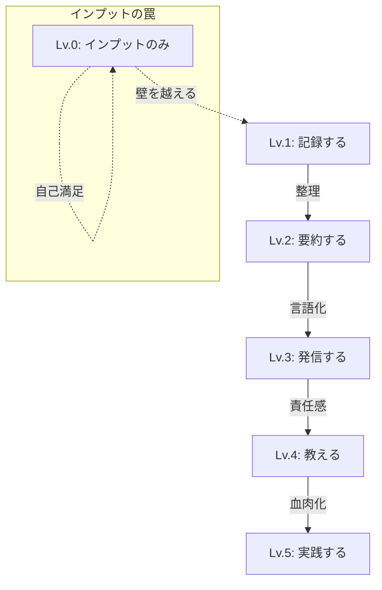

## 学んでいるのに成長しない

本を月に10冊読む。
ビジネス系YouTubeを毎日チェック。
セミナーにも積極的に参加。

なのに、なぜか成長している実感がない。

心当たりはありませんか？

## インプット中毒の正体

### 学んだ「気になる」罠

情報を取り入れると、脳は「何かを達成した」と錯覚します。
ドーパミンが分泌され、満足感を得られる。

でも実際は、何も変わっていません。

### 消費者のままでいる

インプットは基本的に「消費」行為。
生産者（アウトプットする人）にならない限り、価値は生まれません。

### 行動回避の言い訳

「もう少し勉強してから」「準備ができてから」
インプットを続けることで、行動しない自分を正当化しています。

## なぜアウトプットが重要なのか

### 1. 理解が深まる

人に説明しようとすると、自分の理解の曖昧さに気づきます。
アウトプットは、最強のインプット確認法です。

### 成長への階梯：アウトプットの5段階

### 2. 記憶に定着する

ラーニングピラミッドによると、講義を聞くだけの定着率は5%。
他者に教えると90%に上がります。

### 3. フィードバックが得られる

アウトプットすることで、他者からの反応が返ってきます。
その反応が、次の学びにつながります。

### 4. 信頼が築かれる

発信する人は専門家として認知されます。
同じ知識でも、発信している人が選ばれます。

## アウトプットの具体的方法

### レベル1: 記録する

読んだ本のメモを取る。
学んだことを箇条書きにする。
これだけでも、ただ読むよりずっと効果的。

### レベル2: 要約する

学んだことを、自分の言葉で要約する。
「この本のポイントを3つにまとめると…」

### レベル3: 発信する

SNS、ブログ、Note、YouTube。
媒体は何でも構いません。
公開することで、責任感が生まれ質が上がります。

### レベル4: 教える

学んだことを誰かに教える。
勉強会を開く、後輩に説明する、家族に話す。
最も効果的なアウトプット方法です。

### レベル5: 実践する

学んだことを仕事やプライベートで実践する。
これが最終的なゴールです。

## 今日からのルール

「3:7の法則」を意識してください。

インプット3割、アウトプット7割。

本を読んだら、SNSに3つのポイントを投稿する。
セミナーに参加したら、翌日誰かに話す。

学びは使って初めて、あなたの力になります。
