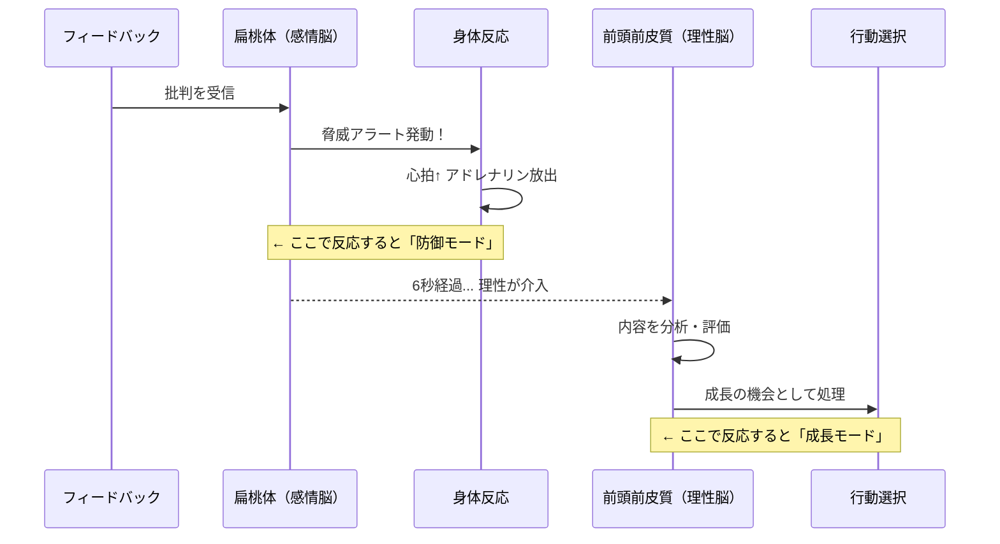

「田村さん、この企画書なんだけど…ちょっとターゲットがぼやけてない？」――上司の一言で、田村彩花（29歳・広告代理店プランナー）の頭が真っ白になった。心臓がバクバクする。顔が熱くなる。頭の中では自動的に言い訳が回り始める。「先週の修正指示と矛盾してるじゃないですか」「データ不足はクライアント側の問題で…」。その日の帰り道、田村さんはイヤホンから流れる音楽も耳に入らないまま、ずっとあの一言をリプレイしていた。

フィードバックを受けた瞬間に心が閉じる。この経験は、あなたにもあるのではないでしょうか。

## フィードバックで「戦闘モード」に入る脳の仕組み

批判を受けたとき、私たちの脳では何が起きているのか。それを理解するだけで、反応の仕方は劇的に変わります。

### 扁桃体ハイジャック ――6秒間の嵐

脳の扁桃体は、原始時代から「脅威を検知するセンサー」として機能してきました。問題は、**社会的な批判も「サーベルタイガーに遭遇した」のと同じ脅威として処理してしまう**ことです。

批判を受けた瞬間、扁桃体が発火し、アドレナリンとコルチゾールが放出される。心拍数が上がり、筋肉が緊張し、思考は「戦うか逃げるか」の二択に狭窄する。この状態で冷静な判断ができるはずがありません。

しかし、ここに希望があります。この扁桃体の反応は**約6秒間**でピークを迎え、その後は前頭前皮質（理性の司令塔）が介入できるようになります。



### フィードバックが「攻撃」に感じる3つの心理メカニズム

**1. アイデンティティの脅威**
「この資料は改善の余地がある」を、「お前は無能だ」と変換してしまう。行動への評価を、存在への否定と混同する。

**2. 確証バイアス**
自分が「ダメかもしれない」と内心感じている部分を指摘されると、「やっぱり自分はダメなんだ」と確証バイアスが強化される。

**3. 過去のトラウマ**
学校での理不尽な叱責、前職でのパワハラ的なフィードバック。過去の経験が、現在のフィードバック全般に対する警戒心を作り上げている。

これらは[インポスター症候群](/blog/imposter-syndrome)とも深く関連しています。自分の価値を過小評価する傾向がある人ほど、フィードバックを「証拠」として受け取ってしまいがちです。

## フィードバック・マスタリーの5ステップ・メソッド

```mermaid
journey
    title フィードバックを受けたときの理想的な心理プロセス
    section Step 1: 一時停止
      批判を受けた瞬間: 2: 自分
      6秒間の深呼吸: 3: 自分
      扁桃体の反応が落ち着く: 4: 自分
    section Step 2: 分離
      行動と存在を切り離す: 4: 自分
      客観的に内容を眺める: 5: 自分
    section Step 3: 探求
      好奇心モードに切り替え: 5: 自分
      質問で深掘りする: 5: 自分
    section Step 4: 感謝
      フィードバックの価値を認識: 5: 自分
      相手への感謝を伝える: 5: 自分
    section Step 5: 選別
      取り入れるべき内容を選ぶ: 5: 自分
      アクションプランを立てる: 5: 自分
```

### Step 1: 一時停止 ――「6秒ルール」を体に覚えさせる

批判を受けた瞬間、**すぐに反応しない**。これが最も重要なスキルです。

具体的なテクニック:
- **深呼吸を1回**する（4秒吸って、4秒止めて、4秒吐く）
- 心の中で**「なるほど」と唱える**（反論の代わりに）
- **メモを取る動作**を始める（ペンを持つことで「聞くモード」に切り替わる）

やってはいけないこと:
- 即座に反論する
- 表情を険しくする
- 腕を組む（無意識の防御姿勢）

### Step 2: 分離 ――「行動」と「存在」を切り離す

フィードバックが向けられているのは、あなたの**行動・成果物**であって、あなたの**人格・存在価値**ではありません。

**リフレーミングの練習:**

| 脳の自動変換（誤） | 正しい解釈 |
|------------------|-----------|
| 「お前はダメだ」 | 「この資料のこの部分は改善できる」 |
| 「能力がない」 | 「このスキルをもっと伸ばせる」 |
| 「信頼されていない」 | 「期待されているからこそ指摘してくれた」 |
| 「もう終わりだ」 | 「次の改善ポイントが明確になった」 |

### Step 3: 探求 ――防御モードから好奇心モードへ

「守る」から「学ぶ」にスイッチを切り替える。その武器が**質問**です。

**効果的な質問テンプレート:**
- 「具体的にはどの部分がそう感じましたか？」
- 「改善するとしたら、どの方向性がいいと思いますか？」
- 「同じ状況で、〇〇さんならどうされますか？」
- 「優先順位をつけるとしたら、まずどこから手をつけるべきですか？」

質問することで、「対立」が「対話」に変わります。フィードバックする側も「ちゃんと受け止めてくれている」と感じ、より具体的で建設的な情報を出してくれるようになります。

### Step 4: 感謝 ――フィードバックのコストを理解する

ここで重要な事実を認識しましょう。**フィードバックをくれる人は、リスクを取っている**のです。

- 嫌われるリスク
- 関係が悪くなるリスク
- 「面倒くさい人」と思われるリスク

多くの人は、これらのリスクを避けて「何も言わない」を選びます。言ってくれる人は、あなたの成長を期待しているか、あるいは組織のために勇気を出しているかのどちらかです。

だから、内容に同意するかどうかに関係なく、**まず「ありがとうございます」と伝える**。これだけで、フィードバックの流れが劇的に変わります。

### Step 5: 選別 ――すべてを受け入れる必要はない

フィードバックは「仮説」です。すべてが正しいとは限りません。

**フィードバック評価の3つのフィルター:**

1. **信頼性**: この分野に知見がある人からの指摘か？
2. **具体性**: 抽象的な批判ではなく、実行可能な改善提案があるか？
3. **一貫性**: 複数の人から同じ指摘を受けているか？

3つすべてに該当するフィードバックは、高い確率で「取り入れるべき金の情報」です。1つしか該当しない場合は、参考程度に留めて問題ありません。

## ケーススタディ1: 「ダメ出しの嵐」をキャリアの転機に変えたデザイナー

**小林健太（31歳・UIデザイナー）の場合**

小林さんは、転職先のテック企業でデザインレビュー文化の洗礼を受けました。

「前の会社ではデザインレビューなんてなかった。新しい会社で初めて出したデザインに、チーム全員から15個のフィードバックが来たんです。正直、**目の前が真っ暗になりました**」

最初の3ヶ月間、小林さんは毎回のレビューで胃が痛くなり、週末も指摘内容が頭から離れない状態でした。

転機は、シニアデザイナーの先輩の一言。

「健太くん、フィードバックが15個来るのは、みんなが君のデザインを**ちゃんと見ている**からだよ。本当にダメだと思ったら、誰も何も言わない」

この言葉をきっかけに、小林さんはフィードバックへのアプローチを変えました。

**変更したこと:**

1. **フィードバックノートの作成** → 受けた指摘をすべて記録し、「すぐ対応」「検討」「保留」に分類
2. **レビュー前の「プレレビュー」** → 信頼できる先輩に事前に見せて、大きな問題を先に潰す
3. **月次の振り返り** → 1ヶ月前の指摘と現在の指摘を比較し、成長を可視化

**1年後の結果:**

- レビューでの指摘数: 平均15個 → 平均3個
- デザイン採用率: 40% → 85%
- チーム内評価: 「伸びしろがある新人」→ 「最も成長速度が速いデザイナー」
- 給与: 年収480万円 → 600万円（社内等級が2段階アップ）

「あのとき逃げなくてよかった。**フィードバックは攻撃じゃなくて、地図だった**んです。自分がどこにいて、どこに向かえばいいかを教えてくれる地図」

## ケーススタディ2: フィードバックを「求める側」に回った営業マネージャー

**鈴木大輔（42歳・法人営業マネージャー）の場合**

鈴木さんは営業成績では常にトップクラス。しかし、マネージャーに昇格してからチームの離職率が高く、360度評価で「部下への共感力が低い」「一方的な指示が多い」という厳しい結果を受けました。

「20年間、数字で評価されてきた。急に『共感力が足りない』と言われても、何をどうすればいいのかわからなかった」

鈴木さんが実行した「フィードバックを求める」プロジェクト:

1. **毎週金曜日の15分面談** → 部下一人ひとりに「今週の自分のマネジメントで、改善すべき点は？」と直接聞く
2. **匿名アンケートの月次実施** → 直接言いにくいことも拾い上げる仕組みを作る
3. **「今日のマネジメント日記」** → 毎日、自分のコミュニケーションを振り返り3行メモ

最初は部下も戸惑いました。「急にどうしたんですか？」という反応がほとんど。しかし、鈴木さんが本気でフィードバックを受け止め、**翌週には必ず改善行動を見せた**ことで、少しずつ本音のフィードバックが出てくるようになりました。

**1年後の変化:**

| 指標 | Before | After |
|------|--------|-------|
| チーム離職率 | 年30% | 年5% |
| 360度評価（共感力） | 2.1/5.0 | 4.2/5.0 |
| チーム営業達成率 | 92% | 118% |
| 部下の昇格者数 | 0人 | 3人 |

「**フィードバックを求めることは、弱さの証明じゃなくて、強さの証明だった。** 自分の不完全さを認められるリーダーにしか、部下は本音を言わない。そしてチームの本音がわかって初めて、本当のマネジメントが始まるんだと学びました」

## ケーススタディ3: クライアントの「クレーム」を製品改善に変えたPM

**岡田恵美（34歳・BtoB SaaS プロダクトマネージャー）の場合**

岡田さんが担当する業務管理SaaSに、大口クライアントから厳しいフィードバックが入りました。

「使いにくい」「UIが直感的じゃない」「前のツールの方がマシだった」

チーム全体の士気が下がりました。半年かけて開発した機能を全否定された気分だったからです。

岡田さんのアプローチ:

1. **「批判」を「データ」に変換** → クライアントの不満を機能単位で分解し、影響度×頻度のマトリックスで優先順位付け
2. **クライアントを「共同開発者」に招待** → 月1回のユーザーインタビューを設定し、改善プロトタイプを一緒にレビュー
3. **チームへの共有方法を変更** → 「クレームが来た」ではなく「貴重なユーザーインサイトが得られた」というフレーミングで伝達

**結果:** 6ヶ月後、そのクライアントの利用率は2倍に。さらに「一緒に改善できるプロダクト」として紹介が発生し、同業界から3社の新規契約を獲得しました。

## フィードバックを「求める」ための実践テンプレート

最も成長が早い人は、フィードバックを待つのではなく**求める**人です。

**日常で使える質問テンプレート:**

| シーン | 質問例 |
|-------|-------|
| 会議の後 | 「さっきの会議での私の発言、何か気になる点ありましたか？」 |
| プレゼン後 | 「特にわかりにくかった部分はどこですか？」 |
| プロジェクト完了時 | 「次に同じ案件をやるとしたら、何を変えるべきだと思いますか？」 |
| 1on1ミーティング | 「最近の私のコミュニケーションで、改善すべき点は？」 |
| 自己評価の時期 | 「自分では気づいていない、改善の余地があるポイントはありますか？」 |

**ポイント:** 漠然と「何かフィードバックありますか？」ではなく、**具体的な場面や行動を指定して聞く**。相手も答えやすくなり、具体的なフィードバックが返ってきます。

## フィードバック耐性を高める「日常トレーニング」

フィードバックへの耐性は、日常の小さな練習で鍛えられます。

**レベル1（初級）: 小さなフィードバックを求める**
- レストランで「この料理、もう少しこうだったら最高です」と伝える練習
- 友人に「正直、この服どう思う？」と聞く

**レベル2（中級）: 仕事でフィードバックを求める**
- 作成した資料について、提出前に同僚に「率直な意見」を求める
- 会議後に1人に「改善点ありましたか？」と聞く

**レベル3（上級）: ネガティブフィードバックを歓迎する**
- 「もっと厳しく言ってください」と明示的に依頼する
- フィードバックを受けたら、まず「ありがとう」と言ってからメモを取る

[レジリエンス（回復力）](/blog/resilience)の記事で解説した「心理的な回復力」は、フィードバック耐性の土台になります。

## 組織としてのフィードバック文化を作る

個人のスキルだけでなく、**フィードバックが安全に行える文化**があるかどうかも重要です。

Google社の「Project Aristotle」で明らかになった、高パフォーマンスチームの最大の特徴は**心理的安全性**。つまり「率直に意見を言っても罰せられない」という信頼感です。

**チームリーダーができること:**
- 自分自身が率先してフィードバックを求める姿を見せる
- 「いいフィードバックをくれてありがとう」と公の場で感謝する
- フィードバックによる改善事例を共有し、その価値を可視化する

## まとめ: フィードバックは「地図」である

フィードバックは攻撃ではありません。**あなたが今どこにいて、どこに向かえばいいかを示す地図**です。

地図を破り捨てれば、目的地にはたどり着けません。地図を読めるようになれば、どんな場所からでも成長への最短ルートが見えてきます。

今日、信頼できる人に1つだけ聞いてみてください。

「最近の私について、率直に改善すべき点はありますか？」

その一歩が、あなたの成長を加速させるフィードバック・ループの始まりになります。

---

## フィードバックを「武器」に変えたいあなたへ

「頭ではわかっていても、実際にフィードバックを受けると感情的になってしまう」「自分の場合、具体的にどうすればいいのかわからない」――そんな方のために、**体験セッション（無料）**であなたのフィードバック・パターンを一緒に分析し、明日から使える受け止め方を練習します。

[フィードバック力を高めるセッションに申し込む](/sessions)
