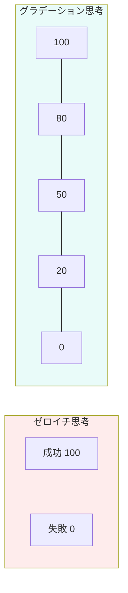

## 白か黒かで判断していませんか

「このプロジェクトは成功？失敗？」
「この人は味方？敵？」
「この判断は正しい？間違い？」

物事を二択で考える「ゼロイチ思考」は、わかりやすい反面、現実を歪めてしまいます。

## ゼロイチ思考の弊害

### 二極化 vs グラデーション

### 1. 極端な結論に至る

「一度の失敗」が「完全な失敗」になる。
「少しの批判」が「全否定」に感じる。

グラデーションを見落とし、極端な解釈をしてしまいます。

### 2. 柔軟性を失う

白か黒かしかないと、中間の選択肢が見えなくなる。
第三の道、妥協点、ハイブリッドな解決策を見逃します。

### 3. 人間関係が悪化する

「味方じゃないなら敵」という思考は、関係を分断します。
ある点では意見が合い、別の点では合わない――それが人間関係の常なのに。

### 4. 自己評価が不安定になる

「できた自分」と「できなかった自分」で評価が乱高下する。
安定した自尊心が築けません。

## グラデーション思考への転換

### 転換1: 「どの程度か」で考える

「成功か失敗か」ではなく「何%達成したか」。
「できるかできないか」ではなく「どこまでできるか」。

量的な評価を取り入れることで、より正確に現実を把握できます。

### 転換2: 「部分」と「全体」を分ける

一部がダメでも、全部がダメとは限らない。

- プレゼンの内容は良かったが、時間配分が悪かった
- この料理は味は良いが、盛り付けが改善できる
- この人は仕事はできるが、コミュニケーションに課題がある

分解することで、正確な評価ができます。

### 転換3: 「今」と「未来」を分ける

今できなくても、未来できるようになる可能性がある。

「永遠にできない」ではなく「まだできない」。
グロースマインドセットと組み合わせて考えます。

### 転換4: 複数の軸で評価する

一つの軸（成功/失敗）ではなく、複数の軸で評価する。

- 結果は不満だが、プロセスでは学びがあった
- 数字は達成したが、チームの疲弊が心配
- 短期的には損したが、長期的には関係が築けた

## 言葉を変える

思考を変えるには、言葉を変えるのが効果的です。

| ゼロイチ表現 | グラデーション表現 |
|------------|------------------|
| 失敗した | 60%は達成した |
| 嫌いな人 | 価値観が合わない部分がある人 |
| ダメな自分 | この点は改善の余地がある自分 |
| 無理 | 今のやり方では難しい |

言葉が変わると、解釈が変わります。
解釈が変わると、行動が変わります。

今日から、「100%か0%か」ではなく、「今、何%か」で考えてみてください。
