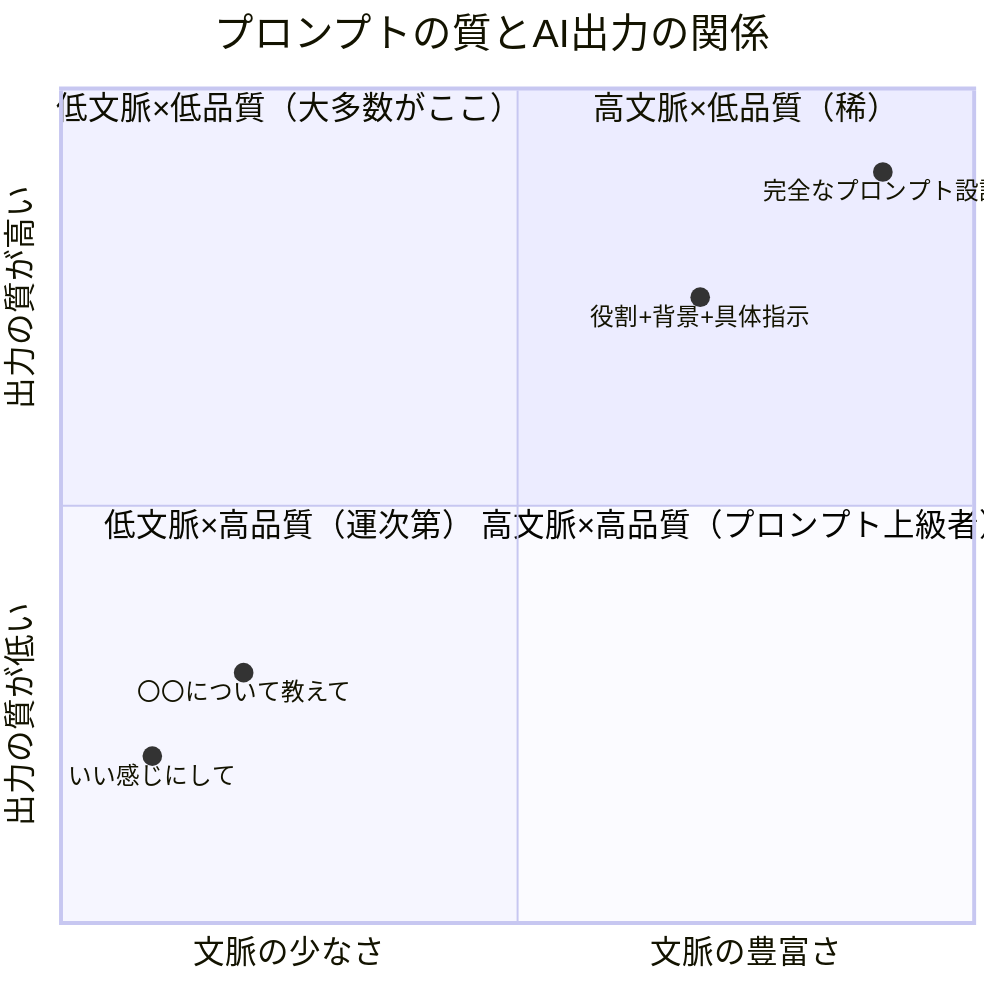
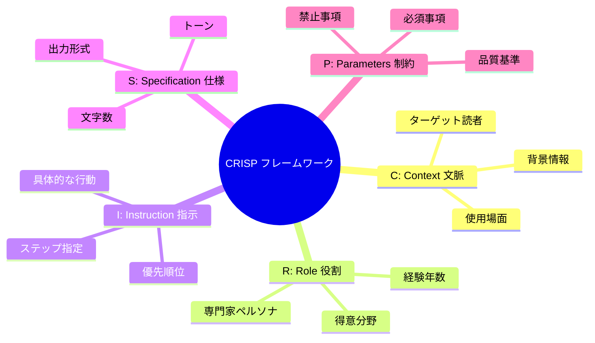

「ChatGPTに聞いてみたんですけど、なんか微妙な答えしか返ってこなくて…」――社内チャットでそうぼやいたのは、入社3年目の吉田凛（26歳・人材系ベンチャーのマーケター）。隣の席の先輩・佐々木が「ちょっと見せて」とモニターを覗き込み、吉田さんが入力したプロンプトを見て苦笑した。「『マーケティングについて教えて』？ そりゃ、教科書みたいな答えしか返ってこないよ」。佐々木は同じChatGPTに別のプロンプトを打ち込んだ。返ってきた答えを見て、吉田さんは目を見開いた。「え、全然違う…同じAIなのに…」

この差を生むのが**プロンプトエンジニアリング**――AI時代の「質問力」です。

## なぜ「質問の仕方」で答えが激変するのか

### AIは「超優秀だけど空気が読めない新人」

AIを理解する最も正確な比喩はこれです。圧倒的な知識量と処理速度を持っているが、**あなたの意図を自動的に察することはできない**。

人間相手なら「いい感じにまとめておいて」で通じます。相手はあなたの立場、過去のやり取り、職場の文化、暗黙の期待値を踏まえて解釈してくれるからです。

AIにはその文脈がありません。「いい感じに」と言われたら、**考えうるすべての「いい感じ」の平均値**を返してきます。結果、誰にとっても60点の、当たり障りのない回答になる。

### Garbage In, Garbage Out の法則

プログラミングの格言「ゴミを入れればゴミが出る」は、AI時代にこそ輝きを増しています。



大多数の人は左下の象限にいます。曖昧なプロンプトを投げ、微妙な結果を見て「AIって大したことないな」と結論づける。しかし、**プロンプトの質を上げるだけで、同じAIから全く違うレベルの出力を引き出せる**のです。

## プロンプトエンジニアリングの5大原則「CRISP」

効果的なプロンプトには5つの構成要素があります。頭文字を取って**CRISP**と覚えてください。



### 原則1: Context（文脈）――背景情報を惜しみなく伝える

AIは文脈がなければ「一般論」しか返せません。あなたの状況を具体的に伝えることで、回答の精度が跳ね上がります。

**悪い例:**
```
メールの文案を作って
```

**良い例:**
```
以下の状況でメールを作成してください。

【背景】
- 先週の展示会で名刺交換したIT企業の部長（50代男性）宛て
- 当社は従業員30名のBtoB SaaS企業で、業務効率化ツールを提供
- 展示会ではデモを見てもらい、「社内で検討する」と好意的な反応
- 1週間後のフォローアップメール

【目的】
- 具体的な打ち合わせの日程を提案したい
- 押しが強すぎず、でも次のアクションにつなげたい
```

### 原則2: Role（役割）――AIに「誰として答えるか」を指定する

役割を与えることで、AIの回答は劇的に変わります。同じ質問でも、「マーケティング初心者」と「15年の経験を持つCMO」では、答えの深さと視点が全く異なります。

**効果的な役割設定の例:**
- 「あなたはBtoB SaaSのマーケティングを15年経験したCMOです」
- 「あなたは小学5年生の担任教師で、難しい概念をわかりやすく説明するのが得意です」
- 「あなたは辛口だけど的確なフードライターです」

### 原則3: Instruction（指示）――何をしてほしいかを明確にする

「考えて」「教えて」のような曖昧な動詞ではなく、具体的な行動を指定します。

**曖昧な指示 → 具体的な指示の変換例:**

| 曖昧 | 具体的 |
|------|-------|
| 「教えて」 | 「初心者向けに5つのステップで説明して」 |
| 「考えて」 | 「メリットとデメリットを3つずつ挙げて比較して」 |
| 「まとめて」 | 「要点を3つに絞り、各50字以内で箇条書きにして」 |
| 「分析して」 | 「SWOT分析のフレームワークで、各象限3項目ずつ挙げて」 |

### 原則4: Specification（仕様）――出力の形を指定する

「どんな形で」答えてほしいかを明示します。

- **形式**: 箇条書き、表形式、段落形式、対話形式
- **分量**: 「500字以内」「3つに絞って」「詳細に」
- **トーン**: 「カジュアルに」「ビジネスフォーマルで」「小学生にもわかるように」
- **構造**: 「結論→理由→具体例の順で」「PREP法で」

### 原則5: Parameters（制約）――やってはいけないことを明示する

AIは指示がなければ「とりあえず盛り込む」傾向があります。不要な要素を明示的に排除します。

- 「専門用語は使わず、中学生にもわかる言葉で」
- 「抽象論は避け、必ず具体例を含めてください」
- 「ポジティブな側面だけでなく、批判的な視点も入れてください」
- 「日本市場に限定してください。海外事例は不要です」

## ケーススタディ1: マーケターが実感した「プロンプト改善」のインパクト

**吉田凛（26歳・人材系ベンチャー マーケター）の場合**

冒頭の吉田さんが、先輩・佐々木のアドバイスを受けてプロンプトを改善した実例です。

**Before（改善前）のプロンプト:**
```
SNSマーケティングの戦略を教えて
```

**AIの回答:** ターゲティング、コンテンツ戦略、エンゲージメント向上…といった教科書的な一般論。使えるようで使えない。

**After（改善後）のプロンプト:**
```
あなたは人材業界のSNSマーケティングに10年の経験を持つ専門家です。

【状況】
- 当社は従業員50名の人材紹介ベンチャー（IT/Web業界特化）
- Instagram運用を始めて3ヶ月、フォロワー800人
- ターゲットは25-35歳のITエンジニア（転職潜在層）
- 月間投稿20本、エンゲージメント率0.8%（業界平均は2.5%）
- 月間予算5万円（広告費は含まず、ツール費のみ）

【依頼】
エンゲージメント率を3ヶ月で業界平均（2.5%）まで引き上げる具体的な施策を、
優先度順に5つ提案してください。

【出力形式】
各施策について以下の項目で整理：
1. 施策名
2. 具体的なアクション（明日から実行できるレベルで）
3. 期待効果
4. 必要なリソース（時間・費用）
5. 成果指標（KPI）

【制約】
- 「バズを狙う」のような再現性のない施策は除外
- 人材紹介業界の法規制（求人広告の表示ルール等）に配慮
- 1人で運用できる施策に限定（チーム体制なし）
```

**AIの回答:** エンジニア転職に特化したリール動画の企画案、エンゲージメントを高める投稿時間帯の分析、UGCを活用したコンテンツ戦略など、**翌日から実行できる具体的な5施策**が返ってきた。

「同じChatGPTに、同じ『SNSマーケティング』について聞いたのに、答えの実用性が**10倍以上違う**。質問の質がここまで答えを変えるなんて、衝撃でした」

## ケーススタディ2: 営業マネージャーの「提案書作成時間」を70%短縮

**松本雄一（38歳・SaaS企業 営業マネージャー）の場合**

松本さんは大口クライアント向けの提案書作成に、毎回3〜4日を費やしていました。クライアントごとにカスタマイズが必要で、テンプレートでは対応しきれなかったのです。

松本さんが構築した「提案書プロンプト・テンプレート」:

```
あなたはBtoB SaaSの法人営業として15年の経験を持つプロフェッショナルです。

【クライアント情報】
- 企業名: [企業名]
- 業種: [業種]
- 従業員数: [人数]
- 決裁者: [役職・年代・特徴]
- 抱えている課題: [ヒアリングで得た情報]
- 過去に検討した競合ツール: [あれば]
- 予算感: [わかれば]

【提案書の構成】
1. エグゼクティブサマリー（経営層向け、A4半ページ）
2. 課題の整理と数値化（クライアントの言葉を使って）
3. 提案ソリューションと導入効果（ROI試算付き）
4. 導入ステップとスケジュール
5. 想定FAQ（決裁者が質問しそうな内容5つ）
6. 次のアクション

【制約】
- 専門用語は最小限に。決裁者は非IT部門の場合が多い
- 競合の名前は出さず、「従来の方法」と表現
- 数字は保守的な試算で。過大な期待を持たせない
- トーンは「パートナー」であって「売り手」ではない
```

**結果:**

| 指標 | Before | After |
|------|--------|-------|
| 提案書作成時間 | 3〜4日 | 1日 |
| 月間提案件数 | 4件 | 10件 |
| 提案採用率 | 25% | 40% |
| 月間受注金額 | 800万円 | 2,000万円 |

「AIが提案書の80%を書いてくれるようになった。でも、残りの20%――クライアントの表情から読み取った本音を反映する部分――は人間にしかできない。**AIは量を担当し、人間は質を担当する**。この役割分担が見えたのが一番の収穫です」

## ケーススタディ3: 非エンジニアがプロンプトで「AI業務改革」を実現

**木下幸恵（45歳・中堅メーカー 総務部長）の場合**

木下さんはITに特に強いわけではありませんでしたが、ChatGPTの登場を機に「AIを使いこなす総務部」を目指しました。

「総務部って、定型業務の宝庫なんです。社内規程の問い合わせ対応、議事録作成、社内通知文の作成…。でもAIに『社内規程について教えて』と聞いても、うちの会社の規程なんて知らないわけで」

木下さんの発見は、**「AIに自社の文脈を教えてから質問する」**という手法でした。

**実際に作ったプロンプト（社内規程Q&A対応）:**
```
以下は当社の就業規則の抜粋です。この内容を踏まえて、
従業員からの質問に総務部担当者として回答してください。

【就業規則（抜粋）】
（ここに自社の就業規則を貼り付け）

【回答ルール】
- 規則に明記されている内容は、該当条項の番号と共に回答
- 規則に明記されていない内容は「この件は個別にご相談ください」と案内
- 法律的な判断が必要な内容は「人事部と顧問弁護士に確認中です」と保留
- トーンは親切だが正確に。曖昧な表現は避ける

【質問】
「有給休暇の繰越しは何日まで可能ですか？また、繰越分の消化期限はありますか？」
```

**6ヶ月間での総務部の変化:**

- 社内問い合わせ対応時間: 月40時間 → 月15時間
- 議事録作成時間: 1件2時間 → 1件30分
- 社内通知文の作成: 1件1時間 → 1件15分
- 部門満足度調査: 「総務部の対応が早くなった」のコメントが急増

「ITスキルより大事なのは、**自分の業務を言語化するスキル**だと気づきました。プロンプトを書くって、結局『自分が何をしたいのか』を明確にすることなんですよね」

## 中級テクニック: プロンプトの威力を倍増させる5つの手法

### 手法1: Few-shot（例示）

AIに「こんな感じで」と具体例を見せる手法。1〜3個の例を示すだけで、出力の品質が劇的に向上します。

```
以下の形式でキャッチコピーを5つ作成してください。

【例】
・「転職は、裏切りじゃない。」
・「30歳の悩みは、30歳にしかわからない。」

【テーマ】リモートワークの自由と孤独
```

### 手法2: Chain of Thought（思考の連鎖）

AIに「段階的に考えて」と指示する。複雑な問題で特に有効です。

```
この事業計画を評価してください。
まず良い点を3つ、次にリスクを3つ、
最後にリスクを踏まえた改善提案を3つ、
段階的に分析してください。
```

### 手法3: ペルソナ切り替え

同じテーマを複数の視点で分析する。

```
以下の新規事業アイデアについて、3人の専門家の視点で評価してください。
1. 楽観的なスタートアップ投資家として
2. 慎重なリスク管理の専門家として
3. エンドユーザーの立場として
```

[AIブレインストーミング](/blog/ai-brainstorming)の記事で紹介した手法と組み合わせると、さらに多角的な分析が可能になります。

### 手法4: 反復改善（イテレーション）

一発で完璧を求めない。対話を通じて磨き上げる。

```
（1回目の出力を見て）
ありがとうございます。以下の点を改善してください：
- 2番目の項目をもっと具体的に
- 数字の根拠を追加
- トーンをもう少しカジュアルに
```

### 手法5: メタプロンプト（プロンプトを作るプロンプト）

自分でプロンプトを作るのが難しい場合、AIに作ってもらう。

```
私は人材紹介会社のマーケターです。
Instagramのキャプション作成をAIに依頼したいのですが、
効果的なプロンプトのテンプレートを作成してください。
必要な変数（毎回変わる部分）は [ ] で示してください。
```

## AIを「検索エンジン」ではなく「思考パートナー」にする

多くの人がAIを「高性能な検索エンジン」として使っています。「〇〇とは？」「〇〇の方法を教えて」。これでは、AIのポテンシャルの10%しか使えていません。

AIの真価は**「壁打ち相手」**としての活用にあります。

**壁打ち活用の例:**
- 「この企画の弱点を徹底的に指摘して」
- 「この文章を読んで、論理の飛躍がある箇所を指摘して」
- 「このアイデアを聞いた競合は、どんな対抗策を取るか予測して」
- 「この意思決定で見落としている観点はないか、5つ挙げて」

[AI時代の「問い」の力](/blog/ai-era-question-power)で解説したように、**良い問いを立てる能力**こそが、AI時代に最も価値を持つスキルです。プロンプトエンジニアリングは、その「問いを立てる力」の実践的な形です。

## 今日から始める「プロンプト改善」3ステップ

**Step 1: 現在の自分のプロンプトを観察する**
今日AIに投げた質問を振り返り、「CRISPの5要素」のうち何が欠けていたかをチェックする。

**Step 2: 1つの要素を追加してみる**
最も効果が高いのは「Context（文脈）」の追加。自分の状況、背景、目的を3行追加するだけで、答えの質が変わります。

**Step 3: Before/Afterを記録する**
改善前と改善後のプロンプトと、それぞれの出力を記録する。「何を変えたら、何が良くなったか」のパターンが見えてきます。

プロンプトエンジニアリングは特別なスキルではありません。**「相手にわかりやすく伝える」というコミュニケーションの基本**を、AIとの対話に適用しているだけです。

良い質問ができる人は、AIからも、人間からも、良い答えを引き出せます。

---

## AIをもっと使いこなしたいあなたへ

「プロンプトの基本はわかったけど、自分の業務にどう応用すればいいかわからない」「実際に手を動かしながら練習したい」――そんな方のために、**体験セッション（無料）**であなたの業務に合わせたプロンプト・テンプレートを一緒に作成します。セッション後、すぐに使える「あなた専用のプロンプト集」をお持ち帰りいただけます。

[AI活用の体験セッションに申し込む](/sessions)
