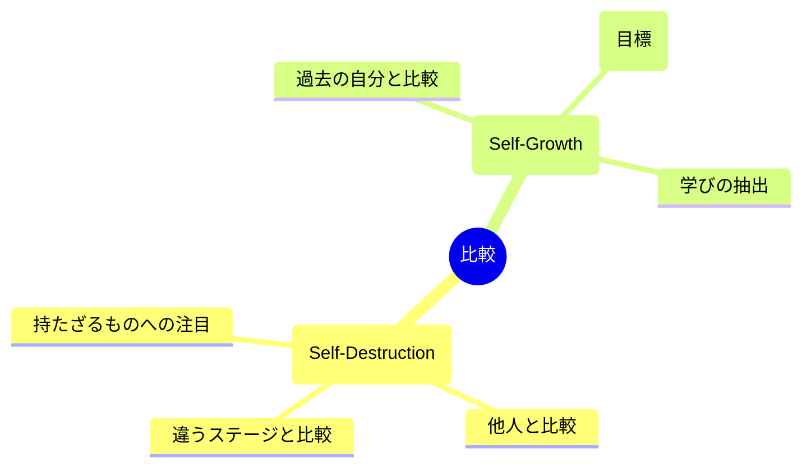

## 比較がやめられない

同期が先に昇進した。
友人が結婚して幸せそう。
SNSで見る知人は充実している。

「比較しても意味がない」「自分は自分」
頭ではわかっていても、やめられない。

それは、あなたの意志が弱いからではありません。

## 比較は人間の本能

進化心理学によると、比較は生存に必要な機能でした。

群れの中での自分の位置を把握し、脅威を察知し、資源を確保する。
比較することで、生き延びてきたのです。

つまり、比較すること自体は自然な反応。
問題は、**どう比較するか**です。

## 有害な比較、有益な比較

### 比較の解剖図

### 有害な比較

- 相手の「持っているもの」と自分の「持っていないもの」を比べる
- 相手のハイライトと自分の舞台裏を比べる
- 違うステージにいる相手と比べる

これらは自尊心を傷つけ、行動を止めてしまいます。

### 有益な比較

- 過去の自分と現在の自分を比べる
- 自分と同じ条件の人から学びを得る
- 尊敬する人を「目標」として参考にする

これらは成長の糧になります。

## 比較との付き合い方

### 方法1: 比較していることを認める

「私は今、比較している」と気づく。
否定したり抑圧したりするのではなく、まず認識すること。

### 方法2: 相手の見えない部分を想像する

SNSで見える成功の裏には、見えない苦労がある。
「この人も、きっと大変なことがあるはず」と想像してみる。

### 方法3: 過去の自分と比べる

「1年前の自分」と「今の自分」を比較する。
確実に成長している点が見つかるはずです。

### 方法4: 「良いところ借り」をする

羨ましいと感じたら、「なぜ羨ましいか」を分析する。
そして、自分も取り入れられることがないか考える。

嫉妬を行動のエネルギーに変換します。

### 方法5: SNSの使い方を見直す

フォローする人を厳選する。
ネガティブな感情を引き起こすアカウントはミュートする。
使用時間を制限する。

## 比較は自分を知るためのツール

比較によって感じる感情は、自分の価値観を映す鏡です。

「なぜこれが羨ましいのか」を深掘りすると、
自分が本当に大切にしていることが見えてきます。

比較を敵視するのではなく、自己理解のツールとして活用する。
そう捉えると、比較との付き合い方が変わります。
