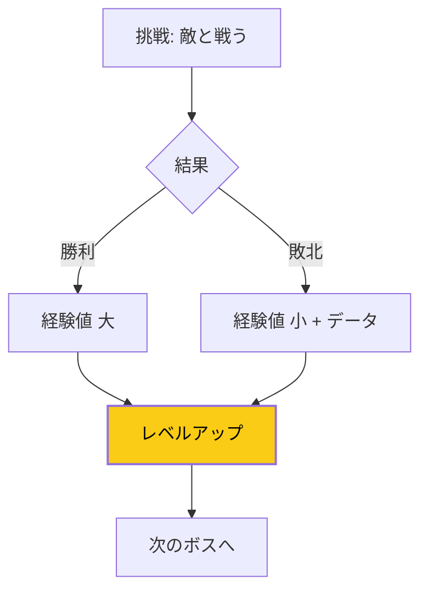

## 失敗が怖くて動けない

新しいことに挑戦したい。
でも、失敗するのが怖くて踏み出せない。

この恐怖は、多くの人が抱えています。
しかし、視点を変えるだけで、失敗への恐怖は軽減できます。

## ゲーミフィケーション思考とは

人生をRPG（ロールプレイングゲーム）のように捉える考え方。

ゲームでは、敵に負けても「ゲームオーバー」ではありません。
経験値を得て、リトライして、少しずつ強くなっていく。

人生も同じように捉えてみましょう。

## ゲームと人生の共通点

### 成長のゲームループ

### 1. レベルアップには経験値が必要

ゲームで強くなるには、たくさんの戦闘をこなす必要があります。
人生でも、成長するには経験を積む必要があります。

失敗 = 経験値獲得

### 2. ボス戦の前には雑魚敵

大きな挑戦の前には、小さな挑戦がある。
段階的にスキルを上げていきます。

### 3. セーブポイントがある

人生には、やり直しがきくポイントがたくさんある。
一度の失敗で取り返しがつかないことは、実は少ない。

### 4. 複数の攻略法がある

正解は一つではない。
自分に合った方法を見つければいい。

## 失敗を経験値に変える方法

### 方法1: 失敗ログをつける

何に挑戦し、何が起きたか、何を学んだかを記録する。

「失敗リスト」ではなく「経験値リスト」として捉えると、
書くことへの抵抗が減ります。

### 方法2: スモールチャレンジから始める

いきなりボス戦に挑まない。
まずは小さな挑戦で経験値を貯める。

- 社内プレゼンの前に、チームミーティングで発言する
- 起業の前に、副業で試す
- 本を書く前に、ブログを書く

### 方法3: 「リトライ」を前提にする

「一発で成功しなければ」と思うからプレッシャーになる。
「何回かやって成功すればいい」と思えば、気が楽になります。

### 方法4: クエストを設定する

「今月のクエスト：新しい人に5人話しかける」
「今週のクエスト：記事を1本公開する」

ゲームのクエストのように、小さな目標を設定する。
達成すると経験値（＝成長）が得られます。

### 方法5: 仲間を見つける

ゲームでもパーティを組んだ方が強い。
同じ目標を持つ仲間と、経験を共有しましょう。

## 今日からプレイヤーになる

人生というゲームで、あなたは主人公です。

失敗を恐れてスタート画面にとどまるか。
経験値を貯めながら、冒険を進めるか。

選ぶのはあなた自身です。

今日、一つだけ小さな挑戦をしてみてください。
その経験値が、明日のあなたを強くします。
