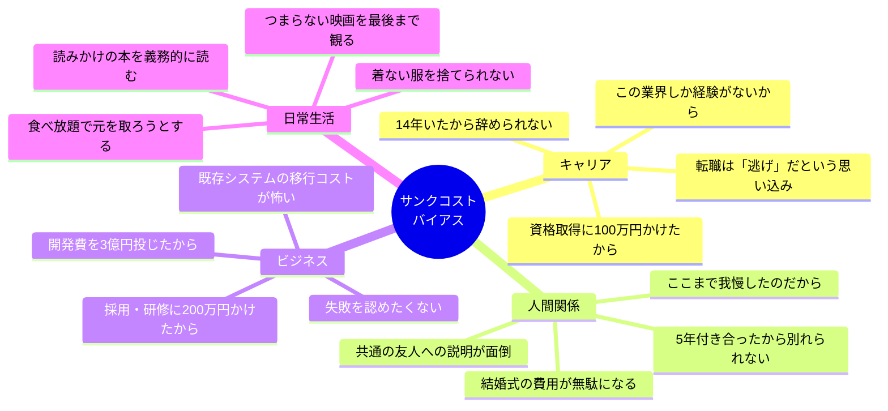
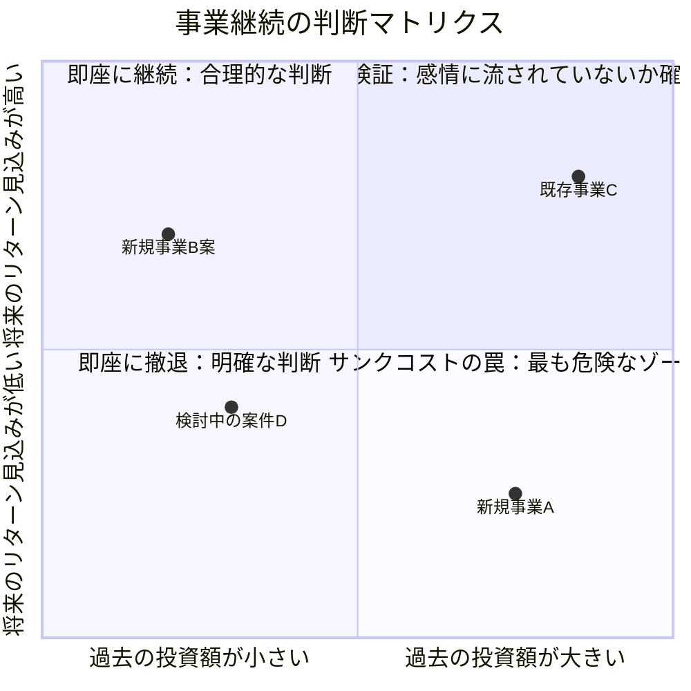
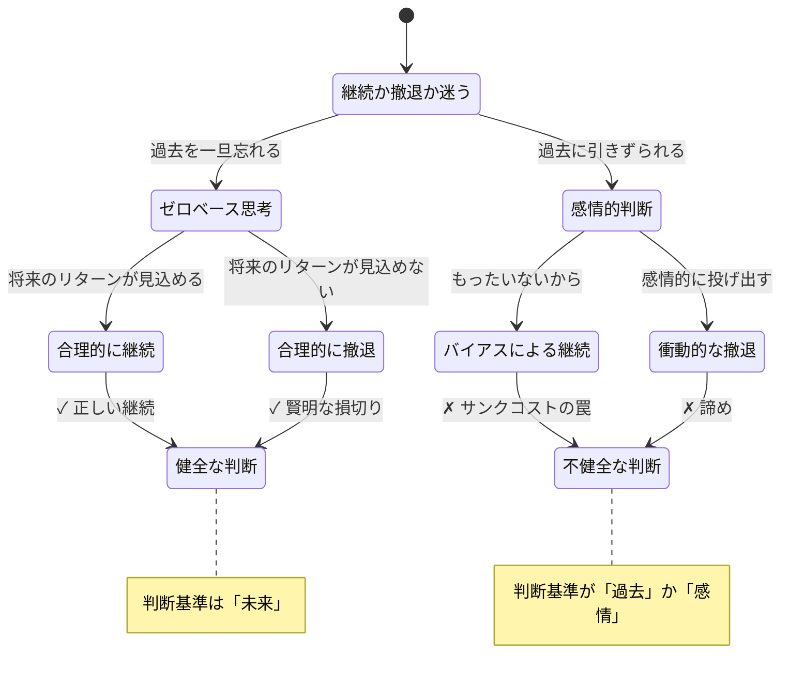

## 「辞めたい」と思いながら、あと3年

日曜日の夜11時。山田浩司さん（仮名・36歳）は、翌日の出社を考えるだけで胃が重くなる。

新卒から14年間、同じ会社で働いてきた。最初の5年は楽しかった。でも、ここ数年は違う。上司との関係、硬直化した組織文化、自分の成長が止まった感覚。「転職した方がいい」と頭ではわかっている。

でも、口をつくのはいつも同じ言葉だ。

「14年もいたのに、今さら辞めるなんてもったいない」

この「もったいない」は、本当にもったいないのでしょうか。

実はこの判断こそが、山田さんの人生を蝕んでいました。経済学と心理学で「サンクコストの誤謬（ごびゅう）」と呼ばれる認知バイアス——**すでに取り戻せないコストに引きずられて、未来の判断を歪めてしまう**現象です。

## コンコルドの教訓——国家規模のサンクコスト

サンクコストバイアスの最も有名な事例は、超音速旅客機「コンコルド」です。

1962年、イギリスとフランスは共同で超音速旅客機の開発を開始しました。しかし開発が進むにつれ、商業的に採算が取れないことが明らかになっていきます。騒音問題、燃費の悪さ、限られた座席数。冷静に分析すれば、プロジェクトを中止すべきでした。

しかし、両国政府はこう考えました。

「すでに数十億ドルを投じた。今やめたら、すべてが無駄になる」

結果、さらに数十億ドルを追加投資。2003年に運航停止するまで、一度も黒字にならないまま約40年間飛び続けました。「コンコルドの誤謬（Concorde Fallacy）」として、サンクコストバイアスの代名詞になっています。

重要なポイントは、**すでに投じた数十億ドルは、中止しても継続しても戻ってこなかった**ということです。「過去の投資を無駄にしたくない」という感情が、さらに大きな損失を生み出した。

この構造は、私たちの日常にも驚くほど多く潜んでいます。

## 日常に潜む4つのサンクコストの罠

### 罠1：キャリアのサンクコスト

「10年以上この業界にいるから、今さら変えられない」

これは最も深刻なサンクコストです。なぜなら、キャリアのサンクコストに囚われると、**残りの人生すべてが「過去の延長」になる**からです。

36歳の山田さんの場合、定年まであと29年。14年の過去に引きずられて、29年の未来を犠牲にしようとしている。冷静に数字を見れば、答えは明白です。

### 罠2：人間関係のサンクコスト

「3年付き合ったのに」「結婚して5年経つのに」

時間や感情の投資は、金銭以上に手放しにくい。しかし、関係の質が明らかに低下しているなら、「過去の投資」は継続の理由にはなりません。

### 罠3：ビジネスのサンクコスト

企業の意思決定でも、サンクコストバイアスは猛威を振るいます。「すでに3億円を投じたプロジェクトを、今さら中止できない」。しかし、その3億円は中止しても継続しても戻ってきません。問われるべきは、「ここから追加投資する価値があるか」だけです。

### 罠4：日常のサンクコスト

食べ放題で「元を取ろう」と食べすぎる。つまらない映画を「チケット代がもったいない」と最後まで観る。小さなサンクコストの積み重ねが、日常の判断力を消耗させています。

## ケーススタディ1：山田さんの14年と「ゼロベース思考」

冒頭の山田さんは、コーチングで一つの問いと向き合いました。

**「もし今日が入社1日目だとして、この会社に14年間勤めたいと思いますか？」**

山田さんは10秒間沈黙し、こう答えました。

「……思いません」

この瞬間が、転機でした。過去の14年間は、どう判断しても変わらない。変えられるのは、今日から先の未来だけ。

しかし、「辞める」という決断は、頭でわかっていても感情が追いつきません。そこで山田さんと取り組んだのは「コスト・ベネフィット分析の可視化」です。

**現状維持のコスト（今後5年間で失うもの）：**
- 年収アップの機会損失：推定年100万円 × 5年 = 500万円
- 成長実感のない時間：1日8時間 × 250日 × 5年 = 10,000時間
- メンタルヘルスへの影響：日曜夜の胃痛、月曜朝の憂鬱
- 「やりたかったこと」への挑戦機会の喪失

**転職のコスト：**
- 退職金の一部（勤続20年との差額）：推定200万円
- 新しい環境への適応ストレス：3〜6ヶ月
- 人間関係のリセット

山田さんは、数字を見て息を呑みました。

「14年いたから辞められないと思っていた。でも、辞めないことの方がはるかにコストが大きかった。**過去を守ることに必死で、未来を見ていなかった**」

山田さんは3ヶ月後に転職。年収は50万円アップし、何より「日曜の夜が怖くなくなった」と言います。

## ケーススタディ2：新規事業を「殺す」決断をした中西部長

中西亮平さん（仮名・44歳）は、消費財メーカーの事業開発部長。2年前に鳴り物入りで始まった新規事業の責任者です。

開発費用：1.8億円。人員：12名の専任チーム。社長プレゼンで「3年以内に年商10億円を目指す」と宣言。

しかし、2年経っても売上は当初計画の15%止まり。市場環境が変わり、競合が強力なサービスをリリースし、当初の前提が崩れていた。

社内の空気は「もう少し続ければ芽が出るはず」「1.8億円を無駄にはできない」。

中西さんは苦しんでいました。

「数字を見れば撤退すべきなのはわかっている。でも、自分が社長の前で宣言した事業だ。12人のチームメンバーの2年間を『無駄でした』とは言えない」

コーチングで中西さんに問いかけたのは、こうでした。

**「1.8億円は、撤退しても継続しても戻ってきません。今から追加で投じる1億円は、この事業と、新しい事業、どちらに投じた方が1年後のリターンが大きいですか？」**

中西さんの新規事業Aは、右下の「サンクコストの罠」ゾーンにいた。過去の投資が大きく、しかし将来のリターン見込みは低い。一方、社内で検討されていた新規事業B案は、左上の「即座に継続」ゾーンに位置していた。

中西さんは1ヶ月かけてデータを整理し、取締役会で撤退を提案しました。

「この決断が正しかったかどうかは、まだわかりません。でも少なくとも、12人のチームメンバーの才能を、芽の出ない事業に埋もれさせ続けるよりは、ずっとましだと確信しています」

結果的に、チームの12人のうち8人が新規事業Bに移り、そちらは1年で黒字化を達成しました。

## サンクコストから自由になる「3つの問い」

判断に迷ったとき、この3つの問いを自分に投げかけてください。

### 問い1：「今日ゼロからスタートしても、同じ選択をするか？」

過去を一旦すべて忘れる。時間もお金も努力も、すべてリセットした状態で考える。それでも同じ道を選ぶなら、継続する合理的な理由がある。選ばないなら、あなたを引き止めているのはサンクコストバイアスです。

### 問い2：「この先投じるリソースの、最善の使い道は何か？」

過去は変えられない。変えられるのは「これから投じるリソースの配分」だけ。

今後の1年間、1,000時間、100万円。それを現状維持に投じるのと、新しい選択肢に投じるのと、どちらがリターンが大きいか。[「正解」を探すな - VUCA時代の意思決定](/blog/vuca-decision-making)で紹介した「仮説思考」が、ここでも役に立ちます。

### 問い3：「5年後の自分は、この判断をどう見るか？」

今の感情から離れて、5年後の視点で判断を見る。「あのとき辞めてよかった」と思うか、「あのとき続けていてよかった」と思うか。[第二レベル思考](/blog/second-level-thinking)の記事でも触れていますが、「一段先の結果」を想像することで、今の判断の質は大きく変わります。

## 「損切り」と「諦め」は違う

ここで一つ、重要な区別があります。

サンクコストバイアスからの脱却は、「すべてをすぐに辞めろ」という意味ではありません。**合理的な判断の結果として「続ける」ことと、サンクコストに引きずられて「辞められない」ことは、まったく違います。**

大切なのは、[ゼロイチ思考をやめる](/blog/gradient-thinking)の記事で紹介したように、「続けるか辞めるか」の二項対立ではなく、**グラデーションで考える**ことです。

- 完全に辞めるのではなく、規模を縮小する
- 撤退の期限を決めて、条件付きで継続する
- 一部のリソースを新しい挑戦に振り向けつつ、残りで現状を維持する

## 実践ワーク：あなたのサンクコストを棚卸しする

今から5分間、以下のワークに取り組んでみてください。

**ステップ1：** 「もったいないから」「ここまでやったから」と思いながら続けていることを3つ書き出す。

**ステップ2：** それぞれについて、「今日ゼロから始めるとしても、同じ選択をするか？」をYes/Noで答える。

**ステップ3：** Noと答えたものについて、「この先1年間のリソースの最善の使い道」を書き出す。

**ステップ4：** 最も小さな一歩を決める。「転職する」ではなく、「転職サイトに登録する」。「プロジェクトを中止する」ではなく、「上司にデータを共有する」。

## 過去を手放すことは、過去を否定することではない

最後に、一つだけ伝えたいことがあります。

サンクコストを手放すことは、過去の努力を否定することではありません。山田さんの14年間は無駄ではなかった。中西さんの事業に費やした1.8億円と2年間も無駄ではなかった。そこで得た経験、スキル、人間関係は、新しい道で必ず活きます。

手放すのは「過去のコスト」であって、「過去の経験」ではない。

過去に感謝しつつ、未来に向けて最善の判断をする。それが、サンクコストバイアスから自由になるということです。

今日、あなたが「もったいない」と感じつつ続けていることは何ですか？　その「もったいない」は、本当にもったいないのか——一度立ち止まって、未来の自分の視点から問い直してみてください。

---

**「辞めたいけど辞められない」を一緒に整理しませんか**

ライフ自己決定コーチングでは、あなたの判断を歪めている「見えないバイアス」を一緒に特定し、感情と事実を切り分けるサポートをしています。辞める判断も、続ける判断も、納得感のある選択ができるように。

[無料セッションに申し込む →](/sessions)
