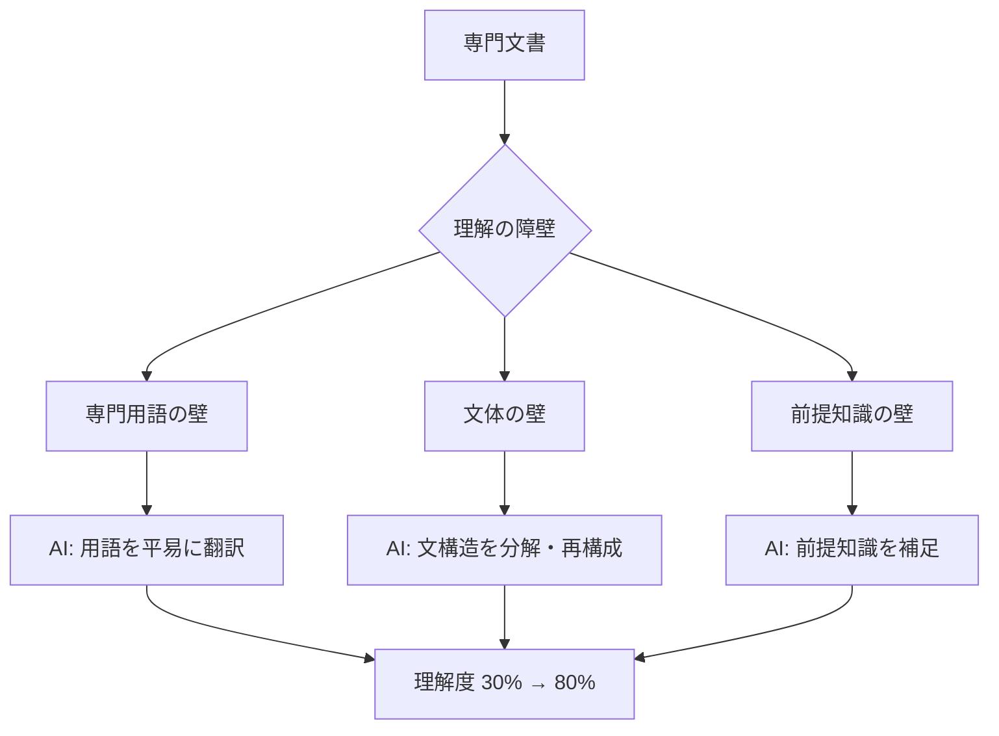

「この契約書、来週までに確認お願いね」――上司から渡された48ページのNDA（秘密保持契約書）を開いた瞬間、山田沙織（27歳・IT企業法人営業）は固まった。「甲は乙に対し、本契約に基づき開示する秘密情報につき、善良なる管理者の注意をもって…」。5回読み直しても意味がわからない。法務部に聞こうにも「営業なんだから契約書くらい読めるようになれ」と言われたトラウマがある。結局、深夜2時まで辞書を引きながら格闘し、それでも理解度は30%程度だった。

この経験、専門外の文書と格闘したことがある人なら誰しも覚えがあるはずです。AIを使えば、この「理解の壁」を劇的に低くできます。

## なぜ専門文書は「読めない」のか ――3つの構造的障壁

専門文書が難しいのは、あなたの読解力の問題ではありません。構造的な理由があります。

### 障壁1: 専門用語の壁

法律文書の「善良なる管理者の注意義務」、論文の「有意水準p<0.05」、医療文書の「予後不良」。専門用語は、その分野の人間にとっては効率的な省略表現ですが、部外者にとっては暗号です。

### 障壁2: 文体の壁

契約書の一文は平均で80〜120文字。主語と述語が離れ、但書きと例外が何層にも入れ子になる。日本の法律文書は特に、一文が長く複雑です。

### 障壁3: 前提知識の壁

「民法第415条の債務不履行に基づく損害賠償」と書かれても、民法415条を知らなければ理解できない。専門文書は、読者が一定の知識を持っていることを前提に書かれています。



## AI平易化の3レベル・アプローチ

```mermaid
journey
    title 文書理解の3レベル進行
    section Level 1: 用語解説
      専門用語をリストアップ: 3: 読者
      AIが各用語を平易に解説: 4: AI
      用語の意味を把握: 5: 読者
    section Level 2: 段落分解
      段落ごとに要約を依頼: 3: 読者
      AIが構造化して解説: 4: AI
      文書の流れを把握: 5: 読者
    section Level 3: 全体ストーリー化
      文書全体の再構成を依頼: 3: 読者
      AIが物語として再構成: 4: AI
      全体像と意図を完全把握: 5: 読者
```

### Level 1: 用語解説 ――「暗号」を「日本語」に変換する

最初のステップは、文書に出てくる専門用語を人間の言葉に変換することです。

**実践プロンプト:**

```
以下の文章に出てくる専門用語を、すべて解説してください。

【文章】
（契約書や論文の一部を貼り付け）

【解説の形式】
各用語について以下の4点で説明：
1. 用語（原文のまま）
2. 一言でいうと（20字以内の平易な説明）
3. 日常の例え（身近なもので例えると）
4. この文書での意味（この文脈での具体的な意味）

【制約】
- 中学生が読んでわかるレベルの言葉で
- 法的な正確性より、理解のしやすさを優先
- ただし、誤解を招く過度な簡略化は避ける
```

**実際の出力例:**

| 用語 | 一言でいうと | 日常の例え | この文書での意味 |
|------|------------|-----------|----------------|
| 善管注意義務 | 「プロとしてちゃんとやれ」という義務 | 預かり物を自分の物以上に大切に扱う | 受け取った秘密情報を専門家として適切に管理する義務 |
| 不可抗力 | 誰のせいでもない事態 | 台風で飛行機が欠航 | 地震・感染症等で契約を履行できない場合の免責 |
| 損害賠償 | 損した分を弁償すること | 壊した物を弁償する | 契約違反で相手に生じた損害を金銭で補償すること |

### Level 2: 段落分解 ――「構造」を見える化する

用語がわかったら、次は文書の構造を把握します。段落ごとにAIに「何を言っているか」を翻訳してもらいます。

**実践プロンプト:**

```
以下の契約書の条項を、段落（項）ごとに解説してください。

【条項】
（対象の条項を貼り付け）

【解説の形式】
各段落について：
1. 原文（その段落のまま）
2. 要するに（30字以内で一言にすると）
3. あなたへの影響（自分にとって何を意味するか）
4. 注意ポイント（見落としがちなリスク）
5. 確認すべき質問（この段落について相手に聞くべきこと）

【制約】
- 法的助言ではなく、理解の補助として
- リスクの高い箇所には ⚠️ マークを付ける
- 「要するに」は日常会話のレベルで
```

### Level 3: ストーリー化 ――「全体像」を物語で理解する

個々の条項を理解したら、最後に文書全体を「物語」として再構成します。人間の脳は物語形式の情報を最も効率よく記憶・理解します。

**実践プロンプト:**

```
以下の契約書全体を、登場人物のいる物語として再構成してください。

【契約書】
（全文または主要部分を貼り付け）

【再構成の形式】
1. 登場人物紹介（甲=太郎さん、乙=花子さん、のように人格化）
2. 背景（なぜこの契約が必要になったか）
3. 約束の内容（各条項を平易な約束として表現）
4. もしトラブルが起きたら（違約・紛争条項をストーリー化）
5. この物語の教訓（特に注意すべきポイントのまとめ）

【制約】
- 法的正確性の核心は保持しつつ、読みやすさを最優先
- 各条項に対応する「約束」が元の何条に該当するかを括弧書きで併記
- 最後に「原文で必ず確認すべき箇所」を3つ挙げる
```

## ケーススタディ1: フリーランスエンジニアが「不利な契約」を回避

**佐藤拓海（30歳・フリーランスWebエンジニア）の場合**

佐藤さんは新規クライアントから受託開発の契約書を受け取りました。12ページの業務委託契約書。法務知識はゼロ。

「正直、読んでも全然わからなかった。でも『大手だし大丈夫だろう』とサインしかけたんです」

思い直してAIで分析した結果、3つの重大なリスクが見つかりました。

**発見されたリスク:**

1. **知的財産権の全面譲渡条項** → 「業務に関連して生じた一切の知的財産権は甲に帰属する」 → AIの解説:「あなたが仕事中に作ったもの全部、ポートフォリオにも載せられなくなります」

2. **競業避止義務（2年間）** → 「契約終了後2年間、同種の業務を行ってはならない」 → AIの解説:「2年間、同じ種類の仕事を他のクライアントにもできなくなります。フリーランスにとっては致命的です」

3. **損害賠償の上限なし** → 損害賠償条項に上限金額の記載なし → AIの解説:「万が一のバグで損害が出た場合、報酬の何十倍もの賠償を請求される可能性があります」

佐藤さんはAIの分析結果を元に、クライアントに修正を依頼。

**交渉結果:**
- 知的財産権: ポートフォリオ掲載可に修正
- 競業避止: 2年 → 6ヶ月、かつ「同一クライアントの競合のみ」に限定
- 損害賠償上限: 報酬総額の2倍までに設定

「AIに『この契約書を初心者向けに解説して、リスクを教えて』と聞いただけ。たった10分で、知らずにサインしていたら数百万円の損失になりかねないリスクを避けられました」

## ケーススタディ2: 研究職の「論文読破速度」が5倍に

**中村麻衣（33歳・製薬会社 研究開発部）の場合**

中村さんは新薬開発チームのメンバー。月に30〜40本の英語論文を読む必要がありますが、1本あたり平均2時間かかっていました。

「専門外の隣接領域の論文が特にきつい。免疫学の論文は読めるけど、統計手法の論文は全然わからない。でもチームの方針決定に必要だから読まないといけない」

中村さんが構築した「論文解析プロンプト・テンプレート」:

```
あなたは学際的な研究に精通した科学コミュニケーターです。

以下の論文のアブストラクトと主要な結果セクションを、
製薬業界の研究者（免疫学専門、統計は専門外）向けに解説してください。

【論文情報】
（タイトル、著者、ジャーナル名、アブストラクトを貼り付け）

【解説項目】
1. この研究は何を調べたか（背景と目的、100字以内）
2. 何がわかったか（主要な発見、箇条書き3つ以内）
3. 統計手法の平易な解説（使われた分析手法を中学生にもわかるレベルで）
4. 私たちの新薬開発にどう関係するか（実務的な示唆）
5. この論文の限界（結果を鵜呑みにしてはいけない理由）
6. 原文で精読すべき箇所（Figure/Table番号を指定）

【制約】
- 統計用語は必ず平易な言葉で言い換える
- 「有意差がある」→「偶然ではなく本当の差がありそう」等
- 結論を過度に単純化しない。不確実性がある場合は明示
```

**結果:**

| 指標 | Before | After |
|------|--------|-------|
| 1論文あたりの所要時間 | 2時間 | 25分 |
| 月間読破論文数 | 35本 | 50本以上 |
| チームへの共有頻度 | 月1回のまとめ | 週2回のハイライト共有 |
| 専門外領域の理解度（自己評価） | 30% | 70% |

「AIは論文を代わりに読んでくれるのではなく、**論文を読むための『地図』を先に渡してくれる**んです。全体像がわかった上で原文を読むと、理解のスピードが全然違う」

## ケーススタディ3: 不動産購入時の「重要事項説明書」を完全理解

**田中誠一・あゆみ夫妻（共に36歳・初めてのマンション購入）の場合**

人生最大の買い物、4,800万円のマンション購入。不動産会社から届いた重要事項説明書は32ページ。

「説明会で宅建士の方が読み上げてくれるんですけど、専門用語が多すぎて右から左へ流れていく。でも何千万の買い物で『わかりません』とは言えなくて…」

田中さん夫妻がAIで事前に分析した内容:

**Level 1（用語解説）で理解した重要概念:**
- 「瑕疵担保責任」→「買った後に欠陥が見つかったとき、売主が責任を取る期間と範囲」
- 「容積率・建ぺい率」→「この土地にどれくらいの大きさの建物を建てていいかのルール」
- 「抵当権」→「住宅ローンを返せなくなったとき、銀行がこのマンションを取り上げる権利」

**Level 2（段落分解）で発見した注意ポイント:**
- 管理費の将来的な値上がりリスク（修繕積立金の長期計画に不足あり）
- 駐車場が「専用使用権」であり「所有権」ではない点
- ペット飼育の制限条項の具体的な内容

**Level 3（ストーリー化）で把握した全体像:**
「この契約は、太郎さん（買主=自分）が花子さん（売主=不動産会社）から家を買う物語。太郎さんには『この家に住む権利』が手に入るけど、銀行の三郎さん（抵当権者）が裏で見守っている。もし太郎さんがお金を払えなくなったら、三郎さんが家を持っていく約束になっている…」

**結果:** 説明会当日、宅建士が「何かご質問は？」と聞いたとき、田中さんは5つの具体的な質問をした。宅建士は驚いて「こんなに準備されているお客様は初めてです」と言った。結果的に、修繕積立金の計画について追加情報を引き出し、管理組合の総会議事録も入手。納得した上で契約に進めた。

## 文書タイプ別：最適なプロンプト設計

### 契約書の場合 ――「リスク」に焦点を当てる

```
以下の契約書条項を分析し、私（乙の立場）にとってのリスクを
重要度順にランク付けしてください。

【条項】（貼り付け）

【分析の形式】
各リスクについて：
- リスクの内容（平易な言葉で）
- 発生確率（高/中/低）
- 影響度（大/中/小）
- 推奨アクション（修正依頼/確認/許容）
- 交渉時の言い方の例
```

### 論文の場合 ――「So what?」に焦点を当てる

```
この論文の結論を、以下の3つの視点で評価してください。
1. 実務家として：この発見を明日からの仕事にどう活かせるか
2. 批評家として：この研究の限界や反論の余地はどこか
3. 学習者として：この分野をもっと理解するために次に何を読むべきか
```

### 法律文書の場合 ――「自分の権利と義務」に焦点を当てる

```
この法律文書において、私の「権利」と「義務」をそれぞれ
箇条書きで整理してください。
また、知らないと損する可能性がある「隠れた条件」があれば、
⚠️マーク付きで指摘してください。
```

## AI平易化の限界と注意点 ――「地図」と「現地」の違い

AIによる平易化は強力ですが、**限界を正しく理解しておくことが重要**です。

### AIの平易化は「参考意見」であり「法的助言」ではない

- 重要な契約書は必ず弁護士にレビューを依頼する
- AIの解釈が間違っている可能性を常に意識する
- 金額の大きい取引、法的リスクの高い文書は、AIの分析を「予習」として使い、本番は専門家と一緒に

### AIが苦手なこと

- 文化的・慣習的なニュアンスの読み取り
- 業界特有の「暗黙のルール」の理解
- 最新の法改正や判例の反映（学習データの時点差）
- 文書の「言外の意図」の読み取り（なぜこの条項がわざわざ入っているのか）

### 正しい使い方のフレームワーク

**AI平易化は「予習」、専門家は「本番」。**

```
AI平易化 → 自分なりの理解 → 質問リスト作成 → 専門家に確認
```

このフローで使えば、専門家との面談時間を最大限に有効活用でき、「何を聞けばいいかわからない」という状態を回避できます。

[AIソロキャンプ](/blog/ai-solo-camp)で紹介した「AIとの対話で思考を整理する」手法は、専門文書の理解にも応用できます。

## 今日から始める3ステップ

**Step 1: 手元の「読めていない文書」を1つ選ぶ**
保険の約款、スマホの利用規約、仕事の契約書、なんでもOK。

**Step 2: Level 1（用語解説）を試す**
その文書の1ページ分をAIに貼り付け、「専門用語を中学生にもわかるように解説して」と依頼する。

**Step 3: 「わかった」と「わからない」を仕分ける**
AI解説で理解できた部分と、それでもわからない部分を分ける。わからない部分は追加質問するか、専門家に聞くための「質問リスト」にする。

[プロンプトエンジニアリングの基本](/blog/ai-prompt-engineering)を押さえておくと、AIへの質問の精度がさらに上がり、より的確な平易化が得られます。

専門文書が「読めない」のは恥ずかしいことではありません。読めるように設計されていないのです。AIという「翻訳者」を味方につけて、知識の壁を越えていきましょう。

---

## 専門文書の「読み解き方」を一緒に練習しませんか？

「契約書のチェックポイントがわからない」「論文を効率的に読む方法を身につけたい」「AIをもっと実務で使いこなしたい」――そんな方のために、**体験セッション（無料）**であなたの実際の業務文書を題材に、AI平易化の実践トレーニングを行います。

[AI文書解析の体験セッションに申し込む](/sessions)
